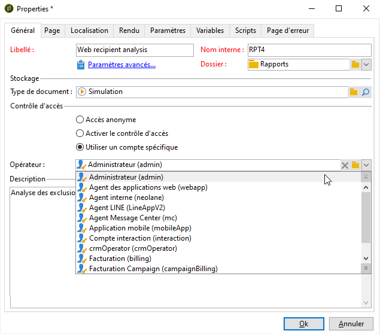
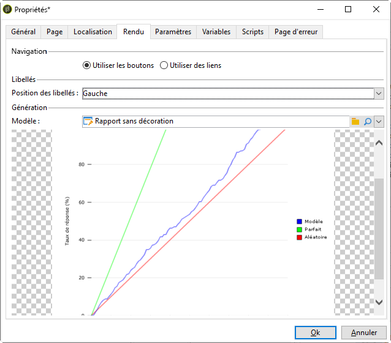

# Propriétés du rapport{#properties-of-the-report}

Vous pouvez entièrement personnaliser et configurer votre rapport en fonction de vos besoins. Pour ce faire, modifiez ses propriétés. Les propriétés du rapport sont accessibles via le bouton **[!UICONTROL Propriétés]** situé au-dessus du graphique de séquence d’activités.

Les propriétés générales sont décrites ci-dessous. Les fonctionnalités avancées configurées dans les onglets **[!UICONTROL Paramètres]**, **[!UICONTROL Variables]** et **[!UICONTROL Scripts]** sont décrites [dans cette section.](../../reporting/using/advanced-functionalities.md)

## Propriétés générales {#overall-properties}

Dans l&#39;onglet **[!UICONTROL Général]** des propriétés du rapport, vous pouvez modifier les paramètres répertoriés ci-dessous :

* Libellé et nom interne du rapport. Le nom **** interne est utilisé dans l’URL finale du rapport. Il ne doit pas être modifié après la création du rapport.

* Le **dossier** des rapports est sélectionné lors de la création du rapport. Il est recommandé de créer un dossier dédié aux rapports personnalisés afin qu’ils ne soient pas mélangés aux rapports intégrés.

* L&#39; **Enregistrement** est sélectionné lors de la création du rapport. Pour modifier le tableau de données du rapport, cliquez sur l&#39;icône **[!UICONTROL Sélectionner le lien]** située à droite du champ Type **[!UICONTROL de]** Document.

   

* Paramètres du **Contrôle d&#39;accès** . Ces paramètres sont décrits ci-dessous.

## Controlling access to the report {#report-accessibility}

Un rapport est accessible dans la console Adobe Campaign ou à l’aide d’un navigateur Web. Dans ce cas, il peut être nécessaire de configurer le contrôle d&#39;accès de rapports comme illustré ci-dessous.

Les options possibles sont les suivantes :

* **[!UICONTROL Accès]** anonyme : cette option permet un accès illimité au rapport. Cependant, aucune manipulation n&#39;est possible.

   Les droits de l&#39;opérateur technique &quot;webapp&quot; sont utilisés pour afficher les éléments de rapport. En savoir plus dans [cette section](../../platform/using/access-management.md#default-operators).

* **[!UICONTROL Contrôle d&#39;accès]**: cette option permet aux opérateurs Adobe Campaign d’y accéder une fois qu’ils sont connectés.
* **[!UICONTROL Compte]** spécifique : cette option vous permet d&#39;exécuter le rapport avec les droits de l&#39;opérateur sélectionné dans le champ **[!UICONTROL Opérateur]** .

## Gérer la localisation du rapport {#managing-report-localization}

Vous pouvez paramétrer les langues dans lesquelles vous souhaitez que le rapport soit traduit. Pour cela, cliquez sur l&#39;onglet **[!UICONTROL Localisation]**.

La langue d&#39;édition correspond à la langue dans laquelle vous rédigez. Lorsque vous ajoutez une langue, un sous-onglet apparaît dans la page d&#39;édition du rapport.

>[!NOTE]
>
>Pour en savoir plus sur la localisation des pages Web à Campaign, consultez [cette section](../../web/using/translating-a-web-form.md).

## Personnaliser le rendu HTML {#personalizing-html-rendering}

Dans l&#39;onglet **[!UICONTROL Rendu]**, vous pouvez personnaliser le mode d&#39;affichage des données dans la page. Ainsi, vous pouvez sélectionner :

* Le moteur de rendu des graphiques : Adobe Campaign propose deux modes distincts pour générer le rendu des graphiques. Par défaut, le moteur de rendu est HTML 5. Au besoin, vous pouvez choisir un rendu Flash.
* Le type de navigation dans le rapport : via des boutons ou des liens.
* La position par défaut des libellés des éléments du rapport. Cette position peut être surchargée au niveau de chaque élément.
* Le modèle, ou thème, utilisé pour la génération des pages du rapport.

## Personnaliser la page d&#39;erreur {#personalizing-the-error-page}

Dans l&#39;onglet **[!UICONTROL Page d&#39;erreur]**, vous pouvez paramétrer le message qui doit apparaître en cas d&#39;erreur lors de l&#39;affichage du rapport.

Vous pouvez définir des textes et les associer à des identifiants afin de gérer la localisation du rapport. Pour plus d’informations, voir la section [Ajouter un en-tête et un pied de page](../../reporting/using/element-layout.md#adding-a-header-and-a-footer).

