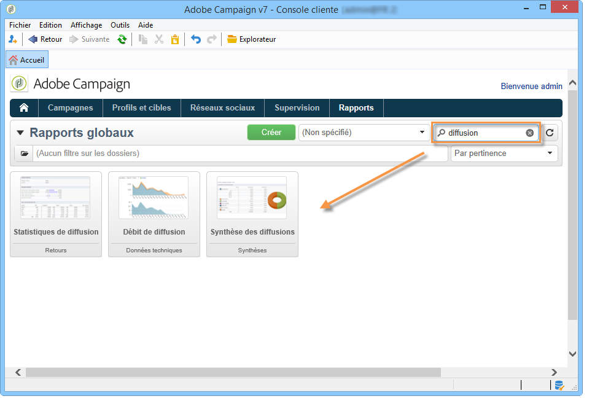
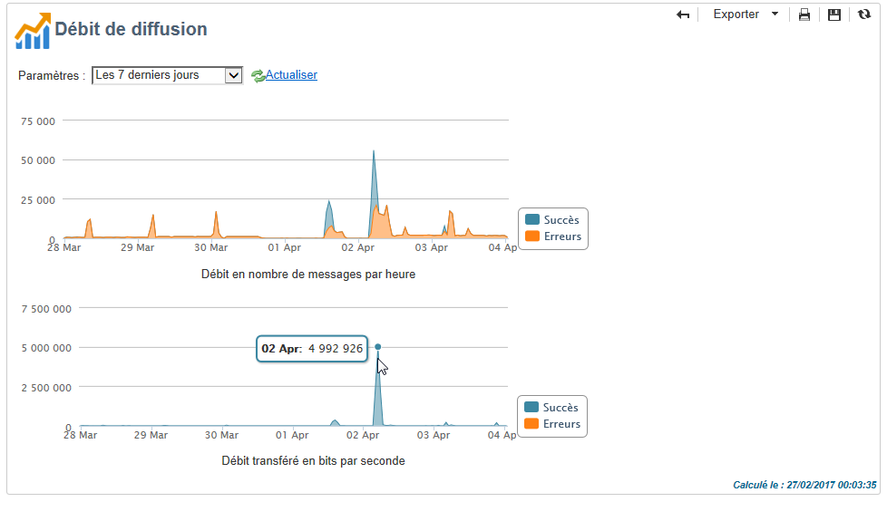

# À propos des rapports sur les diffusions{#reports-on-deliveries}

Adobe Campaign propose plusieurs types de rapports, accessibles depuis la console cliente ou depuis un navigateur internet.

Les types de rapports disponibles sont les suivants :

* Rapports concernant l&#39;ensemble de la plateforme, voir la section [Rapports globaux](../../reporting/using/global-reports.md).
* Rapports de diffusion, voir la section [Rapports de diffusion](../../reporting/using/delivery-reports.md).
* Rapports cumulés, voir la section [Rapports cumulés](../../reporting/using/cumulative-reports.md).

Vous pouvez accéder aux rapports depuis la page d&#39;accueil de la console cliente, le tableau de bord des rapports ou la liste des diffusions. Le mode d&#39;affichage d&#39;un rapport dépend de son contexte. La liste des principaux rapports est disponible sur la page d&#39;accueil et permet d&#39;accéder rapidement aux données des diffusions. Cette liste peut être modifiée selon vos besoins. Voir [cette section](../../reporting/using/about-reports-creation-in-campaign.md) pour plus d&#39;informations.

Un champ de recherche est disponible depuis le tableau de bord des rapports et vous permet d&#39;accéder plus rapidement à l&#39;un des rapports de la liste.

Lorsque le rapport est généré, vous avez la possibilité d&#39;effectuer plusieurs actions à l&#39;aide des icônes disponibles dans la barre d&#39;outils située en haut à droite de la fenêtre du rapport.

Vous pouvez ainsi :

* Exporter le rapport au format Excel, PDF ou Open Document,
* Imprimer le rapport,
* Créer des historiques du rapport,
* Afficher les différents historiques de votre rapport,
* Mettre à jour les données du rapport.

>[!NOTE]
>
>Certains rapports affichent des graphiques (courbes, histogrammes, funnels, etc). Il est possible de déplacer le curseur de la souris sur un graphique pour en afficher les différentes valeurs.

Pour plus d&#39;informations sur ces options, voir [cette section](../../reporting/using/about-adobe-campaign-reporting-tools.md).
