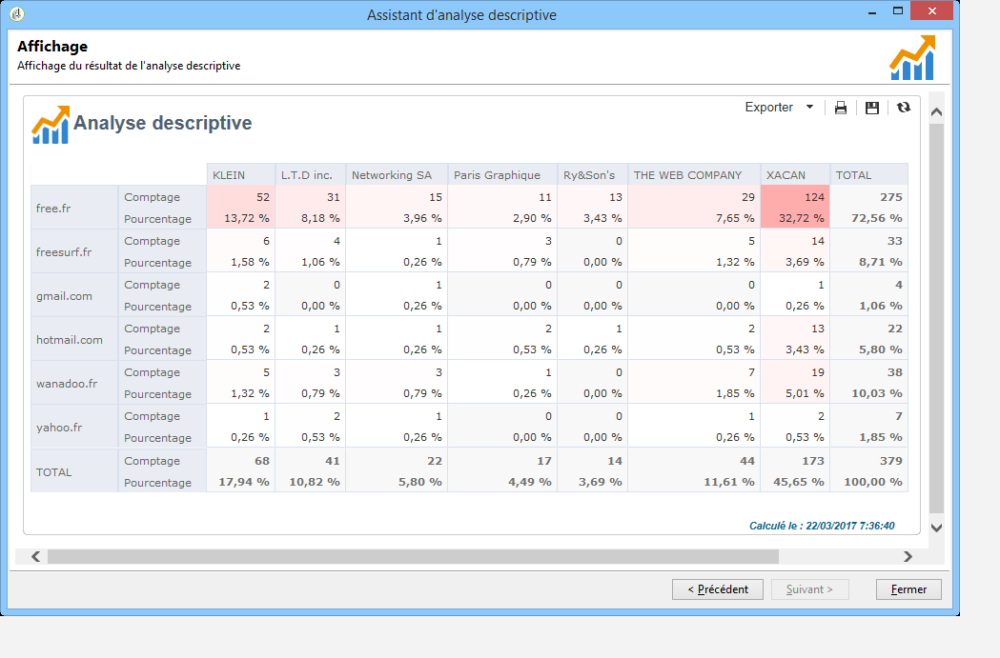
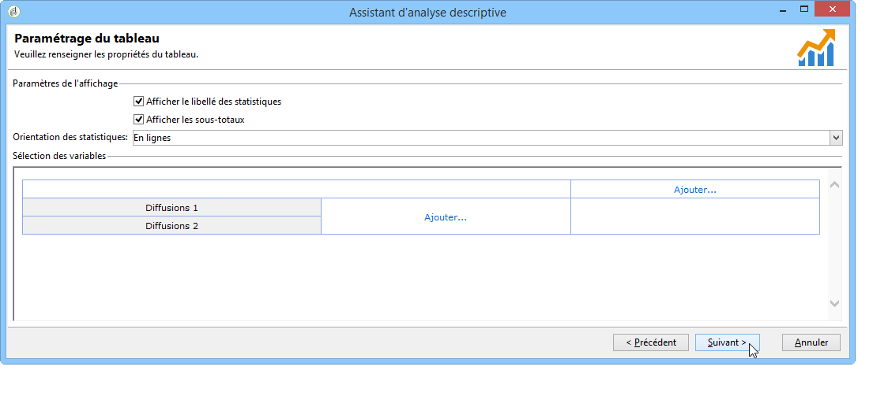
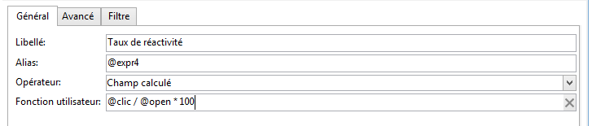

# Cas pratiques{#use-cases}

## Analyser une population {#analyzing-a-population}

L&#39;exemple ci-dessous permet d&#39;explorer la population ciblée par un ensemble de newsletters via l&#39;assistant d&#39;analyse descriptive.

Les étapes de réalisation sont présentées ci-après, les options et descriptions exhaustives sont présentées dans les autres sections de ce chapitre.

### Identifier la population à analyser {#identifying-the-population-to-analyze}

Dans notre exemple, nous allons explorer la population cible des diffusions contenues dans le dossier **Newsletters**.

Pour ce faire, sélectionnez les livraisons concernées, cliquez avec le bouton droit de la souris et sélectionnez **[!UICONTROL Action > Explore the target...]**.


### Choisir le type d&#39;analyse à réaliser {#selecting-a-type-of-analysis}

Dans la première étape de l’assistant, vous pouvez sélectionner le modèle d’analyse descriptive à utiliser.  Par défaut, Adobe Campaign propose deux modèles : **[!UICONTROL Qualitative distribution]** et **[!UICONTROL Quantitative distribution]**. For more on this refer to the [Configuring the qualitative distribution template](../../reporting/using/using-the-descriptive-analysis-wizard.md#configuring-the-qualitative-distribution-template) section. Les différents rendus sont présentés dans la section [A propos de l’analyse](../../reporting/using/about-descriptive-analysis.md) descriptive.

Pour cet exemple, sélectionnez le **[!UICONTROL Qualitative distribution]** modèle et choisissez un affichage avec un graphique et un tableau (tableau). Attribuez un nom au rapport (&quot;Analyse descriptive&quot;) et cliquez sur **[!UICONTROL Next]**.


### Sélectionner les variables à afficher {#selecting-the-variables-to-display}

L&#39;étape suivante permet de sélectionner les données à afficher dans le tableau.

Cliquez sur le **[!UICONTROL Add...]** lien pour sélectionner la variable qui contient les données à afficher. Ici, nous voulons afficher les villes des destinataires sur une ligne :


Les colonnes afficheront le montant des achats de ces destinataires. Dans notre exemple, les montants sont agrégés dans le champ **Achats Web**.

Ici, nous voulons définir le bourrage des résultats pour clarifier leur affichage. Pour ce faire, sélectionnez l’option d’ **[!UICONTROL Manual]** éponge et définissez les classes de calcul pour les segments à afficher :


Cliquez ensuite sur **[!UICONTROL Ok]** pour valider la configuration.

Une fois les lignes et les colonnes définies, vous pouvez les modifier, les déplacer ou les supprimer à partir de la barre d&#39;outils contextuelle.


### Définir le format d&#39;affichage {#defining-the-display-format}

L&#39;étape suivante de l&#39;assistant permet de sélectionner le type de graphique à générer.

Dans cet exemple, choisissez l&#39;histogramme.


Les configurations possibles des différents graphiques sont détaillées dans la section Options [du graphique du rapport](../../reporting/using/processing-a-report.md#analysis-report-chart-options) d’analyse.

### Paramétrer les statistiques à calculer {#configuring-the-statistic-to-calculate}

Indiquez ensuite les calculs à effectuer sur les données collectées. Par défaut, l&#39;assistant d&#39;analyse descriptive réalise un comptage simple des valeurs.

Vous pouvez définir dans cette fenêtre la liste des statistiques à calculer.


Pour créer une statistique, cliquez sur le **[!UICONTROL Add]** bouton. For more on this, refer to [Statistics calculation](../../reporting/using/using-the-descriptive-analysis-wizard.md#statistics-calculation).

### Visualiser et exploiter le rapport {#viewing-and-using-the-report}

La dernière étape de l&#39;assistant affiche le tableau et le graphique.

Vous pouvez stocker, exporter ou imprimer des données à l’aide de la barre d’outils située au-dessus du tableau. For more on this, refer to [Processing a report](../../reporting/using/processing-a-report.md).


## Analyse qualitative des données {#qualitative-data-analysis}

### Exemple d&#39;affichage en graphique {#example-of-a-chart-display}

**Objectif** : générer un rapport d&#39;analyse portant sur la localisation des prospects et des clients.

1. Open the descriptive analysis wizard and select **[!UICONTROL Chart]** only.

   

   Click **[!UICONTROL Next]** to approve this step.

1. Then select the **[!UICONTROL 2 variables]** option and specify that the **[!UICONTROL First variable (abscissa)]** will refer to recipient status (prospects/customers) and the second variable will refer to the country.
1. Select **[!UICONTROL Cylinders]** as a type.

   

1. Cliquez sur **[!UICONTROL Next]** et laissez la **[!UICONTROL Simple count]** statistique par défaut.
1. Click **[!UICONTROL Next]** to display the report.

   

   Vous pouvez positionnez le pointeur de la souris sur une des barres pour connaître le nombre exact de clients ou prospects pour ce pays.

1. Activez ou désactivez l&#39;affichage d&#39;un des pays à partir de la légende.

   

### Exemple d&#39;affichage en tableau {#example-of-a-table-display}

**Objectif** : analyser les domaines des emails des sociétés.

1. Open the descriptive analysis wizard and select the **[!UICONTROL Array]** display mode only.

   

   Click the **[!UICONTROL Next]** button to approve this step.

1. Select the **[!UICONTROL Company]** variable as a column and the **[!UICONTROL Email domain]** variable as a row.
1. Keep the **[!UICONTROL By rows]** option for statistics orientation: the statistic calculation will be displayed to the right of the **[!UICONTROL Email domain]** variable.

   

   Click **[!UICONTROL Next]** to approve this step.

1. Entrez ensuite les statistiques à calculer : conservez le nombre par défaut et créez une nouvelle statistique. Pour ce faire, cliquez sur **[!UICONTROL Add]** et sélectionnez **[!UICONTROL Total percentage distribution]** comme opérateur.

   

1. Saisissez le libellé de cette statistique afin de facilité la lisibilité des informations du rapport.

   

1. Click **[!UICONTROL Next]** to display the report.

   

1. Une fois le rapport d’analyse généré, vous pouvez adapter l’affichage à vos besoins sans modifier la configuration. Par exemple, vous pouvez permuter les axes : cliquez avec le bouton droit de la souris sur les noms de domaine et sélectionnez-les **[!UICONTROL Turn]** dans le menu contextuel.

   

   Le tableau présente alors les informations sous la forme suivante :

   

## Analyse quantitative des données {#quantitative-data-analysis}

**Objectif** : générer un rapport d&#39;analyse quantitatif sur l&#39;âge des destinataires

1. Open the descriptive analysis wizard and select **[!UICONTROL Quantitative distribution]** from the drop-down list.

   

   Click the **[!UICONTROL Next]** button to approve this step.

1. Sélectionnez la **[!UICONTROL Age]** variable et saisissez son libellé. Indiquez s’il s’agit d’un entier, puis cliquez sur **[!UICONTROL Next]**.

   

1. Delete the **[!UICONTROL Deciles]**, **[!UICONTROL Distribution]** and **[!UICONTROL Sum]** statistics: they&#39;re not needed here.

   

1. Click **[!UICONTROL Next]** to display the report.

   

## Analyse de la cible d&#39;une transition dans un workflow {#analyzing-a-transition-target-in-a-workflow}

**Objectif** : générer des rapports sur la population d&#39;un workflow de ciblage

1. Ouvrez un worflow de ciblage de votre choix.
1. Cliquez avec le bouton droit sur une transition pointant vers la table des destinataires.
1. Select **[!UICONTROL Analyze target]** in the drop-down menu to open the descriptive analysis window.

   

1. A ce stade, vous pouvez soit sélectionner l’ **[!UICONTROL Existing analyses and reports]** option et utiliser les rapports créés précédemment (voir [Réutilisation des rapports et analyses](../../reporting/using/processing-a-report.md#re-using-existing-reports-and-analyses)existants), soit créer une nouvelle analyse descriptive. Pour ce faire, laissez l’ **[!UICONTROL New descriptive analysis from a template]** option sélectionnée par défaut.

   Le paramétrage est ensuite le même que pour toute analyse descriptive.

### Recommandations relatives à l&#39;analyse de la cible {#target-analyze-recommendations}

L&#39;analyse d&#39;une population dans un workflow suppose que la population soit encore présente dans la transition. Si le workflow est lancé, le résultat concernant la population risque d&#39;être purgé de la transition. Pour effectuer une analyse, vous pouvez au choix :

* détacher la transition de son activité destination et lancer le workflow pour la rendre active. Lorsque la transition clignote, vous pouvez lancer l&#39;assistant de la façon habituelle.

   

* Modifiez les propriétés du processus en sélectionnant l’ **[!UICONTROL Keep the result of interim populations between two executions]** option. Vous pouvez ainsi lancer une analyse de la transition de votre choix, même si le processus est terminé.

   

   Si la population a été purgée de la transition, un message d&#39;erreur vous invite à sélectionner l&#39;option en question avant de lancer l&#39;assistant d&#39;analyse descriptive.

   

>[!CAUTION]
>
>L&#39; **[!UICONTROL Keep the result of interim populations between two executions]** option ne doit être utilisée qu&#39;en phase de développement, mais jamais pour un environnement en production.\
>Les populations intermédiaires sont automatiquement purgées une fois que le délai de conservation a été atteint. Cette échéance est spécifiée dans l’ **[!UICONTROL Execution]** onglet Propriétés du flux de travail.

## Analyse des logs de tracking des destinataires {#analyzing-recipient-tracking-logs}

L&#39;assistant d&#39;analyse descriptive peut générer des rapports sur d&#39;autres tables de travail. Ainsi, vous pouvez analyser les logs de diffusion en créant un rapport dédié.

Dans notre exemple, nous allons analyser le taux de réactivité des destinataires des newsletters.

Pour cela, les étapes sont les suivantes :

1. Ouvrez l&#39;assistant d&#39;analyse descriptive dans le **[!UICONTROL Tools > Descriptive analysis]** menu et modifiez le tableau de travail par défaut. Sélectionnez **[!UICONTROL Recipient tracking log]** et ajoutez un filtre pour exclure les épreuves et inclure les bulletins d’information.

   

   Select a table display and click **[!UICONTROL Next]**.

1. A l&#39;étape suivante, indiquez que l&#39;analyse porte sur les diffusions.

   

   Ici, les libellés des diffusions seront affichés dans la première colonne.

1. Supprimez le comptage par défaut et créez trois statistiques pour paramétrer les statistiques à afficher dans le tableau.

   Ici, pour chaque newsletter, le tableau affichera : le nombre d&#39;ouvertures et le nombre de clics, le taux de réactivité (en pourcentage).

1. Add a statistic for counting the number of clicks: define the relevant filter in the **[!UICONTROL Filter]** tab.

   

1. Then click the **[!UICONTROL General]** tab to rename the statistics label and alias:

   

1. Ajoutez une deuxième statistique afin de compter le nombre d&#39;ouvertures :

   

1. Then click the **[!UICONTROL General]** tab to rename the statistics label and its alias:

   

1. Add the third statistic and select the **[!UICONTROL Calculated field]** operator to measure the reactivity rate.

   

   Go to the **[!UICONTROL User function]** field and enter the following formula:

   ```
   @clic / @open * 100
   ```

   Adaptez le libellé de la statistique, comme ci-dessous :

   

   Finally, specify whether the values are shown as a percentage: to do this, uncheck the **[!UICONTROL Default formatting]** option in the **[!UICONTROL Advanced]** tab and select **[!UICONTROL Percentage]** without a decimal point.

   

1. Click **[!UICONTROL Next]** to display the report.

   

## Analyse des logs d&#39;exclusion d&#39;une diffusion {#analyzing-delivery-exclusion-logs}

Si l’analyse concerne une livraison, vous pouvez analyser la population exclue. Pour ce faire, sélectionnez les livraisons à analyser et cliquez avec le bouton droit pour accéder au **[!UICONTROL Action > Explore exclusions]** menu.


Vous accédez alors à l&#39;assistant d&#39;analyse descriptive et l&#39;analyse portera sur les logs d&#39;exclusion des destinataires.

Vous pouvez par exemple afficher les domaines des adresses exclues, par date d&#39;exclusion.


Et générer un rapport du type :


