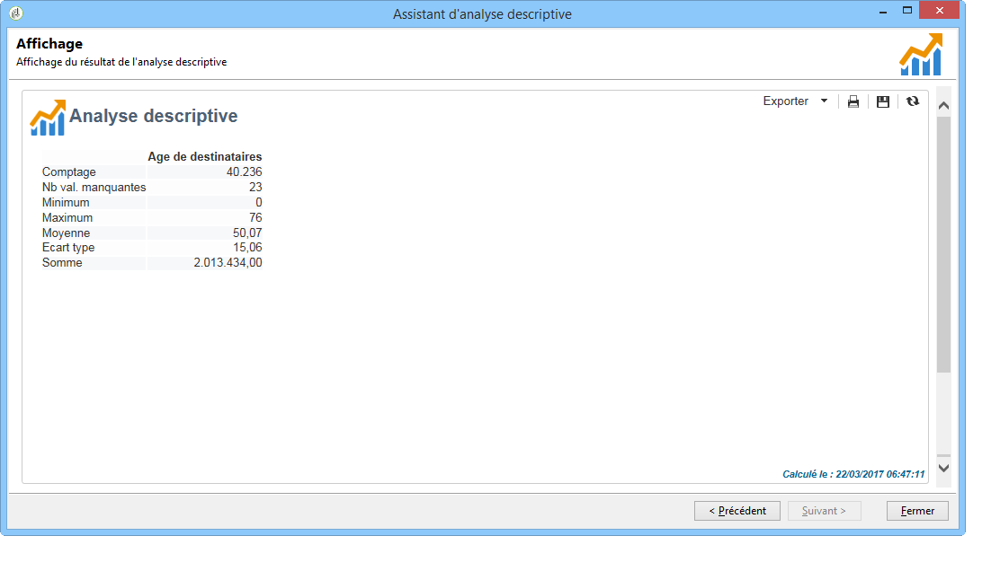

# Cas dʼutilisation{#use-cases}


## Analyser une population {#analyzing-a-population}

L&#39;exemple ci-dessous permet d&#39;explorer la population ciblée par un ensemble de newsletters via l&#39;assistant d&#39;analyse descriptive.

Les étapes de réalisation sont présentées ci-après, les options et descriptions exhaustives sont présentées dans les autres sections de ce chapitre.

### Identifier la population à analyser {#identifying-the-population-to-analyze}

Dans notre exemple, nous allons explorer la population cible des diffusions contenues dans le dossier **Newsletters**.

Pour cela, sélectionnez les diffusions concernées, puis cliquez avec le bouton droit de la souris et choisissez **[!UICONTROL Action > Explorer la cible...]**.


### Choisir le type d&#39;analyse à réaliser {#selecting-a-type-of-analysis}

Dans la première étape de l’assistant, vous pouvez sélectionner le modèle d’analyse descriptive à utiliser. Par défaut, Adobe Campaign propose deux modèles : **[!UICONTROL Distribution qualitative]** et **[!UICONTROL Distribution quantitative]**. Pour plus d&#39;informations, consultez la section [Paramétrer le modèle de distribution qualitative](../../reporting/using/using-the-descriptive-analysis-wizard.md#configuring-the-qualitative-distribution-template). Les différents rendus sont présentés dans la section [À propos de l’analyse descriptive](../../reporting/using/about-descriptive-analysis.md).

Pour cet exemple, choisissez le modèle **[!UICONTROL Distribution qualitative]** et sélectionnez un affichage avec graphe et tableau. Nommez le rapport &quot;Mon analyse descriptive&quot; et cliquez sur le bouton **[!UICONTROL Suivant]**.


### Sélectionner les variables à afficher {#selecting-the-variables-to-display}

L&#39;étape suivante permet de sélectionner les données à afficher dans le tableau.

Cliquez sur lien **[!UICONTROL Ajouter...]** pour sélectionner la variable contenant les données à afficher. Ici, nous allons afficher en ligne les villes de résidence des destinataires des diffusions :


Les colonnes afficheront le montant des achats de ces destinataires. Dans notre exemple, les montants sont agrégés dans le champ **Achats Web**.

Nous allons ici définir une mise en classe des résultats afin de clarifier leur affichage. Pour cela, sélectionnez l&#39;option de mise en classe **[!UICONTROL Manuelle]** et indiquez les bornes à utiliser pour calculer les segments à afficher :


Cliquez ensuite sur **[!UICONTROL OK]** pour valider la configuration.

Une fois les lignes et les colonnes définies, vous pouvez les modifier, les déplacer ou les supprimer à partir de la barre d&#39;outils contextuelle.


### Définir le format d&#39;affichage {#defining-the-display-format}

L&#39;étape suivante de l&#39;assistant permet de sélectionner le type de graphique à générer.

Dans cet exemple, choisissez l&#39;histogramme.


Les configurations possibles des différents graphiques sont détaillées dans la section [Options des graphiques des rapports d’analyse](../../reporting/using/processing-a-report.md#analysis-report-chart-options).

### Paramétrer les statistiques à calculer {#configuring-the-statistic-to-calculate}

Indiquez ensuite les calculs à effectuer sur les données collectées. Par défaut, l&#39;assistant d&#39;analyse descriptive réalise un comptage simple des valeurs.

Vous pouvez définir dans cette fenêtre la liste des statistiques à calculer.


Pour créer une nouvelle statistique, cliquez sur le bouton **[!UICONTROL Ajouter]**. Voir à ce sujet la section [Calcul des statistiques](../../reporting/using/using-the-descriptive-analysis-wizard.md#statistics-calculation).

### Visualiser et exploiter le rapport {#viewing-and-using-the-report}

La dernière étape de l&#39;assistant affiche le tableau et le graphique.

Vous pouvez stocker, exporter ou imprimer des données à l’aide de la barre d’outils située au-dessus de la table. Voir à ce sujet la section [Traitement du rapport](../../reporting/using/processing-a-report.md).


## Analyse qualitative des données {#qualitative-data-analysis}

### Exemple d&#39;affichage en graphique {#example-of-a-chart-display}

**Objectif** : générer un rapport d&#39;analyse portant sur la localisation des prospects et des clients.

1. Ouvrez l&#39;assistant d&#39;analyse descriptive et choisissez le mode d&#39;affichage **[!UICONTROL Graphe]** seulement.

   

   Cliquez sur **[!UICONTROL Suivant]** pour valider cette étape.

1. Sélectionnez ensuite l&#39;option **[!UICONTROL 2 variables]** puis indiquez que la **[!UICONTROL Première variable (abscisse)]** portera sur le statut des destinataires (prospects/clients) et la deuxième variable sur le pays.
1. Choisissez un graphique de type **[!UICONTROL Histogramme]**.

   

1. Cliquez sur **[!UICONTROL Suivant]** et conservez la statistique par défaut : **[!UICONTROL Comptage simple]**.
1. Cliquez sur **[!UICONTROL Suivant]** pour afficher le rapport.

   

   Vous pouvez positionnez le pointeur de la souris sur une des barres pour connaître le nombre exact de clients ou prospects pour ce pays.

1. Activez ou désactivez l&#39;affichage d&#39;un des pays à partir de la légende.

   

### Exemple d&#39;affichage en tableau {#example-of-a-table-display}

**Objectif** : analyser les domaines des emails des sociétés.

1. Ouvrez l&#39;assistant d&#39;analyse descriptive et choisissez le mode d&#39;affichage en **[!UICONTROL Tableau]** seulement.

   

   Cliquez sur le bouton **[!UICONTROL Suivant]** pour valider cette étape.

1. Sélectionnez la variable **[!UICONTROL Société]** en colonne et la variable **[!UICONTROL Domaine de l&#39;email]** en ligne.
1. Laissez l&#39;option **[!UICONTROL En ligne]** pour l&#39;orientation des statistiques : le calcul de la statistique sera affiché à droite de la variable **[!UICONTROL Domaine de l&#39;email]**.

   

   Cliquez sur **[!UICONTROL Suivant]** pour valider cette étape.

1. Renseignez ensuite les statistiques à calculer : conservez le comptage par défaut et créez une nouvelle statistique. Pour cela, cliquez sur **[!UICONTROL Ajouter]** et sélectionnez l&#39;opérateur **[!UICONTROL Répartition en pourcentage sur le total]**.

   

1. Saisissez le libellé de cette statistique afin de facilité la lisibilité des informations du rapport.

   

1. Cliquez sur **[!UICONTROL Suivant]** pour afficher le rapport.

   

1. Une fois le rapport d&#39;analyse généré, vous pouvez en adapter l&#39;affichage à vos besoins, sans modifier sa configuration. Vous pouvez par exemple permuter les axes : pour cela, cliquez avec le bouton droit sur la ligne contenant les noms de domaine et, dans le menu contextuel, sélectionnez **[!UICONTROL Tourner]**.

   

   Le tableau présente alors les informations sous la forme suivante :

   

## Analyse quantitative des données {#quantitative-data-analysis}

**Objectif** : générer un rapport d&#39;analyse quantitatif sur l&#39;âge des destinataires

1. Ouvrez l&#39;assistant d&#39;analyse descriptive et sélectionnez le modèle d&#39;analyse **[!UICONTROL Distribution quantitative]**.

   

   Cliquez sur le bouton **[!UICONTROL Suivant]** pour valider cette étape.

1. Sélectionnez ensuite la variable **[!UICONTROL Age]** et saisissez son libellé. Indiquez qu&#39;il s&#39;agit d&#39;un entier, puis cliquez sur **[!UICONTROL Suivant]**.

   

1. Supprimer les statistiques inutiles, ici **[!UICONTROL Déciles]**, **[!UICONTROL Distribution]** et **[!UICONTROL Somme]**.

   

1. Cliquez sur **[!UICONTROL Suivant]** pour afficher le rapport.

   

## Analyse de la cible d&#39;une transition dans un workflow {#analyzing-a-transition-target-in-a-workflow}

**Objectif** : générer des rapports sur la population d&#39;un workflow de ciblage

1. Ouvrez un worflow de ciblage de votre choix.
1. Cliquez avec le bouton droit sur une transition pointant vers la table des destinataires.
1. Dans le menu contextuel, choisissez **[!UICONTROL Analyser la cible]** pour ouvrir l&#39;assistant d&#39;analyse descriptive.

   

1. A ce stade, vous pouvez soit sélectionner l’option **[!UICONTROL Analyses et rapports existants]** et utiliser les rapports créés précédemment (voir [Ré-utiliser des analyses et rapports existants](../../reporting/using/processing-a-report.md#re-using-existing-reports-and-analyses)), soit créer une nouvelle analyse descriptive. Pour ce faire, laissez l’option **[!UICONTROL Nouvelle analyse descriptive depuis un modèle]** sélectionnée par défaut.

   Le paramétrage est ensuite le même que pour toute analyse descriptive.

### Recommandations relatives à l&#39;analyse de la cible {#target-analyze-recommendations}

L&#39;analyse d&#39;une population dans un workflow suppose que la population soit encore présente dans la transition. Si le workflow est lancé, le résultat concernant la population risque d&#39;être purgé de la transition. Pour effectuer une analyse, vous pouvez au choix :

* détacher la transition de son activité destination et lancer le workflow pour la rendre active. Lorsque la transition clignote, vous pouvez lancer l&#39;assistant de la façon habituelle.

  

* modifier les propriétés du workflow en sélectionnant l&#39;option **[!UICONTROL Conserver le résultat des populations intermédiaires entre deux exécutions]**. Cela vous permet de lancer une analyse sur la transition de votre choix même si le workflow s&#39;est terminé.

  

  Si la population a été purgée de la transition, un message d&#39;erreur vous invite à sélectionner l&#39;option en question avant de lancer l&#39;assistant d&#39;analyse descriptive.

  

>[!CAUTION]
>
>L&#39;option **[!UICONTROL Conserver le résultat des populations intermédiaires entre deux exécutions]** ne doit être utilisée que dans des phases de développement, mais jamais pour un environnement en production.\
>Les populations intermédiaires sont automatiquement purgées une fois leur délai de rétention atteint. Ce délai est défini dans l&#39;onglet **[!UICONTROL Exécution]** des propriétés du workflow.

## Analyse des logs de tracking des destinataires {#analyzing-recipient-tracking-logs}

L&#39;assistant d&#39;analyse descriptive peut générer des rapports sur d&#39;autres tables de travail. Ainsi, vous pouvez analyser les logs de diffusion en créant un rapport dédié.

Dans notre exemple, nous allons analyser le taux de réactivité des destinataires des newsletters.

Pour cela, les étapes sont les suivantes :

1. Ouvrez l&#39;assistant d&#39;analyse descriptive à partir du menu **[!UICONTROL Outils > Analyse descriptive]** et modifiez la table de travail par défaut. Choisissez **[!UICONTROL Log de tracking d&#39;un destinataire]**. Ajoutez un filtre pour que l&#39;analyse ne porte que sur les newsletters et exclut les Bons à Tirer.

   

   Sélectionnez un mode d&#39;affichage en tableau seul et cliquez sur **[!UICONTROL Suivant]**.

1. A l&#39;étape suivante, indiquez que l&#39;analyse porte sur les diffusions.

   

   Ici, les libellés des diffusions seront affichés dans la première colonne.

1. Supprimez le comptage par défaut et créez trois statistiques pour paramétrer les statistiques à afficher dans le tableau.

   Ici, pour chaque newsletter, le tableau affichera : le nombre d&#39;ouvertures et le nombre de clics, le taux de réactivité (en pourcentage).

1. Ajoutez une statistique afin de compter le nombre de clics : définissez le filtre correspondant dans l&#39;onglet **[!UICONTROL Filtre]**.

   

1. Puis, cliquez sur l&#39;onglet **[!UICONTROL Général]** pour adapter le libellé de la statistique et son alias :

   

1. Ajoutez une deuxième statistique afin de compter le nombre d&#39;ouvertures :

   

1. Puis, cliquez sur l&#39;onglet **[!UICONTROL Général]** pour adapter le libellé de la statistique et son alias :

   

1. Ajoutez une dernière statistique et sélectionnez l&#39;opérateur **[!UICONTROL Champ calculé]** afin de mesurer le taux de réactivité.

   

   Dans le champ **[!UICONTROL Fonction utilisateur]**, saisissez la formule suivante :

   ```
   @clic / @open * 100
   ```

   Adaptez le libellé de la statistique, comme ci-dessous :

   

   Indiquez enfin que les valeurs sont affichées en pourcentage : pour cela, décochez l&#39;option **[!UICONTROL Formatage par défaut]** de l&#39;onglet **[!UICONTROL Avancé]**, et choisissez **[!UICONTROL Pourcentage]**, sans décimale.

   

1. Cliquez sur **[!UICONTROL Suivant]** pour afficher le rapport.

   

## Analyse des logs d&#39;exclusion d&#39;une diffusion {#analyzing-delivery-exclusion-logs}

Lorsque l&#39;analyse porte sur une diffusion, vous pouvez analyser la population exclue. Pour cela, sélectionnez la ou les diffusions à analyser et cliquez avec le bouton droit pour accéder au menu **[!UICONTROL Action > Explorer les exclusions]**.


Vous accédez alors à l&#39;assistant d&#39;analyse descriptive et l&#39;analyse portera sur les logs d&#39;exclusion des destinataires.

Vous pouvez par exemple afficher les domaines des adresses exclues, par date d&#39;exclusion.


Et générer un rapport du type :


