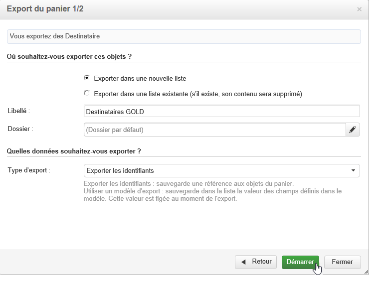
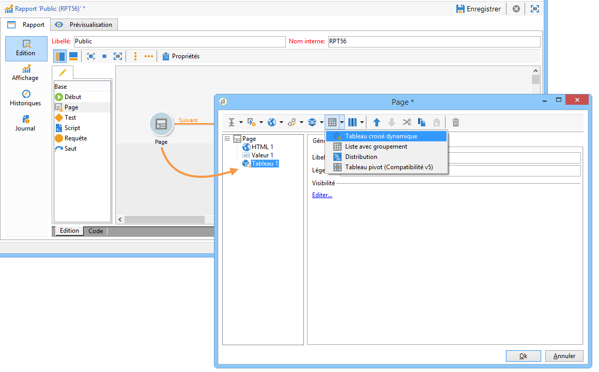

# Utilisation des cubes pour explorer les données{#using-cubes-to-explore-data}

Marketing Analytics permet de simplifier la création de rapports ainsi que l&#39;identification et la sélection de données de la base via l&#39;utilisation des cubes. Vous pouvez ainsi :

* Créer des rapports basés sur des cubes. La procédure est décrite dans la section [Exploration des données dans un rapport](#exploring-the-data-in-a-report).
* Collecter des données de la base et les regrouper dans des listes, par exemple pour identifier et construire les cibles des diffusions. Pour plus dʼinformations, consultez la section [Construction dʼune population cible](#building-a-target-population).
* Insérer un tableau croisé dynamique dans un rapport, au sein duquel vous référencez un cube existant. Pour plus dʼinformations, consultez la section [Insertion dʼun tableau croisé dynamique dans un rapport](#inserting-a-pivot-table-into-a-report).

>[!NOTE]
>
>Marketing Analytics est nécessaire pour créer ou modifier des cubes. Voir à ce sujet la section [À propos des cubes](../../reporting/using/ac-cubes.md).

## Exploration des données dans un rapport {#exploring-the-data-in-a-report}

### Étape 1 : création dʼun rapport basé sur un cube {#step-1---creating-a-report-based-on-a-cube}

Pour créer un rapport basé sur un cube, cliquez sur le bouton **[!UICONTROL Créer]** de l’onglet **[!UICONTROL Rapports]** et choisissez le cube à utiliser.

La procédure est décrite dans la section [Création dʼun rapport basé sur un cube](../../reporting/using/creating-indicators.md#creating-a-report-based-on-a-cube).

### Étape 2 : sélection des lignes et colonnes {#step-2---selecting-lines-and-columns}

L&#39;affichage par défaut propose alors les deux premières dimensions du cube (dans notre exemple : l&#39;âge et la ville).

Les boutons **[!UICONTROL Ajouter]** situés sur chacun des axes permettent d&#39;ajouter d&#39;autres dimensions.

1. Pour ajouter une dimension, cliquez sur le bouton de la ligne ou de la colonne concernée :
1. Sélectionnez la dimension à ajouter dans le tableau, parmi celles disponibles :

   

1. Sélectionnez ensuite les paramètres de cette dimension.

   

   Les paramètres dépendent du type de données de la dimension sélectionnée.

   Par exemple, pour les dates, plusieurs niveaux peuvent être disponibles. Pour plus dʼinformations, consultez la section [Affichage des mesures](../../reporting/using/concepts-and-methodology.md#displaying-measures).

   Les options proposées sont alors les suivantes :

   

   Vous pouvez, au choix :

   * Déplier les données au chargement : les valeurs seront alors affichées par défaut à chaque actualisation du rapport (valeur par défaut : non).
   * Afficher le total en fin de ligne : pour les données affichées en colonne, une options supplémentaire est proposée afin d&#39;afficher le total en fin de ligne : une colonne supplémentaire est alors ajoutée dans le tableau (valeur par défaut : oui).
   * Appliquer un tri : les valeurs de la colonne peuvent être triées par valeur, par libellé, ou selon une mesure (valeur par défaut : par valeur).
   * Afficher les valeurs dans l&#39;ordre ascendant (a-z, 0-9) ou descendant (z-a, 9-0).
   * Modifier le nombre de colonnes à afficher au chargement (par défaut : 200).

1. Cliquez sur **[!UICONTROL Ok]** pour confirmer l&#39;insertion : la dimension est alors ajoutée parmi les dimensions existantes.

   Le bandeau jaune situé au-dessus du tableau indique que vous avez effectué des modifications : cliquez sur le bouton **[!UICONTROL Enregistrer]** si vous souhaitez les sauvegarder.

   

### Étape 3 : configuration des mesures à afficher {#step-3---configuring-the-measures-to-display}

Une fois les lignes et colonnes positionnées, indiquez les mesures que vous souhaitez afficher ainsi que leur mode d&#39;affichage.

Par défaut, une seule mesure est affichée. Pour ajouter ou paramétrez les mesures :

1. Cliquez sur le bouton **[!UICONTROL Mesures]**.

   

1. Le bouton **[!UICONTROL Utiliser une mesure]** permet de sélectionner une des mesures existantes.

   

   Sélectionnez les informations que vous souhaitez afficher et le type de formatage à utiliser. La liste des options dépend du type de mesure paramétré.

   

   Une configuration globale des mesures est également possible à partir de l’icône **[!UICONTROL Modifier la configuration du tableau croisé dynamique]** située dans l’en-tête.

   

   Vous pouvez notamment choisir d&#39;afficher ou non les libellés des mesures. Pour plus dʼinformations, consultez la section [Configuration de lʼaffichage](../../reporting/using/concepts-and-methodology.md#configuring-the-display).

1. Vous pouvez construire de nouvelles mesures à partir des mesures existantes. Pour cela, cliquez sur le bouton **[!UICONTROL Créer une mesure]** et indiquez son paramétrage.

   

   Les types de mesures possibles sont les suivantes :

   * Combinaison de mesures : ce type de mesure permet de construire la nouvelle mesure à partir de mesures existantes.

     Entre ces mesures, les opérateurs disponibles sont : somme, différence, multiplication et taux.

   * Proportion : ce type de mesure permet de calculer le nombre d&#39;enregistrements mesurés pour une dimension donnée. Vous pouvez calculer la proportionnalité par rapport à une dimension ou une sous-dimension.
   * Variation : cette mesure permet de calculer la variation des valeurs d&#39;un niveau.
   * Ecart à la moyenne : ce type de mesure permet de calculer les écarts dans chaque groupe de cellules correspondantes, par rapport à la moyenne des valeurs. Vous pouvez par exemple comparer le volume des ventes pour chaque segment existant.

   La mesure créée est alors ajoutée dans le rapport.

   

   Une fois créée, vous pouvez éditer et, au besoin, modifier, la configuration de la mesure. Pour cela, cliquez sur le bouton **[!UICONTROL Mesures]**, puis sur l&#39;onglet de la mesure à éditer.

   Cliquez ensuite sur le bouton **[!UICONTROL Modifier la mesure dynamique]** pour accéder au menu des paramètres.

## Construction dʼune population cible {#building-a-target-population}

Les rapports construits à partir des cubes permettent de collecter des données dans le tableau et de les sauvegarder dans une liste.

Pour cela, vous pouvez les ajouter à un panier, dont le contenu sera exporté.

Pour regrouper une population dans une liste, les étapes sont les suivantes :

1. Cliquez sur les cellules contenant les populations à collecter pour les sélectionner, puis cliquez sur l&#39;icône **[!UICONTROL Ajouter au panier]**.

   

   Répétez l&#39;opération autant de fois que nécessaire, pour collecter les différents profils.

1. Cliquez sur le bouton **[!UICONTROL Afficher le panier]** pour en visualiser le contenu avant de réaliser l&#39;export.

   

1. Le bouton **[!UICONTROL Exporter]** permet de regrouper les éléments du panier dans une liste.

   Vous devez indiquer le nom de la liste et le type d&#39;export à réaliser.

   

   Cliquez sur **[!UICONTROL Démarrer]** pour lancer l&#39;export.

1. Une fois l&#39;export terminé, un message vous en confirme la bonne exécution, ainsi que le nombre d&#39;enregistrements traités.

   

   Vous pouvez choisir de conserver le contenu du panier ou de le vider.

   La liste correspondante est accessible à partir de l’onglet **[!UICONTROL Profils et cibles]**.

   

## Insertion dʼun tableau croisé dynamique dans un rapport {#inserting-a-pivot-table-into-a-report}

Pour créer un tableau qui explore les données d&#39;un cube, les étapes sont les suivantes :

1. Créez un nouveau rapport, avec une seule page, et insérez-y un tableau croisé dynamique. Voir à ce propos [cette page](../../reporting/using/creating-a-table.md#creating-a-breakdown-or-pivot-table).

   

1. Dans l&#39;onglet **[!UICONTROL Données]** de la page, sélectionnez un cube afin d&#39;exploiter les dimensions qu&#39;il contient et afficher les mesures calculées.

   

   Vous pourrez ainsi construire le rapport à afficher. Pour plus d&#39;informations, consultez la section [Etape 2 - Sélection des lignes et colonnes](#step-2---selecting-lines-and-columns).
