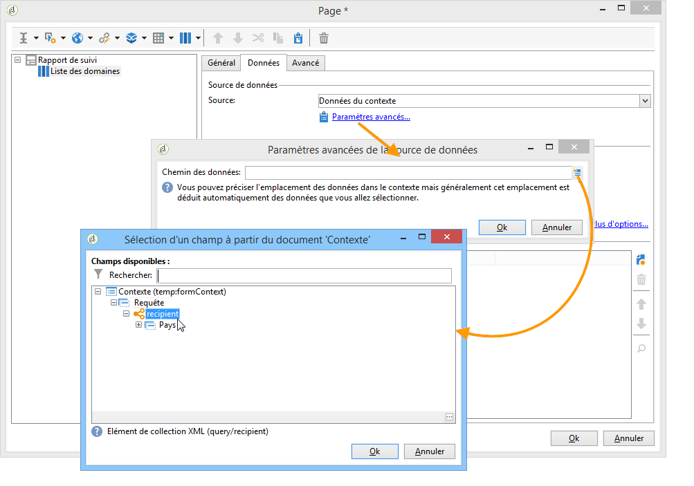

# Utilisation du contexte dans vos rapports{#using-the-context}

Lorsque vous souhaitez représenter les données sous forme de **[!UICONTROL tableau]** ou de **[!UICONTROL graphique]**, elles peuvent provenir de deux sources : dʼune nouvelle requête (consultez la section [Définition dʼun filtre direct sur les données](#defining-a-direct-filter-on-data)) ou du contexte du rapport (consultez la section [Utilisation des données du contexte](#using-context-data)).

## Définition dʼun filtre direct sur les données {#defining-a-direct-filter-on-data}

### Filtrage des données {#filtering-data}

Il n&#39;est pas obligatoire d&#39;utiliser une activité de type **[!UICONTROL Requête]** lors de la construction d&#39;un rapport. En effet, les données peuvent être filtrées directement au niveau des tableaux et des graphiques qui composent ce rapport.

Ainsi, vous pouvez sélectionner les données à afficher dans le rapport directement depuis l&#39;activité **[!UICONTROL Page]** du rapport.

Pour cela, cliquez sur le lien **[!UICONTROL Filtrer les données...]** disponible dans l&#39;onglet **[!UICONTROL Données]** : ce lien permet d&#39;accéder à l&#39;éditeur d&#39;expressions pour définir une requête sur les données à analyser.

### Exemple : utilisation d&#39;un filtre dans un graphique {#example--use-a-filter-in-a-chart}

Dans l&#39;exemple suivant, le graphique ne doit afficher que les profils de destinataires vivant en France et qui ont effectué des achats pendant l&#39;année.

Pour définir ce filtre, positionnez une page dans le diagramme et éditez-la. Cliquez sur le lien **[!UICONTROL Filtrer les données]** et créez le filtre correspondant aux données que vous voulez afficher. Pour plus d&#39;informations sur la construction des requêtes dans Adobe Campaign, reportez-vous à [cette section](../../platform/using/adobe-campaign-workspace.md#about-queries-in-campaign).

Ici, nous allons afficher la répartition par ville des destinataires répondant à la sélection.

Le rendu sera par exemple :

### Exemple : utilisation d&#39;un filtre dans un tableau croisé dynamique {#example--use-a-filter-in-a-pivot-table}

Dans cet exemple, le filtre permettra de n&#39;afficher dans le tableau croisé dynamique que les clients non-parisiens, sans passer par une requête préalable.

Les étapes sont les suivantes :

1. Positionnez une page dans le diagramme et éditez-la.
1. Créez un tableau croisé dynamique.
1. Dans l&#39;onglet **[!UICONTROL Données]**, sélectionnez le cube à utiliser.
1. Cliquez sur le lien **[!UICONTROL Filtrer les données...]** et définissez la requête suivante afin de retirer Adobe de la liste des sociétés.

   

Le résultat sera que seuls les destinataires répondant aux critères de filtrage seront pris en compte dans le rapport.

## Utilisation des données contextuelles {#using-context-data}

Lorsque vous souhaitez représenter les données sous forme de **[!UICONTROL tableau]** ou de **[!UICONTROL graphique]**, les données peuvent provenir du contexte du rapport.

Dans la page contenant le tableau ou le graphique, l&#39;onglet **[!UICONTROL Données]** permet de sélectionner la source des données.

* L&#39;option **[!UICONTROL Nouvelle requête]** permet de créer une requête pour collecter des données. Pour plus dʼinformations, consultez la section [Définition dʼun filtre direct sur les données](#defining-a-direct-filter-on-data).
* L&#39;option **[!UICONTROL Données du contexte]** permet d&#39;utiliser les données d&#39;entrée : le contexte du rapport correspond aux informations qui sont véhiculées dans la transition entrante de la page contenant le graphique ou le tableau. Ce contexte peut, par exemple, contenir les données collectées via une activité **[!UICONTROL Requête]** placée avant l&#39;activité **[!UICONTROL Page]**, et dans laquelle vous spécifiez la table et les champs sur lesquels doit porter le rapport.

Par exemple, dans une boîte de requête, construisez la requête suivante sur les destinataires :

Indiquez ensuite la source des données de votre rapport, ici : les **[!UICONTROL Données du contexte]**.

L&#39;emplacement des données est déduit automatiquement. Vous pouvez, au besoin, forcer le chemin des données.

Lorsque vous choisissez les données sur lesquelles doivent porter les statistiques, les champs disponibles correspondent aux données spécifiées dans la requête.

