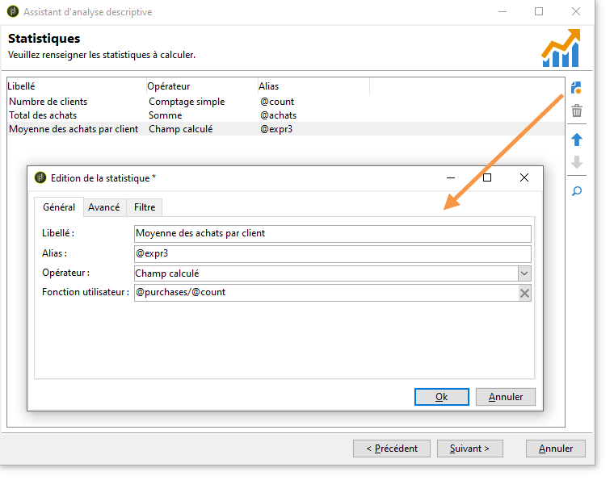

# Utilisation de l’assistant d’analyse descriptive{#using-the-descriptive-analysis-wizard}

Pour créer un rapport dʼanalyse descriptive, vous devez suivre les étapes de lʼassistant dédié. Son paramétrage dépend des données à analyser et du rendu souhaité.

## Analyse des données dans la base de données {#analyzing-data-in-the-database}

L&#39;assistant d&#39;analyse descriptive peut être lancé à l&#39;aide du menu **[!UICONTROL Outils > Analyse descriptive]** : dans ce cas, l&#39;analyse porte par défaut sur les destinataires (**nms:recipient**). Il s&#39;applique à la totalité des données de la base Adobe Campaign.

Si vous souhaitez analyser une autre table que celle des destinataires standards (**nms:recipient**), cliquez sur le lien **[!UICONTROL Paramètres avancés...]** proposé à la première étape de l&#39;assistant et sélectionnez la table correspondant à votre paramétrage, par exemple ici **cus:individual** :

Si vous souhaitez produire des statistiques sur une partie de vos données, vous pouvez définir un filtre sur les données : pour cela, cliquez sur le lien **[!UICONTROL Paramètres avancés...]** et définissez le filtre à appliquer, comme dans l&#39;exemple ci-dessous :

L&#39;analyse ne portera que sur les destinataires de la base de données agés de 16 ans et plus et résidant à Paris.

## Analyse dʼun jeu de données {#analyzing-a-set-of-data}

Vous pouvez utiliser l&#39;assistant d&#39;analyse descriptive à partir d&#39;un autre contexte : une liste, une transition de workflow, une ou plusieurs diffusions, une sélection de destinataires, etc.

En effet, il est accessible depuis plusieurs noeuds de l&#39;arborescence d&#39;Adobe Campaign qui pointent vers la table des destinataires.

L&#39;assistant d&#39;analyse descriptive est alors lancé à partir du bouton droit de la souris sur la sélection. Dans ce cas, seules les données de la sélection seront analysées.

* Pour un ensemble de **destinataires**, sélectionnez les destinataires à analyser, puis cliquez avec le bouton droit et choisissez **[!UICONTROL Actions > Explorer...]**, comme dans l&#39;exemple ci-dessus. Si un filtre est appliqué sur la liste de destinataires, seul son contenu sera analysé.

  Vous pouvez sélectionner tous les destinataires du dossier, ou du filtre courant, en utilisant la combinaison CTRL+A. Dans ce cas, même les destinataires non visibles à l&#39;écran sont sélectionnés.

  Un exemple d&#39;analyse descriptive des destinataires est proposé dans la section [Analyse qualitative des données](../../reporting/using/use-cases.md#qualitative-data-analysis).

* Dans le contexte d&#39;un **workflow**, placez le curseur sur une transition pointant vers la table des destinataires, cliquez avec le bouton droit de la souris et sélectionnez **[!UICONTROL Analyser la cible]**. Pour plus dʼinformations, consultez lʼexemple présenté dans la section [Analyse de la cible dʼune transition dans un workflow](../../reporting/using/use-cases.md#analyzing-a-transition-target-in-a-workflow).
* Pour les **listes**, sélectionnez une ou plusieurs listes et appliquez la même procédure que pour les destinataires.
* Dans le contexte d&#39;une **diffusion**, sélectionnez la ou les diffusions dont vous souhaitez analyser la cible, cliquez avec le bouton droit et choisissez **[!UICONTROL Actions > Explorer la cible]**, comme dans l&#39;exemple ci-dessous :

  

  Des exemples dʼanalyses descriptives de diffusions sont proposés dans les sections suivantes : [Analyse dʼune population](../../reporting/using/use-cases.md#analyzing-a-population) et [Analyse des logs de tracking des destinataires](../../reporting/using/use-cases.md#analyzing-recipient-tracking-logs).

## Configuration du modèle de distribution qualitative {#configuring-the-qualitative-distribution-template}

Le modèle **[!UICONTROL Distribution qualitative]** vous permet de faire des statistiques sur tous types de données (par exemple le nom dʼune société ou le domaine dʼe-mail).

Les options de configuration proposées pour un rapport créé à lʼaide du modèle de **[!UICONTROL distribution qualitative]** sont détaillées dans la section [Affichage des données dans le tableau](#displaying-data-in-the-table). Un exemple détaillé est proposé dans la section [Analyse dʼune population](../../reporting/using/use-cases.md#analyzing-a-population).

Lorsque vous utilisez lʼassistant dʼanalyse descriptive pour réaliser une analyse qualitative de vos données, les options disponibles dépendent des paramètres sélectionnés. Elles sont présentées ci-après.

### Mise en classe des données {#data-binning}

Lorsque vous sélectionnez les variables à afficher, vous pouvez définir une mise en classe des données, c&#39;est-à-dire paramétrer des critères de regroupement pour les données sélectionnées.

>[!NOTE]
>
>Lorsque le champ sur lequel portent les calculs est calculé au travers d&#39;un agrégat, cochez l&#39;option **[!UICONTROL Les données sont déjà agrégées]** afin d&#39;améliorer les performances.

En fonction du contenu du champ, les options proposées peuvent différer.

* **[!UICONTROL Aucune]** : cette option permet d&#39;afficher toutes les valeurs disponibles pour la variable, sans mise en classe.

  >[!CAUTION]
  >
  >Il est recommandé d&#39;utiliser cette option avec précaution : les performances et la lisibilité du rapport peuvent être fortement impactées.

* **[!UICONTROL Auto]** : cette option permet d&#39;afficher les n valeurs les plus représentées. Elles sont automatiquement calculées et représentent chacune un pourcentage des variables par rapport au nombre de classes spécifié. Lorsque les valeurs sont numériques, Adobe Campaign répartit automatiquement les données dans n tranches.
* **[!UICONTROL Manuelle]** : cette option fonctionne comme l&#39;option **[!UICONTROL Auto]**, mais vous pouvez personnaliser manuellement ces valeurs. Pour cela, cliquez sur le bouton **[!UICONTROL Ajouter]** situé à droite du tableau des valeurs.

  Les valeurs peuvent être initialisées automatiquement par Adobe Campaign avant d&#39;être personnalisées : pour cela, saisissez le nombre de classes à générer et cliquez sur le lien **[!UICONTROL Initialiser avec]**, comme dans l&#39;exemple ci-dessous :

  

  Adaptez ensuite le contenu à vos besoins :

  

  Selon le niveau de précision souhaité, les champs qui contiennent des dates peuvent être regroupés par heure, jour, mois, année, etc.

  

* **[!UICONTROL Modulo]**: permet de créer des groupes de valeurs, lorsqu&#39;il s&#39;agit d&#39;une valeur numérique. Par exemple, un modulo avec une valeur 10 permet de créer un intervalle de valeurs allant de dix en dix.

  

  Notre exemple permet de visualiser la répartition des destinataires par tranche d&#39;âge.

  

### Affichage des données dans le tableau {#displaying-data-in-the-table}

Utilisez la barre d&#39;outils pour personnaliser l&#39;affichage des variables dans le tableau : supprimer une colonne, afficher les données en ligne plutôt qu&#39;en colonne, changer le niveau d&#39;affichage des données, consulter ou modifier le calcul des valeurs.

La section supérieure de la fenêtre permet de sélectionner les paramètres d&#39;affichage.

Vous pouvez afficher ou masquer le nom des statistiques et sous-totaux, et choisir l&#39;orientation des statistiques. Voir à ce sujet la section [Paramètres de l&#39;affichage du rapport d&#39;analyse](../../reporting/using/processing-a-report.md#analysis-report-display-settings).

### Affichage des données dans le graphique {#displaying-data-in-the-chart}

Dans la première étape de l&#39;assistant d&#39;analyse descriptive, vous pouvez choisir de n&#39;afficher les données que sous forme graphique, sans tableau. Dans ce cas, la sélection des variables doit être faite dans l&#39;étape de paramétrage du graphique. Vous devez d&#39;abord choisir le nombre de variables à afficher et sélectionner les champs de la base concernés.

Puis indiquez le type de graphique voulu.

>[!NOTE]
>
>Vous pouvez choisir d&#39;afficher vos variables à la fois sous forme de graphe et de tableau. Dans ce cas, saisissez vos variables dans la fenêtre **[!UICONTROL Paramétrage du tableau]**. Puis cliquez sur **[!UICONTROL Suivant]** et choisissez simplement le type de graphique dans la fenêtre de paramétrage du graphique. Si des sous-dimensions sont définies dans le tableau, elles ne sont pas affichées dans le graphique.

Cliquez sur le lien **[!UICONTROL Variantes]** pour modifier les propriétés du graphique.

Les options proposées dépendent du type de graphique sélectionné. Pour plus d&#39;informations, voir [cette page](../../reporting/using/creating-a-chart.md#chart-types-and-variants).

### Calcul des statistiques {#statistics-calculation}

L&#39;assistant d&#39;analyse descriptive permet de calculer plusieurs types de statistiques sur les données. Par défaut, seul un comptage simple est paramétré.

Cliquez sur le bouton **[!UICONTROL Ajouter]** pour créer une nouvelle statistique.

Les opérations possibles sont les suivantes :

* **[!UICONTROL Comptage simple]** pour compter toutes les valeurs non-nulles du champ à agréger, y compris les valeurs en double (du champ agrégé),
* **[!UICONTROL Moyenne]** pour calculer la moyenne des valeurs d&#39;un champ numérique,
* **[!UICONTROL Minimum]** pour calculer le minimum des valeurs d&#39;un champ numérique,
* **[!UICONTROL Maximum]** pour calculer le maximum des valeurs d&#39;un champ numérique,
* **[!UICONTROL Somme]** pour calculer la somme des valeurs d&#39;un champ numérique,
* **[!UICONTROL Ecart type]** pour calculer la dispersion, autour de la moyenne, des valeurs retournées,
* **[!UICONTROL Répartition en pourcentage en ligne]** pour calculer le rapport entre la valeur située en colonne et celle en ligne (disponible uniquement pour les tableaux),
* **[!UICONTROL Répartition en pourcentage en colonne]** pour calculer le rapport entre la valeur située en ligne et celle en colonne (disponible uniquement pour les tableaux),
* **[!UICONTROL Répartition en pourcentage sur le total]** pour calculer la proportion de la totalité des destinataires concernés par les valeurs,

  

* **[!UICONTROL Champ calculé]** pour créer un opérateur personnalisé (disponible uniquement pour les tableaux). Le champ **[!UICONTROL Fonction utilisateur]** permet de saisir le calcul à appliquer sur les données.

  Exemple : Calcul de la moyenne des achats par client, selon leur ville et leur origine

  

  Pour afficher les informations ci-dessus dans un tableau, vous devez créez un champ calculé afin de stocker la moyenne des achats par client.

  Pour cela :

   1. Calculez la somme des achats.

      

   1. Cette statistique ne sera pas affichée dans le tableau. Vous devez donc décocher l&#39;option **[!UICONTROL Afficher dans le tableau]** de l&#39;onglet **[!UICONTROL Avancé]**.

      

   1. Créez une nouvelle statistique de type **[!UICONTROL Champ calculé]** et saisissez la formule suivante dans le champ **[!UICONTROL Fonction utilisateur]** : **@achats/@count**.

      

### Affichage du rapport {#displaying-the-report}

La dernière étape de l&#39;assistant permet d&#39;afficher le rapport, c&#39;est-à-dire le tableau et/ou le graphique tels qu&#39;ils ont été paramétrés.

Lorsque le rapport contient un tableau, vous constaterez que la cellule du résultat du calcul est colorée. L&#39;intensité de la couleur est d&#39;autant plus forte que le résultat est élevé.

Vous pouvez modifier la présentation des résultats. Pour cela, cliquez avec le bouton droit sur la variable concernée et choisissez l&#39;entrée dans le menu contextuel.

Lorsque le rapport contient un graphique, les libellés de la légende permettent de filtrer les informations affichées : cliquez sur un libellé pour en activer/désactiver l&#39;affichage dans le graphique.

## Configuration du modèle de distribution quantitative {#configuring-the-quantitative-distribution-template}

Pour générer vous-même une analyse descriptive, sélectionnez l&#39;option **Nouvelle analyse descriptive depuis un modèle** si ce n&#39;est pas le cas par défaut.

Le modèle **[!UICONTROL Distribution quantitative]** qui vous permet de faire des statistiques sur des données qui peuvent être mesurées ou comptées (ex. montant d&#39;une facture, âge des destinataires).

Le mode de paramétrage d&#39;un rapport d&#39;analyse créé via le modèle **[!UICONTROL Distribution quantitative]** est présenté dans un exemple pratique d&#39;[Analyse quantitative des données](../../reporting/using/use-cases.md#quantitative-data-analysis). 

Lorsque vous utilisez l&#39;assistant d&#39;analyse descriptive pour créer un rapport quantitatif, les options disponibles sont présentées ci-après.

Vous devez d&#39;abord sélectionner la variable sur laquelle portent les calculs :

Par défaut, Adobe Campaign propose une série de statistiques à calculer sur les données sélectionnées. Vous pouvez modifier cette liste, ajouter, modifier ou supprimer des statistiques selon vos besoins.

Les opérations possibles sont les suivantes :

* **[!UICONTROL Comptage simple]** pour compter toutes les valeurs non-nulles du champ à agréger, y compris les valeurs en double (du champ agrégé),
* **[!UICONTROL Moyenne]** pour calculer la moyenne des valeurs d&#39;un champ numérique,
* **[!UICONTROL Minimum]** pour calculer le minimum des valeurs d&#39;un champ numérique,
* **[!UICONTROL Maximum]** pour calculer le maximum des valeurs d&#39;un champ numérique.
* **[!UICONTROL Somme]** pour calculer la somme des valeurs d&#39;un champ numérique,
* **[!UICONTROL Ecart type]** pour calculer la dispersion, autour de la moyenne, des valeurs retournées.
* **[!UICONTROL Nombre de valeurs manquantes]** pour calculer le nombre de champs numériques n&#39;ayant pas de valeurs définies.
* **[!UICONTROL Distribution par déciles]** pour répartir les valeurs retournées représentant chacune 1/10e des valeurs d&#39;un champ numérique.
* **[!UICONTROL Distribution personnalisée]** pour répartir les valeurs retournées selon les seuils que vous aurez définis.

  Le bouton **[!UICONTROL Détail...]** permet d&#39;éditer une statistique, et, au besoin, d&#39;en personnaliser le calcul ou l&#39;affichage :

  

  La dernière étape de l&#39;assistant affiche le rapport d&#39;analyse quantitative.

  

  Pour savoir comment apporter des modifications au rapport, consultez la section [Traitement du rapport](../../reporting/using/processing-a-report.md).
