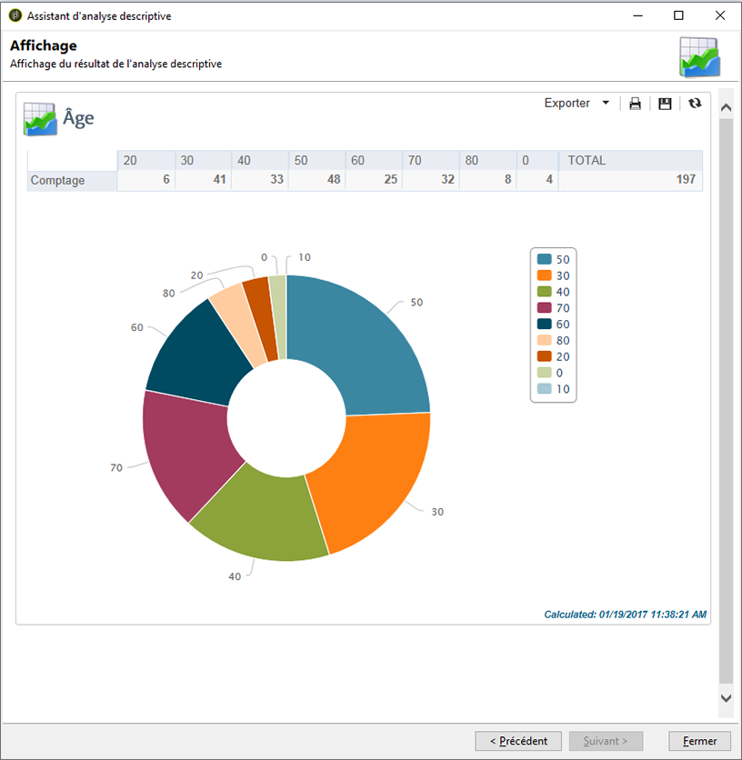
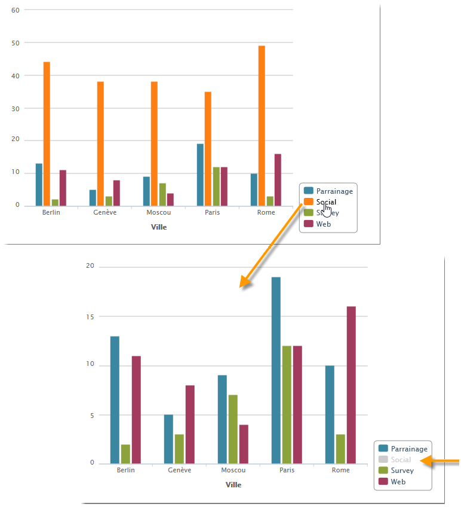

# Utiliser l&#39;assistant d&#39;analyse descriptive{#using-the-descriptive-analysis-wizard}

Pour créer un rapport d&#39;analyse descriptive, vous devez suivre les étapes de l&#39;assistant dédié. Son paramétrage dépend des données à analyser et du rendu souhaité.

## Analyser les données dans la base de données {#analyzing-data-in-the-database}

L&#39;assistant d&#39;analyse descriptive peut être lancé via le **[!UICONTROL Tools > Descriptive analysis]** menu : dans ce cas, l’analyse concerne les destinataires par défaut (**nms:Recipient**). Elle s’applique à toutes les données de la base de données Adobe Campaign.

To analyze a table other than the standard recipients one (**nms:recipient**), click the **[!UICONTROL Advanced settings...]** link in the last stage of the wizard and select the table that matches your settings, in this case **cus:individual**:

If you want to produce statistics on part of the data, you can define a filter: to do this, click the **[!UICONTROL Advanced settings...]** link and define the filter to apply, as shown below:

L&#39;analyse ne portera que sur les destinataires de la base de données agés de 16 ans et plus et résidant à Paris.

## Analyser un ensemble de données {#analyzing-a-set-of-data}

Vous pouvez utiliser l&#39;assistant d&#39;analyse descriptive à partir d&#39;un autre contexte : une liste, une transition de workflow, une ou plusieurs diffusions, une sélection de destinataires, etc.

En effet, il est accessible depuis plusieurs noeuds de l&#39;arborescence d&#39;Adobe Campaign qui pointent vers la table des destinataires.

L&#39;assistant d&#39;analyse descriptive est alors lancé à partir du bouton droit de la souris sur la sélection. Dans ce cas, seules les données de la sélection seront analysées.

* Pour un ensemble de **destinataires**, sélectionnez les destinataires à analyser, puis cliquez avec le bouton droit de la souris et sélectionnez **[!UICONTROL Actions > Explore...]**, comme illustré ci-dessus. Si un filtre est appliqué à la liste des destinataires, seul son contenu est analysé.

   Vous pouvez sélectionner tous les destinataires du dossier, ou du filtre courant, en utilisant la combinaison CTRL+A. Dans ce cas, même les destinataires non visibles à l&#39;écran sont sélectionnés.

   For an example of the descriptive analysis of recipients, refer to: [Qualitative data analysis](../../reporting/using/use-cases.md#qualitative-data-analysis).

* Dans le contexte d’un **processus**, placez le curseur sur une transition qui pointe vers le tableau des destinataires, cliquez avec le bouton droit de la souris et sélectionnez **[!UICONTROL Analyze target]**. Pour plus d’informations, reportez-vous à l’exemple de la section [Analyse d’une cible de transition dans un processus](../../reporting/using/use-cases.md#analyzing-a-transition-target-in-a-workflow).
* Pour les **listes**, sélectionnez une ou plusieurs listes et appliquez la même procédure que pour les destinataires.
* In the context of a **delivery**, select the deliveries whose target you want to analyze, right-click and select **[!UICONTROL Actions > Explore the target]**, as shown below:

   

   Voici des exemples d&#39;analyses descriptives des livraisons : [Analyse d’une population](../../reporting/using/use-cases.md#analyzing-a-population) et ici : [Analyse des journaux](../../reporting/using/use-cases.md#analyzing-recipient-tracking-logs)de suivi des destinataires.

## Paramétrer le modèle de distribution qualitative {#configuring-the-qualitative-distribution-template}

The **[!UICONTROL Qualitative distribution]** template lets you create statistics on all types of data (e.g. company name, email domain).

Les options de configuration disponibles pour un rapport créé via le **[!UICONTROL Qualitative distribution]** modèle sont détaillées dans [Affichage des données dans le tableau](#displaying-data-in-the-table). Un exemple complet est détaillé dans [Analyser une population](../../reporting/using/use-cases.md#analyzing-a-population).

Lorsque vous utilisez l&#39;assistant d&#39;analyse descriptive pour réaliser une analyse qualitative de vos données, les options disponibles dépendent des paramètres sélectionnés. Elles sont présentées ci-après.

### Mise en classe des données {#data-binning}

Lorsque vous sélectionnez les variables à afficher, vous pouvez définir une mise en classe des données, c&#39;est-à-dire paramétrer des critères de regroupement pour les données sélectionnées.

>[!NOTE]
>
>When the field concerned by the calculation is computed using an aggregate, check **[!UICONTROL The data is already aggregated]** to improve performances.

En fonction du contenu du champ, les options proposées peuvent différer.

* **[!UICONTROL None]** : cette option vous permet d’afficher toutes les valeurs disponibles pour la variable, sans liaison.

   >[!CAUTION]
   >
   >Il est recommandé d&#39;utiliser cette option avec précaution : les performances et la lisibilité du rapport peuvent être fortement impactées.

* **[!UICONTROL Auto]** : cette option vous permet d’afficher les n valeurs les plus fréquemment représentées. Ils sont calculés automatiquement et représentent chacun un pourcentage des variables par rapport au nombre de chutiers. Pour les valeurs numériques, Adobe Campaign génère automatiquement n classes pour trier les données.
* **[!UICONTROL Manual]** : cette option fonctionne comme l’ **[!UICONTROL Auto]** option, sauf que vous pouvez définir ces valeurs manuellement. Pour ce faire, cliquez sur le **[!UICONTROL Add]** bouton à droite du tableau des valeurs.

   Values can be initialized automatically by Adobe Campaign before personalization: to do this, enter the number of bins you want to generate and click the **[!UICONTROL Initialize with]** link, as shown below:

   

   Adaptez ensuite le contenu à vos besoins :

   

   Selon le niveau de précision souhaité, les champs qui contiennent des dates peuvent être regroupés par heure, jour, mois, année, etc.

   

* **[!UICONTROL Modulo]** : permet de créer des groupes de valeurs en cas de valeurs numériques. Par exemple, un module avec une valeur de 10 permet de créer un intervalle de valeurs qui change de dix à dix.

   

   Notre exemple permet de visualiser la répartition des destinataires par tranche d&#39;âge.

   

### Affichage des données dans le tableau {#displaying-data-in-the-table}

Utilisez la barre d&#39;outils pour personnaliser l&#39;affichage des variables dans le tableau : supprimer une colonne, afficher les données en ligne plutôt qu&#39;en colonne, changer le niveau d&#39;affichage des données, consulter ou modifier le calcul des valeurs.

La section supérieure de la fenêtre permet de sélectionner les paramètres d&#39;affichage.

Vous pouvez afficher ou masquer le nom des statistiques et des sous-totaux et choisir l’orientation des statistiques. Pour plus d’informations, reportez-vous aux paramètres [d’affichage des rapports](../../reporting/using/processing-a-report.md#analysis-report-display-settings)d’analyse.

### Affichage des données dans le graphique {#displaying-data-in-the-chart}

Dans la première étape de l&#39;assistant d&#39;analyse descriptive, vous pouvez choisir de n&#39;afficher les données que sous forme graphique, sans tableau. Dans ce cas, la sélection des variables doit être faite dans l&#39;étape de paramétrage du graphique. Vous devez d&#39;abord choisir le nombre de variables à afficher et sélectionner les champs de la base concernés.

Puis indiquez le type de graphique voulu.

>[!NOTE]
>
>Vous pouvez afficher les variables dans un graphique et un tableau simultanément. Pour ce faire, entrez les variables dans la **[!UICONTROL Table configuration]** fenêtre. Cliquez sur **[!UICONTROL Next]** et sélectionnez le type de graphique dans la fenêtre de configuration du graphique. Si des sous-dimensions sont définies dans le tableau, elles ne sont pas affichées dans le graphique.

Click the **[!UICONTROL Variants]** link to modify the chart properties.

Les options proposées dépendent du type de graphique sélectionné. Pour plus d&#39;informations, voir [cette page](../../reporting/using/creating-a-chart.md#chart-types-and-variants).

### Calcul des statistiques {#statistics-calculation}

L&#39;assistant d&#39;analyse descriptive permet de calculer plusieurs types de statistiques sur les données. Par défaut, seul un comptage simple est paramétré.

Click **[!UICONTROL Add]** to create a new statistic.

Les opérations possibles sont les suivantes :

* **[!UICONTROL Count]** pour comptabiliser toutes les valeurs non nulles du champ à agréger, y compris les valeurs en double (du champ agrégé),
* **[!UICONTROL Average]** pour calculer la moyenne des valeurs dans un champ numérique,
* **[!UICONTROL Minimum]** pour calculer le minimum des valeurs d&#39;un champ numérique,
* **[!UICONTROL Maximum]** pour calculer le maximum des valeurs d&#39;un champ numérique,
* **[!UICONTROL Sum]** pour calculer la somme des valeurs dans un champ numérique,
* **[!UICONTROL Standard deviation]** pour calculer comment les valeurs renvoyées sont réparties autour de la moyenne,
* **[!UICONTROL Row percentage distribution]** pour calculer le ratio de la valeur dans une colonne et de la valeur dans une ligne (disponible pour les tableaux uniquement),
* **[!UICONTROL Column percentage distribution]** pour calculer le rapport entre la valeur d’une ligne et la valeur d’une colonne (disponible pour les tableaux uniquement),
* **[!UICONTROL Total percentage distribution]** calculer la répartition des bénéficiaires concernés par les valeurs,

   

* **[!UICONTROL Calculated field]** pour créer un opérateur personnalisé (disponible pour les tableaux uniquement). Le **[!UICONTROL User function]** champ vous permet de saisir le calcul à appliquer aux données.

   Exemple : Calcul de la moyenne des achats par client, selon leur ville et leur origine

   

   Pour afficher les informations ci-dessus dans un tableau, vous devez créez un champ calculé afin de stocker la moyenne des achats par client.

   Pour cela :

   1. Calculez la somme des achats.

      

   1. Cette statistique ne s’affichera pas dans le tableau. Vous devez désélectionner l’ **[!UICONTROL Display in the table]** option de l’ **[!UICONTROL Advanced]** onglet.

      

   1. Create a new **[!UICONTROL Calculated field]** type statistic and enter the following formula in the **[!UICONTROL User function]** field: **@purchases/@count**.

      

### Affichage du rapport {#displaying-the-report}

La dernière étape de l&#39;assistant permet d&#39;afficher le rapport, c&#39;est-à-dire le tableau et/ou le graphique tels qu&#39;ils ont été paramétrés.

Lorsque le rapport contient un tableau, vous constaterez que la cellule du résultat du calcul est colorée. L&#39;intensité de la couleur est d&#39;autant plus forte que le résultat est élevé.

Vous pouvez modifier la présentation des résultats. Pour cela, cliquez avec le bouton droit sur la variable concernée et choisissez l&#39;entrée dans le menu contextuel.

Lorsque le rapport contient un graphique, les libellés de la légende permettent de filtrer les informations affichées : cliquez sur un libellé pour en activer/désactiver l&#39;affichage dans le graphique.

## Paramétrer le modèle de distribution quantitative {#configuring-the-quantitative-distribution-template}

Pour générer vous-même une analyse descriptive, sélectionnez l&#39;option **Nouvelle analyse descriptive depuis un modèle** si ce n&#39;est pas le cas par défaut.

The **[!UICONTROL Quantitative distribution]** template that lets you generate statistics on data which can be measured or counted (e.g. invoice amount, age of recipients).

The configuration mode of an analysis report created via the **[!UICONTROL Quantitative distribution]** template is detailed in an implementation example [Quantitative data analysis](../../reporting/using/use-cases.md#quantitative-data-analysis).

Lorsque vous utilisez l&#39;assistant d&#39;analyse descriptive pour créer un rapport quantitatif, les options disponibles sont présentées ci-après.

Vous devez d&#39;abord sélectionner la variable sur laquelle portent les calculs :

Par défaut, Adobe Campaign propose une série de statistiques à calculer sur les données sélectionnées. Vous pouvez modifier cette liste, ajouter, modifier ou supprimer des statistiques selon vos besoins.

Les opérations possibles sont les suivantes :

* **[!UICONTROL Count]** pour comptabiliser toutes les valeurs non nulles du champ à agréger, y compris les valeurs en double (du champ agrégé),
* **[!UICONTROL Average]** pour calculer la moyenne des valeurs dans un champ numérique,
* **[!UICONTROL Minimum]** pour calculer le minimum des valeurs d&#39;un champ numérique,
* **[!UICONTROL Maximum]** pour calculer le maximum des valeurs d&#39;un champ numérique.
* **[!UICONTROL Sum]** pour calculer la somme des valeurs dans un champ numérique,
* **[!UICONTROL Standard deviation]** pour calculer comment les valeurs renvoyées sont réparties autour de la moyenne.
* **[!UICONTROL Number of missing values]** pour calculer le nombre de champs numériques sans valeurs définies.
* **[!UICONTROL Decile distribution]** pour répartir les valeurs renvoyées de telle sorte que chacune représente 1/10 des valeurs dans un champ numérique.
* **[!UICONTROL Custom distribution]** pour répartir les valeurs renvoyées en fonction de seuils définis par l’utilisateur.

   The **[!UICONTROL Detail...]** button lets you edit a statistic and, if needed, personalize its calculation or its display:

   

   La dernière étape de l&#39;assistant affiche le rapport d&#39;analyse quantitative.

   

   Pour apporter des modifications au rapport, consultez [Traitement d’un rapport](../../reporting/using/processing-a-report.md).

