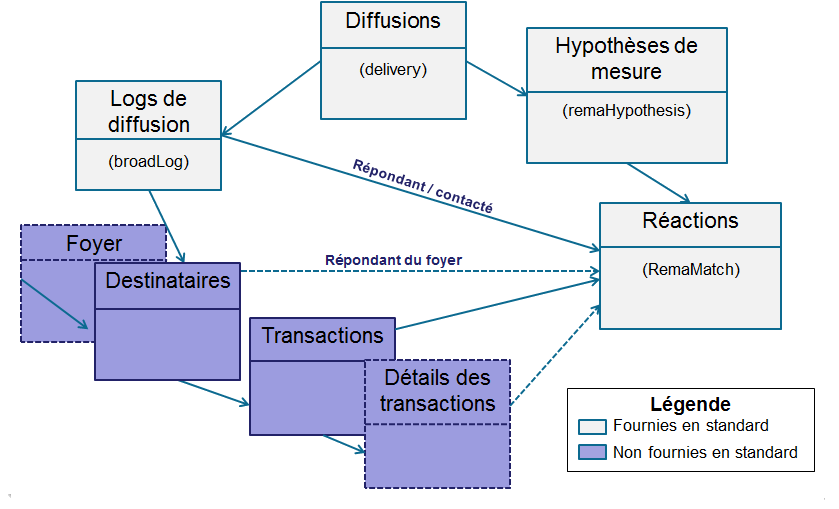
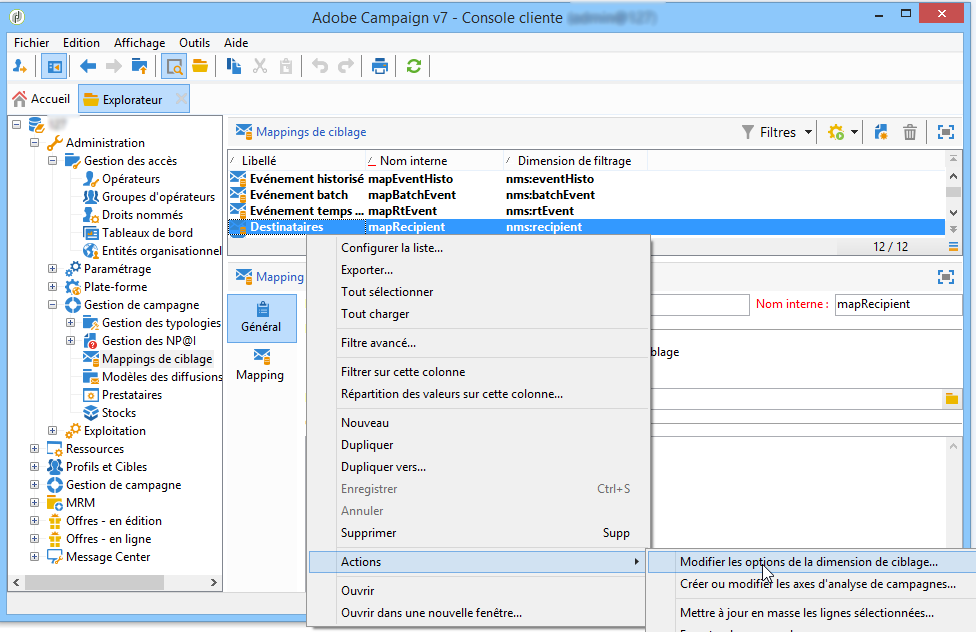
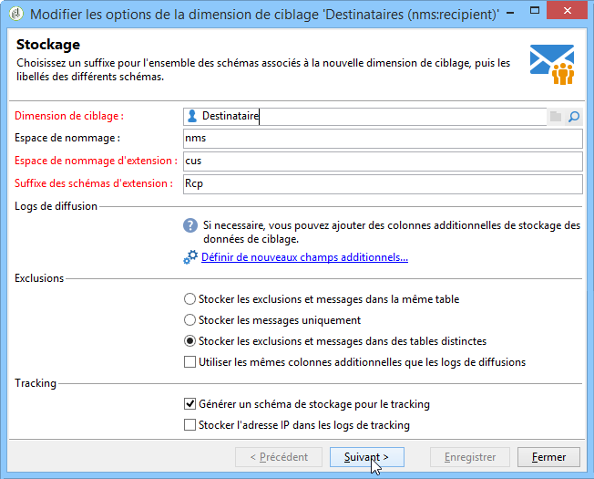
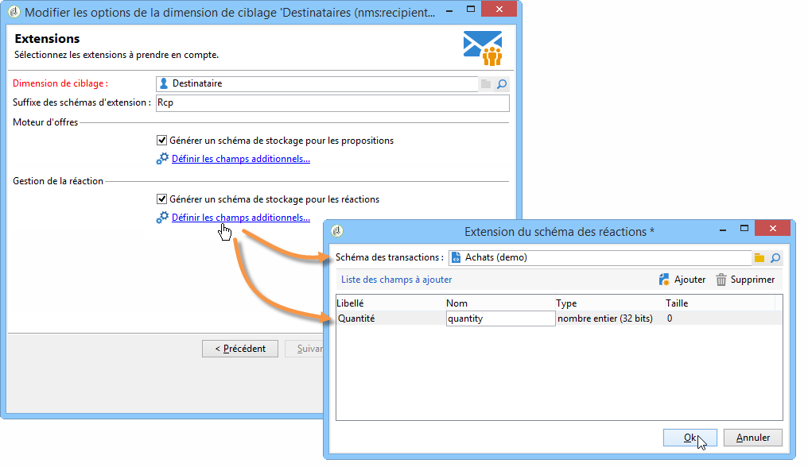

# Configuration de la gestion de la réaction (Response Manager) de Campaign{#configuration}


Cette section s&#39;adresse aux opérateurs chargés du paramétrage de la gestion de la réaction. La mise en oeuvre de cette configuration requiert des connaissances en termes d&#39;extension de schémas, de création et gestion de workflows et de programmation SQL.

Elle permet de comprendre comment adapter le modèle de données standard aux spécificités d&#39;une table de transactions externe à Adobe Campaign avec la table des individus. Cette table d&#39;individus peut correspondre à la table des destinataires disponible dans Adobe Campaign ou à une table différente.

L&#39;hypothèse de mesure est lancée par le workflow des traitements sur les opérations (**[!UICONTROL operationMgt]**). Chaque hypothèse représente un processus distinct exécuté en asynchrone avec un statut d&#39;exécution (En édition, En attente, Terminé, En erreur, etc.) et soumis à un ordonnanceur gérant les contraintes de priorités, la limitation sur le nombre de process simultanés, la plage de faible activité et l&#39;exécution automatique avec fréquence d&#39;exécution.

## Configuration de schémas {#configuring-schemas}

>[!CAUTION]
>
>Ne modifiez pas les schémas natifs de l’application. Utilisez plutôt le mécanisme d’extension de schéma. Sinon, les schémas modifiés ne seront pas mis à jour au moment des futures mises à niveau de l’application. Cela peut entraîner des dysfonctionnements lors de l’utilisation d’Adobe Campaign.

Avant toute utilisation du module de la réaction, vous devez définir les différentes tables (transactions, détails des transactions) et leur relation avec les diffusions, les offres et les individus.

### Schémas standards {#standard-schemas}

Le schéma **[!UICONTROL nms:remaMatch]**, fourni en standard, contient la table des logs de réaction, c&#39;est-à-dire la relation entre les individus, l&#39;hypothèse et la table des transactions. Ce schéma devra être utilisé comme schéma d&#39;héritage pour la table de destination finale des logs de réactions.

Le schéma **[!UICONTROL nms:remaMatchRcp]** est également fourni en standard, il contient le stockage des logs de réaction pour les destinataires Adobe Campaign (**[!UICONTROL nms:recipient]**). Pour l&#39;utiliser, il devra être étendu pour lui associer la table des transactions (contenant les actes d&#39;achats).

### Tables des transactions et des détails des transactions {#transaction-tables-and-transaction-details}

La table des transactions doit comporter un lien direct vers les individus.

Vous pouvez aussi ajouter une table contenant les détails des transactions, qui elle n&#39;est pas liée directement aux individus.

Par exemple dans le cas d&#39;un ticket de caisse, une table des transactions est liée au contact (la table des tickets) et une table des lignes de tickets n&#39;est reliée qu&#39;à la table des tickets (la table des détails). Vous pouvez ainsi paramétrer l&#39;hypothèse directement au niveau de la table des lignes de tickets associée à la table des tickets.

>[!NOTE]
>
>Si vous souhaitez conserver l&#39;identifiant des lignes de ticket qui décrit le comportement attendu dans l&#39;hypothèse, vous pouvez étendre le modèle de la table nms:remaMatchRcp afin d&#39;y ajouter ce dernier (dans ce cas, aucun calcul de ROI n&#39;est associé à ces champs).

L&#39;ajout d&#39;une date d&#39;évènement est également fortement recommandée.

Le schéma suivant représente les jointures entre les différentes tables une fois le paramétrage effectué :



### Gestion de la réaction et destinataires {#response-management-with-adobe-campaign-recipients}

Dans cet exemple, vous allez intégrer une table d&#39;achats dans votre module de gestion de la réaction en utilisant la table des destinataires native d&#39;Adobe Campaign **[!UICONTROL nms:recipient]**.

La table des logs de réaction d&#39;un destinataire **[!UICONTROL nms:remaMatchRcp]** est étendue pour ajouter un lien au schéma de la table d&#39;achats. Dans l&#39;exemple suivant, la table d&#39;achats s&#39;appelle **demo:purchase**.

1. Via l&#39;explorateur Adobe Campaign, sélectionnez le noeud **[!UICONTROL Administration]** > **[!UICONTROL Gestion de campagne]** > **[!UICONTROL Mappings de ciblage]**.
1. Cliquez-droit sur **Destinataires** puis sélectionnez **[!UICONTROL Actions]** et **[!UICONTROL Modifier les options de la dimension de ciblage]**.

   

1. Dans la fenêtre qui s&#39;affiche, personnalisez éventuellement l&#39;**[!UICONTROL Espace de noms d&#39;extension]** puis cliquez sur **[!UICONTROL Suivant]**.

   

1. Dans la catégorie **[!UICONTROL Gestion de la réaction]**, assurez-vous que la case **[!UICONTROL Générer un schéma de stockage pour les réactions]** est cochée.

   Sélectionnez ensuite **[!UICONTROL Définir les champs additionnels]** afin de sélectionner la table des transactions rattachée et d&#39;ajouter les champs de votre choix à l&#39;extension du schéma nms:remaMatchRcp.

   

Le schéma alors créé se présente comme suit :

```
<srcSchema _cs="Reactions (Recipients) (cus)" entitySchema="xtk:srcSchema" extendedSchema="nms:remaMatchRcp" 
img="nms:remaMatch.png" implements="xtk:persist" label="Reactions (Recipients)" mappingType="sql"
name="remaMatchRcp" namespace="cus">  
 <element label="Reactions (Recipients)" name="remaMatchRcp">    
  <key internal="true" name="match">      
   <keyfield xlink="hypothesis"/>      
   <keyfield xlink="broadLog"/>      
   <keyfield xlink="proposition"/>    
  </key>    
  <attribute label="Quantity" name="quantity" type="long"/>    
  <element name="purchase" target="demo:purchase" type="link"/>    
  <element name="hypothesis" revLabel="Reactions (Recipients)" revLink="remaMatchRcp"/>    
  <element applicableIf="HasPackage('nms:coreInteraction')" label="Proposition" name="proposition" target="nms:propositionRcp" type="link"/>   
  <element desc="Message (Delivery log)" label="Message" name="broadLog" target="nms:broadLogRcp" type="link"/>    
  <element label="Respondent" name="responder" target="nms:recipient" type="link"/>  
 </element>  
 <createdBy _cs="Administrator (admin)"/>  
 <modifiedBy _cs="Administrator (admin)"/>
</srcSchema>
```

### Gestion de la réaction avec une table des destinataires personnalisée {#response-management-with-a-personalized-recipient-table}

Dans cet exemple, vous allez intégrer une table d&#39;achats dans votre module de gestion de la réaction en utilisant une table d&#39;individus autre que la table des destinataires disponible dans Adobe Campaign.

* Création d&#39;un nouveau schéma de logs de réaction dérivé du schéma **[!UICONTROL nms:remaMatch]**.

   La table des individus étant différente de la table des destinataires par défaut d&#39;Adobe Campaign, il est nécessaire de créer un nouveau schéma des logs de réaction basé sur le schéma **[!UICONTROL nms:remaMatch]**. Il faut ensuite le compléter avec les liens vers les logs de diffusion et la table des actes d&#39;achats.

   Dans l&#39;exemple ci-dessous, nous utilisons le schéma **demo:broadLogPers** et la table des transactions est **demo:purchase** :

   ```
   <srcSchema desc="Linking of a recipient transaction to a hypothesis"    
   img="nms:remaMatch.png" label="Responses on persons" labelSingular="Responses on a person" name="remaMatchPers" namespace="nms">
     <element name="remaMatchPers" template="nms:remaMatch">
       <key internal="true" name="match">
         <keyfield xlink="hypothesis"/>
        <keyfield xlink="purchase"/>
       </key>
   
       <element name="hypothesis" revLabel="Response logs for persons" revLink="remaMatchPers"/>
       <element applicableIf="HasPackage('nms:interaction')" label="Proposition" name="proposition"
                target="demo:propositionPers" type="link"/>
       <element label="Delivery log" name="broadLog" target="demo:broadLogPers" type="link"/>
     </element>
   </srcSchema>
   ```

* Modification du formulaire des hypothèses dans le schéma **[!UICONTROL nms:remaHypothesis]**.

   Par défaut, la liste des logs de réaction est visible dans les logs des destinataires. Il faut donc modifier la forme des hypothèses pour pouvoir visualiser les nouveaux logs de réaction créés à l&#39;étape précédente.

   Par exemple :

   ```
    <container type="visibleGroup" visibleIf="[context/@remaMatchStorage]= 'demo:remaMatchPers'">
                 <input hideEditButtons="true" img="nms:remaMatch.png" nolabel="true" refresh="true"
                  toolbarCaption="Responses generated by the hypothesis" type="linklist"
                  xpath="remaMatchPers">
             <input xpath="[.]"/>
             <input xpath="@controlGroup"/>
           </input>
      </container> 
   ```

## Gestion des indicateurs {#managing-indicators}

Le module Response Manager est fourni avec une liste d&#39;indicateurs prédéfinis. Vous pouvez cependant ajouter d&#39;autres indicateurs de mesures personnalisés.

Pour cela, vous devez étendre la table des hypothèses en insérant deux champs pour chaque nouvel indicateur :

* le premier pour la population ciblée ;
* le second pour la population témoin.

Par exemple :

```
<srcSchema entitySchema="xtk:srcSchema" extendedSchema="nms:remaHypothesis" label="Measurement hypothesis" 
md5="1D4DED54FF8EC2432AED6736EDE6F547" name="remaHypothesis" namespace="demo" xtkschema="xtk:srcSchema">  
    <element name="remaHypothesis">    
        <element name="indicators">      
            <!-- Quantity -->      
            <attribute label="Total contacted" name="contactReactedTotalQuantity" type="long"/>
            <attribute label="Total number of people in the control group" name="proofReactedTotalquantity" type="long"/> 
        </element> 
    </element>
</srcSchema>
```
