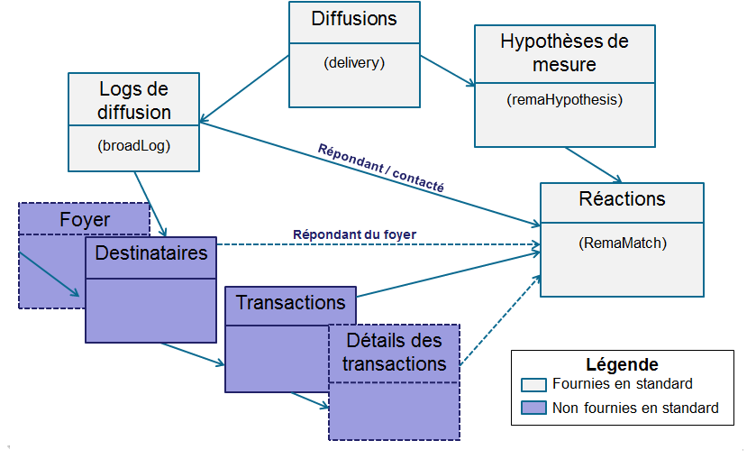
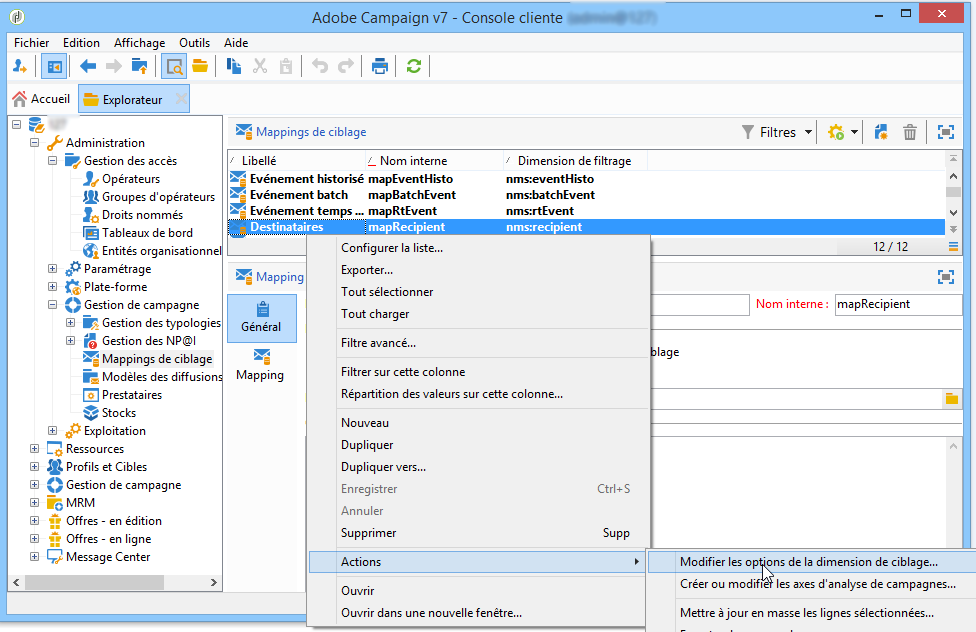
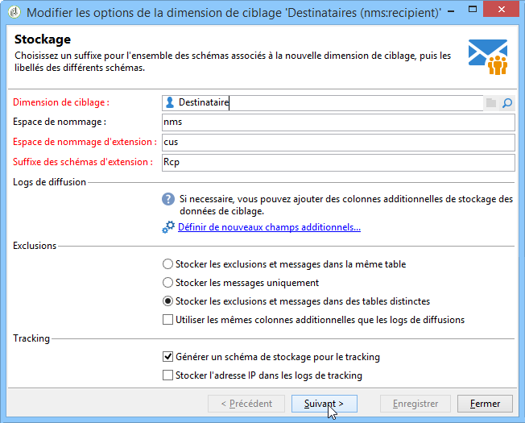
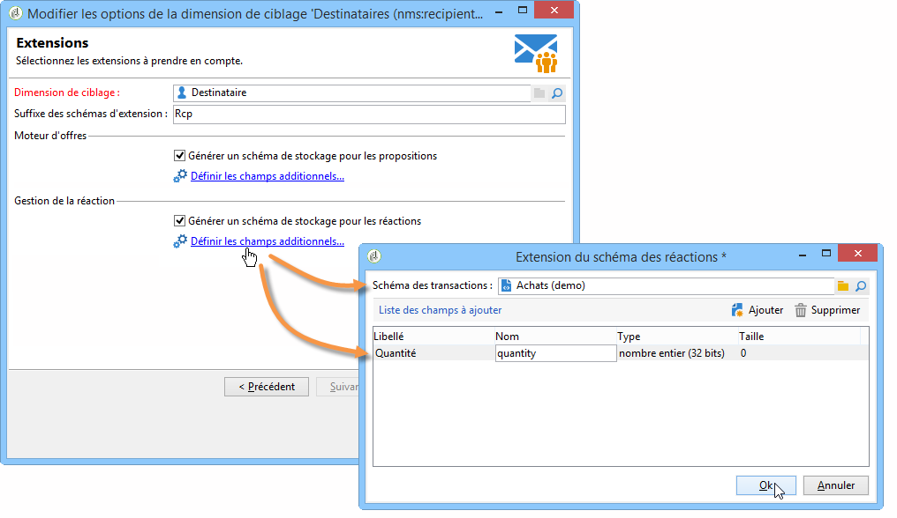

# Configuration de la gestion de la réaction (Response Manager) de Campaign{#configuration}


Cette section est destinée aux personnes responsables de la configuration de la gestion de la réaction. Il suppose une certaine connaissance de l’extension des schémas, de la définition des workflows et de la programmation SQL.

Vous pouvez ainsi comprendre comment adapter le modèle de données standard aux spécificités d&#39;une table de transactions externe à Adobe Campaign avec la table des individus. Cette table d’individus peut coïncider avec la table des individus disponibles dans Adobe Campaign ou avec une table différente

L&#39;hypothèse de mesure est lancée par le workflow de processus d&#39;opération ( **[!UICONTROL operationMgt]** ). Chaque hypothèse représente un processus distinct exécuté de manière asynchrone avec un statut d’exécution (En édition, En attente, Terminé, En échec, etc.) et contrôlée par un planificateur qui gère les contraintes de priorité, la limitation du nombre de processus simultanés, la page de faible activité et l&#39;exécution automatique avec fréquence.

## Configuration de schémas {#configuring-schemas}

>[!CAUTION]
>
>Ne modifiez pas les schémas natifs de l’application. Utilisez plutôt le mécanisme d’extension de schéma. Sinon, les schémas modifiés ne seront pas mis à jour au moment des futures mises à niveau de l’application. Cela peut entraîner des dysfonctionnements lors de l’utilisation d’Adobe Campaign.

Avant toute utilisation du module de la réaction, vous devez définir les différentes tables (transactions, détails des transactions) et leur relation avec les diffusions, les offres et les individus.

### Schémas standards {#standard-schemas}

Le schéma d&#39;usine **[!UICONTROL nms:remaMatch]** contient la table des logs de réaction, c&#39;est-à-dire la relation entre les individus, les hypothèses et la table des transactions. Ce schéma doit être utilisé comme schéma d’héritage pour la table de destination finale des logs de réaction.

Le schéma **[!UICONTROL nms:remaMatchRcp]** est également fourni en standard, il contient le stockage des logs de réaction pour les destinataires Adobe Campaign ( **[!UICONTROL nms:recipient]** ). Pour l&#39;utiliser, il devra être étendu pour lui associer la table des transactions (contenant les achats, etc.).

### Tables des transactions et des détails des transactions {#transaction-tables-and-transaction-details}

La table des transactions doit comporter un lien direct vers les individus.

Vous pouvez également ajouter une table contenant les détails de la transaction. Ce n&#39;est pas directement lié aux individus.

Si nous prenons un règlement, par exemple, une table des mouvements est liée à un contact (table des règlements) et une table des lignes de règlement est uniquement liée à la table des règlements (table des détails). Vous pouvez ensuite configurer l&#39;hypothèse directement au niveau auquel la table des lignes de réception est liée à la table des réceptions.

>[!NOTE]
>
>Si vous souhaitez conserver l&#39;identifiant de ticket de caisse qui décrit le comportement attendu dans les hypothèses, vous pouvez étendre le modèle de table nms:remaMatchRcp afin de lui ajouter l&#39;identifiant (dans ce cas, aucun calcul de retour sur investissement n&#39;est associé à ces champs).

L&#39;ajout d&#39;une date d&#39;évènement est également fortement recommandée.

Le schéma suivant représente les jointures entre les différentes tables une fois le paramétrage effectué :



### Gestion de la réaction et destinataires {#response-management-with-adobe-campaign-recipients}

Dans cet exemple, vous allez intégrer une table d&#39;achats dans votre module de gestion de la réaction en utilisant la table des destinataires native d&#39;Adobe Campaign **[!UICONTROL nms:recipient]**.

La table des logs de réponse d&#39;un destinataire **[!UICONTROL nms:remaMatchRcp]** est étendue pour ajouter un lien vers le schéma de la table des achats. Dans l’exemple suivant, la table des achats est appelée **demo:purchase**.

1. Via l&#39;explorateur Adobe Campaign, sélectionnez le noeud **[!UICONTROL Administration]** > **[!UICONTROL Gestion de campagne]** > **[!UICONTROL Mappings de ciblage]**.
1. Cliquez-droit sur **Destinataires** puis sélectionnez **[!UICONTROL Actions]** et **[!UICONTROL Modifier les options de la dimension de ciblage]**.

   

1. Dans la fenêtre qui s&#39;affiche, personnalisez éventuellement l&#39;**[!UICONTROL Espace de noms d&#39;extension]** puis cliquez sur **[!UICONTROL Suivant]**.

   

1. Dans la catégorie **[!UICONTROL Gestion de la réaction]**, assurez-vous que la case **[!UICONTROL Générer un schéma de stockage pour les réactions]** est cochée.

   Cliquez ensuite sur **[!UICONTROL Définir des champs supplémentaires...]** pour sélectionner les tables de transactions associées et ajouter les champs souhaités à l&#39;extension du schéma nms:remaMatchRcp.

   

Le schéma alors créé se présente comme suit :

```
<srcSchema _cs="Reactions (Recipients) (cus)" entitySchema="xtk:srcSchema" extendedSchema="nms:remaMatchRcp" 
img="nms:remaMatch.png" implements="xtk:persist" label="Reactions (Recipients)" mappingType="sql"
name="remaMatchRcp" namespace="cus">  
 <element label="Reactions (Recipients)" name="remaMatchRcp">    
  <key internal="true" name="match">      
   <keyfield xlink="hypothesis"/>      
   <keyfield xlink="broadLog"/>      
   <keyfield xlink="proposition"/>    
  </key>    
  <attribute label="Quantity" name="quantity" type="long"/>    
  <element name="purchase" target="demo:purchase" type="link"/>    
  <element name="hypothesis" revLabel="Reactions (Recipients)" revLink="remaMatchRcp"/>    
  <element applicableIf="HasPackage('nms:coreInteraction')" label="Proposition" name="proposition" target="nms:propositionRcp" type="link"/>   
  <element desc="Message (Delivery log)" label="Message" name="broadLog" target="nms:broadLogRcp" type="link"/>    
  <element label="Respondent" name="responder" target="nms:recipient" type="link"/>  
 </element>  
 <createdBy _cs="Administrator (admin)"/>  
 <modifiedBy _cs="Administrator (admin)"/>
</srcSchema>
```

### Gestion de la réaction avec une table des destinataires personnalisée {#response-management-with-a-personalized-recipient-table}

Dans cet exemple, vous allez intégrer une table d&#39;achats dans votre module de gestion de la réaction en utilisant une table d&#39;individus autre que la table des destinataires disponible dans Adobe Campaign.

* Créez un schéma de logs de réaction dérivé du schéma **[!UICONTROL nms:remaMatch]**.

  La table des individus étant différente de la table des destinataires Adobe Campaign, il est nécessaire de créer un nouveau schéma des logs de réponse basé sur le schéma **[!UICONTROL nms:remaMatch]** . Il faut ensuite le compléter avec les liens vers les logs de diffusion et la table des actes d&#39;achats.

  Dans l&#39;exemple suivant, nous utiliserons le schéma **demo:broadLogPers** et la table des transactions **demo:purchase** :

  ```
  <srcSchema desc="Linking of a recipient transaction to a hypothesis"    
  img="nms:remaMatch.png" label="Responses on persons" labelSingular="Responses on a person" name="remaMatchPers" namespace="nms">
    <element name="remaMatchPers" template="nms:remaMatch">
      <key internal="true" name="match">
        <keyfield xlink="hypothesis"/>
       <keyfield xlink="purchase"/>
      </key>
  
      <element name="hypothesis" revLabel="Response logs for persons" revLink="remaMatchPers"/>
      <element applicableIf="HasPackage('nms:interaction')" label="Proposition" name="proposition"
               target="demo:propositionPers" type="link"/>
      <element label="Delivery log" name="broadLog" target="demo:broadLogPers" type="link"/>
    </element>
  </srcSchema>
  ```

* Modifiez le formulaire des hypothèses dans le schéma **[!UICONTROL nms:remaHypothesis]** .

  Par défaut, la liste des logs de réponse est visible dans les logs de destinataires. Vous devez donc modifier le formulaire des hypothèses afin de visualiser les nouveaux logs de réponse créés lors de l&#39;étape précédente.

  Par exemple :

  ```
   <container type="visibleGroup" visibleIf="[context/@remaMatchStorage]= 'demo:remaMatchPers'">
                <input hideEditButtons="true" img="nms:remaMatch.png" nolabel="true" refresh="true"
                 toolbarCaption="Responses generated by the hypothesis" type="linklist"
                 xpath="remaMatchPers">
            <input xpath="[.]"/>
            <input xpath="@controlGroup"/>
          </input>
     </container> 
  ```

## Gestion des indicateurs {#managing-indicators}

Le module Gestion de la réaction comprend une liste d’indicateurs prédéfinis. Cependant, vous pouvez ajouter d’autres indicateurs de mesure personnalisés.

Pour cela, vous devez étendre la table des hypothèses en insérant deux champs pour chaque nouvel indicateur :

* le premier pour la population ciblée ;
* le second pour la population témoin.

Par exemple :

```
<srcSchema entitySchema="xtk:srcSchema" extendedSchema="nms:remaHypothesis" label="Measurement hypothesis" 
md5="1D4DED54FF8EC2432AED6736EDE6F547" name="remaHypothesis" namespace="demo" xtkschema="xtk:srcSchema">  
    <element name="remaHypothesis">    
        <element name="indicators">      
            <!-- Quantity -->      
            <attribute label="Total contacted" name="contactReactedTotalQuantity" type="long"/>
            <attribute label="Total number of people in the control group" name="proofReactedTotalquantity" type="long"/> 
        </element> 
    </element>
</srcSchema>
```
