# Création d’hypothèses{#creating-hypotheses}

Il existe différentes possibilités pour créer/associer des hypothèses à une offre ou a une diffusion d&#39;une opération :

* Depuis le dossier **[!UICONTROL Hypothèses de mesure]** en créant une nouvelle hypothèse basée sur un modèle existant et en l&#39;associant à une diffusion existante.
* Depuis l&#39;onglet **[!UICONTROL Edition]** > **[!UICONTROL Mesure]** d&#39;une opération.
* Depuis l&#39;option **[!UICONTROL Mesure]** d&#39;une diffusion créée à partir d&#39;une opération.

Les hypothèses ne peuvent être calculées qu&#39;une fois la campagne marketing lancée et que les destinataires ont reçu la diffusion. Si l&#39;hypothèse est basée sur une proposition d&#39;offre, celle-ci doit au moins être présentée et être active. Les hypothèses sur offre et diffusion sont créées depuis le dossier **[!UICONTROL Hypothèses de mesure]** et sont basées sur un modèle d&#39;hypothèse. Cependant, vous avez la possibilité de référencer une hypothèse directement dans la diffusion ou l&#39;opération avant que la campagne ne démarre. Dans ce cas, la ou les hypothèses seront calculées automatiquement après le lancement de la campagne marketing en fonction de la définition des paramètres d&#39;exécution. [Apprenez-en davantage](hypothesis-templates.md#hypothesis-template-execution-settings)

## Création d’une hypothèse à la volée sur une diffusion {#creating-a-hypothesis-on-the-fly-on-a-delivery}

Pour créer une hypothèse sur une diffusion existante, procédez comme suit :

>[!NOTE]
>
>Cette opération est uniquement possible pour les livraisons en attente.

1. Dans l&#39;arborescence d&#39;Adobe Campaign, positionnez-vous au niveau de **[!UICONTROL Gestion de campagne > Hypothèses de mesure]**.
1. Cliquez sur le bouton **[!UICONTROL Nouveau]** ou cliquez avec le bouton droit de la souris dans la liste des hypothèses et sélectionnez **[!UICONTROL Nouveau]** dans le menu contextuel.

   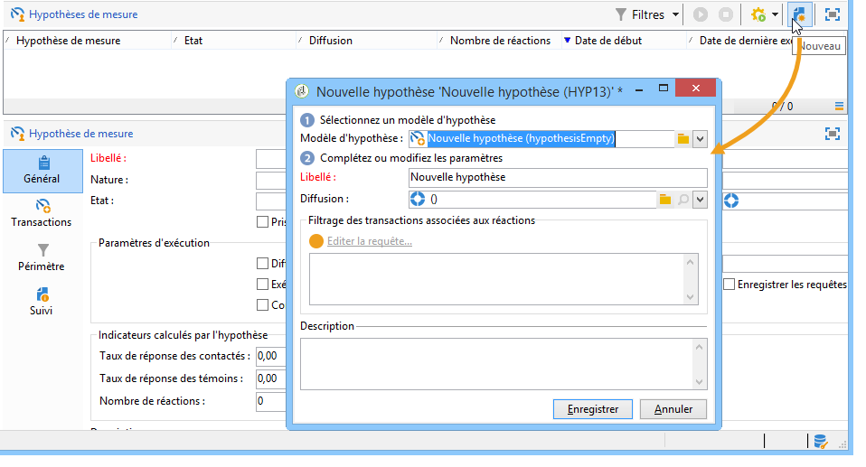

1. Dans la fenêtre d&#39;hypothèse, sélectionnez un modèle créé précédemment. [Apprenez-en davantage](hypothesis-templates.md)

   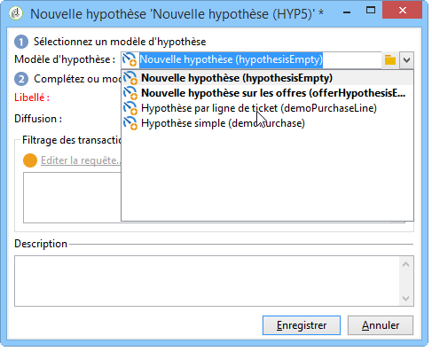

   Le contexte d&#39;hypothèse tel qu&#39;il a été défini dans le modèle sélectionné s&#39;affiche dans la fenêtre.

   >[!NOTE]
   >
   >Les paramètres définis dans le modèle et non visibles à cette étape sont également gardés en mémoire et réaffectés à l&#39;hypothèse en cours.

   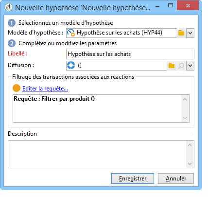

1. Sélectionnez la diffusion sur laquelle vous souhaitez faire une hypothèse.

   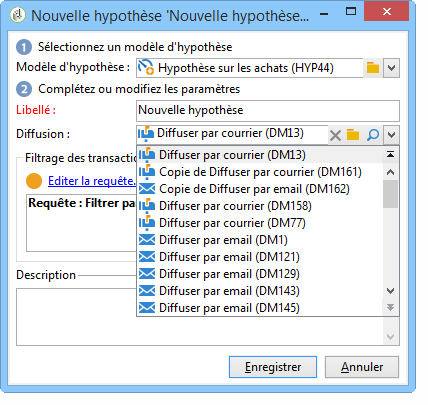

1. Vous pouvez personnaliser votre hypothèse en modifiant les onglets **[!UICONTROL Général]**, **[!UICONTROL Transactions]** et **[!UICONTROL Périmètre]**. [Apprenez-en davantage](hypothesis-templates.md#creating-a-hypothesis-model)
1. Lancez votre hypothèse en cliquant sur **[!UICONTROL Démarrer]**.

   Un workflow est alors automatiquement créé afin de procéder au calcul. Son nom est défini automatiquement en fonction du paramétrage de l&#39;hypothèse.

   >[!CAUTION]
   >
   >Vous pouvez accéder à ce dernier si vous avez coché la case **[!UICONTROL Conserver le workflow d&#39;exécution]**.\
   >Cette option ne doit être activée qu&#39;à des fins de débogage, en cas d&#39;erreur lors de l&#39;exécution de l&#39;hypothèse. Les workflows générés automatiquement sont enregistrés dans le dossier **[!UICONTROL Administration]** > **[!UICONTROL Exploitation]** > **[!UICONTROL Objets créés automatiquement]** > **[!UICONTROL Workflows des opérations]** de l&#39;explorateur Adobe Campaign.
   > 
   >De plus, les workflows générés automatiquement ne doivent pas être modifiés. Toute modification éventuelle ne serait par ailleurs pas prise en compte pour les calculs ultérieurs.
   >
   >Si vous avez coché cette option, supprimez le workflow après son exécution.

   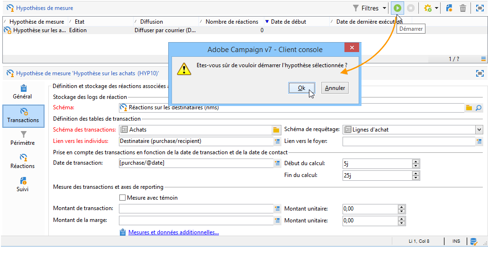

   Lorsque le calcul est terminé, les indicateurs de mesure sont automatiquement mis à jour.

   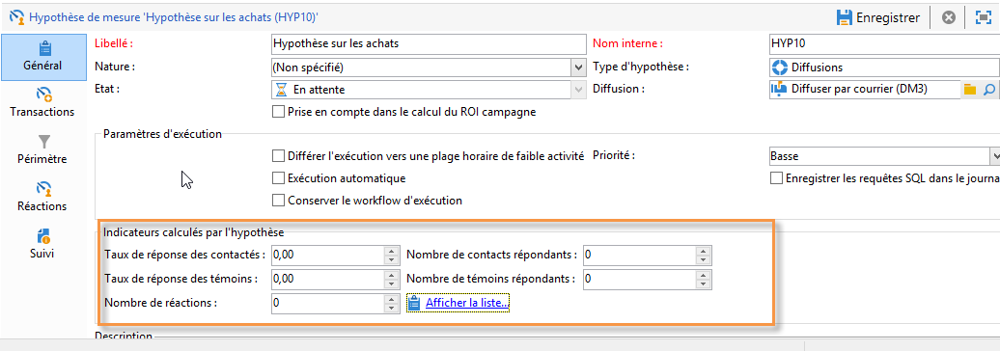

1. Si besoin est, modifiez les paramètres et relancez l&#39;hypothèse.

## Référencement d’une hypothèse dans une diffusion de campagne {#referencing-a-hypothesis-in-a-campaign-delivery}

Vous pouvez référencer une hypothèse dans une campagne marketing avant son démarrage. Dans ce cas, l’hypothèse sera lancée automatiquement après l’envoi de la diffusion, selon les paramètres d’exécution définis dans le modèle de l’hypothèse. Procédez comme suit pour créer une hypothèse dans une diffusion :

1. Selon vos besoins, créez un ou plusieurs modèles de type **[!UICONTROL Diffusion]** comme décrit dans [cette section](hypothesis-templates.md#creating-a-hypothesis-model).
1. Créez votre opération marketing et vos workflows de ciblage.
1. Dans la fenêtre de diffusion, cliquez sur l&#39;icône **[!UICONTROL Mesure de la diffusion]**.
1. Sélectionnez le modèle d&#39;hypothèse (la requête paramétrée dans le modèle apparaît dans la fenêtre de l&#39;hypothèse).

   L&#39;hypothèse sera calculée automatiquement lorsque la campagne sera terminée, en fonction des dates fixées dans le modèle. [Apprenez-en davantage](hypothesis-templates.md#hypothesis-template-execution-settings)

   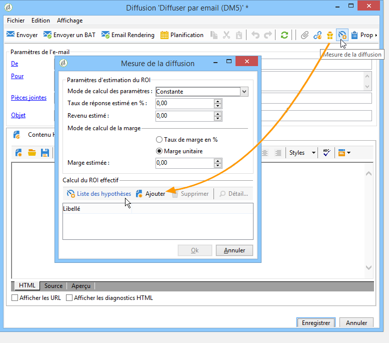

## Ajout d’une hypothèse par défaut aux diffusions d’une campagne {#adding-a-default-hypothesis-to-deliveries-for-a-campaign}

Vous pouvez directement référencer une hypothèse au niveau d&#39;une opération. De ce fait, l&#39;hypothèse sera automatiquement rattachée à toutes les diffusions crées dans l&#39;opération. Pour cela :

1. Positionnez-vous dans l&#39;onglet **[!UICONTROL Edition]** de l&#39;opération de votre choix.
1. Dans la section de la mesure, cliquez sur l&#39;onglet **[!UICONTROL Hypothèses par défaut]**.

   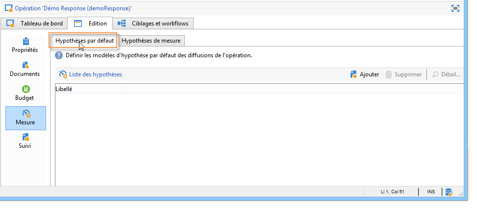

1. Cliquez sur **[!UICONTROL Ajouter]** et sélectionnez un modèle d&#39;hypothèse.

   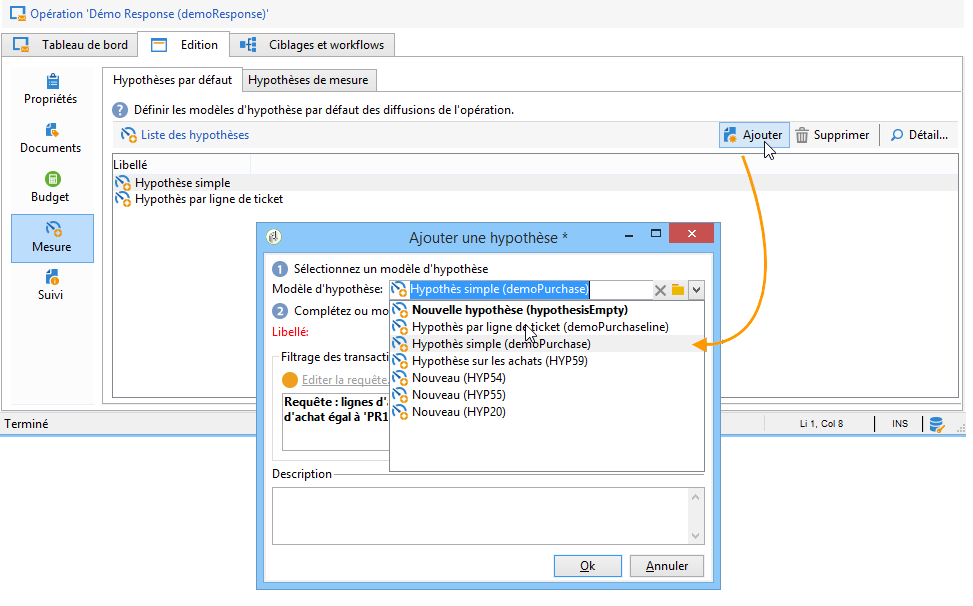

   Une hypothèse basée sur ce modèle sera désormais référencée par défaut dans chaque nouvelle diffusion de l&#39;opération.

   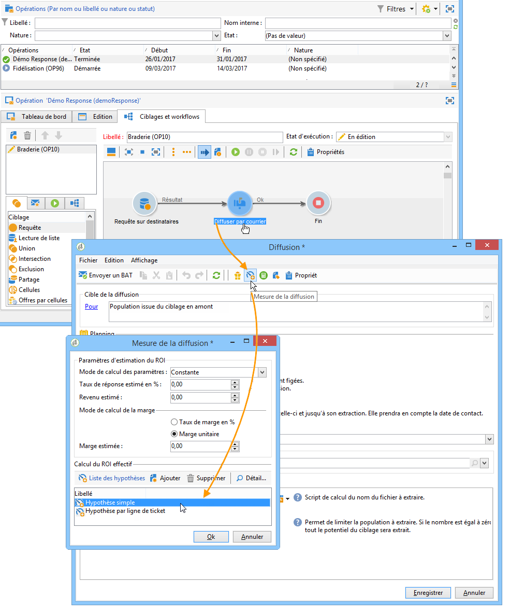

Vous pourrez consulter les résultats de l&#39;hypothèse dans les onglets **[!UICONTROL Général]** et **[!UICONTROL Réactions]** de l&#39;hypothèse. [Apprenez-en davantage](hypothesis-tracking.md)

Reportez-vous également à [cet exemple](#example--creating-a-hypothesis-linked-to-a-delivery) pour plus d’informations.

## Création d’une hypothèse sur une offre {#creating-a-hypothesis-on-an-offer}

Les étapes de création d&#39;une hypothèse sur une proposition d&#39;offre sont similaires à celles d&#39;une hypothèse sur diffusion créée à la volée. L&#39;exécution des hypothèses est possible tant que l&#39;offre est active. La période de calcul est basée sur la date de la proposition d&#39;offre. Lorsque l&#39;hypothèse permet de relier un destinataire à un acte d&#39;achat, l&#39;état de la proposition d&#39;offre susceptible d&#39;être acceptée peut être modifié automatiquement. [Apprenez-en davantage](hypothesis-templates.md#transactions)

1. Créez un ou plusieurs modèles de type **[!UICONTROL Offre]** comme décrit dans [cette section](hypothesis-templates.md#creating-a-hypothesis-model).
1. Positionnez-vous au niveau du noeud **[!UICONTROL Gestion de campagne > Hypothèses de mesure]**.
1. Créez une hypothèse de type **[!UICONTROL Offres]** en sélectionnant le modèle créé précédemment.

   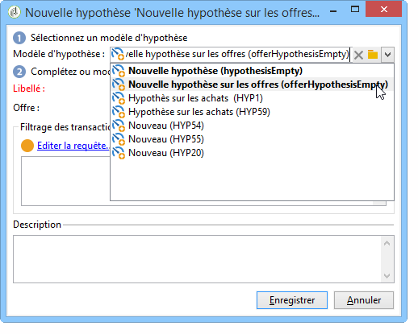

   La requête créée dans le modèle apparaît dans la fenêtre.

   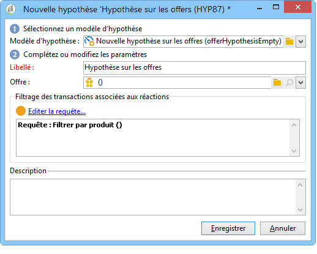

1. Sélectionnez l&#39;offre sur laquelle vous souhaitez faire une hypothèse.

   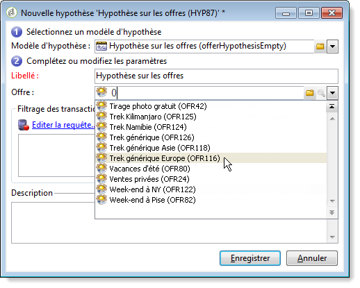

1. Affinez la requête si besoin est.
1. Lancez l&#39;hypothèse en cliquant sur **[!UICONTROL Démarrer]**.
1. Consultez les résultats de l&#39;hypothèse dans les onglets **[!UICONTROL Général]** et **[!UICONTROL Réactions]**. [Apprenez-en davantage](hypothesis-tracking.md)

   Les hypothèses faites sur une offre sont référencées dans l&#39;onglet **[!UICONTROL Mesure]** de l&#39;offre.

   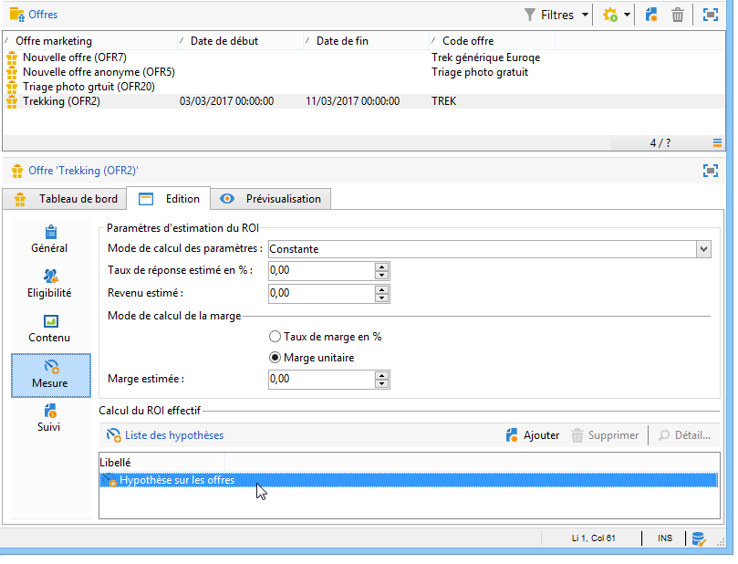

   Si l’option **[!UICONTROL Mettre à jour l’état de la proposition d’offre]** a été activée dans le modèle d’hypothèse, l’état de la proposition d’offre est automatiquement modifié et permet d’avoir un retour sur l’impact de la campagne (voir à ce sujet la section [Transactions](hypothesis-templates.md#transactions)).

## Exemple de création d’une hypothèse liée à une diffusion {#example--creating-a-hypothesis-linked-to-a-delivery}

Dans cet exemple, nous allons créer une hypothèse liée à une diffusion. Cette hypothèse sera basée sur le modèle créé précédemment. [Apprenez-en davantage](hypothesis-templates.md#example--creating-a-hypothesis-template-on-a-delivery)

Nous affinerons ensuite la requête héritée du modèle pour émettre une hypothèse sur un article spécifique de la table d’achat.

1. Créez une campagne et une diffusion. [Apprenez-en davantage](../../campaign/using/setting-up-marketing-campaigns.md#creating-a-campaign)

   Dans notre exemple, la diffusion est de type courrier.

1. Paramétrez une adresse témoin. En effet, le modèle d&#39;hypothèse créé précédemment a été paramétré pour tenir compte d&#39;une population témoin dans les résultats de la réaction.

   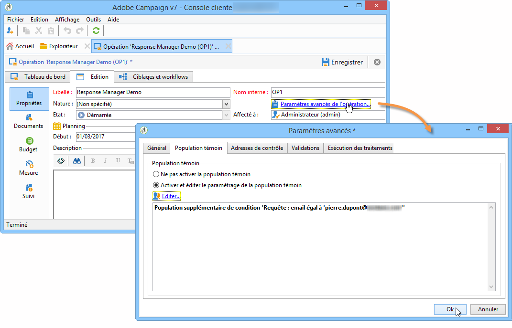

   >[!NOTE]
   >
   >Pour plus d’informations, consultez [cette section](../../campaign/using/marketing-campaign-deliveries.md#defining-a-control-group).

1. Ouvrez la **[!UICONTROL Diffusion courrier]** et cliquez sur l&#39;icône **[!UICONTROL Mesure de la diffusion]**, puis sur **[!UICONTROL Ajouter]**.

   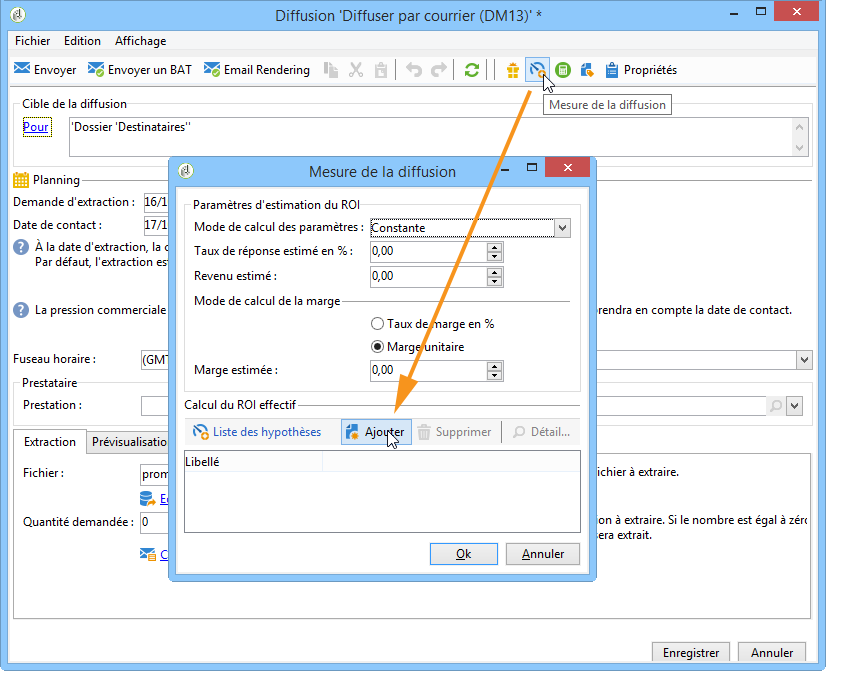

1. Choisissez le modèle d&#39;hypothèse créé précédemment à l&#39;aide de la liste déroulante.

   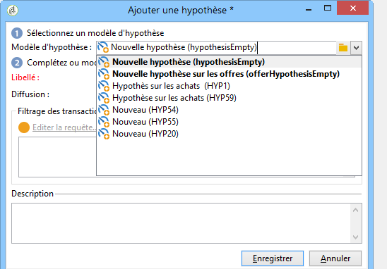

   La requête créée dans le modèle s&#39;affiche.

   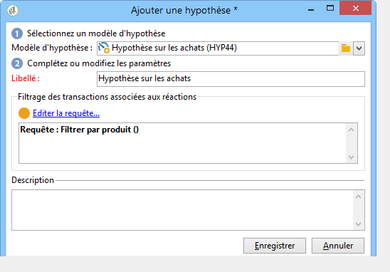

1. Cliquez sur **[!UICONTROL Editer la requête]** et affinez la requête en précisant le produit sur lequel va porter l&#39;hypothèse.

   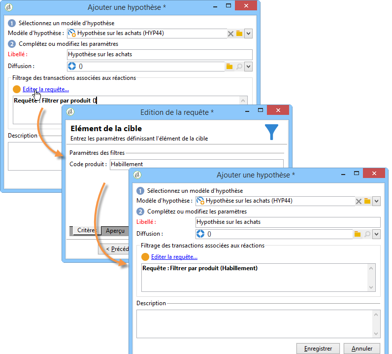

   Vous pouvez vérifier que l&#39;hypothèse a été rattachée à la diffusion depuis l&#39;onglet **[!UICONTROL Edition]** > **[!UICONTROL Mesure]** de l&#39;opération.

   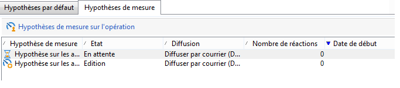

1. Lancez votre workflow de ciblage et effectuez les vérifications nécessaires jusqu&#39;à ce que la campagne soit terminée. [Apprenez-en davantage](../../campaign/using/marketing-campaign-deliveries.md#starting-a-delivery)

   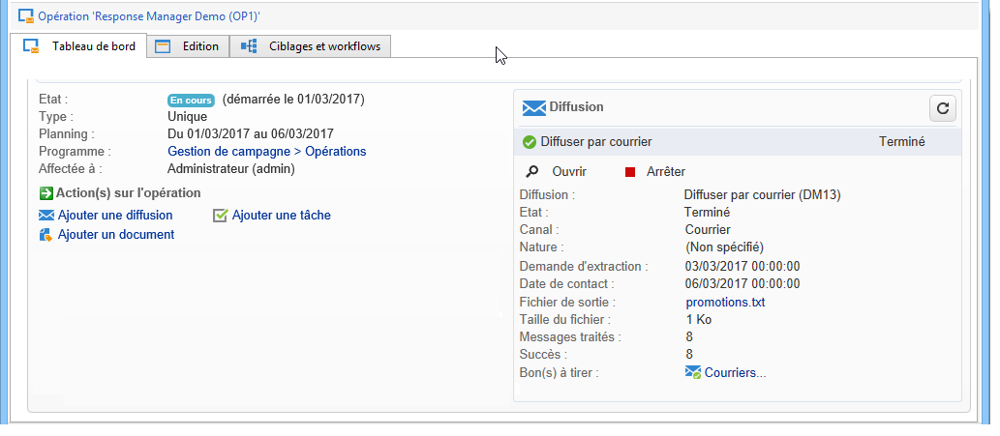

1. Dans l’arborescence d’Adobe Campaign, accédez au nœud **[!UICONTROL Gestion de campagnes > Hypothèses de mesure]** pour vérifier les indicateurs calculés par l’hypothèse.

   
