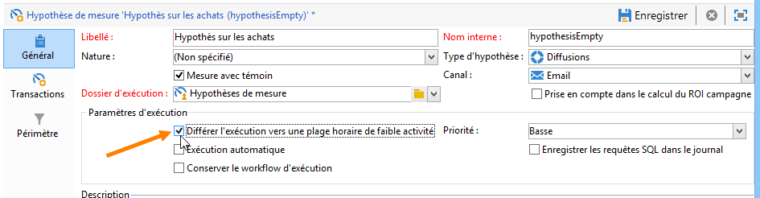

# Modèles d&#39;hypothèse{#hypothesis-templates}

## Créer un modèle d&#39;hypothèse {#creating-a-hypothesis-model}

Le paramétrage du modèle d&#39;hypothèse permet de définir le contexte dans lequel les réactions vont être mesurées, qu&#39;elles soient liées à une diffusion ou une offre. C&#39;est à ce niveau que sont référencées les différentes tables nécessaires à la mesure, notamment pour définir les relations entre les individus, les hypothèses et la table des transactions.

Pour créer un modèle d&#39;hypothèse, les étapes sont les suivantes :

1. Dans l&#39;explorateur Adobe Campaign, cliquez sur **[!UICONTROL Ressources > Modèles > Modèles d&#39;hypothèse]**.

   

1. Cliquez sur le bouton **[!UICONTROL Nouveau]** ou cliquez avec le bouton droit de la souris dans la liste des modèles et sélectionnez **[!UICONTROL Nouveau]** dans le menu contextuel.
1. Saisissez le libellé de l&#39;hypothèse.
1. Indiquez si le modèle est destiné à des hypothèses sur les offres ou les diffusions via le champ **[!UICONTROL Type d&#39;hypothèse]**.
1. Pour les modèles de type **[!UICONTROL Diffusion]**, indiquez si les mesures doivent être effectuées avec ou sans population témoin. [Apprenez-en davantage](#properties-of-a-hypothesis-template)
1. Pour un modèle de type **[!UICONTROL Diffusion]**, vous pouvez sélectionner un canal spécifique, ou choisir d&#39;appliquer le modèle à tous les canaux disponibles dans Adobe Campaign à l&#39;aide de la liste déroulante **[!UICONTROL Canal]**. [Apprenez-en davantage](#properties-of-a-hypothesis-template)
1. Sélectionnez le **[!UICONTROL Dossier d&#39;exécution]** dans lequel vous souhaitez créer et exécuter automatiquement les hypothèses qui seront créées à partir du modèle.
1. Choisissez les paramètres d&#39;exécution. [Apprenez-en davantage](#hypothesis-template-execution-settings)
1. Indiquez la période de calcul de l&#39;hypothèse. [Apprenez-en davantage](#hypothesis-template-execution-settings)

   >[!CAUTION]
   >
   >Cette période est déterminée à partir de la date de contact.

1. Dans l&#39;onglet **[!UICONTROL Transactions]**, indiquez les tables et champs nécessaires au calcul de l&#39;hypothèse. [Apprenez-en davantage](#transactions)
1. Si votre modèle est paramétré pour des hypothèses de type **[!UICONTROL Offres]**, vous pouvez activer l&#39;option **[!UICONTROL Mettre à jour l&#39;état de la proposition d&#39;offre]** : dans ce cas, sélectionnez l&#39;état de la proposition d&#39;offre que vous souhaitez modifier.
1. Indiquez le périmètre d&#39;application de l&#39;hypothèse. [Apprenez-en davantage](#hypothesis-perimeter)
1. Si nécessaire, utilisez un script pour terminer le filtrage. [Apprenez-en davantage](#hypothesis-perimeter)

### Propriétés d&#39;un modèle d&#39;hypothèse {#properties-of-a-hypothesis-template}

L&#39;onglet **[!UICONTROL Général]** du modèle permet de définir les options générales du modèle. Les champs disponibles sont les suivants :

* **[!UICONTROL Type d&#39;hypothèse]** : permet de déterminer si le modèle doit être destiné aux hypothèses sur diffusions ou sur offres.

  Vous pouvez également choisir de créer une hypothèse qui s&#39;appliquera à la fois aux diffusions et aux offres.

  >[!NOTE]
  >
  >Si le modèle porte sur les offres, l&#39;option **[!UICONTROL Mettre à jour l&#39;état de la proposition d&#39;offre]** est disponible dans l&#39;onglet **[!UICONTROL Transactions]**.

* **[!UICONTROL Mesure avec témoin]** : permet d&#39;indiquer si une population témoin a été définie au niveau de la diffusion ou de l&#39;opération et de la comptabiliser dans les indicateurs de mesure. La population témoin, qui ne reçoit pas de diffusion, sert à mesurer l&#39;impact de la campagne après la diffusion par comparaison avec le comportement de la population cible qui, elle, reçoit la diffusion.

  >[!NOTE]
  >
  >Si le modèle est paramétré pour tenir compte d&#39;une population témoin et qu&#39;aucun témoin n&#39;est défini dans la diffusion sur laquelle sont faites les hypothèses, les résultats ne seront basés que sur les destinataires ciblés.

  La définition et la configuration d’une population témoin sont présentées dans la [documentation de Campaign v8](https://experienceleague.adobe.com/docs/campaign/automation/campaign-orchestration/marketing-campaign-target.html?lang=fr#add-a-control-group){target=_blank}.

* **[!UICONTROL Canal]** : vous pouvez choisir un canal spécifique ou mettre le modèle d&#39;hypothèse à la disposition de tous les canaux dans la console Adobe Campaign en sélectionnant l&#39;option **[!UICONTROL Tous les canaux]** dans la liste déroulante. Si vous paramétrez le modèle pour un canal particulier, cela permet de filtrer automatiquement les diffusions par canal au moment de la création de l&#39;hypothèse. [Apprenez-en davantage](creating-hypotheses.md)

  

* **[!UICONTROL Dossier d&#39;exécution]** : permet de spécifier le dossier d&#39;exécution de l&#39;hypothèse.
* **[!UICONTROL Prise en compte dans le calcul du ROI campagne]** : permet de prendre en compte le résultat de l&#39;hypothèse dans le calcul du ROI de la campagne associée (dans le cas d&#39;une diffusion de campagne).

### Paramètres d&#39;exécution d&#39;un modèle d&#39;hypothèse {#hypothesis-template-execution-settings}

L&#39;onglet **[!UICONTROL Général]** du modèle permet également de définir les paramètres d&#39;exécution de l&#39;hypothèse. Les options disponibles sont les suivantes :

* **[!UICONTROL Différer l&#39;exécution vers une plage horaire de faible activité]** : permet de différer le lancement de l&#39;hypothèse afin d&#39;optimiser les performances d&#39;Adobe Campaign. Lorsque cette option est sélectionnée, le workflow de traitement sur les opérations choisit une plage horaire de moindre activité pour lancer le calcul d&#39;hypothèse.

  

* **[!UICONTROL Priorité]** : niveau appliqué à l&#39;hypothèse pour échelonner l&#39;ordre de calcul des hypothèses, dans le cas d&#39;exécutions simultanées.

  

* **[!UICONTROL Exécution automatique]** : permet, au besoin, de planifier le recalcul de l&#39;hypothèse (par exemple si l&#39;on souhaite mettre à jour les indicateurs à intervalle régulier jusqu&#39;à la date de fin de la diffusion).

  

  Pour définir la fréquence, procédez comme suit :

   1. Cliquez sur le lien **[!UICONTROL Fréquence d&#39;exécution...]**, puis sur le bouton **[!UICONTROL Changer]**.

      

   1. Configurez la fréquence, la périodicité des événements et la période de validité.

      

   1. Cliquez sur **[!UICONTROL Terminer]** pour enregistrer le planning.

      

* **[!UICONTROL Enregistrer les requêtes SQL dans le journal]** : cette fonctionnalité est réservée aux utilisateurs experts. Elle permet d&#39;ajouter un onglet au suivi des hypothèses de mesure dans lequel les requêtes en SQL sont visibles. Ceci permet de détecter un éventuel dysfonctionnement si la simulation se termine en erreur.
* **[!UICONTROL Conserver le workflow d&#39;exécution]** : permet de conserver le workflow généré automatiquement au lancement du calcul de l&#39;hypothèse. Dans les hypothèses créées à partir d&#39;un modèle dont l&#39;option est cochée, le workflow généré est accessible afin d&#39;en suivre le déroulement.

  >[!CAUTION]
  >
  >Cette option ne doit être activée qu&#39;à des fins de débogage, en cas d&#39;erreur lors de l&#39;exécution de l&#39;hypothèse.\
  >De plus, les workflows générés automatiquement ne doivent pas être modifiés. Toute modification éventuelle ne serait par ailleurs pas prise en compte pour les calculs ultérieurs.\
  >Si vous avez coché cette option, supprimez le workflow après son exécution.

### Transactions {#transactions}

Cet onglet contient les différents champs et tables permettant de conserver l&#39;historique des réactions des destinataires en termes de transactions. Consultez cette [section](../../configuration/using/about-schema-reference.md) pour plus d’informations sur les tables dédiées à la gestion de la réaction.

* **[!UICONTROL Schéma (stockage des logs de réaction)]** : indiquez la table des réactions des destinataires. La table livrée d&#39;usine dans Adobe Campaign est **NmsRemaMatchRcp**.
* **[!UICONTROL Schéma des transactions]** : choisissez la table sur laquelle vous allez effectuer vos hypothèses, soit la table des transactions ou des achats.
* **[!UICONTROL Schéma de requêtage]** : sélectionnez les critères permettant de filtrer l&#39;hypothèse.
* **[!UICONTROL Lien vers les individus]** : sélectionnez le lien entre les individus et la table sélectionnée comme schéma des transactions.
* **[!UICONTROL Lien vers le foyer]** : sélectionnez le lien vers le foyer dans le schéma des transactions si vous souhaitez inclure l&#39;ensemble des membres d&#39;un foyer dans votre hypothèse. Ce champ est optionnel.
* **[!UICONTROL Date de transaction]** : ce champ est optionnel mais recommandé car il permet de délimiter le périmètre du calcul de l&#39;hypothèse.
* **[!UICONTROL Période de calcul de la mesure]** : permet de paramétrer les dates de début et de fin pendant lesquelles les hypothèses s’exécutent et les lignes d’achat sont récupérées.

  Lorsque l&#39;hypothèse est rattachée à une diffusion, la mesure se déclenche automatiquement quelques jours après la date de contact, dans le cas d&#39;une diffusion courrier, ou après la date d&#39;envoi s&#39;il s&#39;agit d&#39;une diffusion email ou SMS.

  

  Si l&#39;hypothèse est lancée à la volée, elle peut être forcée pour se déclencher instantanément. Sinon, elle se déclenche automatiquement en fonction de la date de fin de calcul paramétrée à compter de la date de création de l&#39;hypothèse. [En savoir plus](creating-hypotheses.md#creating-a-hypothesis-on-the-fly-on-a-delivery)).

* **[!UICONTROL Montant de transaction/de la marge]** : ces champs sont facultatifs et permettent de calculer automatiquement les indicateurs du chiffre d&#39;affaire. [Apprenez-en davantage](hypothesis-tracking.md#indicators)
* **[!UICONTROL Montant unitaire]** : permet d&#39;indiquer un montant fixe pour le calcul du chiffre d&#39;affaire. [Apprenez-en davantage](hypothesis-tracking.md#indicators)

  

* **[!UICONTROL Mesures et données additionnelles]** : permet de définir des mesures ou des axes de reporting supplémentaires à partir des champs des différentes tables.
* **[!UICONTROL Mettre à jour l&#39;état de la proposition d&#39;offre]** : permet de modifier l&#39;état de la proposition d&#39;offre dans le cas où le destinataire d&#39;une offre est identifié par l&#39;hypothèse.

  

### Périmètre de l&#39;hypothèse {#hypothesis-perimeter}

Lorsque la table des transactions et les champs sur lesquels va porter l&#39;hypothèse sont définis, vous avez la possibilité d&#39;affiner davantage le périmètre de vos hypothèses en indiquant précisément les transactions et les diffusions visées à l&#39;aide de filtres. Vous pouvez également utiliser un script JavaScript pour indiquer explicitement un produit référencé dans la table des transactions sur lequel vous souhaitez faire une hypothèse.

* **Filtrage sur les transactions** : dans l&#39;onglet **[!UICONTROL Périmètre]**, vous pouvez paramétrer un filtre sur l’hypothèse. Pour cela :

   1. Cliquez sur le lien **[!UICONTROL Editer la requête]**.

      

   1. Définissez vos critères de filtrage.

      

   1. Sélectionnez la transaction sur laquelle doit porter l&#39;hypothèse.

      

* **Filtre sur les destinataires** : dans l&#39;onglet **[!UICONTROL Périmètre]**, vous pouvez limiter votre hypothèse à toute information liée à un message (diffusion, destinataire, adresse email, service, etc.). Pour cela :

   1. Cliquez sur le lien **[!UICONTROL Ajouter un filtre]**, puis **[!UICONTROL Editer la requête]**.

      

   1. Définissez vos critères de filtrage.

      

   1. Cliquez sur **[!UICONTROL Terminer]** pour sauvegarder votre requête.

      

* **Script** : vous pouvez utiliser un script JavaScript pour surcharger dynamiquement les paramètres de l&#39;hypothèse lors de son exécution.

  Pour cela, cliquez sur le lien **[!UICONTROL Paramètres avancés]**, puis saisissez le script de votre choix.

  >[!NOTE]
  >
  >Cette option est destinée aux utilisateurs experts.

  

## Exemple : création d&#39;un modèle d&#39;hypothèse sur une diffusion {#example--creating-a-hypothesis-template-on-a-delivery}

Dans cet exemple, vous allez créer un modèle d&#39;hypothèse sur une diffusion de type courrier. La table des transactions (**Achats** dans notre exemple) sur laquelle seront basées les hypothèses contient des lignes d&#39;achat auxquelles sont rattachés des articles ou produits. Vous allez paramétrer votre modèle pour faire des hypothèses sur les articles ou produits de votre table d&#39;achats.

1. Dans l&#39;explorateur Adobe Campaign, positionnez-vous au niveau du noeud **[!UICONTROL Ressources > Modèles > Modèles d&#39;hypothèse]**.
1. Cliquez sur **[!UICONTROL Nouveau]** pour créer un modèle.

   

1. Modifiez le libellé du modèle.

   

1. Choisissez le type d&#39;hypothèse **[!UICONTROL Diffusions]**.
1. Indiquez que la diffusion peut contenir une population témoin en cochant la case correspondante.
1. Sélectionnez le canal **[!UICONTROL Courrier]**.

   >[!NOTE]
   >
   >Le modèle étant spécifique aux diffusions courrier, les hypothèses créées à partir de ce modèle ne pourront être rattachées à une diffusion utilisant un canal autre que celui du courrier.

1. Dans l&#39;onglet **[!UICONTROL Transactions]**, sélectionnez la table des réactions des destinataires.

   

1. Dans le champ **[!UICONTROL Schéma des transactions]**, choisissez votre table d&#39;achats.

   

1. Sélectionnez les lignes d&#39;achat dans le champ **[!UICONTROL Schéma de requêtage]**.

   

1. Sélectionnez les destinataires liés à la table des achats.

   

1. Sélectionnez le champ correspondant à la date d&#39;achat.

   Ceci permet de délimiter les hypothèses dans le temps. Cette étape n&#39;est pas obligatoire, mais elle est recommandée.

   

1. Paramétrez la période de calcul entre 5 et 25 jours.

   

1. Dans l&#39;onglet **[!UICONTROL Périmètre]**, cliquez sur **[!UICONTROL Editer la requête]** pour créer un filtre sur les hypothèses.

   

   Le modèle ainsi créé vous permettra de faire des hypothèses sur les produits ou articles contenus dans la table des achats.

1. Cliquez sur **[!UICONTROL Enregistrer]** pour sauvegarder votre modèle.
