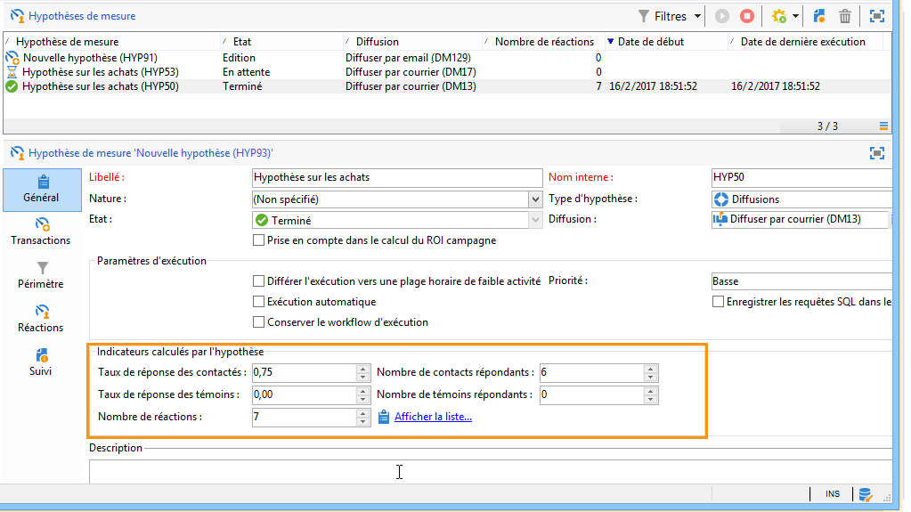
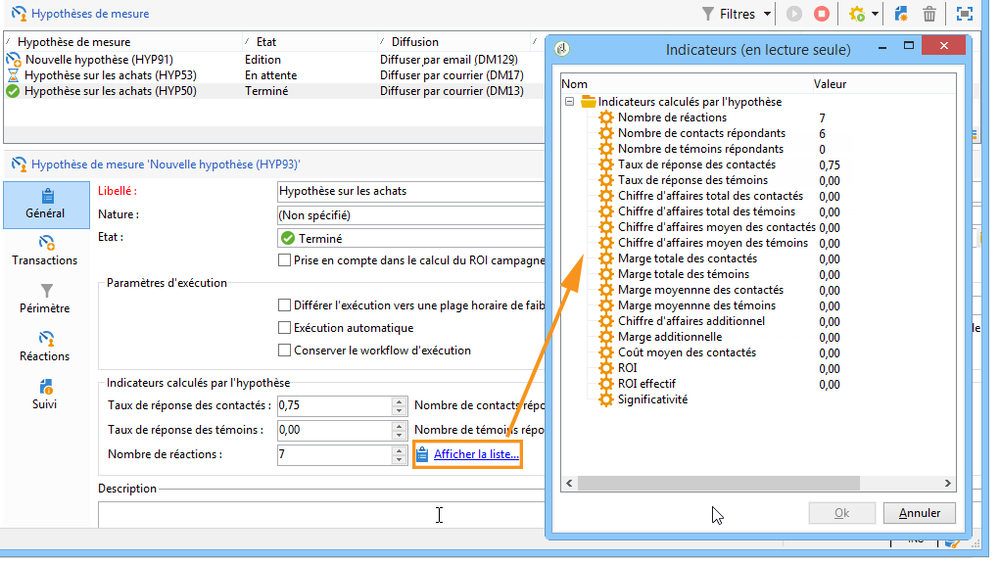
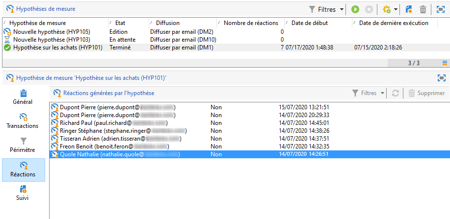
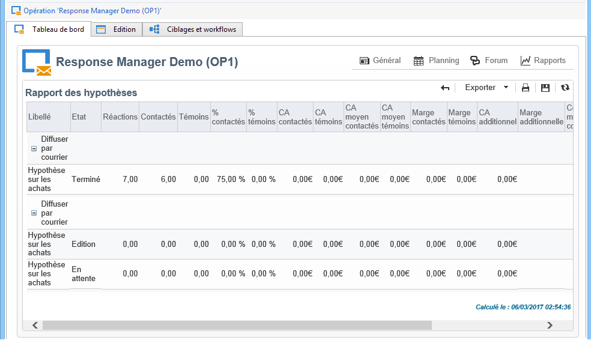
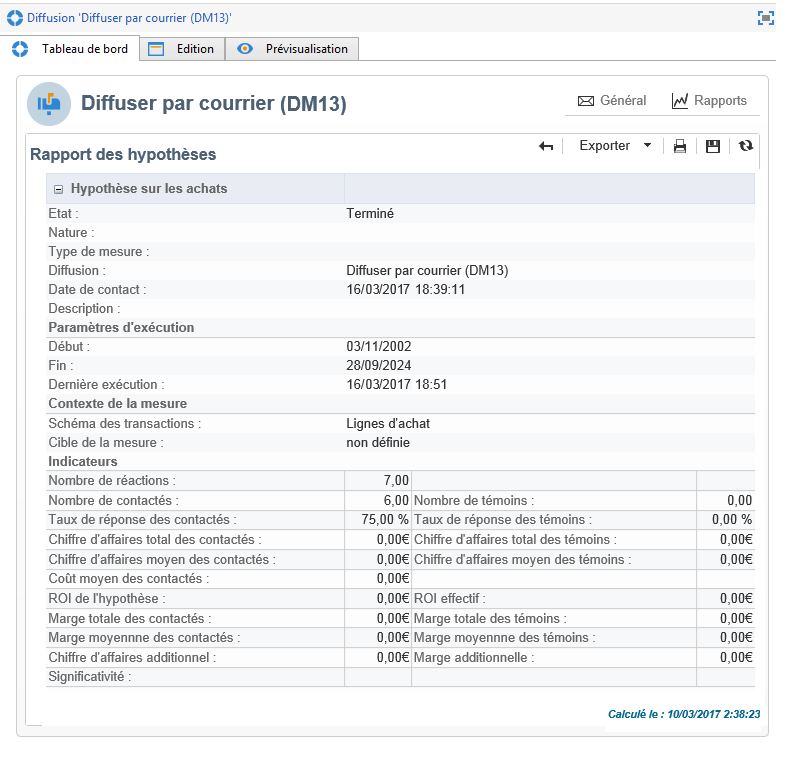

# Suivi des hypothèses{#hypothesis-tracking}

Le résultat des calculs des hypothèses est disponible à divers niveaux de la plateforme Adobe Campaign : les indicateurs calculés par les hypothèses et les réactions de la population cible peuvent être consultés depuis l&#39;hypothèse de mesure elle-même, ainsi que dans des rapports d&#39;hypothèses accessibles depuis les opérations et les diffusions.

## Résultats des hypothèses {#hypothesis-results}

### Indicators {#indicators}

Lorsque l&#39;hypothèse a été calculée, plusieurs indicateurs de mesure sont automatiquement mis à jour. Ils sont disponibles dans l&#39;onglet **[!UICONTROL Général]** de l&#39;hypothèse.

Ces indicateurs sont les suivants :

* **Nombre de contacts répondants** : nombre distinct d&#39;individus contactés qui répondent à l&#39;hypothèse.
* **Taux de réponse des contactés** : nombre de contacts répondants / total des contacts de la diffusion.
* **Nombre de témoins répondants** : nombre distinct des témoins répondant à l&#39;hypothèse.
* **Taux de réponse des témoins** : nombre de témoins répondants / total des témoins de la diffusion.
* **Nombres de réactions** : nombre d&#39;enregistrements dans la table contenant la relation entre les individus, l&#39;hypothèse et la table des transactions.

Vous pouvez obtenir la liste complète des indicateurs en cliquant sur le lien **[!UICONTROL Afficher la liste]** :

Les informations données par les indicateurs sont les suivantes :

* **Chiffre d&#39;affaires total des contactés** : somme des montants sur le nombre d&#39;individus contactés.
* **Chiffre d&#39;affaires total des témoins** : somme des montants sur le nombre des témoins.
* **Chiffre d&#39;affaires moyen des contactés** : somme des montants / nombre des contactés.
* **Chiffre d&#39;affaires moyen des témoins** : somme des montants / nombre des témoins.
* **Marge totale des contactés** : somme des marges sur le nombre des contactés.
* **Marge totale des témoins** : somme des marges sur le nombre des témoins.
* **Marge moyenne des contactés** : somme des marges / nombre des contactés.
* **Marge moyenne des témoins** : somme des marges / nombre des témoins.
* **Chiffre d’affaire additionnel** : (Chiffre d’affaire moyen des personnes contactés - Chiffre d’affaire moyen de la population témoin)&#42;Nombre de personnes contactées
* **Marge additionnelle** : (Marge moyenne des contactés-Marge moyenne des témoins) / nombre de contactés
* **Coût moyen des contactés** : coût calculé de la diffusion / Nombre de contactés.
* **ROI** : coût calculé de la diffusion / Marge totale des contactés
* **ROI effectif** : coût calculé de la diffusion / Marge additionnelle.
* **Significativité** : contient les valeurs 0 à 3 selon que la campagne est plus ou moins significative.

### Réactions {#reactions}

Vous pouvez visualiser les réactions des destinataires aux hypothèses depuis l&#39;onglet **[!UICONTROL Réactions]**.

1. Lorsque le calcul de l&#39;hypothèse est terminé, positionnez-vous au niveau du noeud **[!UICONTROL Gestion de campagne > Hypothèses de mesure]** dans l&#39;arborescence d&#39;Adobe Campaign.
1. Sélectionnez l&#39;hypothèse voulue dans la liste et cliquez sur l&#39;onglet **[!UICONTROL Réactions]** afin de voir la liste des destinataires susceptibles de faire un achat suite à la campagne marketing.

   

## Rapports  {#reports}

Le **[!UICONTROL Rapport des hypothèses]** permet de consulter les résultats des hypothèses appliquées aux opérations et diffusions. Il contient les indicateurs calculés par l’hypothèse (voir à ce propos la section [Indicateurs](#indicators)).

* **Au niveau d&#39;une opération** : cliquez sur le lien **[!UICONTROL Rapports]** de l&#39;opération concernée et sélectionnez le **[!UICONTROL Rapport des hypothèses]**. Ce rapport contiendra la liste des diffusions de l&#39;opération et les hypothèses calculées pour chacune des diffusions.

  

* **Au niveau d&#39;une diffusion** : pour accéder au rapport, ouvrez la diffusion concernée, cliquez sur l&#39;onglet **[!UICONTROL Rapports]** dans l&#39;onglet **[!UICONTROL Résumé]**, et sélectionnez le **[!UICONTROL Rapport des hypothèses]**. Si plusieurs hypothèses ont été calculées pour une même diffusion, le rapport contiendra la totalité des hypothèses.

  
