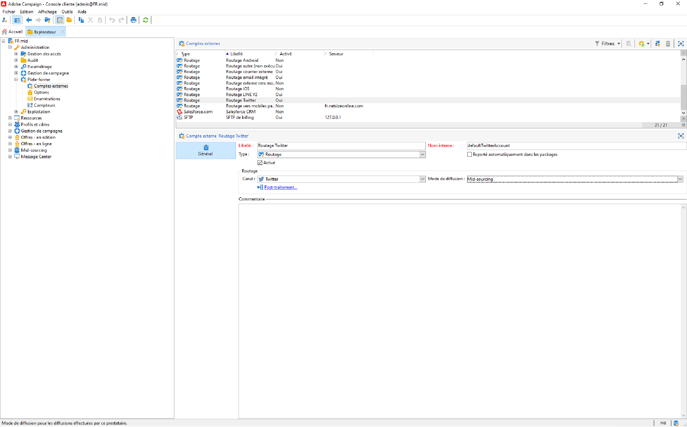

# À propos du marketing sur les réseaux sociaux{#about-social-marketing}

La variable **Gestion des réseaux sociaux** (Social Marketing) est une application conçue pour la gestion des réseaux sociaux qui permet d&#39;interagir avec les clients et les prospects via X (anciennement appelée Twitter).

Découvrez les étapes clés pour intégrer Campaign et X dans [Documentation de Campaign v8](https://experienceleague.adobe.com/docs/campaign/campaign-v8/connect/ac-tw.html?lang=fr){target="_blank"}.

En tant que client on-premise ou hybride, votre compte externe X doit être configuré et activé. Pour les configurations hybrides, l’onglet **Mid-sourcing** doit également être défini avec une connexion active à la plateforme de mid-sourcing.

