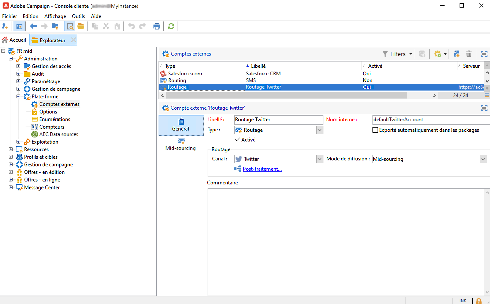

# À propos du marketing des médias sociaux{#about-social-marketing}

L’application **Gestion des réseaux sociaux** (Social Marketing) vous permet d’interagir avec vos clientes et clients et vos prospects via X (anciennement Twitter).

Découvrez les principales étapes pour intégrer Campaign à X dans la [documentation de Campaign v8](https://experienceleague.adobe.com/docs/campaign/campaign-v8/connect/ac-tw.html?lang=fr){target="_blank"}.

En tant que client ou cliente On-Premise ou hybride, votre compte externe X doit être configuré et activé. Pour les configurations hybrides, l’onglet **Midsourcing** doit également être défini avec une connexion active à la plateforme de midsourcing.

