# Configurer la publication Twitter{#configuring-publishing-on-twitter}

Pour qu&#39;Adobe Campaign puisse envoyer des tweets sur vos comptes Twitter, vous devez déléguer, à Adobe Campaign, les droits d&#39;écriture sur ces comptes. Les étapes de paramétrage sont les suivantes :

* Créez un compte Twitter.
* Créez un compte Twitter de test dédié à l&#39;envoi de BAT.
* Créez une application Twitter par compte Twitter.
* Pour chaque application Twitter, créez un nouveau service de type **[!UICONTROL Twitter]**.

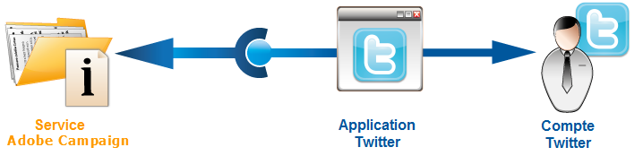

## Conditions préalables requises {#prerequisites}

Vous devez tout d&#39;abord créer un ou plusieurs comptes Twitter sur lesquels vous enverrez vos tweets.

Pour créer un compte Twitter, suivez le lien : [https://twitter.com](https://twitter.com)

## Créer un compte Twitter de test {#creating-a-test-account-on-twitter}

Il est recommandé de créer également un compte Twitter privé sur lequel vous enverrez des BAT de vos tweets (voir à ce sujet la section [Envoi du BAT](../../social/using/publishing-on-twitter.md#sending-the-proof)) :

* Créez un nouveau compte Twitter.
* Cliquez sur le menu, en haut à droite, et sélectionnez **[!UICONTROL Paramètres]**.
* Sélectionnez l&#39;onglet **[!UICONTROL Sécurité et confidentialité]**, et cochez la case **[!UICONTROL Protéger mes tweets]**.
* Cliquez sur le bouton **[!UICONTROL Enregistrer les modifications]**, en bas de la page.

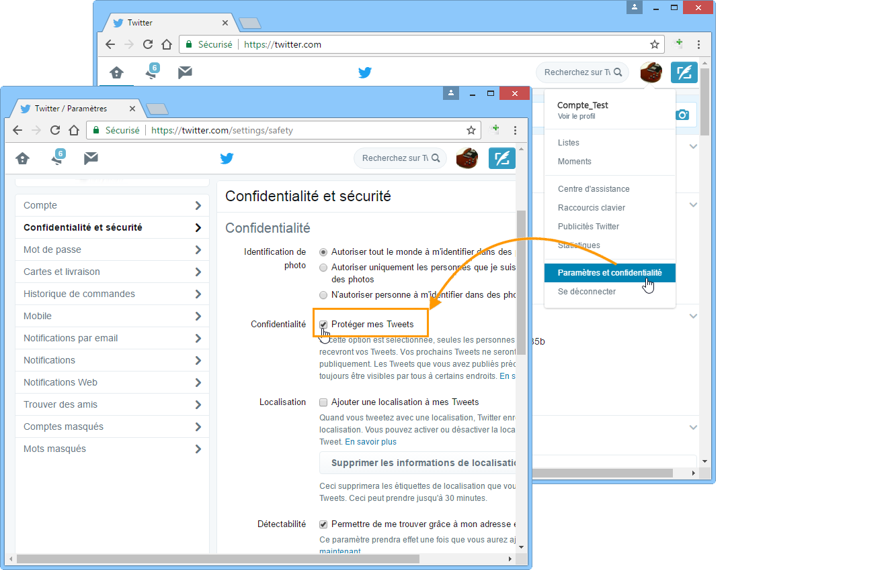

## Créer une application sur Twitter {#creating-an-application-on-twitter}

Pour qu&#39;Adobe Campaign puisse envoyer des tweets sur vos comptes Twitter, vous devez créer une application Twitter par compte Twitter. Les étapes sont les suivantes :

1. Connectez-vous à votre compte Twitter.
1. Saisissez l&#39;adresse [https://apps.twitter.com/](https://apps.twitter.com/) dans la barre d&#39;adresse de votre navigateur Internet.
1. Cliquez ensuite sur le bouton **[!UICONTROL Create New App]**, à droite de la page.

   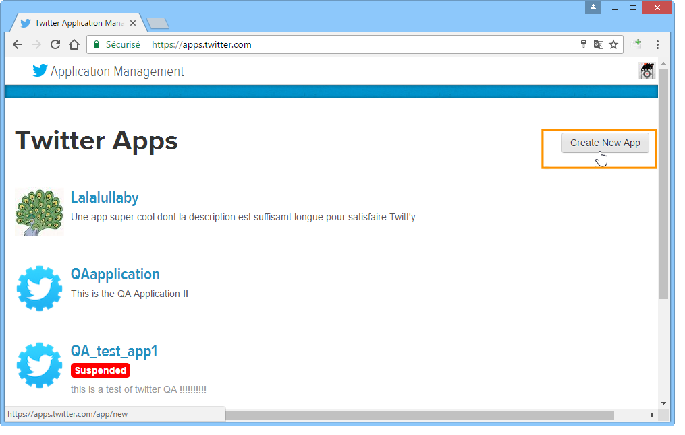

1. Laissez-vous guider par l&#39;assistant.

   Pour que cette application permette à Adobe Campaign d&#39;envoyer des tweets sur votre compte, rendez-vous sur l&#39;onglet **[!UICONTROL Permissions]** de l&#39;application et sélectionnez **[!UICONTROL Read and Write]** dans la section **[!UICONTROL Access]**. Sur l&#39;onglet **[!UICONTROL Settings]**, vous devez également laisser le champ **[!UICONTROL Callback URL]** vide.

   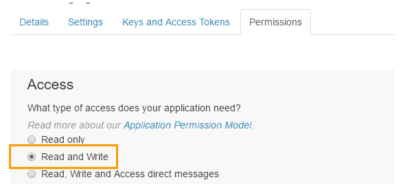

## Déléguer les droits d&#39;écriture à Adobe Campaign {#delegating-write-access-to-adobe-campaign}

Pour chaque application Twitter, vous devez créer un service de type **[!UICONTROL Twitter]** différent, dans lequel vous renseignerez les paramètres de chacune des applications.

Cette étape requiert l&#39;accès simultané à votre console Adobe Campaign ainsi qu&#39;à un navigateur Internet connecté à votre compte Twitter :

* **Twitter** : sélectionnez l&#39;application créée précédemment ([https://dev.twitter.com/apps](https://dev.twitter.com/apps)), et cliquez sur l&#39;onglet **[!UICONTROL Keys and Access Tokens]**.

   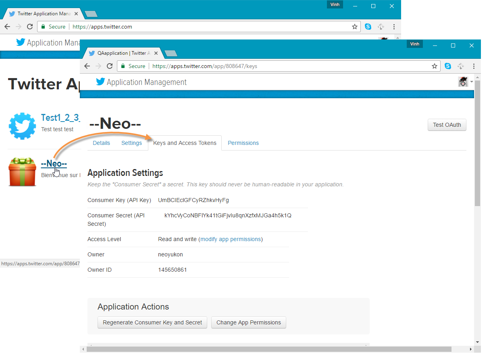

* **Adobe Campaign** : positionnez-vous sur l’onglet **[!UICONTROL Profils et cibles]**, cliquez sur le lien **[!UICONTROL Services et abonnements]** et cliquez sur le bouton **[!UICONTROL Créer]**.

   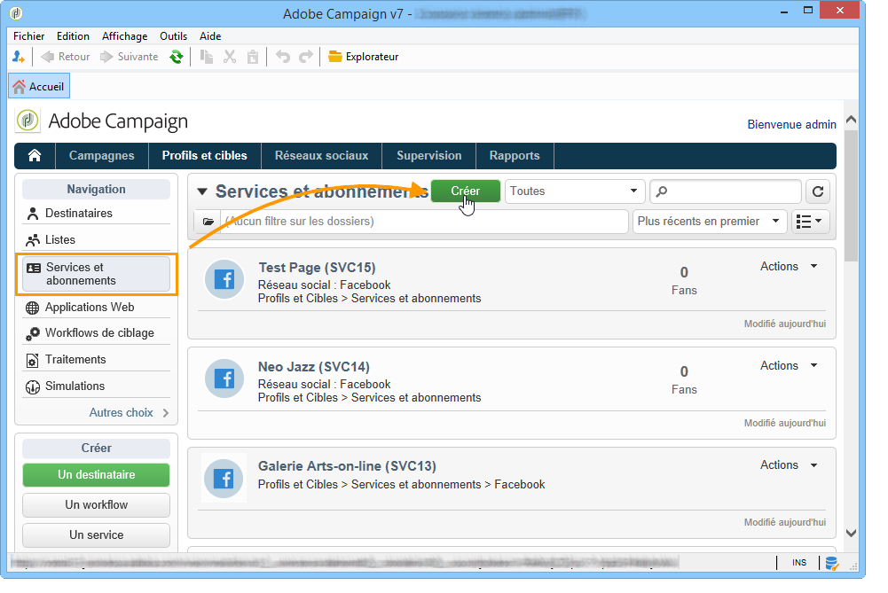

1. Sélectionnez le type **[!UICONTROL Twitter]**.

   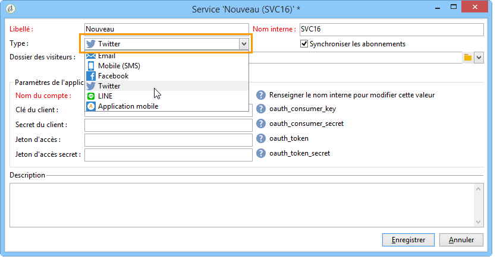

   >[!NOTE]
   >
   >L’option **[!UICONTROL Synchroniser les abonnements]** est activée par défaut. Lorsque cette case est cochée, le processus de synchronisation des comptes Twitter (voir [Synchronisation des comptes Twitter](#synchronizing-twitter-accounts)) récupère la liste des abonnés Twitter afin que vous puissiez leur envoyer des messages directs (voir [Envoyer des messages directs à vos abonnés](../../social/using/publishing-on-twitter.md#sending-direct-messages-to-subscribers)). Si vous ne souhaitez pas récupérer la liste des abonnés, décochez cette case.

1. Renseignez le libellé et le nom interne du service.

   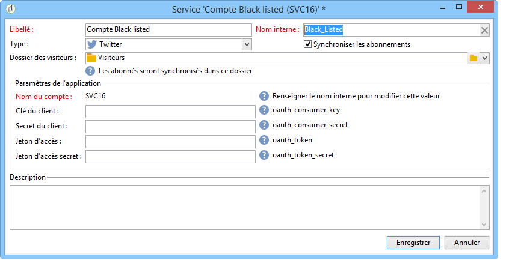

   >[!IMPORTANT]
   >
   >Le **[!UICONTROL Nom interne]** du service doit être identique au nom du compte Twitter. Pour vous assurer qu’il n’y a aucune erreur d’entrée, procédez comme suit.

   * Cliquez sur le bouton **[!UICONTROL Enregistrer]**.
   * Dans la vue d&#39;ensemble des services, cliquez sur le service de type Twitter que vous venez de créer.
   * Sélectionnez l&#39;onglet **[!UICONTROL Page Twitter]**. Le compte Twitter doit s&#39;afficher.

      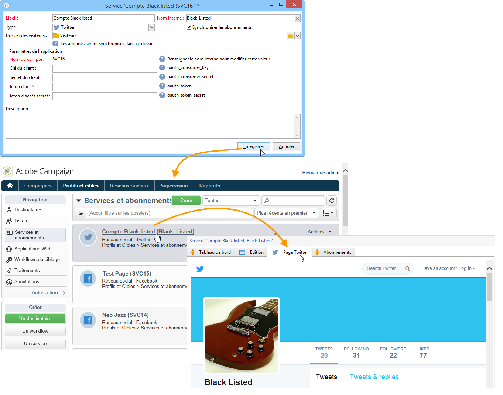

1. Dans le champ **[!UICONTROL Dossier des visiteurs]**, sélectionnez le dossier des visiteurs dans lequel les abonnés seront créés. Voir à ce sujet la section [Principe de fonctionnement](../../social/using/publishing-on-twitter.md#operating-principle). Par défaut, les abonnés sont créés à la racine du dossier **[!UICONTROL Visiteurs]**.

   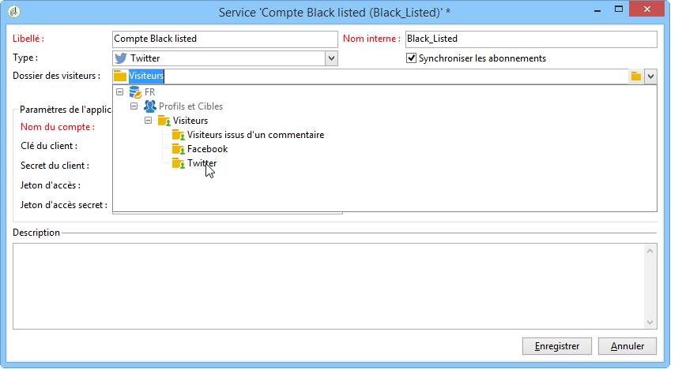

1. Sur Twitter, copiez le contenu des champs **[!UICONTROL Consumer key (API Key)]** et **[!UICONTROL Consumer secret (API Secret)]** et collez-les dans les champs **[!UICONTROL Clé du client]** et **[!UICONTROL Secret du client]** de la console.

   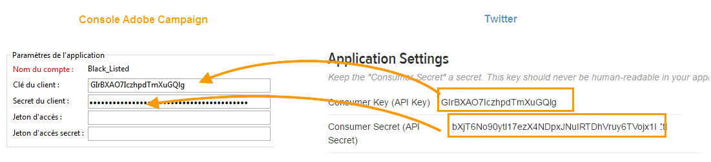

1. Sur Twitter, copiez le contenu des champs **[!UICONTROL Access Token]** et **[!UICONTROL Access Token Secret]** et collez-les dans les champs **[!UICONTROL Jeton d&#39;accès]** et **[!UICONTROL Jeton d&#39;accès secret]** de la console.

   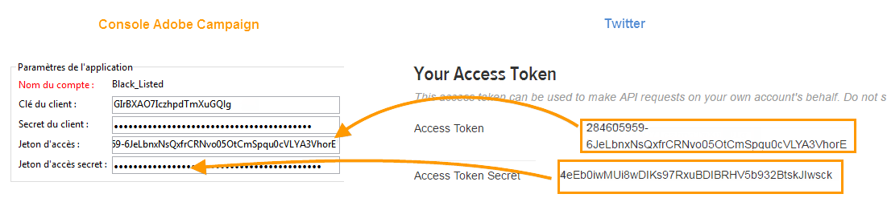

1. Dans la console Adobe Campaign, cliquez sur **[!UICONTROL Enregistrer]**. La délégation des droits d&#39;écriture d&#39;Adobe Campaign sur le compte Twitter est terminée.

   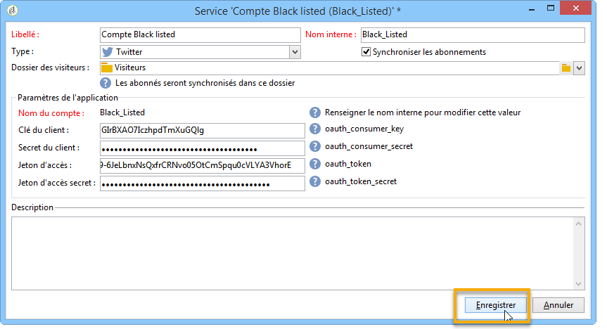

>[!NOTE]
>
>Vous devez créer un service de type **[!UICONTROL Twitter]** par application Twitter.

Le workflow **[!UICONTROL Synchronisation des comptes Twitter]** synchronise les comptes Twitter dans Adobe Campaign. Voir à ce sujet la section [Synchronisation des pages Facebook](../../social/using/publishing-on-facebook-walls.md#synchronizing-facebook-pages).

## Synchroniser les comptes Twitter {#synchronizing-twitter-accounts}

>[!IMPORTANT]
>
>Pour que le workflow récupère la liste des abonnés d&#39;un compte Twitter, la case **[!UICONTROL Synchronisation des comptes Twitter]** doit être cochée dans la section d’édition du service lié au compte. Voir à ce sujet la section [Déléguer les droits d&#39;écriture à Adobe Campaign](#delegating-write-access-to-adobe-campaign).

Le workflow **[!UICONTROL Synchronisation des comptes Twitter]**, accessible à partir du noeud **[!UICONTROL Administration > Exploitation > Workflows techniques > Gestion des réseaux sociaux]** permet de synchroniser, dans Adobe Campaign, les comptes Twitter paramétrés précédemment. Ce workflow est configuré par défaut pour se déclencher tous les jeudis à 7 heures 30 du matin.

>[!NOTE]
>
>Il est possible de démarrer le workflow à tout moment, en effectuant un traitement anticipé des tâches. Vous pouvez également éditer le planificateur pour modifier la fréquence de déclenchement du workflow. Pour plus d’informations sur le planificateur, reportez-vous à [cette section](../../workflow/using/scheduler.md).

Vous pouvez désormais envoyer des tweets à vos comptes Twitter et envoyer des messages directs à vos abonnés. Voir à ce sujet la section : [Publier sur Twitter](../../social/using/publishing-on-twitter.md).
