# Création d’une application Facebook{#creating-a-facebook-application}

Grâce aux applications web, le module dédié au marketing sur les réseaux sociaux de Campaign vous permet d’afficher du contenu personnalisé dans vos applications Facebook, ce qui facilite l’acquisition de prospects par l’intermédiaire de ce réseau social. Pour plus d’exemples d’applications web de type Facebook, reportez-vous à [cette page](../../social/using/examples-of-facebook-apps.md).

>[!NOTE]
>
>Vous pouvez également intégrer Adobe Campaign à une application Facebook développée par un partenaire. Dans ce cas, il n’est pas nécessaire d’utiliser l’application web Adobe Campaign pour acquérir des profils Facebook. [En savoir plus](#configuring-external-accounts).

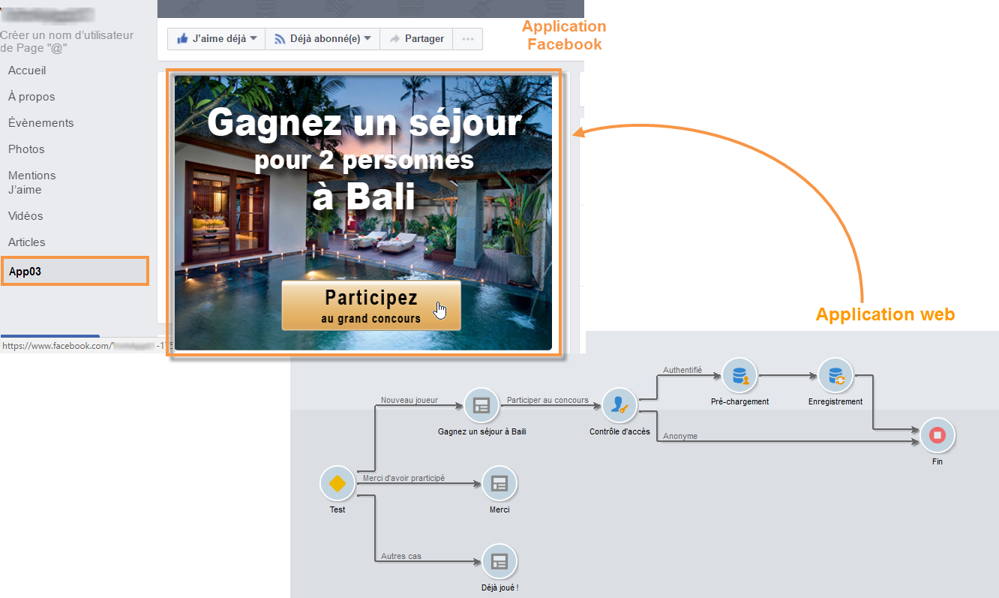

Les étapes de configuration sont les suivantes :

1. Créez une ou plusieurs applications Facebook.
1. Renseignez les liens **[!UICONTROL Conditions d’utilisation]** et **[!UICONTROL Politique de confidentialité]** qui apparaîtront sur l’écran de demande d’autorisation Facebook. [En savoir plus](#entering-the-terms-of-service-and-privacy-policy-links)
1. Pour chaque application Facebook, vous devez créer un compte externe de type **[!UICONTROL Facebook Connect]**. [En savoir plus](#configuring-external-accounts)
1. Pour chaque application Facebook, créez une application web de type Facebook dans Adobe Campaign. [En savoir plus](#creating-a-facebook-type-web-application)
1. Configurez vos applications Facebook afin qu’elles s’affichent sous forme d’onglets sur votre page Facebook. [En savoir plus](#configuring-facebook-tabs)

## Configuration des comptes externes {#configuring-external-accounts}

Pour chaque application Facebook, vous devez créer un compte externe de type **[!UICONTROL Facebook Connect]**.

Cette étape nécessite l’accès à votre console Adobe Campaign et à votre compte administrateur Facebook :

* Sur **Facebook** : sélectionnez l’application créée précédemment ([https://developers.facebook.com/apps](https://developers.facebook.com/apps)), puis sélectionnez l’onglet **[!UICONTROL Paramètres]** > **[!UICONTROL Général]**.

   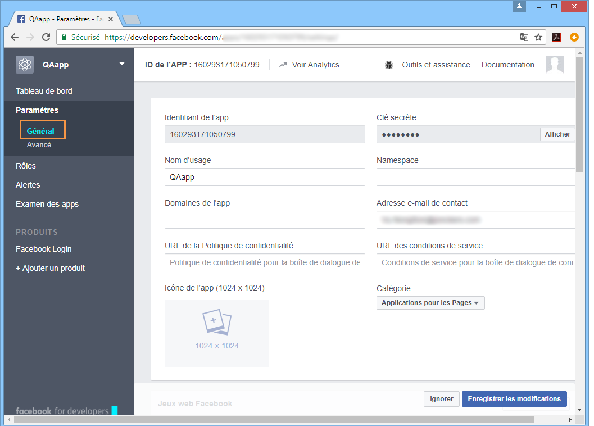

   >[!NOTE]
   >
   >Si la section **[!UICONTROL Jeux web Facebook]** n’apparaît pas, cliquez sur le bouton **[!UICONTROL Ajouter une plateforme]**, en bas de la page, puis sélectionnez **[!UICONTROL Jeux web Facebook]**.

* Sur **Adobe Campaign** : accédez à **[!UICONTROL Administration > Plateforme > Comptes externes]** et cliquez sur **[!UICONTROL Nouveau]**.

   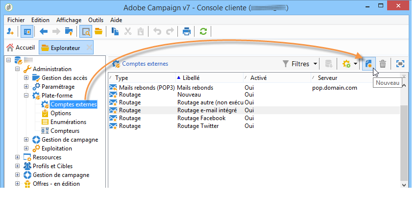

1. Saisissez un libellé et un nom interne, puis sélectionnez le type **[!UICONTROL Facebook Connect]**.

   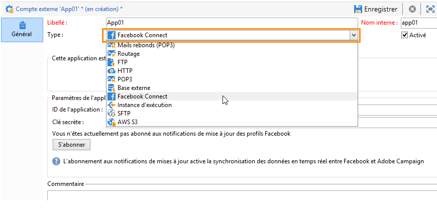

1. Sélectionnez le mode d’hébergement de l’application : **[!UICONTROL hébergée chez un partenaire]** ou **[!UICONTROL hébergée sur cette instance]**.

   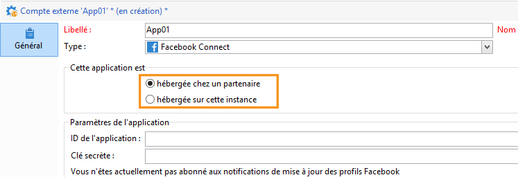

   **Application hébergée chez un partenaire**

   Il est possible d&#39;intégrer Adobe Campaign avec une application Facebook développée par un partenaire. Dans ce cas, il n&#39;est pas nécessaire d&#39;utiliser les applications web Adobe Campaign pour acquérir des profils Facebook. Lorsque l&#39;utilisateur Facebook installe l&#39;application, une clé (access token) est générée. Le partenaire transmet cette clé à Adobe Campaign en appelant un webservice. Adobe Campaign utilise cette clé pour se connecter à la base Facebook et récupérer les données que l&#39;utilisateur a partagé avec l&#39;application.

   >[!NOTE]
   >
   >Les paramètres du service Web sont détaillés dans le fichier WSDL disponible ici : **`https://<Instance name>/nl/jsp/schemawsdl.jsp?schema=nms:visitor`**

   Pour intégrer l&#39;application tierce dans Adobe Campaign, vous devez copier le contenu des champs Facebook **[!UICONTROL Identifiant de l&#39;app]** et **[!UICONTROL Clé secrète]**, et les coller dans les champs **[!UICONTROL ID de l&#39;application]** et **[!UICONTROL Clé secrète]** dans la console.

   

   **Application hébergée sur cette instance**

   Si vous souhaitez héberger l&#39;application sur cette instance (dans le cas où vous ne disposez pas d&#39;une application tierce), vous devrez utiliser les applications web Adobe Campaign pour acquérir des profils Facebook. Pour plus dʼinformations, consultez [cette page](../../social/using/examples-of-facebook-apps.md).

   Dans la console Adobe Campaign, copiez l’adresse contenue dans le champ **[!UICONTROL URL sécurisée de la zone de travail]** et collez-la dans le champ **[!UICONTROL Jeux web Facebook (https)]** sur Facebook (dans la section **[!UICONTROL Jeux web Facebook]**).

   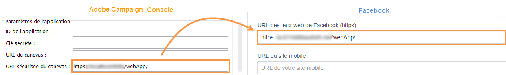

   >[!CAUTION]
   >
   >N’utilisez aucune URL non sécurisée.

   Sur Facebook, copiez le contenu des champs **[!UICONTROL Identifiant de l&#39;app]** et **[!UICONTROL Clé secrète]** et collez-les dans les champs **[!UICONTROL ID de l&#39;application]** et **[!UICONTROL Clé secrète]** dans la console.

   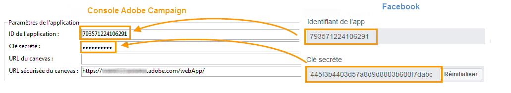

1. Sur Facebook, cliquez sur le bouton **[!UICONTROL Enregistrer les modifications]**, en bas de la page.
1. Dans la console Adobe Campaign, cliquez sur le bouton **[!UICONTROL S’abonner]** pour permettre à Adobe Campaign de récupérer, en temps réel, les données des fans acquis par le biais de cette application.  [En savoir plus](../../social/using/examples-of-facebook-apps.md)

   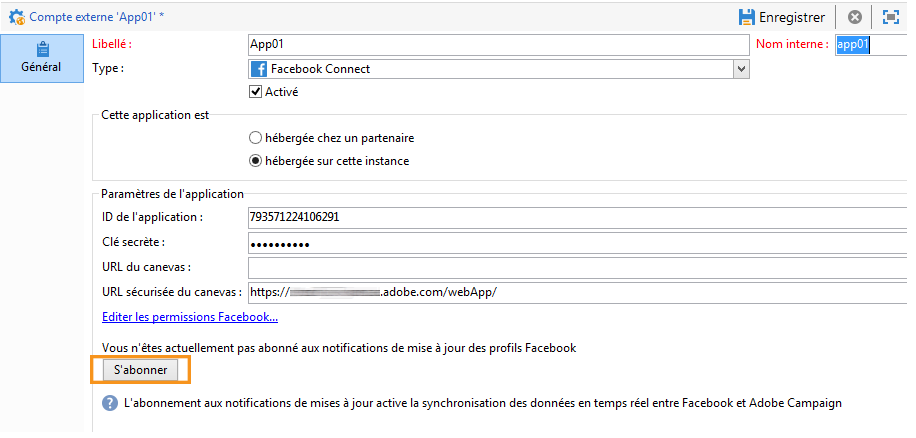

## Saisie des liens Conditions d’utilisation et Politique de confidentialité {#entering-the-terms-of-service-and-privacy-policy-links}

Nous vous recommandons vivement d&#39;ajouter les liens **[!UICONTROL Conditions d&#39;utilisation]** et **[!UICONTROL Politique de confidentialité]**, qui apparaitront sur l&#39;écran de demande d&#39;autorisation Facebook.

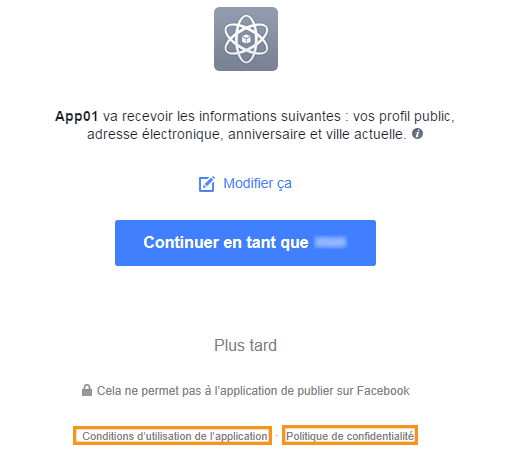

Les étapes de paramétrage sont les suivantes :

1. Saisissez l&#39;adresse [https://developers.facebook.com/apps](https://developers.facebook.com/apps), puis sélectionnez l&#39;application Facebook.
1. Dans la section **[!UICONTROL Paramètres > Général]**, renseignez les champs **[!UICONTROL URL de la Politique de confidentialité]** et **[!UICONTROL URL des conditions de service]**.

   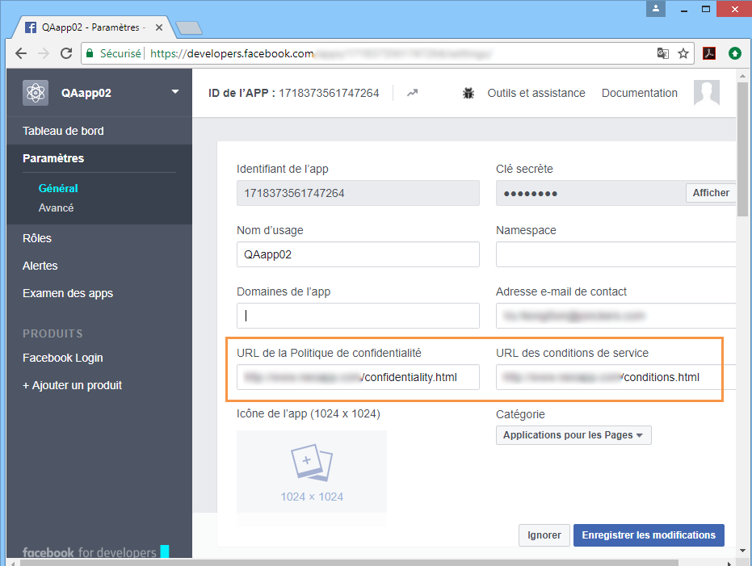

## Création d’une application web de type Facebook {#creating-a-facebook-type-web-application}

L&#39;application web Adobe Campaign de type Facebook permet d&#39;afficher du contenu personnalisé dans votre application Facebook. Pour chaque application Facebook, vous devez créer une application web dans Adobe Campaign. Les étapes de création d&#39;une application web de type Facebook sont les suivantes.

1. Positionnez-vous sur l’onglet **[!UICONTROL Réseaux sociaux]**, cliquez sur le lien **[!UICONTROL Applications]** puis sur le bouton **[!UICONTROL Créer]**.

   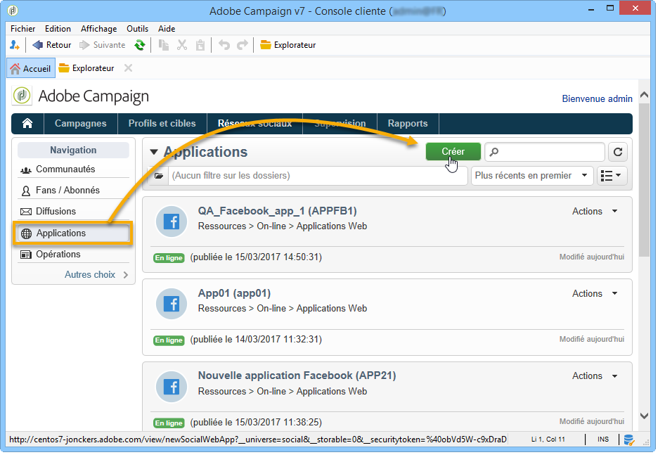

1. Sélectionnez un modèle d&#39;application web Facebook dans la liste, et renseignez le libellé.

   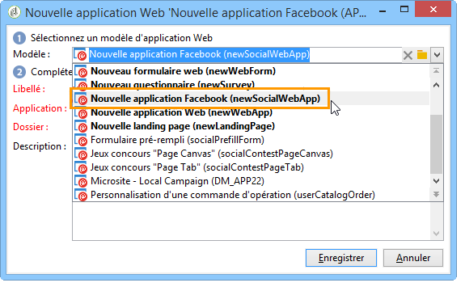

   >[!NOTE]
   >
   >Quatre modèles d&#39;applications web Facebook sont proposés par défaut :
   >
   >* **[!UICONTROL Nouvelle application Facebook]** : sélectionnez ce modèle si vous souhaitez partir d&#39;une application vierge.
   >* **[!UICONTROL Formulaire pré-rempli]** : application Facebook comportant un formulaire et un bouton &quot;Facebook login&quot; permettant aux utilisateurs de le remplir automatiquement grâce aux données de leur profil. Cela permet à l&#39;utilisateur de remplir le formulaire plus rapidement et aux marques d&#39;obtenir des informations de meilleure qualité.
   >* **[!UICONTROL Jeux concours &quot;Page Canvas&quot;]** : application Facebook s&#39;affichant sur la totalité de l&#39;écran pour une expérience visuelle plus agréable pour les utilisateurs.
   >* **[!UICONTROL Jeux concours &quot;Page Tab&quot;]** : application Facebook encapsulée au sein des onglets des pages de marque.

1. Dans le champ **[!UICONTROL Application]**, renseignez le compte externe lié à l&#39;application Facebook. [En savoir plus](#configuring-external-accounts)

   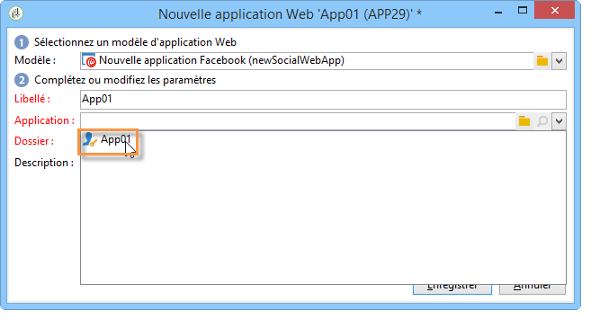

1. Sélectionnez l’onglet **[!UICONTROL Modification]**, puis modifiez l’application web. [En savoir plus](../../social/using/examples-of-facebook-apps.md)

   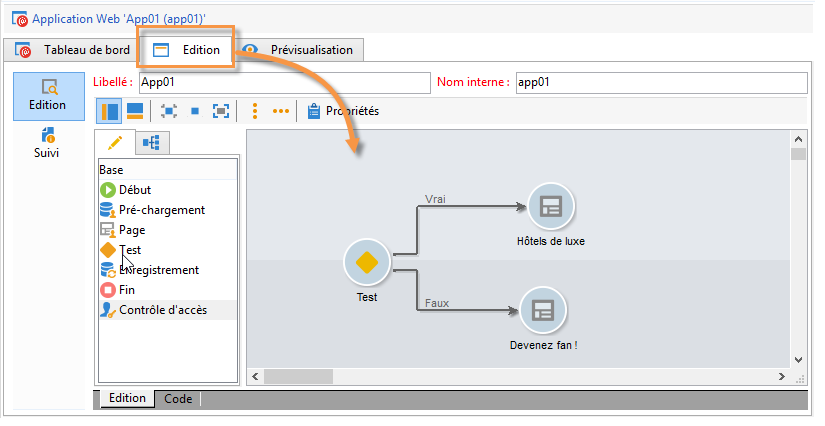

1. Une fois l’application web terminée, sélectionnez l’onglet **[!UICONTROL Tableau de bord]**, puis cliquez sur **[!UICONTROL Publier]** pour la mettre en ligne.

   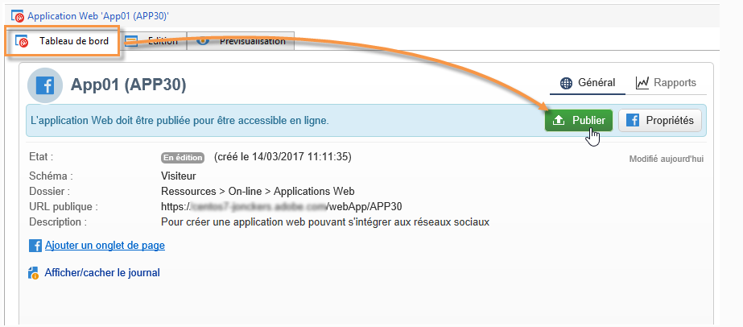

## Configuration des onglets Facebook {#configuring-facebook-tabs}

Vous pouvez paramétrer vos applications Facebook pour qu&#39;elles apparaissent sous la forme d&#39;onglets sur votre page Facebook. Les étapes de paramétrage sont les suivantes :

1. Sélectionnez l&#39;application Facebook ([https://developers.facebook.com/apps](https://developers.facebook.com/apps)), et sélectionnez l&#39;onglet **[!UICONTROL Paramètres > Général]**.

   

1. En bas de la page, cliquez sur le bouton **[!UICONTROL Ajouter une plateforme]**, et sélectionnez **[!UICONTROL Onglet Page]**.

   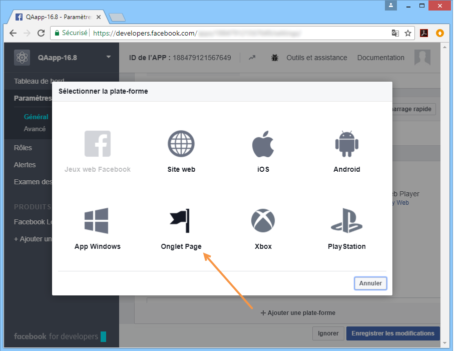

1. Dans le champ **[!UICONTROL Nom de l&#39;onglet de Page]** de la section **[!UICONTROL Onglet Page]**, renseignez le libellé qui apparaîtra sur la page Facebook.

   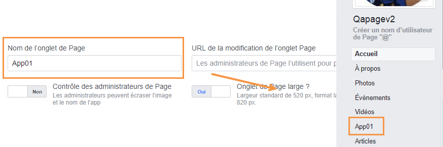

1. Dans le champ **[!UICONTROL URL d&#39;onglet Page sécurisé]**, saisissez l&#39;URL publique de l&#39;application web, accessible via l&#39;onglet **[!UICONTROL Tableau de bord]** de cette application. Pour plus d’informations sur la création d’applications web de type Facebook, reportez-vous à [cette section](#creating-a-facebook-type-web-application).

   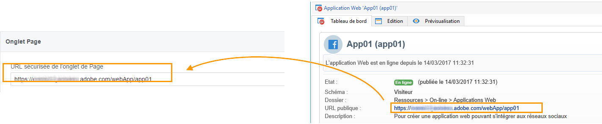

1. Sur l&#39;onglet **[!UICONTROL Tableau de bord]** de l&#39;application web, cliquez sur le lien **[!UICONTROL Ajouter un onglet de page]**.

   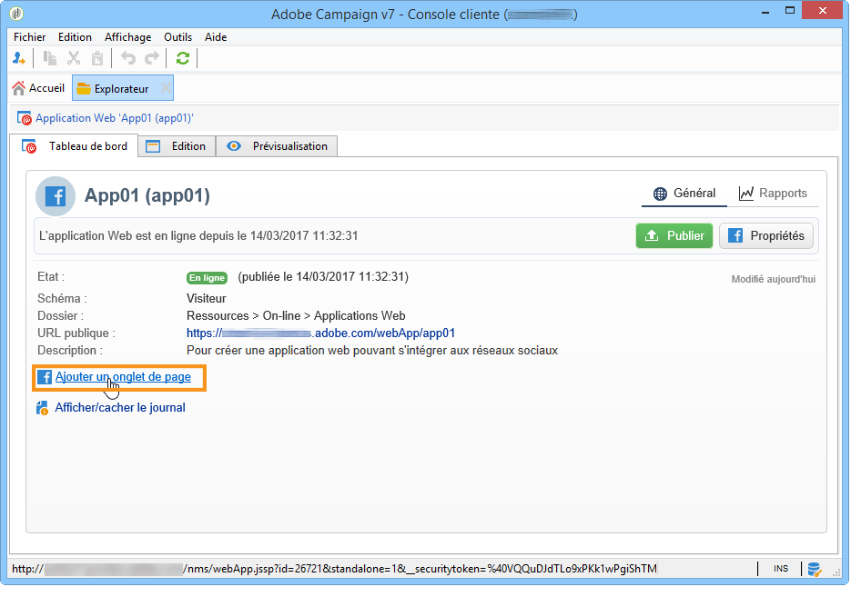

1. Sélectionnez la page Facebook sur laquelle vous souhaitez ajouter l&#39;onglet et cliquez sur **[!UICONTROL Ajouter un onglet de page]**.

   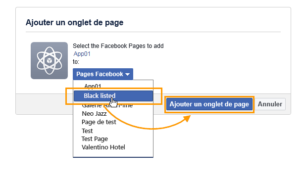
