# Exemples d&#39;apps Facebook{#examples-of-facebook-apps}

Lorsqu&#39;un utilisateur clique sur l&#39;onglet d&#39;une application Facebook, celle-ci s&#39;affiche dans un espace de 810 pixels de large. Par le biais d&#39;une application web de type Facebook, Adobe Campaign vous permet de définir et de personnaliser le contenu affiché dans l&#39;application Facebook, et facilite l&#39;acquisition de profils.

>[!NOTE]
>
>Il est également possible d&#39;intégrer Adobe Campaign avec une application Facebook développée par un partenaire. Dans ce cas, il n&#39;est pas nécessaire d&#39;utiliser les applications web Adobe Campaign pour acquérir des profils Facebook. Voir à ce sujet la section [Paramétrer les comptes externes](../../social/using/creating-a-facebook-application.md#configuring-external-accounts).

>[!IMPORTANT]
>
>Suivez les étapes de configuration décrites dans [Créer une application Facebook](../../social/using/creating-a-facebook-application.md).

>[!NOTE]
>
>Cette section présente les éléments spécifiques aux applications web de type Facebook. Tous les éléments communs avec les applications web standards sont présentés dans [cette section](../../web/using/about-web-applications.md).

Les exemples d&#39;applications web de type Facebook présentés dans cette section sont les suivants :

* Comment créer une application Facebook en 7 étapes. Voir [Quick Start : comment créer une application Facebook en 7 étapes](#quick-start--creating-a-facebook-application-in-7-steps).
* Comment transmettre des paramètres à une application Facebook. Voir [Comment transmettre des paramètres à une application Facebook ?](#how-to-forward-settings-to-a-facebook-application-).
* Comment acquérir les données des fans. Voir [Comment acquérir les données des fans ?](#how-to-acquire-fan-data-).

>[!IMPORTANT]
>
>Ces cas d&#39;utilisation simples ne sont donnés qu&#39;à titre d&#39;exemple afin d&#39;illustrer les fonctionnalités des applications web de type Facebook.

## Recommandations       {#recommendations}

Les limitations suivantes sont des contraintes inhérentes à Facebook :

* Vous devez impérativement construire toutes vos applications web en HTTPS.
* Une application Facebook affichée à partir d&#39;un onglet a une largeur de 810 pixels.

## Quick Start : comment créer une application Facebook en 7 étapes {#quick-start--creating-a-facebook-application-in-7-steps}

Cet exemple décrit pas à pas toutes les étapes permettant d&#39;afficher, dans Facebook, une application construite avec Adobe Campaign. Dans cet exemple, nous allons créer une application permettant d&#39;afficher le message **Bienvenue** lorsque l&#39;utilisateur clique sur l&#39;onglet de l&#39;application (**App01**).

Pour créer cette application, suivez les étapes ci-dessous :

1. Créez une application sur Facebook ([https://developers.facebook.com/apps](https://developers.facebook.com/apps)). Voir à ce sujet la section : [Créer une application Facebook](../../social/using/publishing-on-facebook-walls.md#creating-a-facebook-application).

   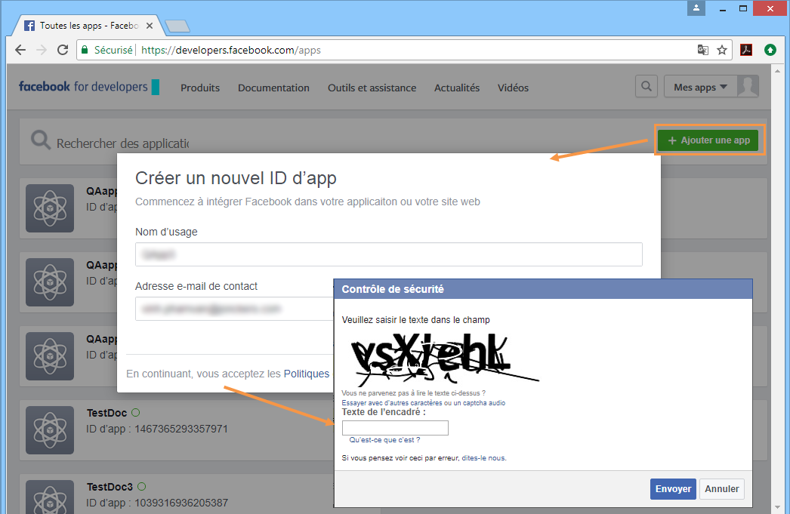

1. Créez un compte externe de type **[!UICONTROL Facebook Connect]** et saisissez les paramètres de l’application Facebook. Voir à ce sujet la section : [Paramétrer les comptes externes](../../social/using/creating-a-facebook-application.md#configuring-external-accounts).

   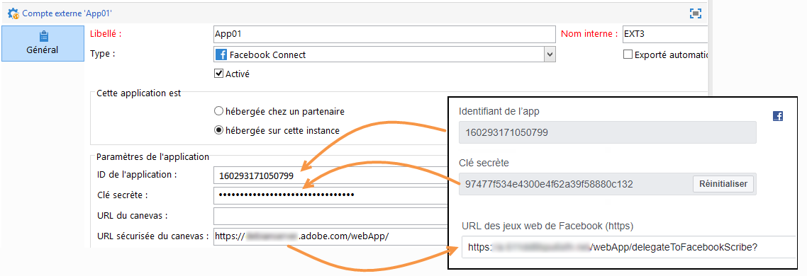

1. Renseignez les liens **[!UICONTROL Conditions d’utilisation]** et **[!UICONTROL Politique de confidentialité]** qui apparaîtront sur l’écran de demande de permission Facebook. Voir à ce sujet la section : [Renseigner les liens Conditions d&#39;utilisation et Politique de confidentialité](../../social/using/creating-a-facebook-application.md#entering-the-terms-of-service-and-privacy-policy-links).

   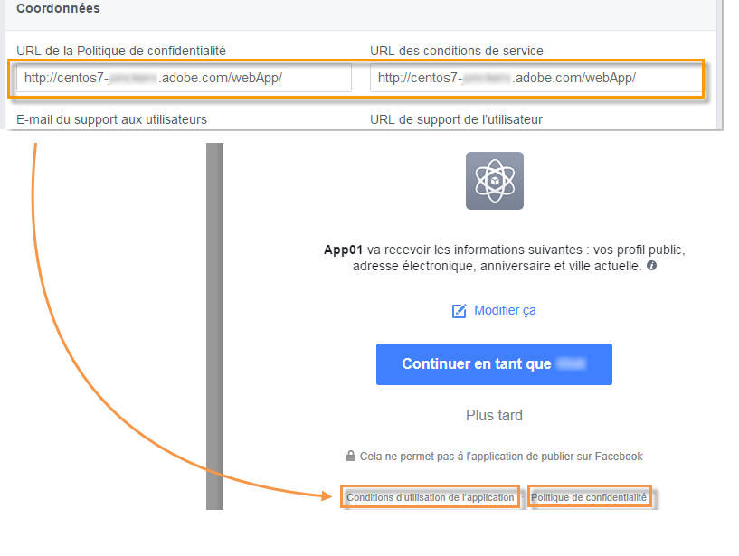

1. Créez une application web de type Facebook dans Adobe Campaign. Voir à ce sujet la section : [Créer une application web de type Facebook](../../social/using/creating-a-facebook-application.md#creating-a-facebook-type-web-application).

   

1. Editez votre application web. Dans cet exemple, nous avons ajouté une activité **[!UICONTROL Page]** pour laquelle nous avons défini un titre.

   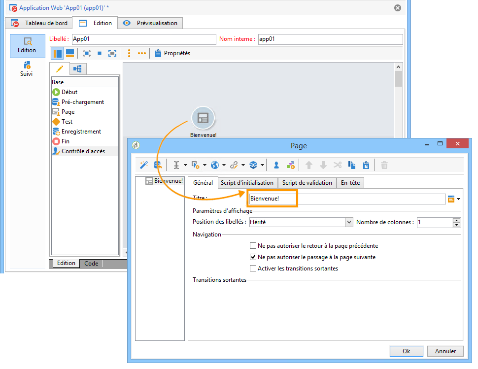

1. Publiez votre application.

   

1. Configurez votre application Facebook de sorte qu’elle s’affiche sous forme d’onglet sur votre page Facebook. Voir à ce sujet la section : [Paramétrer les onglets Facebook](../../social/using/creating-a-facebook-application.md#configuring-facebook-tabs).

   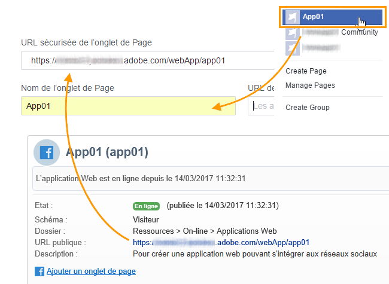

Vérifiez que l&#39;onglet de l&#39;application **App01** apparaît bien sur votre page Facebook. Lorsque vous cliquez dessus, le message **Bienvenue** doit apparaître.

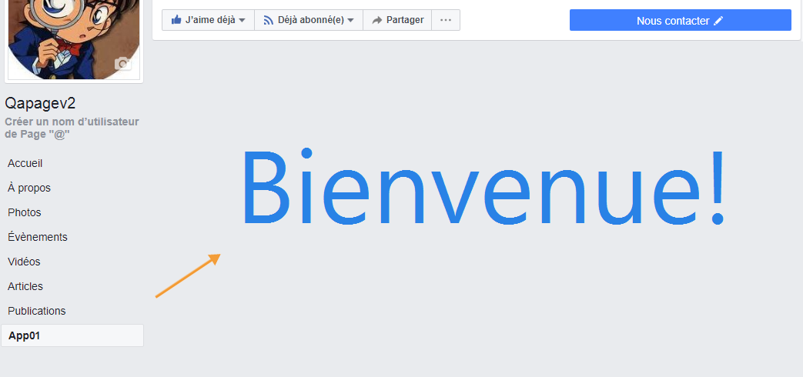

## Comment transmettre des paramètres à une application Facebook ? {#how-to-forward-settings-to-a-facebook-application-}

>[!IMPORTANT]
>
>Suivez les étapes de configuration décrites dans [Créer une application Facebook](../../social/using/creating-a-facebook-application.md).

Dans l&#39;exemple 1, nous avions personnalisé l&#39;affichage de la page Facebook en fonction de la valeur du champ **[!UICONTROL Fan de la page]**. Il est également possible d&#39;exploiter le champ **[!UICONTROL Paramètres de l&#39;application]**. Ce champ permet de récupérer depuis Facebook des données contenues dans un lien généré par Adobe Campaign.

Prenons pour exemple une société qui décide d&#39;animer une campagne e-mail. Dans la diffusion, un lien pointe vers l&#39;application Facebook. Ce lien est personnalisé grâce au paramètre **[!UICONTROL app_data]** ajouté à la fin de l&#39;URL. La valeur de ce paramètre peut être, par exemple, un indicateur reflétant l&#39;importance du client. Dans notre exemple, les valeurs du paramètre **[!UICONTROL app_data]** sont **[!UICONTROL big]** (client important) et **[!UICONTROL small]** (client moins important).

Une fois personnalisée, l&#39;URL devient :

* `http://<path of the Facebook application>&app_data=big` (pour un client important)
* `http://<path of the Facebook application>&app_data=small` (pour un client moins important)

Parmi les données anonymes transmises par Facebook à Adobe Campaign, la valeur du champ **[!UICONTROL Paramètres de l&#39;application]** est récupérée, permettant ainsi à Adobe Campaign de personnaliser l&#39;affichage de l&#39;application en fonction de ce paramètre.

Si l&#39;utilisateur est un client important (la valeur du paramètre **[!UICONTROL app_data]** est **[!UICONTROL big]**), l&#39;image suivante s&#39;affiche :

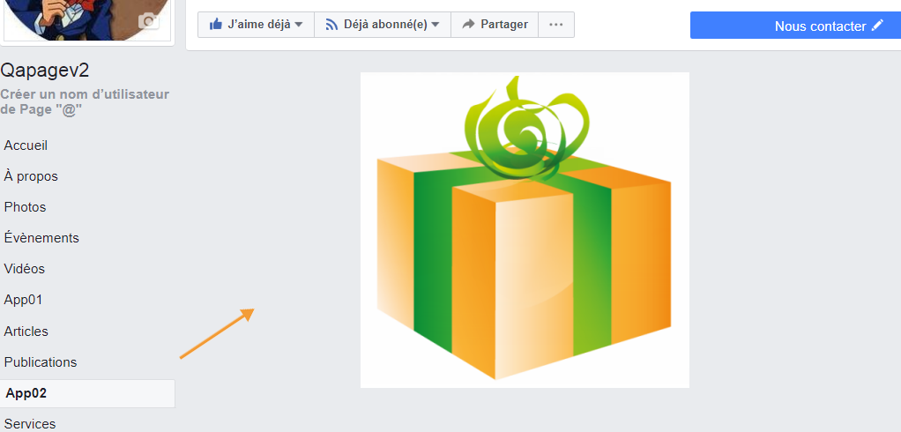

Si l&#39;utilisateur est un client moins important (la valeur du paramètre **[!UICONTROL app_data]** est **[!UICONTROL small]**), l&#39;image suivante apparaît :

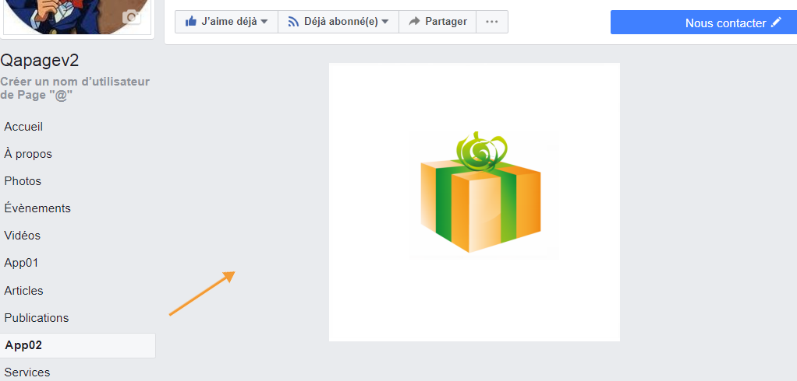

Pour réaliser ce cas d&#39;utilisation, nous avons créé une application web composée des éléments suivants :

* une activité **[!UICONTROL Test]** basée sur le champ **[!UICONTROL Paramètre de l&#39;application]**.
* deux pages contenant les images à afficher en fonction de la valeur du champ **[!UICONTROL Paramètre de l&#39;application]**.

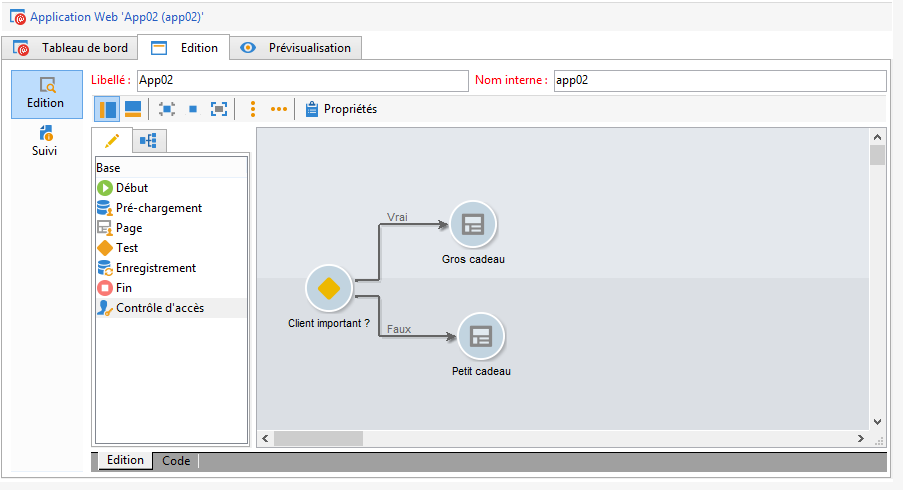

## Comment acquérir les données des fans ? {#how-to-acquire-fan-data-}

>[!IMPORTANT]
>
>Suivez les étapes de configuration décrites dans [Création d’une application](../../social/using/creating-a-facebook-application.md)Facebook.

Cet exemple illustre comment entrer en contact avec les utilisateurs Facebook et leur proposer de partager leurs informations de profil. Prenons pour exemple une société qui souhaite acquérir un fichier de prospects. Elle organise un jeu concours, sur sa page Facebook, afin d&#39;attirer les prospects.

Lorsqu&#39;un utilisateur clique sur l&#39;onglet **[!UICONTROL App03]**, nous lui proposons de participer au jeu.

S&#39;il choisit de participer au concours, nous lui proposons de partager ses informations de profil.

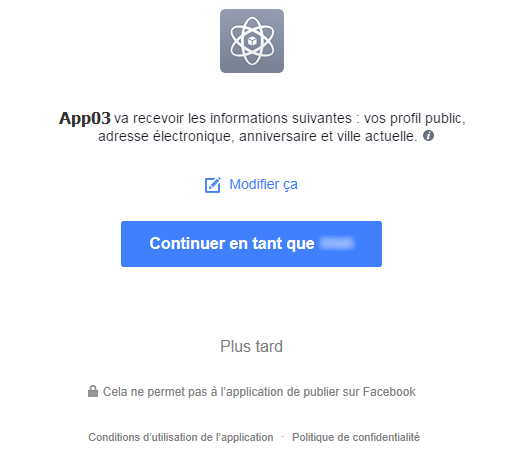

S&#39;il accepte de partager ses informations, l&#39;écran suivant apparaît.

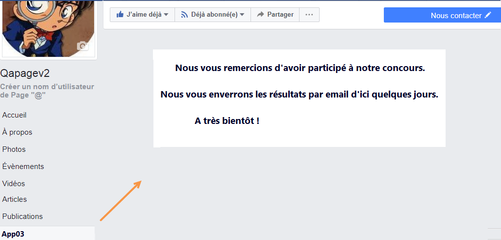

Pour réaliser ce cas d&#39;utilisation, nous avons créé une application web composée des éléments suivants :

* une activité **[!UICONTROL Test]**
* trois pages
* une activité **[!UICONTROL Contrôle d&#39;accès]**
* une activité **[!UICONTROL Pré-chargement]**
* une activité **[!UICONTROL Enregistrement]**
* une activité **[!UICONTROL Fin]**

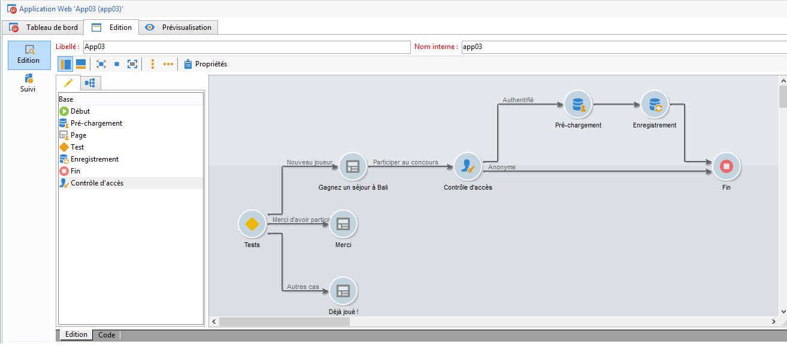

### Activité Test {#test-activity}

L&#39;activité **[!UICONTROL Test]** est basée sur les champs **[!UICONTROL Identifiant (UID)]** et **[!UICONTROL Paramètre de l&#39;application]**.

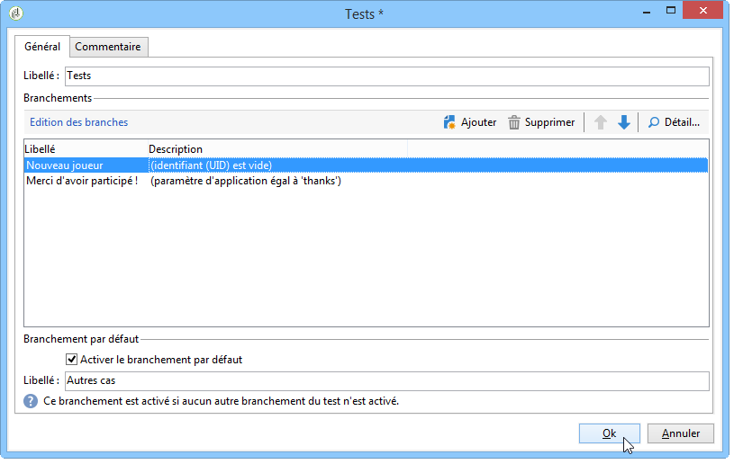

Celle-ci comporte trois branches :

* **[!UICONTROL identifiant (UID) est vide]** : L&#39;identifiant n&#39;est transmis par Facebook que si l&#39;utilisateur a déjà accepté de partager ses informations. La première branche de l&#39;activité **[!UICONTROL Test]** permet de proposer le jeu uniquement si l&#39;utilisateur n&#39;a jamais joué, donc si l&#39;identifiant est vide.
* **[!UICONTROL le paramètre d&#39;application est égal à « Merci »]** : pour éviter une erreur d’affichage liée à Facebook, la page de fin de l’application Web pointe vers l’URL de l’application Facebook à laquelle le paramètre **[!UICONTROL app_data]** est ajouté là l’aide de la valeur **[!UICONTROL thanks]** (voir à ce sujet la section : [Activité de fin](#end-activity)). La seconde branche vous permet de savoir si l’utilisateur provient de l’activité **[!UICONTROL Fin]** de la première branche (et vient d’entrer dans le concours) pour afficher un message de remerciement. Pour plus d’informations sur l’utilisation de paramètres d’URL supplémentaires, voir : [Comment transférer des paramètres à une application Facebook ?](#how-to-forward-settings-to-a-facebook-application-).
* **[!UICONTROL Branchement par défaut]** : si l&#39;utilisateur a déjà joué (identifiant renseigné) et qu&#39;il ne vient pas de participer au jeu (paramètre d&#39;application différent de **[!UICONTROL thanks]**), nous lui affichons une page lui indiquant qu&#39;il a déjà participé.

### Page du jeu {#competition-page}

Pour contourner l&#39;erreur d&#39;affichage liée à Facebook, vous devez également sélectionner **[!UICONTROL Fenêtre parente]** ou **[!UICONTROL Dans la fenêtre la plus en avant]** dans le champ **[!UICONTROL Fenêtre]** de la page proposant de participer au concours.

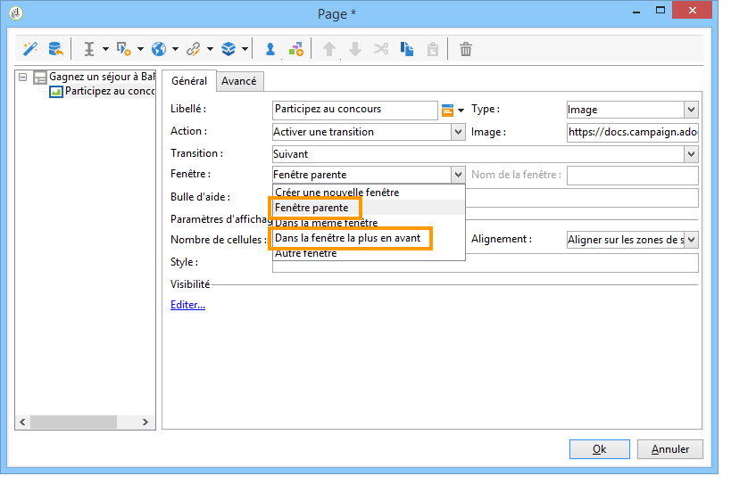

### Activité Contrôle d&#39;accès {#access-control-activity}

L’activité **[!UICONTROL Contrôle d’accès]** permet d&#39;afficher l&#39;écran de demande de permission Facebook lorsque l&#39;utilisateur choisit de participer au jeu. S&#39;il décide de partager ses informations, celles-ci seront récupérées lors du pré-chargement. Voir à ce sujet la section : [Activité Pré-chargement](#pre-loading-activity).

Si vous avez précédemment saisi le compte externe lors de la création de l’application web (voir [Créer une application web de type Facebook](../../social/using/creating-a-facebook-application.md#creating-a-facebook-type-web-application)), vous n’avez pas besoin de modifier l’activité. Dans le cas contraire, accédez au champ **[!UICONTROL Application]** et sélectionnez le compte externe lié à l’application Facebook.

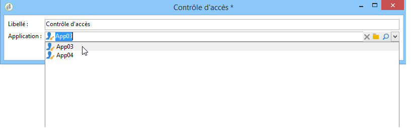

### Activité Pré-chargement {#pre-loading-activity}

Sélectionnez la source des données à utiliser pour le préchargement :

* **[!UICONTROL Base marketing]** : cette option permet d&#39;effectuer le préchargement des données depuis la base Adobe Campaign.
* **[!UICONTROL Facebook]** : cette option permet d&#39;effectuer le préchargement à partir des données Facebook.

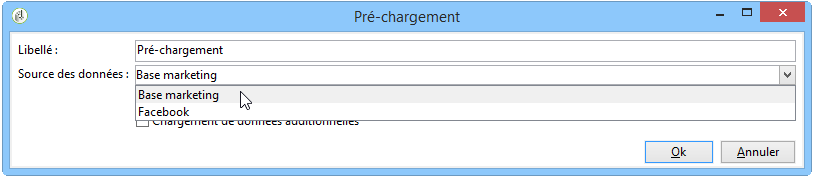

**Base marketing**

Cette option permet de récupérer les données d&#39;un profil existant dans la table des visiteurs. La vérification est faite à partir de l&#39;identifiant externe Facebook récupéré lorsque l&#39;utilisateur clique sur l&#39;onglet de l&#39;application Facebook. Si vous ajoutez un formulaire à la suite de l&#39;activité **[!UICONTROL Pré-chargement]**, les champs contenant des informations existantes en base seront pré-remplis.

>[!NOTE]
>
>Reportez-vous à [cette section](../../web/using/publishing-a-web-form.md#pre-loading-the-form-data) pour plus d’informations sur le préchargement des données depuis la base de données Adobe Campaign.

**Facebook**

Cette option permet de définir les informations de profil Facebook à récupérer, parmi celles que l&#39;utilisateur a accepté de partager, dans le but de les enregistrer.

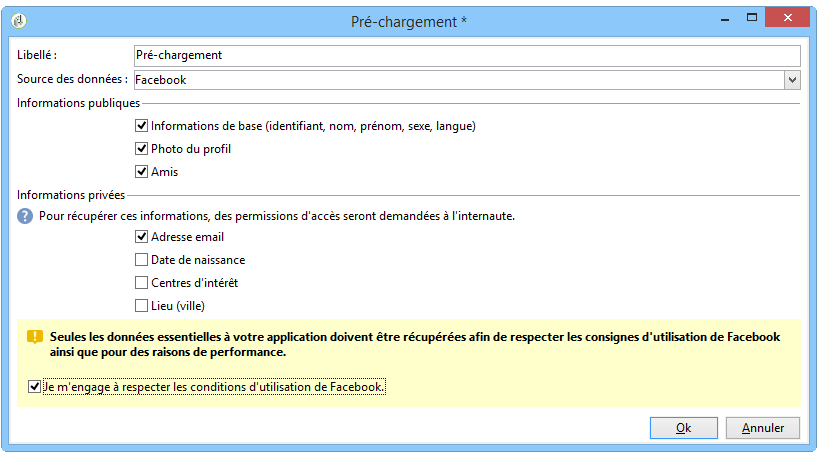

L&#39;option **[!UICONTROL Informations de base]** permet de récupérer les données suivantes :

* **[!UICONTROL Id externe]** : identifiant de l&#39;utilisateur
* **[!UICONTROL Sexe]** : genre de l&#39;utilisateur
* **[!UICONTROL Vérifié]** : ce champ indique si l&#39;utilisateur possède un compte Facebook vérifié
* **[!UICONTROL Nom complet]** : nom complet de l&#39;utilisateur
* **[!UICONTROL Prénom]** : prénom de l&#39;utilisateur
* **[!UICONTROL Nom]** : nom de l&#39;utilisateur
* **[!UICONTROL Langue]** : langue de l&#39;utilisateur

Vous pouvez également choisir de récupérer la photo de profil, la liste des amis, l&#39;adresse email, la date de naissance, les centres d&#39;intérêt et le lieu en cochant les cases correspondantes.

Avant de cliquer sur **[!UICONTROL Ok]**, vous devez cocher la case : **[!UICONTROL Je m&#39;engage à respecter les conditions d&#39;utilisation de Facebook.]**

>[!NOTE]
>
>Si vous cochez une ou plusieurs cases de la section **[!UICONTROL Informations privées]**, l&#39;écran de demande de permissions Facebook affichera automatiquement la demande d&#39;accès à ces données.
>
>Pour récupérer les informations sélectionnées, l&#39;utilisateur doit avoir accepté de les partager.
>
>Si vous souhaitez effectuer les deux types de préchargement (depuis Adobe Campaign et Facebook), vous devez insérer deux boîtes de préchargement l&#39;une à la suite de l&#39;autre.

### Activité Enregistrement {#save-activity}

L&#39;activité **[!UICONTROL Enregistrement]** permet de stocker, dans la table des visiteurs, les informations récupérées lors des étapes précédentes.

Si le profil existe déjà dans la table des visiteurs, ses données sont mises à jour avec les nouvelles données récupérées.

Si le profil n&#39;existe pas en base et que l&#39;adresse email de l&#39;utilisateur Facebook a été récupérée, un visiteur est créé dans la table des visiteurs.

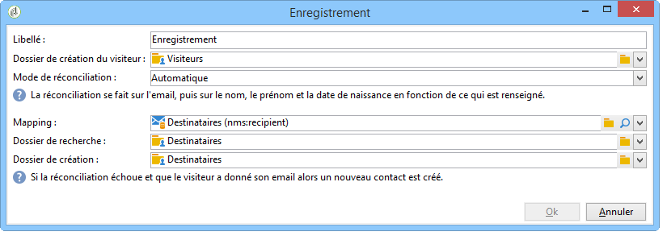

1. Dans le champ **[!UICONTROL Dossier de création du visiteur]**, sélectionnez le dossier dans lequel le profil sera créé. Dans le cas d&#39;une application web de type Facebook, le dossier de création par défaut est **[!UICONTROL Visiteurs]**.
1. Dans le champ **[!UICONTROL Mode de réconciliation]**, sélectionnez la méthode de réconciliation que vous souhaitez utiliser :

   * **[!UICONTROL Automatique]** : La réconciliation se fait sur l&#39;email, puis sur le nom, le prénom et la date de naissance.
   * **[!UICONTROL Manuelle]** : Vous devez sélectionner une ou plusieurs clés de réconciliation.
   * **[!UICONTROL Aucune]** : Aucune réconciliation n&#39;est effectuée.

1. Dans le champ **[!UICONTROL Mapping]**, sélectionnez le schéma sur lequel vous souhaitez effectuer la réconciliation.

   >[!IMPORTANT]
   >
   >Assurez-vous que les champs de l&#39;onglet **[!UICONTROL Réseaux sociaux]** du mapping de diffusion sont correctement renseignés. Les mappings de diffusions sont accessibles à partir du noeud **[!UICONTROL Administration > Gestion de campagne > Mappings de ciblage]**.

1. Vous pouvez sélectionner un dossier de recherche pour la réconciliation et un dossier de création pour les nouveaux profils. Si ces champs sont vides, les profils sont recherchés et créés dans le dossier par défaut correspondant au schéma du mapping.

### Activité de fin {#end-activity}

Pour contourner l&#39;erreur d&#39;affichage liée à Facebook, vous devez cocher la case **[!UICONTROL Utiliser une URL externe]** et saisir l&#39;URL de l&#39;application Facebook, suivie du paramètre **[!UICONTROL app_data]** et d&#39;une valeur. Cette valeur sera utilisée dans la l&#39;activité **[!UICONTROL Test]** pour permettre de détecter si l&#39;utilisateur vient de terminer le jeu et lui afficher une page de remerciements. Voir à ce sujet la section : [Activité Test](#test-activity).

Dans notre exemple, la valeur utilisée est **thanks**.

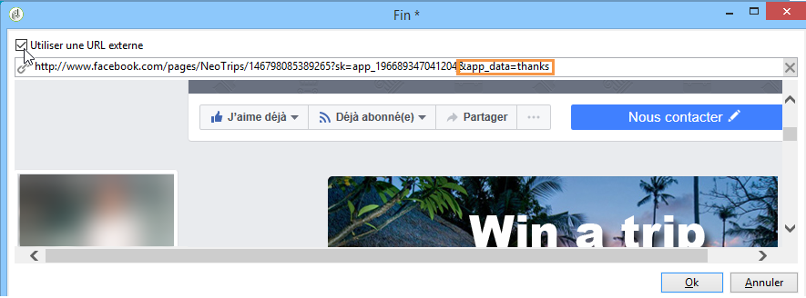

### Ecran de détails d&#39;un visiteur {#details-screen-of-a-visitor}

Comme pour les abonnés Twitter (voir : [Principe de fonctionnement](../../social/using/publishing-on-twitter.md#operating-principle)), les profils Facebook récupérés sont stockés dans la table des visiteurs. Pour afficher la liste des visiteurs, accédez au nœud **[!UICONTROL Profils et cibles > Visiteurs]**.

Chaque prospect Facebook qui accepte de partager ses informations de profil est ajouté à la liste des visiteurs. Si la case **[!UICONTROL Amis]** est cochée dans l’activité **[!UICONTROL Pré-chargement]** (voir : [Activité Pré-chargement](#pre-loading-activity)), des amis sont également ajoutés.

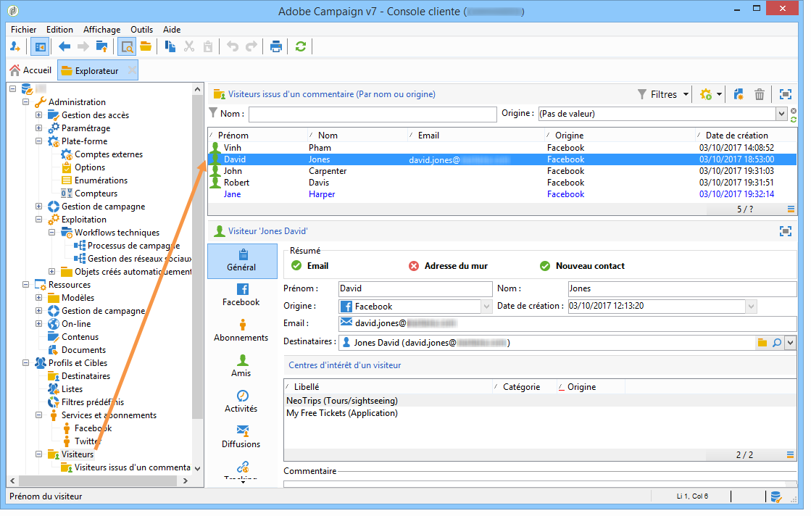

Dans la section **[!UICONTROL Résumé]** de l&#39;écran de détails d&#39;un visiteur, l&#39;indicateur **[!UICONTROL Nouveau Contact]** peut avoir deux états :

Si une coche verte est affichée, cela signifie que le visiteur n&#39;a été réconcilié avec aucun destinataire. Dans ce cas, un nouveau profil est créé dans la liste des destinataires.

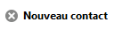

Une croix rouge indique que le visiteur a été réconcilié avec un destinataire. Vous pouvez cliquer sur la loupe située à droite du champ **[!UICONTROL Destinataire]** pour afficher le destinataire correspondant.

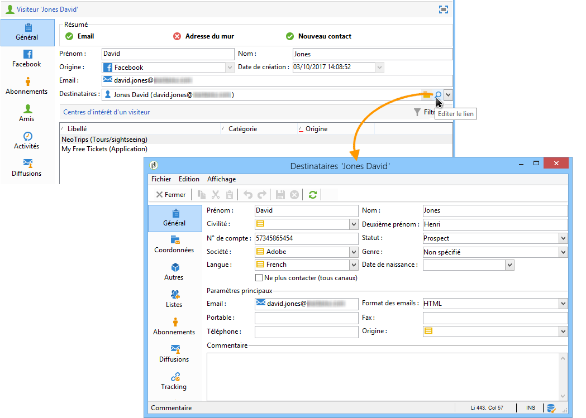

A partir de l&#39;écran de détails d&#39;un destinataire, vous pouvez également afficher le visiteur correspondant, le cas échéant. Sélectionnez l&#39;onglet **[!UICONTROL Autres]**, puis double-cliquez sur le nom du visiteur dans la section **[!UICONTROL Identités web]**.

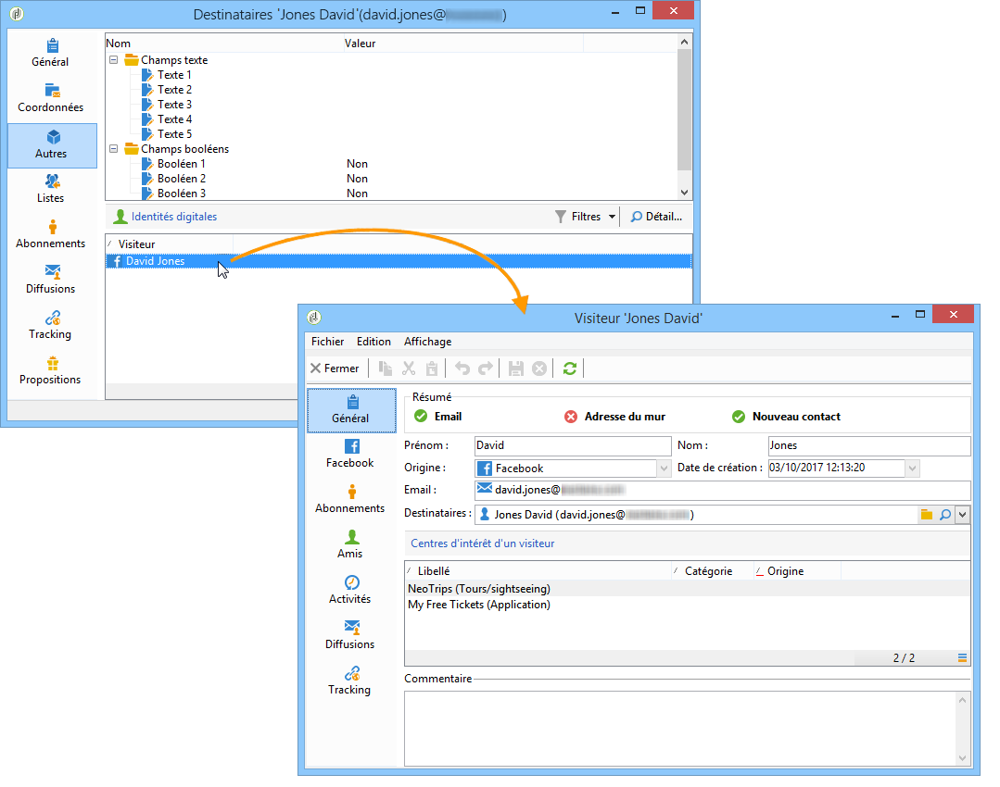

L&#39;onglet **[!UICONTROL Activités]** de l&#39;écran de détails d&#39;un visiteur regroupe les informations suivantes :

* activités de type &quot;Open Graph&quot; du fan : musique écoutée, vidéos visionnées, articles lus et déduction des applications installées (Deezer, Spotify, Dailymotion, Yahoo News, etc.)

   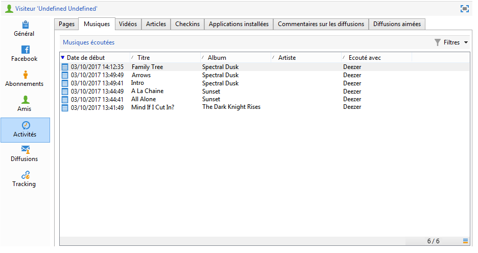

* les mentions &quot;J&#39;aime&quot; et les commentaires que le fan a ajouté suite à des diffusions envoyées par Adobe Campaign
* les pages aimées par le fan
* les check-ins effectués par le fan

   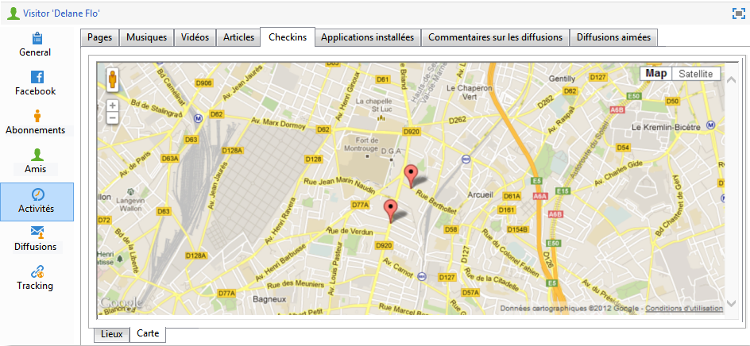

   >[!NOTE]
   >
   >Pour qu&#39;Adobe Campaign récupère les check-ins effectués par le fan, vous devez cliquer sur le bouton **[!UICONTROL S’abonner]** dans l&#39;écran de configuration du service. Voir à ce sujet la section [Paramétrer les comptes externes](../../social/using/creating-a-facebook-application.md#configuring-external-accounts).

## Comment précharger un formulaire à l&#39;aide des données de profil Facebook {#how-to-pre-load-the-fields-of-a-form-using-facebook-profile-data}

L’application **[!UICONTROL Social Marketing]** vous donne également la possibilité d’insérer, dans un formulaire, un bouton permettant de pré-remplir les champs grâce aux informations de profil Facebook. Cette option, disponible dans tous les modèles d’application web (activités de type **[!UICONTROL Page]**), est présentée dans [cette section](../../web/using/static-elements-in-a-web-form.md#inserting-html-content).

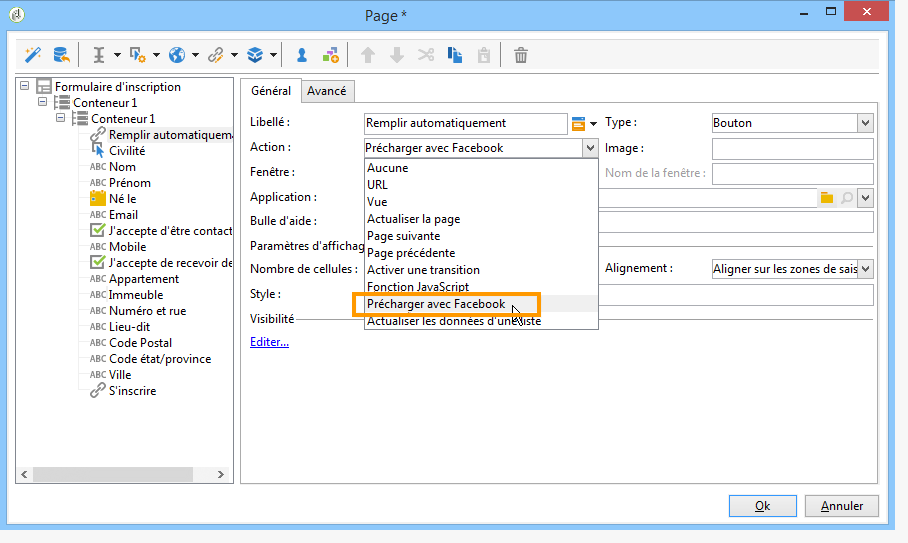

>[!NOTE]
>
>Avant d&#39;utiliser cette fonction, vous devez créer une application Facebook, ainsi qu&#39;un compte externe de type **[!UICONTROL Facebook Connect]**. Voir à ce sujet la section [Paramétrer les comptes externes](../../social/using/creating-a-facebook-application.md#configuring-external-accounts).

**Pré-remplir les champs du formulaire avec les données de profil Facebook**

Vous créez un formulaire web et incluez des éléments avec lesquels l&#39;utilisateur n&#39;a aucune interaction dans les pages du formulaire ; il s&#39;agit d&#39;éléments statiques tels que des images, du contenu HTML, une barre horizontale ou un lien hypertexte. Pour en savoir plus sur les éléments statiques dans un formulaire web, consultez [cette page](../../web/using/static-elements-in-a-web-form.md).

Lorsque vous insérez un élément statique, l&#39;option **[!UICONTROL Précharger avec Facebook]** permet d&#39;insérer, dans un formulaire, un bouton permettant de pré-remplir les champs grâce aux informations de profil Facebook.

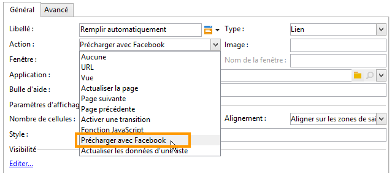

Lorsque l&#39;utilisateur clique sur le bouton **[!UICONTROL Remplir automatiquement]**, l&#39;écran de demande de connexion Facebook apparaît.

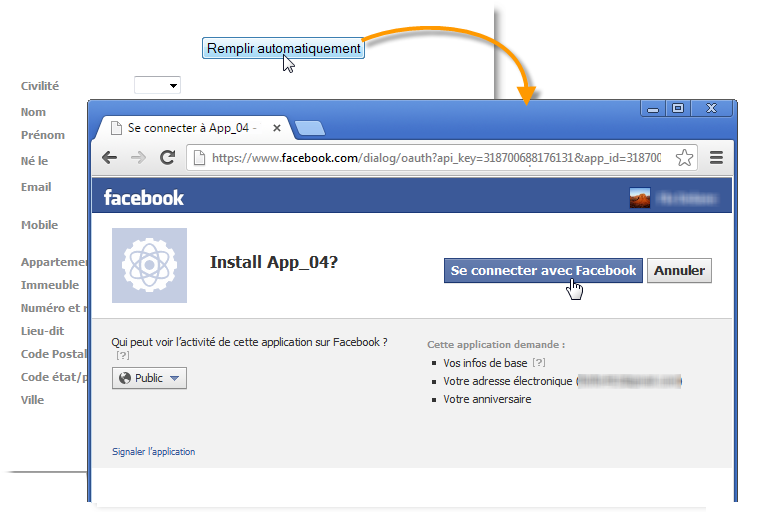

>[!NOTE]
>
>Vous pouvez modifier la liste des droits étendus lors de la configuration du compte externe. Si aucun droit étendu n&#39;est configuré, Facebook transmet les informations de profil de base par défaut.\
>Pour consulter la liste des droits étendus et leur syntaxe, [reportez-vous à la documentation Facebook](https://developers.facebook.com/docs/reference/api/permissions).

Si l&#39;utilisateur autorise le partage de ses informations, les champs du formulaire sont alors pré-remplis.

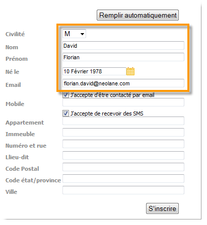

Pour réaliser ce cas d&#39;utilisation, nous avons créé une application web composée des éléments suivants :

* une page contenant le formulaire
* une activité **[!UICONTROL Enregistrement]**
* une activité **[!UICONTROL Fin]**

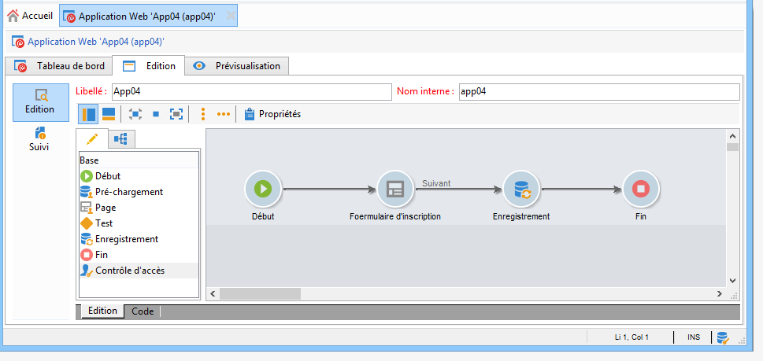

Les étapes d&#39;ajout du bouton de pré-remplissage sont les suivantes :

1. Créez votre formulaire.

   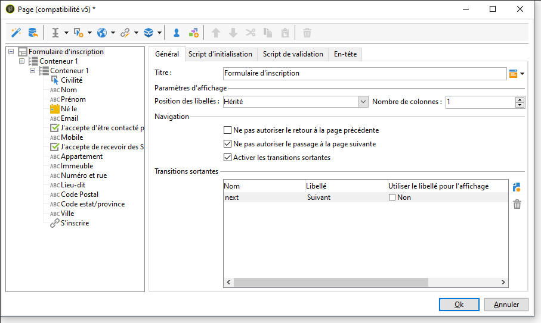

1. Positionnez-vous au même niveau que les champs du formulaire et ajoutez un lien.

   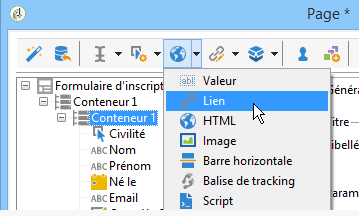

1. Renseignez le libellé et sélectionnez le type **[!UICONTROL Bouton]**.

   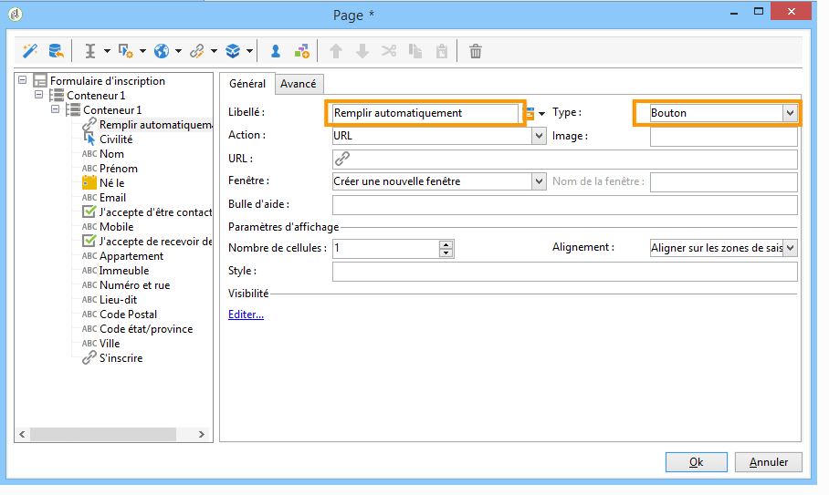

1. Dans le champ **[!UICONTROL Action]**, sélectionnez **[!UICONTROL Précharger avec Facebook]**.

   

1. Dans le champ **[!UICONTROL Application]**, sélectionnez le compte externe de type **[!UICONTROL Facebook Connect]** créé précédemment. Voir à ce sujet [cette page](../../social/using/creating-a-facebook-application.md#configuring-external-accounts).

   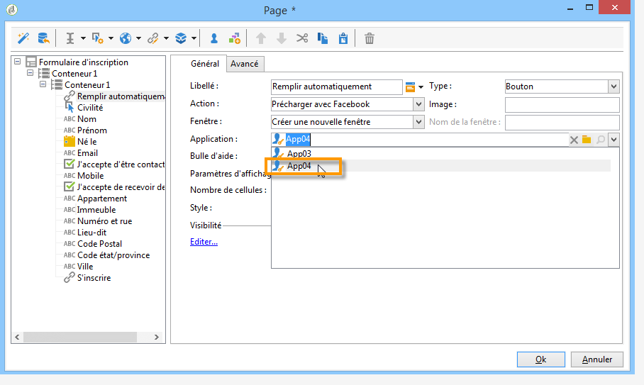

