# Publication sur les murs Facebook{#publishing-on-facebook-walls}

Pour qu&#39;Adobe Campaign puisse envoyer des publications sur les murs de vos pages Facebook, vous devez déléguer, à Adobe Campaign, les droits d&#39;écriture sur ces pages. Les étapes de paramétrage sont les suivantes :

1. Créez un compte Facebook et une ou plusieurs pages.
1. Créez une page Facebook de test dédiée à l&#39;envoi de BAT.
1. Créez une application Facebook.
1. Enter the Facebook application settings into Adobe Campaign, in the **[!UICONTROL Facebook routing]** external account.

## Prérequis {#prerequisites}

Vous devez tout d&#39;abord créer un compte Facebook ainsi qu&#39;une ou plusieurs pages, sur lesquelles vous enverrez vos publications.

* Pour créer un compte Facebook, suivez le lien : [https://www.facebook.com](https://www.facebook.com)
* Pour créer une page Facebook, suivez le lien : [https://www.facebook.com/pages/create.php](https://www.facebook.com/pages/create.php)

   Il est conseillé d&#39;utiliser le même compte Facebook pour administrer toutes vos pages. Cela permettra de ne créer qu&#39;une seule application Facebook et de ne configurer qu&#39;un seul compte externe pour écrire sur n&#39;importe laquelle des pages du compte Facebook.

   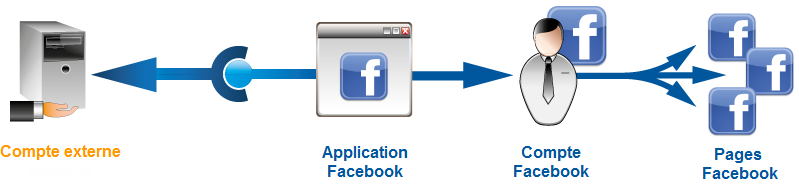

## Créer une page Facebook de test {#creating-a-test-facebook-page}

We recommend creating a private Facebook page for delivering publication proofs (for more on this, refer to [Sending the proof](../../social/using/publishing-on-facebook.md#sending-the-proof).

1. Connectez-vous au compte Facebook à partir duquel vous administrez vos pages.
1. Créez une nouvelle page Facebook.
1. Click the **[!UICONTROL Settings]** button in the top right-hand corner.
1. In the **[!UICONTROL General]** tab, modify the page&#39;s visibility parameters: check the **[!UICONTROL Page unpublished]** box.
1. Cliquez sur le **[!UICONTROL Save Changes]** bouton.

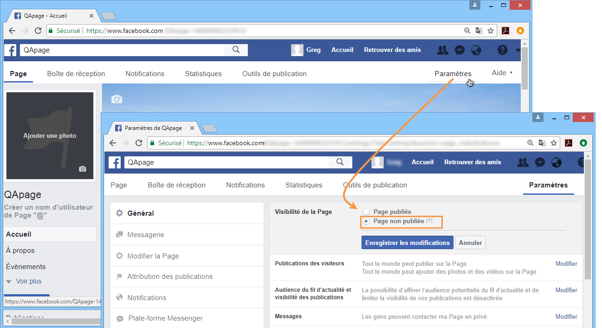

## Créer une application Facebook {#creating-a-facebook-application}

Pour qu&#39;Adobe Campaign puisse publier sur les murs de vos pages, vous devez créer une application Facebook. Les étapes sont les suivantes :

1. Connectez-vous au compte Facebook à partir duquel vous administrez vos pages.
1. Dans la barre d&#39;adresse de votre navigateur Internet, saisissez l&#39;adresse [https://developers.facebook.com/apps](https://developers.facebook.com/apps).

   >[!IMPORTANT]
   >
   >En fonction du type de compte, une ou plusieurs autorisations peuvent vous être demandées.
   >
   >Pour créer une application Facebook, vous devez disposer d&#39;un compte Facebook **vérifié**.

1. Cliquez sur le **[!UICONTROL Add a New App]** bouton dans le coin supérieur droit de la page. Entrez un nom d’application et un courriel de contact, puis transmettez la vérification de sécurité.

   

1. Sous **[!UICONTROL Settings > Basic]**, cliquez sur **[!UICONTROL Add a platform]** et sélectionnez le **[!UICONTROL Facebook Web Games]** type.

   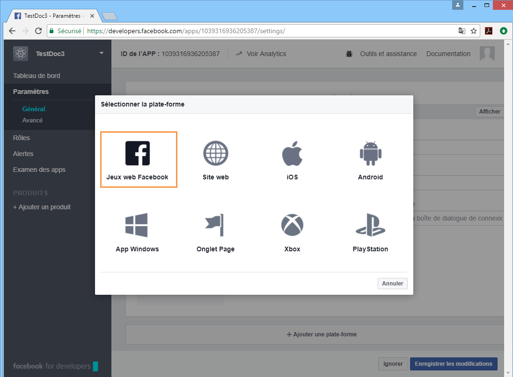

1. Dans la **[!UICONTROL Products]** section, dans le menu de gauche, vérifiez que vous voyez le **[!UICONTROL Facebook Login]** produit. Dans le cas contraire, ajoutez un nouveau produit et sélectionnez **[!UICONTROL Facebook Login]**.

   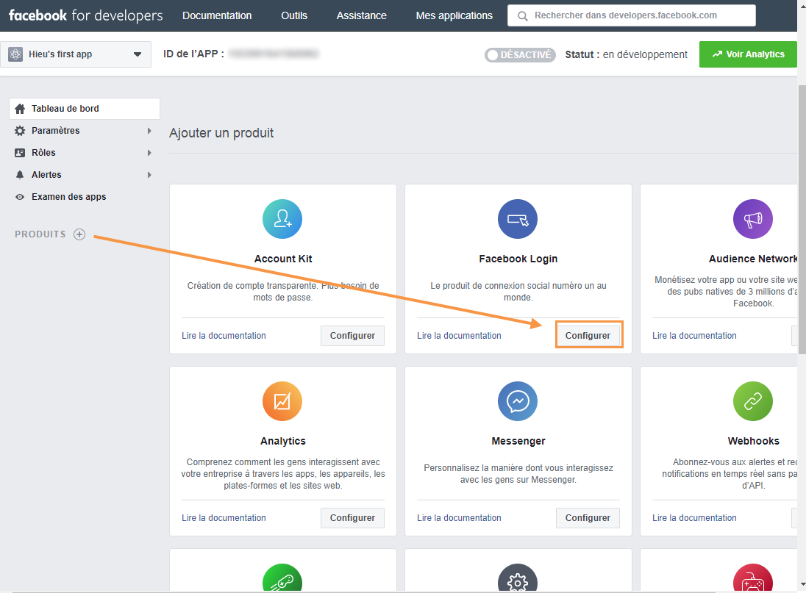

1. Once the application is created, select the **[!UICONTROL App Review]** tab and publish the application.

   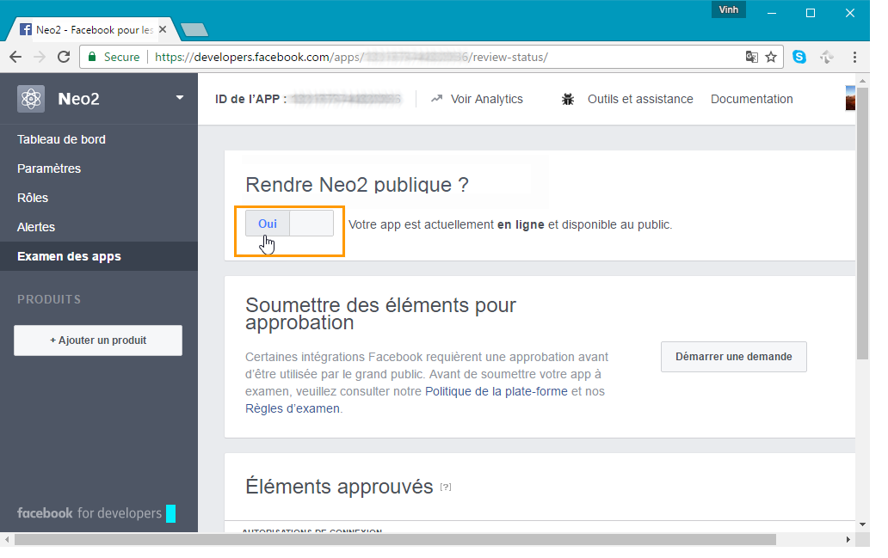

## Déléguer les droits d&#39;écriture à Adobe Campaign {#delegating-write-access-to-adobe-campaign}

Afin de déléguer à Adobe Campaign les droits d&#39;écriture sur les murs de vos pages, vous devez renseigner, dans Adobe Campaign, les paramètres de l&#39;application Facebook créée précédemment.

Cette étape requiert l&#39;accès simultané à votre console Adobe Campaign ainsi qu&#39;à un navigateur Internet connecté au compte Facebook administrateur de vos pages :

>[!IMPORTANT]
>
>L&#39;opérateur Adobe Campaign doit disposer des droits administrateur pour effectuer ce paramétrage.

* **Facebook**: sélectionnez l’application précédemment créée ( [https://developers.facebook.com/apps](https://developers.facebook.com/apps)), puis sélectionnez l’ **[!UICONTROL Settings > Basic]** onglet.

   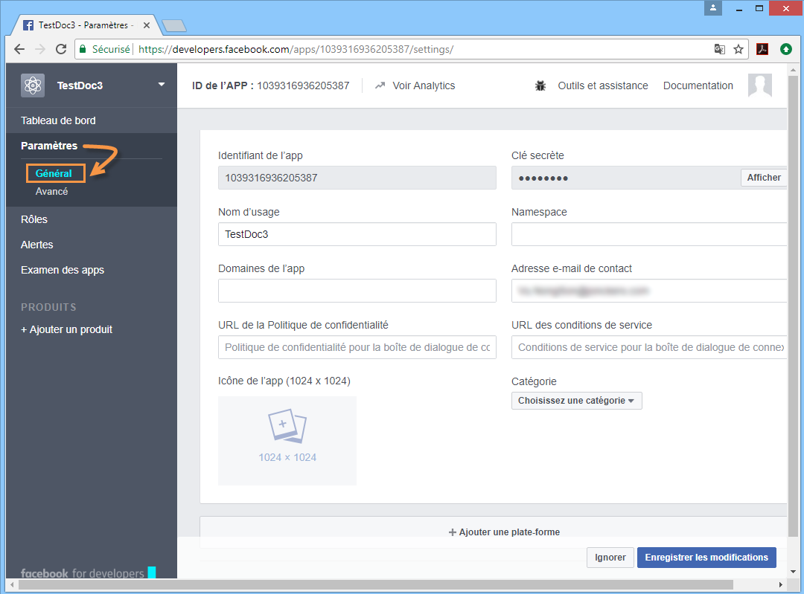

   >[!NOTE]
   >
   >Si la **[!UICONTROL Facebook Web Games]** section n’apparaît pas, cliquez sur le **[!UICONTROL Add Platform]** bouton, au bas de la page, puis sélectionnez **[!UICONTROL Facebook Web Games]**.

* **Adobe Campaign**: accédez au **[!UICONTROL Administration > Platform > External Accounts]** noeud de l’arborescence, sélectionnez le compte **[!UICONTROL Facebook routing]** externe et cliquez sur l’ **[!UICONTROL Connector]** onglet.

   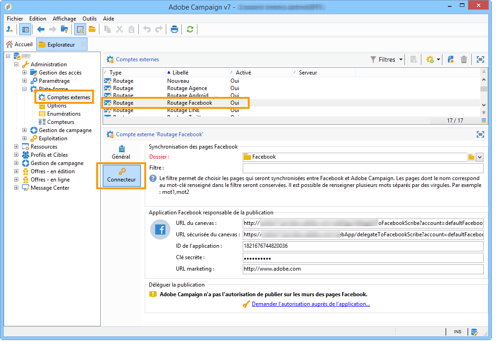

1. Dans la console Adobe Campaign, copiez l’adresse contenue dans le **[!UICONTROL Secure Canvas URL]** champ et collez-la dans le **[!UICONTROL Secure Web Games URL (https)]** champ sur Facebook (dans la **[!UICONTROL Facebook Web Games]** section).

   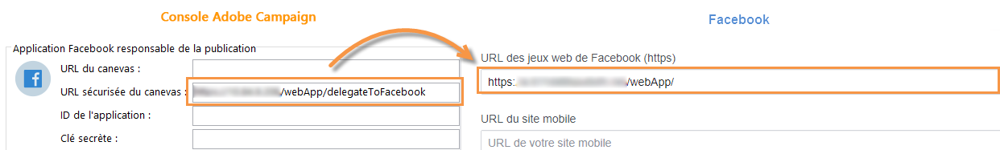

   >[!IMPORTANT]
   >
   >N&#39;utilisez en aucun cas l&#39;URL non sécurisée.

   Copiez et collez cette URL également sous **[!UICONTROL Products]** > **[!UICONTROL Facebook Login]** > **[!UICONTROL Settings]** > **[!UICONTROL Valid OAuth Redirect URIs]**. Pour vérifier la validité de l’URL, enregistrez l’application, copiez et collez l’URL dans le **[!UICONTROL Redirect URI to Check]** champ et cliquez sur **[!UICONTROL Check URI]**.

   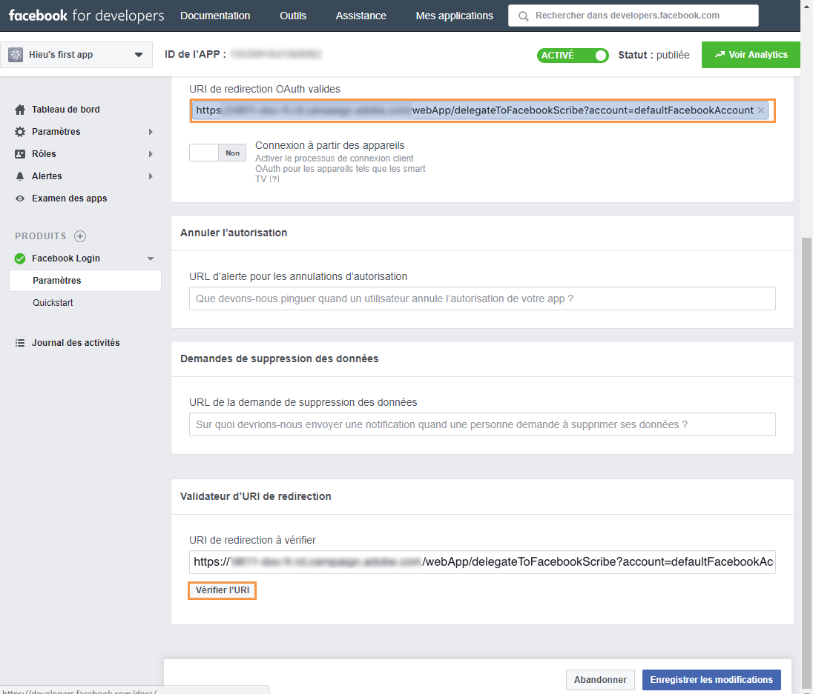

1. On Facebook, copy the content of the **[!UICONTROL App ID]** and **[!UICONTROL App Secret]** fields and paste it into the matching fields of the console.

   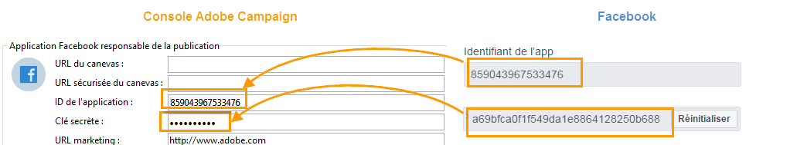

1. On Facebook, click the **[!UICONTROL Save Changes]** button at the bottom of the page.
1. Dans la console Adobe Campaign, enregistrez le compte externe.

   >[!NOTE]
   >
   >Le **[!UICONTROL Marketing URL]** champ est facultatif.

1. Dans la console Adobe Campaign, cliquez sur le **[!UICONTROL Request the authorization from the application]** lien au bas de l’ **[!UICONTROL Connector]** onglet. Le **[!UICONTROL Synchronize Facebook pages]** processus est déclenché automatiquement et collecte toutes les pages Facebook gérées par l’administrateur. Pour plus d’informations, reportez-vous à la section [Synchronisation des pages](#synchronizing-facebook-pages)Facebook.

   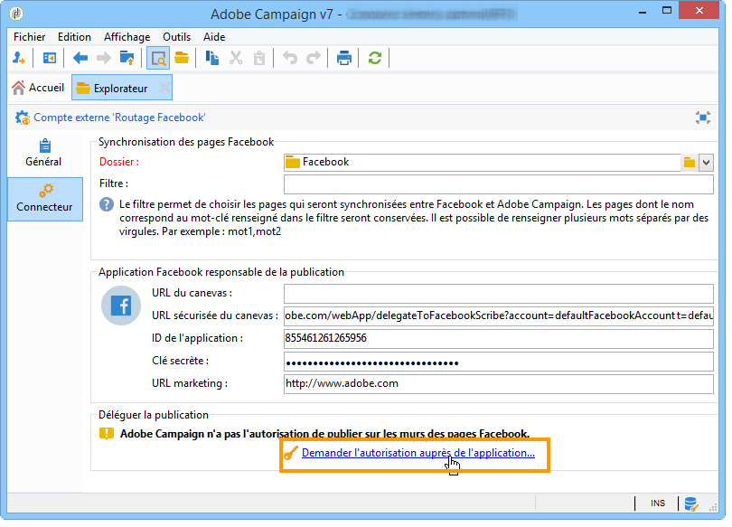

   >[!NOTE]
   >
   >Par défaut, les pages sont ajoutées au dossier du **[!UICONTROL Facebook]** service, disponible via le **[!UICONTROL Profiles and Targets > Services and Subscriptions]** noeud. Le **[!UICONTROL Folder]** champ de l’ **[!UICONTROL Connector]** onglet permet de modifier le dossier de service dans lequel les pages Facebook sont créées après la synchronisation. Vous pouvez également sélectionner les pages Facebook à synchroniser dans Adobe Campaign grâce au **[!UICONTROL Filter]** champ. Si vous laissez ce champ vide, toutes les pages Facebook gérées par l’administrateur seront synchronisées.

1. Une boite de dialogue apparaît, avec les différents paramètres de demande de permission Facebook. Ces paramètres permettront à Adobe Campaign d&#39;envoyer des publications sur les murs des pages du compte Facebook.

   Acceptez les différentes demandes de permissions.

   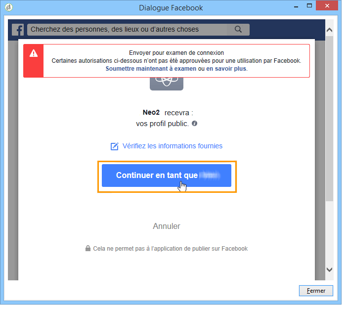

1. La délégation des droits d&#39;écriture d&#39;Adobe Campaign sur les murs des pages du compte Facebook est terminée.

   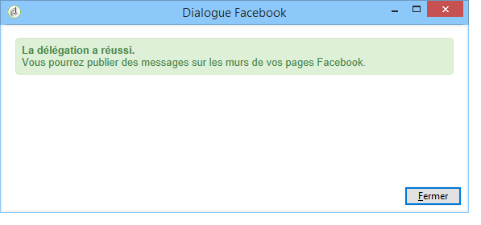

>[!NOTE]
>
>Si le compte Facebook administre plusieurs pages, configurez simplement un compte externe pour qu’il inscrive sur une page du compte Facebook. Pour chaque nouveau compte Facebook, vous devez créer un nouveau **[!UICONTROL Routing]** type de compte externe.

Le **[!UICONTROL Synchronization of Facebook pages]** processus synchronise toutes les pages gérées par le compte Facebook, afin que vous puissiez publier sur leur mur directement via Adobe Campaign. Pour plus d’informations, reportez-vous à la section [Synchronisation des pages](#synchronizing-facebook-pages)Facebook.

## Synchronisation des pages Facebook {#synchronizing-facebook-pages}

Le **[!UICONTROL Synchronization of Facebook pages]** processus, accessible via le **[!UICONTROL Administration > Production > Technical workflows > Managing social networks]** noeud, vous permet de synchroniser (dans Adobe Campaign) les pages du compte Facebook précédemment configuré. Par défaut, ce processus est configuré pour s’exécuter une fois par jour ou chaque fois qu’un administrateur clique sur le **[!UICONTROL Request an authorization from the application]** lien dans l’écran de configuration du service (voir [Délégation de l’accès en écriture à Adobe Campaign](#delegating-write-access-to-adobe-campaign)).

Une fois la synchronisation terminée, les pages collectées apparaissent dans le dossier de service saisi dans le compte externe (voir [Délégation de l’accès en écriture à Adobe Campaign](#delegating-write-access-to-adobe-campaign)). Par défaut, les pages sont ajoutées à la racine du dossier du **[!UICONTROL Facebook]** service, qui est disponible via le **[!UICONTROL Profiles and Targets > Services and subscriptions]** menu.

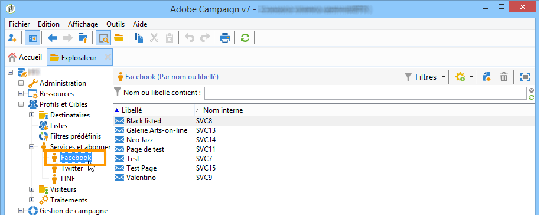

Vous pouvez désormais publier sur les murs de vos pages Facebook directement via Adobe Campaign. Pour plus d’informations, reportez-vous à la page [Publication sur Facebook](#publishing-on-facebook-walls).
