# Publication sur Facebook{#publishing-on-facebook}

Une fois le paramétrage effectué, Social Marketing permet d&#39;envoyer des publications sur les murs de vos pages Facebook.

## Limites {#limitations}

Les limitations suivantes sont des contraintes inhérentes à Facebook.

* La longueur du message ne peut pas dépasser 1000 caractères.
* Le format HTML n&#39;est pas supporté.

## Création de la diffusion {#creating-the-delivery}

Créez une diffusion basée sur le modèle de diffusion **[!UICONTROL Publier sur une page de marque]**.

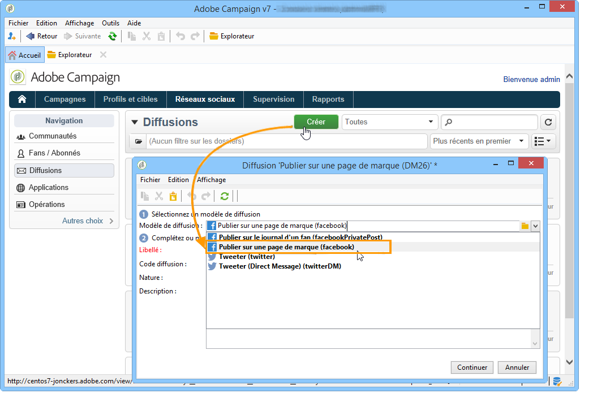

## Sélection de la cible principale {#selecting-the-main-target}

Vous devez sélectionner la ou les pages sur lesquelles vous souhaitez envoyer votre publication.

1. Cliquez sur le lien **[!UICONTROL Pour]**.

   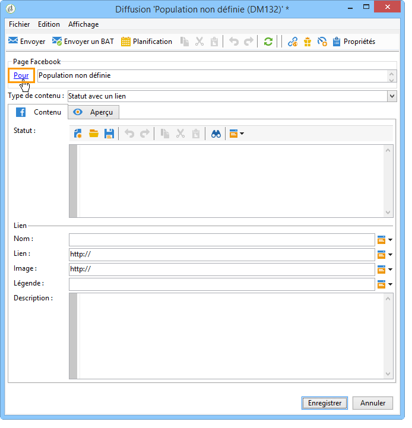

1. Cliquez sur le bouton **[!UICONTROL Ajouter]**.

   

1. Sélectionnez **[!UICONTROL Une page Facebook]**.

   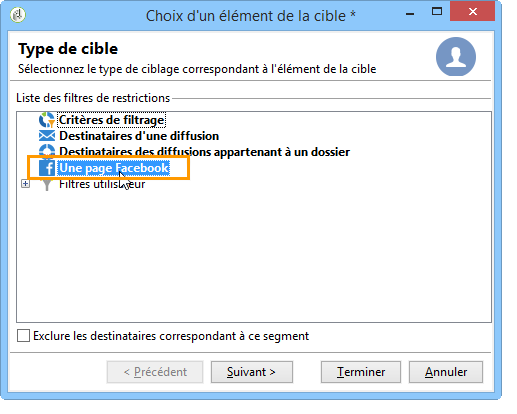

1. Dans le champ **[!UICONTROL Dossier]**, sélectionnez le dossier de services contenant la page Facebook. Par défaut, les pages sont stockées à la racine du dossier de services **[!UICONTROL Facebook]**. Sélectionnez ensuite la page Facebook sur laquelle vous souhaitez envoyer votre publication.

   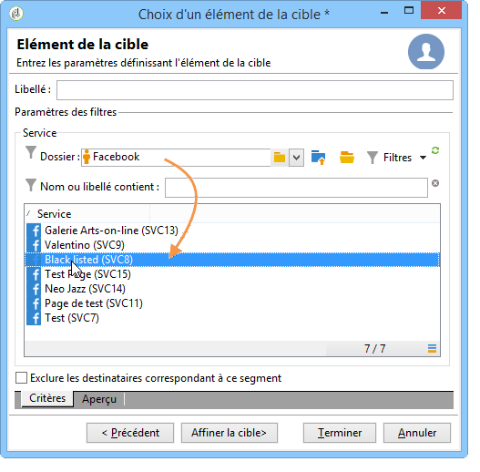

## Sélection de la cible du BAT {#selecting-the-proof-target}

L’onglet **[!UICONTROL Cible des BAT]** permet de définir la page Facebook que vous souhaitez utiliser pour tester les diffusions avant de les envoyer. Nous vous recommandons de créer une page Facebook privée dédiée à cet effet. Pour plus d’informations sur la création d’une page Facebook privée, reportez-vous à [cette page](../../social/using/publishing-on-facebook-walls.md#creating-a-test-facebook-page). Pour sélectionner la cible du BAT, appliquez les mêmes étapes que pour la cible principale. [En savoir plus](#selecting-the-main-target)

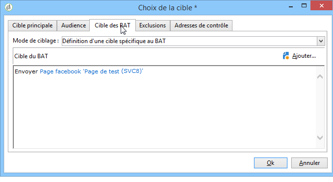

>[!NOTE]
>
>Si vous utilisez la même page de test Facebook pour toutes vos diffusions, vous pouvez enregistrer la cible du BAT dans le modèle de diffusion **[!UICONTROL Publier sur une page de marque]**, accessible à partir du nœud **[!UICONTROL Ressources > Modèles > Modèles de diffusion]**. La cible du BAT sera alors renseignée par défaut pour chaque nouvelle diffusion.

## Définition de l’audience {#defining-the-audience}

Si vous souhaitez utiliser des segments locaux afin d&#39;affiner le type de public qui sera autorisé à visualiser la publication, nous vous conseillons de créer une page Facebook par segment (par exemple : Adobe Campaign Paris, Adobe Campaign London, etc.).

Il est cependant aussi possible d&#39;utiliser les filtres d&#39;audience utilisés par Facebook. L&#39;onglet **[!UICONTROL Audience]** de la fenêtre **[!UICONTROL Choix de la cible]** vous propose quatre filtres :

* **[!UICONTROL Country]**
* **[!UICONTROL Régions]**
* **[!UICONTROL Villes]**
* **[!UICONTROL Langues]**

>[!CAUTION]
>
>Utilisez cette fonction avec précaution. Dans les rapports de diffusion, l&#39;indicateur **[!UICONTROL Nombre de fan]** ne prendra pas en compte ces filtres Facebook.
>
>Facebook peut être amené à modifier la liste des filtres d&#39;audience ainsi que leurs valeurs.

## Définition du contenu du message {#defining-message-content}

Sélectionnez le type de publication à l&#39;aide du menu déroulant **[!UICONTROL Type de contenu]**.

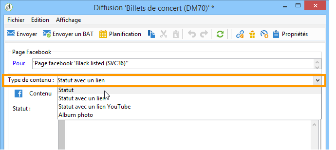

Les types de diffusion suivants sont proposés :

* un **[!UICONTROL Statut]**
* un **[!UICONTROL Statut avec un lien]**
* un **[!UICONTROL Statut avec un lien YouTube]**
* un **[!UICONTROL Album photo]**

### Publication d’un statut {#publishing-a-status}

Une diffusion de type statut contient uniquement du texte, comme dans l&#39;exemple ci-dessous :

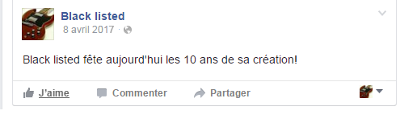

Saisissez le statut de la publication dans la zone de saisie.

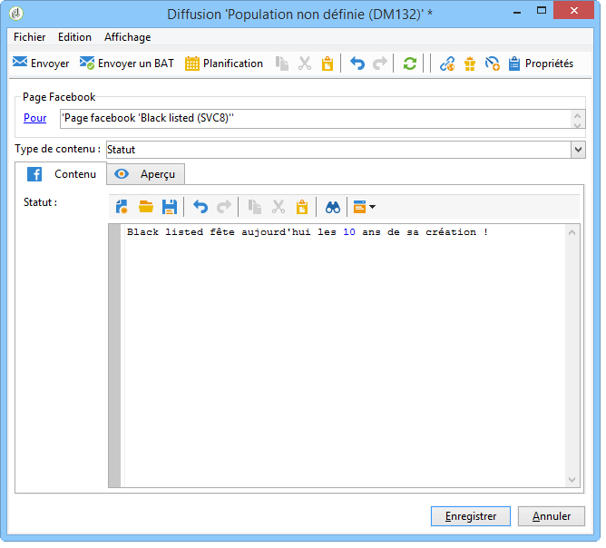

### Publication d’un statut avec un lien {#publishing-a-status-with-a-link}

Une diffusion de type statut avec un lien peut contenir du texte, une image et un lien. Les correspondances entre les champs de l&#39;écran d&#39;édition de la diffusion et la publication finale sur Facebook sont présentées ci-dessous :

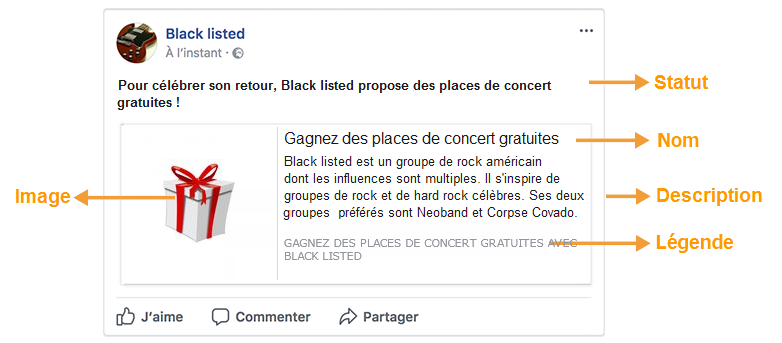

Renseignez les différents champs proposés :

>[!CAUTION]
>
>Toutes les URL doivent commencer par **&quot;http://&quot;** ou **&quot;https://&quot;**.

1. Dans le champ **[!UICONTROL Statut]**, saisissez le texte qui sera affiché sous le nom de la page.
1. Dans le champ **[!UICONTROL Nom]**, saisissez le titre de la publication.
1. Dans le champ **[!UICONTROL Lien]**, saisissez l&#39;URL vers laquelle pointe la publication.

   >[!NOTE]
   >
   >Si vous souhaitez ajouter, dans le champ **[!UICONTROL Lien]**, l&#39;url d&#39;une application Facebook afin de la promouvoir, nous vous recommandons de la configurer pour qu&#39;elle s&#39;adapte à un affichage smartphone :
   >
   >1. Sélectionnez l&#39;application Facebook [https://developers.facebook.com/apps](https://developers.facebook.com/apps), puis l&#39;onglet **[!UICONTROL Paramètres > Général]**.
   >1. Renseignez le champ **[!UICONTROL Espace de noms]**.
   >1. Renseignez le champ **[!UICONTROL URL du site mobile]** : lorsqu&#39;un utilisateur cliquera sur le lien de la publication depuis un smartphone, il sera automatiquement redirigé par Facebook sur l&#39;url définie dans ce champ.
   >1. Construisez votre application web de manière à personnaliser l&#39;affichage de l&#39;application Facebook en fonction de l&#39;appareil utilisé (smartphone ou PC).
   >1. Dans le champ **[!UICONTROL Lien]** de la publication depuis la console Adobe Campaign, saisissez l&#39;url du champ **[!UICONTROL Page Canevas]**.

1. Dans le champ **[!UICONTROL Image]**, saisissez l&#39;URL de l&#39;image qui apparaîtra sur le côté gauche de la publication.

   >[!CAUTION]
   >
   >L&#39;image doit être hébergée sur un site Internet public pour que Facebook puisse la télécharger.

1. Dans le champ **[!UICONTROL Légende]**, saisissez le texte qui apparaîtra à la fin de la publication.
1. Dans le champ **[!UICONTROL Description]**, saisissez le texte qui apparaîtra sous le titre.

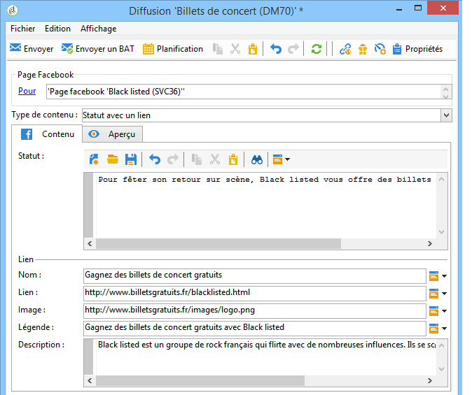

### Publication d’un statut avec un lien YouTube {#publishing-a-status-with-a-youtube-link}

Ce type de contenu permet de publier un lien vers une vidéo YouTube. Comme pour un statut avec un lien classique, vous avez la possibilité de définir un statut, un nom, une légende, une description, et un lien additionnel. L&#39;image est automatiquement ajoutée par Facebook. Les correspondances entre les champs de l&#39;écran d&#39;édition de la diffusion et la publication finale sur Facebook sont présentées ci-dessous :

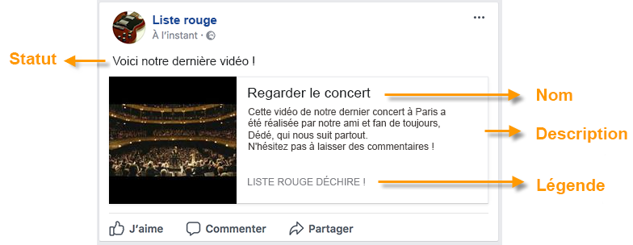

Renseignez les différents champs proposés :

>[!CAUTION]
>
>Toutes les URL doivent commencer par **&quot;http://&quot;** ou **&quot;https://&quot;**.

1. Dans le champ **[!UICONTROL Statut]**, saisissez le texte qui sera affiché sous le nom de la page.
1. Dans le champ **[!UICONTROL Nom]**, saisissez le titre de la publication.
1. Dans le champ **[!UICONTROL Code vidéo]**, saisissez le code de la vidéo YouTube. Par exemple, pour le lien « https://www.youtube.com/watch?v=abc123456 », le code vidéo sera « abc123456 ».
1. Dans le champ **[!UICONTROL Légende]**, saisissez le texte qui apparaîtra à la fin de la publication.
1. Dans le champ **[!UICONTROL Description]**, saisissez le texte qui apparaîtra sous le titre.

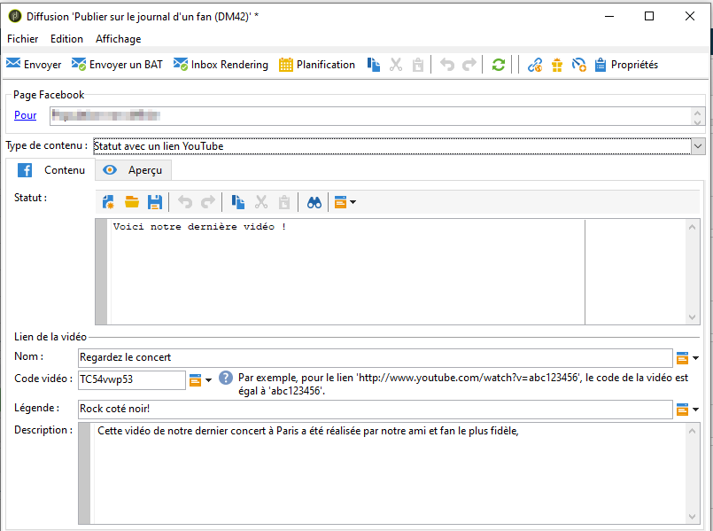

### Publication d’un album photo {#publishing-a-photo-album}

Ce type de contenu permet de publier un album photo. Vous avez la possibilité d&#39;ajouter un nom et une description pour l&#39;album ainsi qu&#39;une légende pour chaque photo. Les correspondances entre les champs de l&#39;écran d&#39;édition de la diffusion et la publication finale sur Facebook sont présentées ci-dessous :

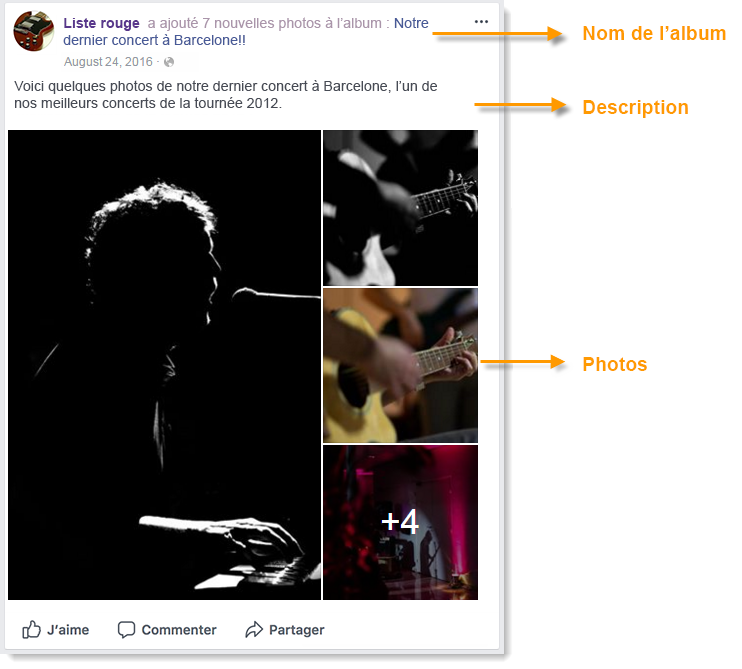

Renseignez les différents champs proposés :

1. Saisissez tout d&#39;abord le **[!UICONTROL Nom de l&#39;album]**.
1. Saisissez ensuite la **[!UICONTROL Description]** qui apparaîtra au-dessus des photos.
1. Pour ajouter une photo, cliquez sur le bouton **[!UICONTROL Ajouter]**, sélectionnez la photo et cliquez sur **[!UICONTROL Ouvrir]**.
1. Pour chaque photo, vous avez la possibilité d&#39;ajouter une légende.

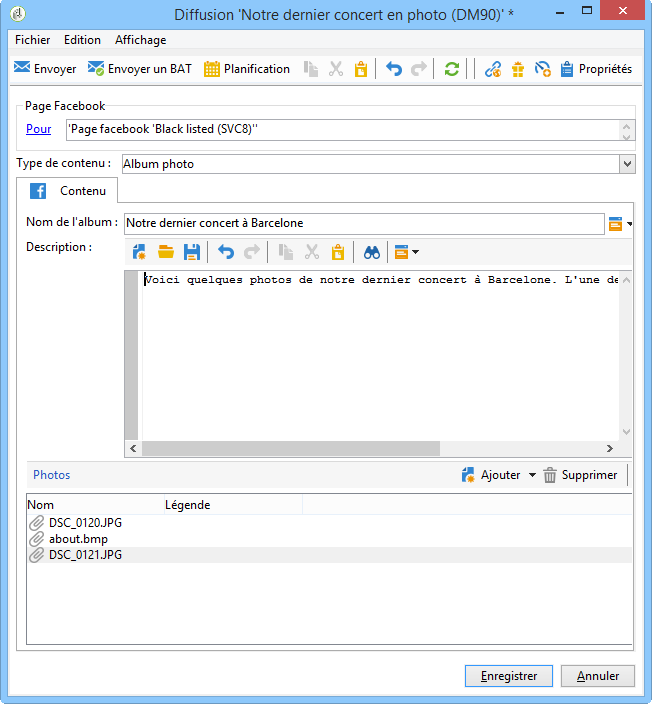

## Aperçu {#previewing}

L&#39;onglet **[!UICONTROL Aperçu]** permet de visualiser le rendu de la publication.

1. Cliquez sur l&#39;onglet **[!UICONTROL Aperçu]**.
1. Cliquez sur le menu déroulant **[!UICONTROL Tester la personnalisation]** et sélectionnez **[!UICONTROL Service]**.
1. Dans le champ **[!UICONTROL Dossier]**, sélectionnez le dossier de services contenant vos pages Facebook. Par défaut, les pages sont stockées à la racine du dossier de services **[!UICONTROL Facebook]**.
1. Sélectionnez la page Facebook sur laquelle vous souhaitez tester l&#39;aperçu.

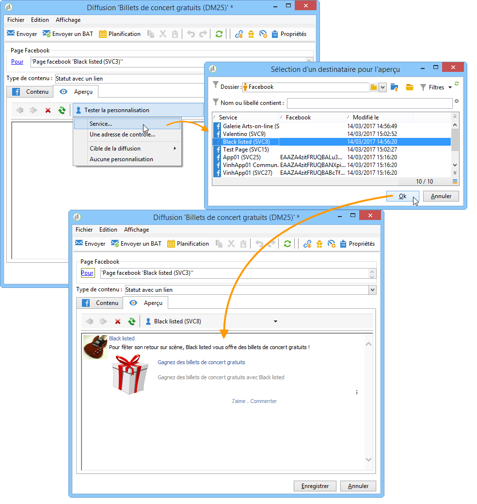

>[!NOTE]
>
>L&#39;aperçu peut différer légèrement de la publication finale sur Facebook. Il est vivement recommandé d&#39;envoyer un BAT avant l&#39;envoi final afin de visualiser un rendu exact de la publication. [En savoir plus](#sending-the-proof).

## Configuration du tracking {#configuring-tracking}

Le tracking est visualisable dans les rapports de diffusion et dans l&#39;onglet **[!UICONTROL Edition > Tracking]** de la diffusion et du service.

Les clics sur l&#39;URL contenue dans la diffusion sont mesurés par Adobe Campaign. Le nombre de clics sur le bouton **[!UICONTROL J&#39;aime]**, le nombre de commentaires et le nombre de fans sont mesurés par Facebook.

La configuration du tracking s’effectue de la même manière que pour une diffusion email. Voir à ce sujet [cette section](../../delivery/using/about-delivery-monitoring.md).

>[!NOTE]
>
>Dans le modèle de diffusion **[!UICONTROL Publier sur une page de marque]**, le tracking est activé par défaut.

## Envoi du BAT {#sending-the-proof}

Nous vous recommandons vivement d’envoyer un BAT de votre publication avant la diffusion finale pour en voir le rendu exact sur une page de test Facebook privée. Pour plus d’informations sur la création d’une page de test Facebook privée, reportez-vous à [cette page](../../social/using/publishing-on-facebook-walls.md#creating-a-test-facebook-page). Les étapes permettant de sélectionner le BAT cible sont présentées en détail dans [cette section](#selecting-the-proof-target).

La diffusion du BAT s’effectue de la même manière que pour une diffusion e-mail. Reportez-vous à [cette section](../../delivery/using/steps-validating-the-delivery.md#sending-a-proof).

## Envoi du message {#sending-the-message}

1. Une fois le contenu validé, cliquez sur le bouton **[!UICONTROL Envoyer]**.
1. Choisissez **[!UICONTROL Diffuser dès que possible]** et cliquez sur le bouton **[!UICONTROL Analyser]**.

   >[!NOTE]
   >
   >L&#39;option **[!UICONTROL Différer la diffusion]** permet de différer l&#39;envoi de la diffusion à une date ultérieure.

   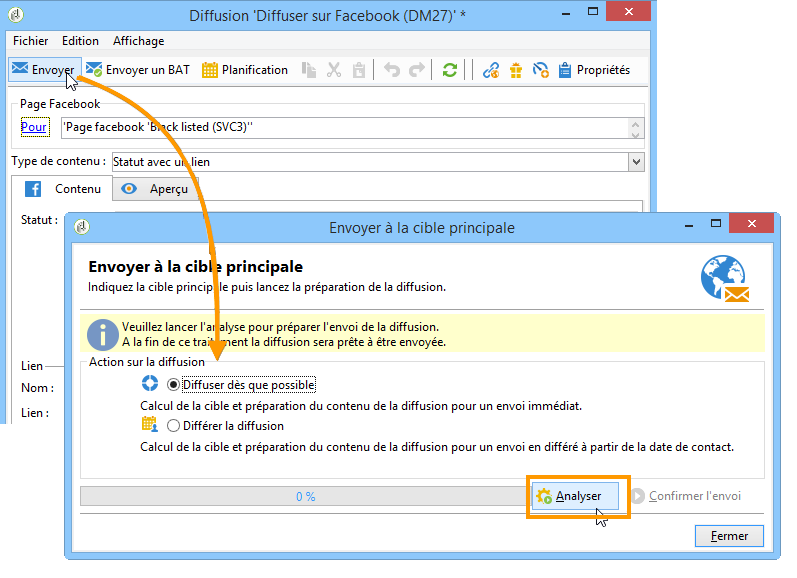

1. Une fois l&#39;analyse terminée, vérifiez le résultat de l&#39;analyse.
1. Cliquez sur le bouton **[!UICONTROL Confirmer l&#39;envoi]**, puis cliquez sur **[!UICONTROL Oui]**.

   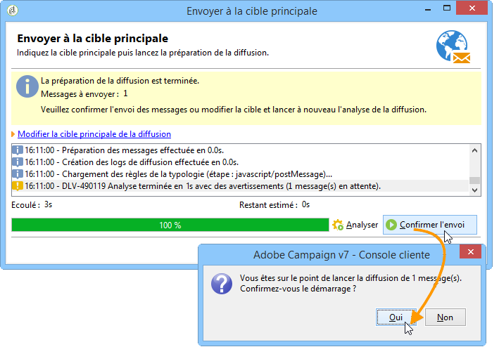
