# Publication sur Twitter{#publishing-on-twitter}

## Publication sur vos comptes Twitter {#publishing-on-your-twitter-accounts}

Une fois le paramétrage effectué, Social Marketing permet d&#39;envoyer des tweets sur vos comptes Twitter.

### Limites {#limitations}

Les limitations suivantes sont des contraintes inhérentes à Twitter.

* La longueur du message ne peut pas dépasser 140 caractères.
* Le format HTML n&#39;est pas supporté.

### Création de la diffusion {#creating-the-delivery}

Créez une diffusion basée sur le modèle de diffusion **[!UICONTROL Tweeter (Twitter)]**.

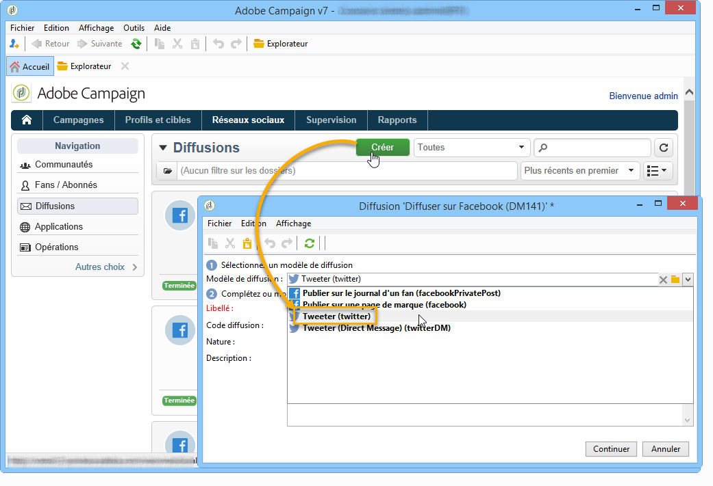

### Sélection de la cible principale {#selecting-the-main-target}

Vous devez sélectionner le ou les comptes sur lesquels vous souhaitez envoyer votre tweet.

1. Cliquez sur le lien **[!UICONTROL Pour]**.

   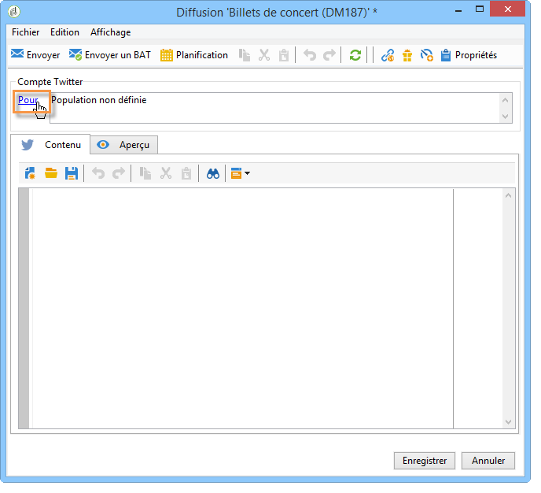

1. Cliquez sur le bouton **[!UICONTROL Ajouter]**.

   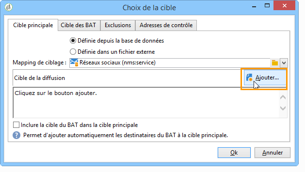

1. Sélectionnez **[!UICONTROL Un compte Twitter]**.

   

1. Dans le champ **[!UICONTROL Dossier]**, sélectionnez le dossier de services contenant le compte Twitter. Sélectionnez ensuite le compte Twitter sur lequel vous souhaitez envoyer votre tweet.

   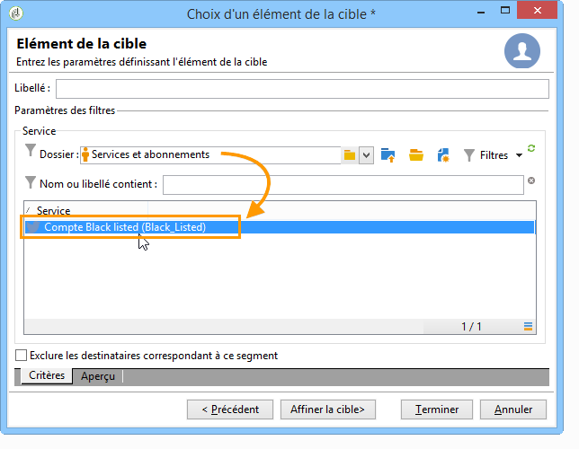

### Sélection de la cible du BAT {#selecting-the-target-of-the-proof}

L’onglet **[!UICONTROL Cible des BAT]** permet de définir le compte Twitter utilisé pour les diffusions de test avant la diffusion finale. Par conséquent, nous vous recommandons de créer un compte Twitter privé dédié à l’envoi de BAT. Pour plus d’informations sur la façon de créer un compte Twitter privé, reportez-vous à [cette section](../../social/using/configuring-publishing-on-twitter.md#creating-a-test-account-on-twitter). Les étapes permettant de sélectionner la cible du BAT sont identiques à celles visant à sélectionner la cible principale. Consultez [cette section](../../social/using/configuring-publishing-on-twitter.md#creating-a-test-account-on-twitter).

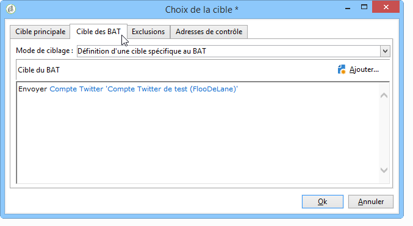

>[!NOTE]
>
>Si vous utilisez le même compte Twitter de test pour toutes vos diffusions, vous pouvez enregistrer la cible du BAT dans le modèle de diffusion **[!UICONTROL Tweeter]**, accessible à partir du nœud **[!UICONTROL Ressources > Modèles > Modèles de diffusion]**. La cible du BAT sera alors renseignée par défaut pour chaque nouvelle diffusion.

### Définition du contenu du message {#defining-the-message-content}

Saisissez le contenu du tweet dans l’onglet **[!UICONTROL Contenu]**.

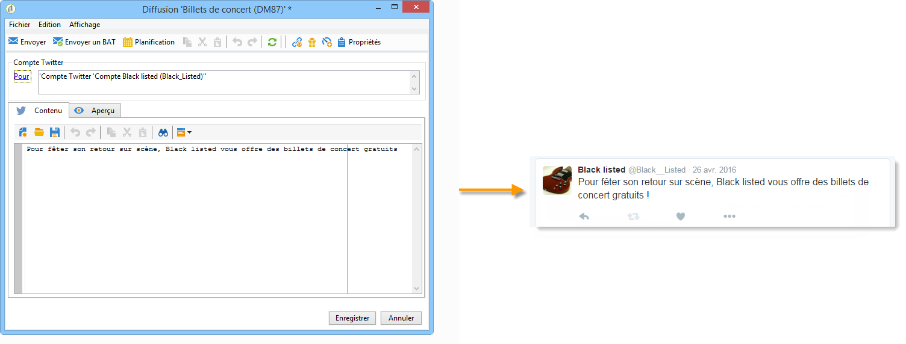

### Prévisualisation du message {#viewing-the-preview}

L&#39;onglet **[!UICONTROL Aperçu]** permet de visualiser le rendu du tweet.

1. Cliquez sur l&#39;onglet **[!UICONTROL Aperçu]**.
1. Cliquez sur le menu déroulant **[!UICONTROL Tester la personnalisation]** et sélectionnez **[!UICONTROL Service]**.
1. Dans le champ **[!UICONTROL Dossier]**, sélectionnez le dossier de services contenant votre compte Twitter.
1. Sélectionnez le compte Twitter sur lequel vous souhaitez tester l&#39;aperçu.

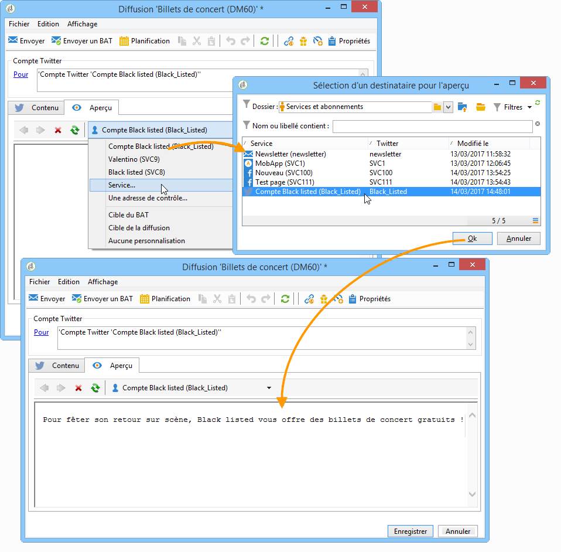

>[!NOTE]
>
>L&#39;aperçu peut différer légèrement du tweet final sur Twitter. Il est vivement recommandé d&#39;envoyer un BAT avant l&#39;envoi final afin de visualiser un rendu exact du tweet. Consultez [cette section](#sending-the-proof).

### Configuration du tracking {#configuring-tracking}

Le tracking est visualisable dans les rapports de diffusion et dans l&#39;onglet **[!UICONTROL Edition > Tracking]** de la diffusion et du service.

La configuration du tracking s’effectue de la même manière que pour une diffusion email. Voir à ce sujet [cette section](../../delivery/using/about-delivery-monitoring.md).

>[!NOTE]
>
>Dans le modèle de diffusion **[!UICONTROL Tweeter]**, le tracking est activé par défaut.

>[!CAUTION]
>
>Il n&#39;est pas possible de distinguer l&#39;activité des robots qui analysent les tweets des utilisateurs qui cliquent réellement.

### Envoi du BAT {#sending-the-proof}

Nous vous recommandons vivement d’envoyer un BAT de votre publication avant la diffusion finale pour en voir le rendu exact sur une page Twitter de test privée. Pour en savoir plus sur la création d’un compte Twitter privé, reportez-vous à [cette section](../../social/using/configuring-publishing-on-twitter.md#creating-a-test-account-on-twitter). Les étapes permettant de sélectionner la cible du BAT sont présentées en détail dans [cette section](#selecting-the-target-of-the-proof).

La diffusion du BAT s’effectue de la même manière que pour une diffusion e-mail. Reportez-vous à [cette section](../../delivery/using/steps-validating-the-delivery.md#sending-a-proof).

### Envoi du message {#sending-the-message}

1. Une fois le contenu validé, cliquez sur le bouton **[!UICONTROL Envoyer]**.
1. Choisissez **[!UICONTROL Diffuser dès que possible]** et cliquez sur le bouton **[!UICONTROL Analyser]**.

   >[!NOTE]
   >
   >L&#39;option **[!UICONTROL Différer la diffusion]** permet de différer l&#39;envoi de la diffusion à une date ultérieure.

   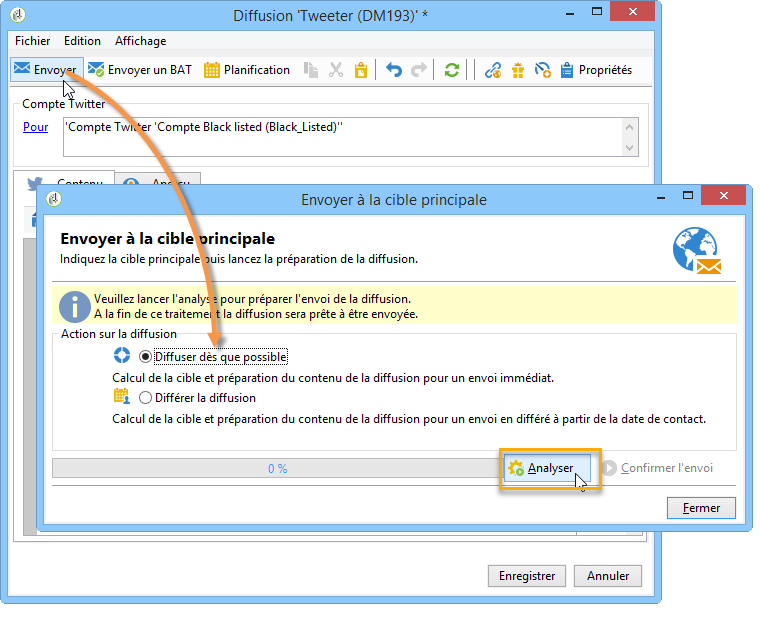

1. Une fois l&#39;analyse terminée, vérifiez le résultat de l&#39;analyse.
1. Cliquez sur le bouton **[!UICONTROL Confirmer l&#39;envoi]**, puis cliquez sur **[!UICONTROL Oui]**.

## Envoi de messages directs à vos abonnés {#sending-direct-messages-to-subscribers}

### Principe de fonctionnement {#operating-principle}

Le workflow **[!UICONTROL Synchroniser les comptes Twitter]** (voir la section [En savoir plus](../../social/using/configuring-publishing-on-twitter.md#synchronizing-twitter-accounts)) récupère la liste des abonnés Twitter pour vous permettre de leur envoyer des messages directs. Les abonnés récupérés sont stockés dans un tableau spécifique : la table des visiteurs. Pour afficher la liste des abonnés Twitter, accédez au nœud **[!UICONTROL Profils et cibles > Visiteurs]**.

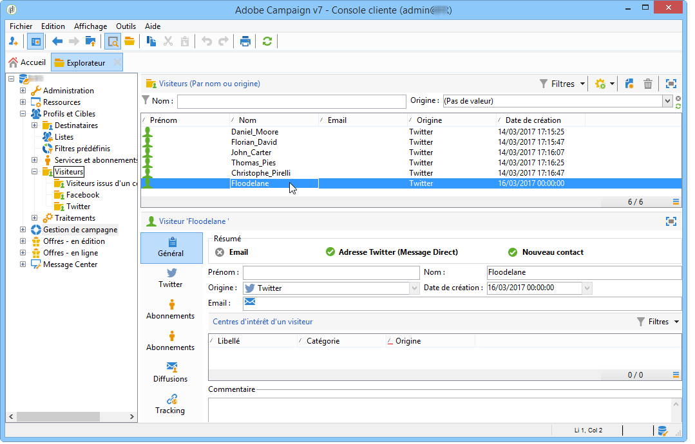

>[!IMPORTANT]
>
>Pour que le workflow récupère la liste des abonnés d&#39;un compte Twitter, la case **[!UICONTROL Synchroniser les comptes Twitter]** doit être cochée dans l&#39;écran d&#39;édition du service correspondant au compte. Pour plus d&#39;informations à ce sujet, voir la section [Déléguer les droits d&#39;écriture à Adobe Campaign](../../social/using/configuring-publishing-on-twitter.md#delegating-write-access-to-adobe-campaign).

Pour chaque abonné, Adobe Campaign récupère les informations suivantes :

* **[!UICONTROL Origine]** : nom du réseau social (**Twitter**, dans ce cas)
* **[!UICONTROL Id externe]** : identifiant de l&#39;utilisateur
* **[!UICONTROL Pseudo]** : nom de compte de l&#39;utilisateur
* **[!UICONTROL Nom complet]** : nom de l&#39;utilisateur
* **[!UICONTROL Langue]** : langue de l&#39;utilisateur
* **[!UICONTROL Nombre d&#39;amis]** : nombre d&#39;abonnés au compte de l&#39;utilisateur
* **[!UICONTROL Fuseau horaire]** : fuseau horaire de l&#39;utilisateur
* **[!UICONTROL Vérifié]** : ce champ indique si l&#39;utilisateur possède un compte Twitter vérifié

### Limites {#limitations-1}

Les limitations suivantes sont des contraintes inhérentes à Twitter.

* La longueur du message ne peut pas dépasser 140 caractères.
* Le format HTML n&#39;est pas supporté.
* Vous ne pouvez pas envoyer plus de 250 messages directs par jour. Afin de ne pas dépasser cette limite, il est possible d’effectuer un envoi en plusieurs vagues. L’envoi en plusieurs vagues s’effectue de la même manière que pour une diffusion email. Voir à ce sujet [cette section](../../delivery/using/steps-sending-the-delivery.md#sending-using-multiple-waves).

### Création de la diffusion {#creating-the-delivery-}

Créez une diffusion basée sur le modèle de diffusion **[!UICONTROL Tweeter (Message privé)]**.

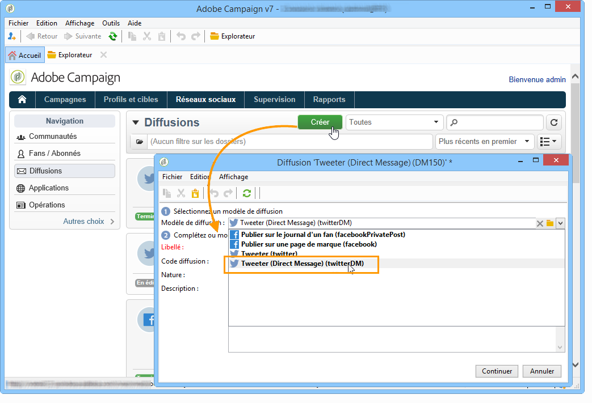

### Sélection de la cible principale {#selecting-the-main-target-1}

Vous devez sélectionner les abonnés à qui vous souhaitez envoyer votre message direct.

1. Cliquez sur le lien **[!UICONTROL Pour]**.

   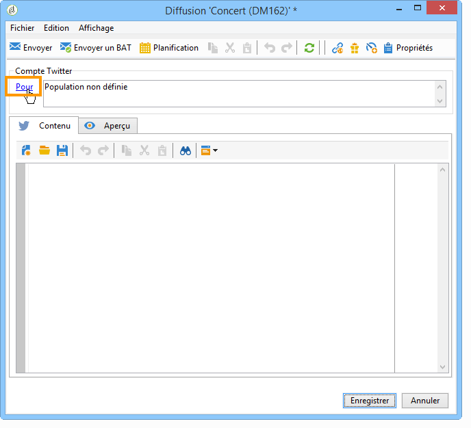

1. Cliquez sur le bouton **[!UICONTROL Ajouter]**.

   

1. Choisissez un type de ciblage.

   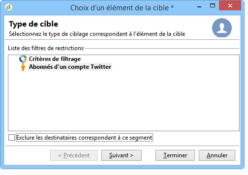

   * Sélectionnez **[!UICONTROL Abonnés d&#39;un compte Twitter]** pour envoyer un message direct à tous les abonnés d&#39;un compte.

      >[!IMPORTANT]
      >
      >Vous ne pouvez pas envoyer plus de 250 messages par jour. Si votre compte Twitter comporte plus de 250 abonnés, il est vivement recommandé d’effectuer un envoi en plusieurs vagues. L’envoi en plusieurs vagues s’effectue de la même manière que pour une diffusion email. Reportez-vous à [cette section](../../delivery/using/steps-sending-the-delivery.md#sending-using-multiple-waves).

   * Sélectionnez **[!UICONTROL Conditions de filtrage]** afin de définir une requête et d’en visualiser le résultat. Cette option s’utilise de la même manière que pour une diffusion email. Reportez-vous à [cette section](../../platform/using/defining-filter-conditions.md) pour plus d’informations.

      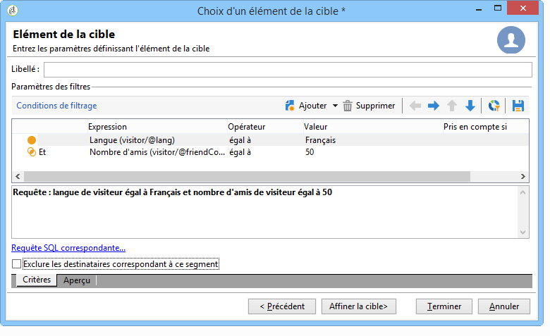

### Sélection de la cible du BAT {#selecting-the-target-of-the-proof-1}

L&#39;onglet **[!UICONTROL Cible des BAT]** permet de définir l&#39;abonné qui recevra le BAT de votre message direct. Les étapes de sélection de la cible du BAT sont les mêmes que pour la sélection de la cible principale. Pour plus d&#39;informations, consultez la section [Choisir la cible principale](#selecting-the-main-target).

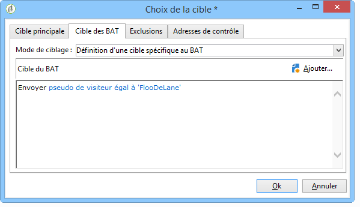

>[!NOTE]
>
>Si vous souhaitez envoyer tous les BAT de vos messages directs au même abonné Twitter, vous pouvez enregistrer la cible du BAT dans le modèle de diffusion **[!UICONTROL Tweeter (Direct Message)]**, accessible à partir du noeud **[!UICONTROL Ressources > Modèles > Modèles de diffusion]**. La cible du BAT sera alors renseignée par défaut pour chaque nouvelle diffusion.

### Définition du contenu du message {#defining-message-content-}

Saisissez le contenu du tweet dans l&#39;onglet **[!UICONTROL Contenu]**.

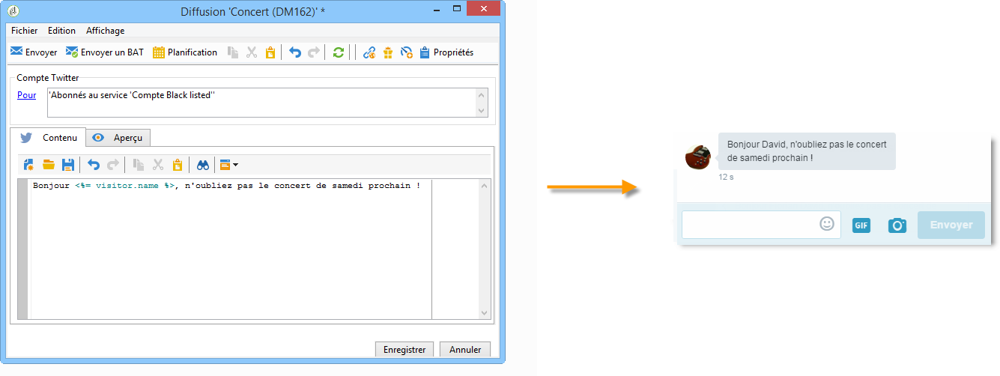

Comme pour une diffusion email, il est possible d’utiliser les champs de personnalisation, par exemple si vous souhaitez ajouter le nom de l’abonné dans le corps du message. La personnalisation du contenu est présentée dans [cette section](../../delivery/using/about-personalization.md).

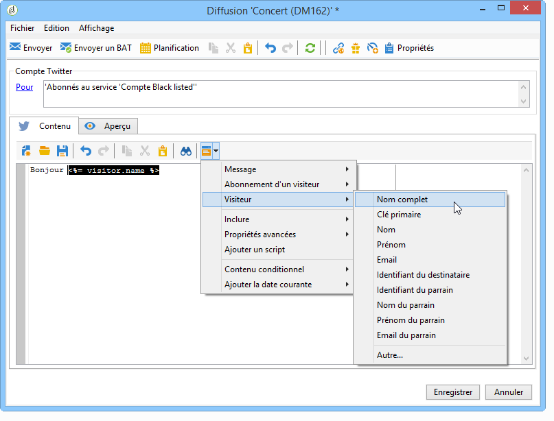

Les étapes suivantes sont les mêmes que pour l&#39;envoi d&#39;un tweet sur un compte Twitter. Pour plus d&#39;informations, consultez la section [Publier sur vos comptes Twitter](#publishing-on-your-twitter-accounts).
