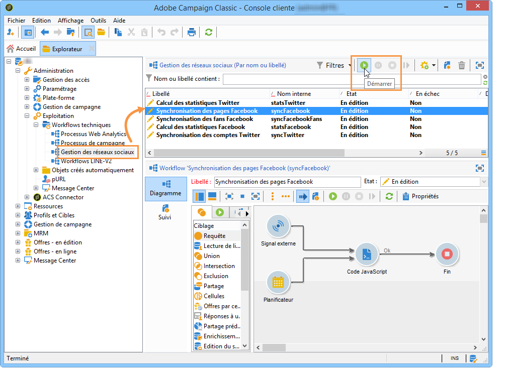
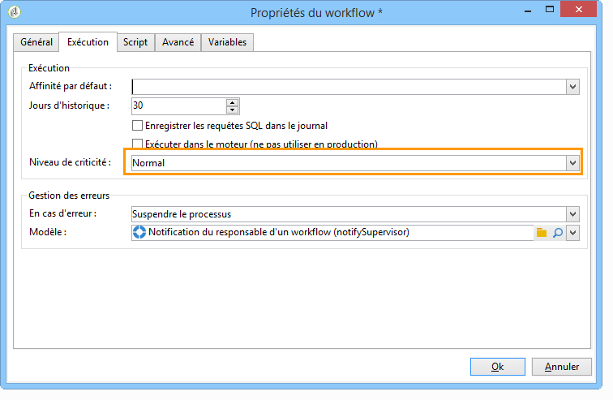

# Démarrer les workflows{#starting-workflows}

Les workflows de **[!UICONTROL Gestion des réseaux sociaux]**, disponibles à partir du noeud **[!UICONTROL Administration > Exploitation > Workflows techniques > Gestion des réseaux sociaux]** permettent de synchroniser Adobe Campaign avec Twitter et Facebook.

A la première utilisation de Social Marketing, ces workflows sont arrêtés par défaut. Démarrez-les à l&#39;aide du bouton **[!UICONTROL Démarrer]** situé dans la barre d&#39;outils.

Si vous ne souhaitez pas utiliser l&#39;un des deux réseaux sociaux, il est conseillé de ne pas démarrer les workflows correspondants. Pour ne pas recevoir d&#39;alerte indiquant que des workflows de production sont arrêtés, sélectionnez le niveau de criticité **[!UICONTROL Normal]** dans l&#39;onglet **[!UICONTROL Exécution]** des propriétés des workflows concernés.

