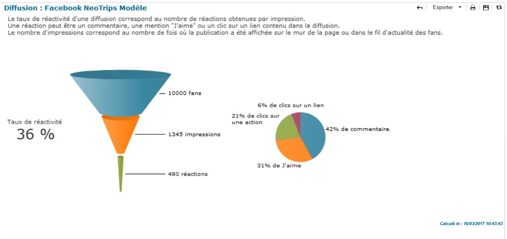
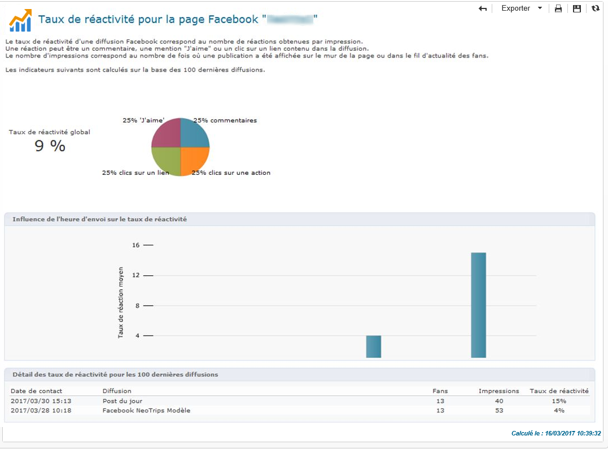
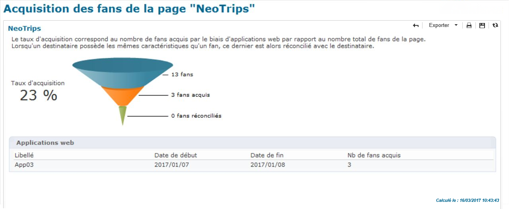

# Effectuer un tracking{#tracking}

Social Marketing met à disposition des rapports permettant de mesurer le taux de réactivité des diffusions Facebook et Twitter et d&#39;analyser l&#39;acquisition de profils Facebook. Les rapports disponibles sont les suivants :

* Le rapport **[!UICONTROL Taux de réactivité]**, disponible à partir de l&#39;onglet **[!UICONTROL Résumé]** d&#39;une diffusion Facebook ou Twitter.

   

* Le rapport **[!UICONTROL Taux de réactivité]**, disponible à partir de l&#39;onglet **[!UICONTROL Tableau de bord]** d&#39;un service Twitter ou Facebook.

   

* Le rapport **[!UICONTROL Acquisition des fans]**, disponible à partir de l&#39;onglet **[!UICONTROL Tableau de bord]** d&#39;un service Facebook.

   
