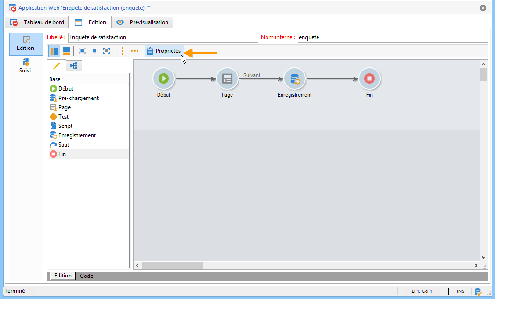

# Configurer des questionnaires en ligne{#configuring-surveys}

## Propriétés du questionnaire {#survey-properties}

Les questionnaires en ligne sont entièrement paramétrables et personnalisables pour répondre à vos besoins. Les paramètres doivent être renseignés dans la fenêtre des propriétés.

Les paramètres disponibles sont présentés dans [ce document ](../../web/using/defining-web-forms-properties.md).

## Stockage des données d&#39;un questionnaire {#survey-data-storage}

Par défaut, les champs des formulaires Web sont stockés dans la table des destinataires. Vous pouvez modifier la table utilisée en sélectionnant une nouvelle table dans le champ **[!UICONTROL Type de document]**. L&#39;icône **[!UICONTROL Loupe]** permet de visualiser le contenu de la table sélectionnée.

Les réponses fournies par les utilisateurs dans les questionnaires et qui ne sont pas stockées dans des champs (mais dans des variables locales) sont stockées dans la table **Réponses aux questionnaires**. Vous pouvez modifier le schéma utilisé à partir du champ **[!UICONTROL Bibliothèque]**. Ce champ n’est disponible que pour les **questionnaires**.
