# Étapes clés de création d’un questionnaire{#getting-started-with-surveys}

Nous vous proposons ici d&#39;aborder rapidement, en sept étapes clés, la création d&#39;un questionnaire simple, selon le modèle natif suivant :

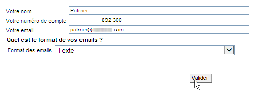

Ces étapes sont les suivantes :

1. [Étape 1 - Créer un questionnaire](#step-1---creating-a-survey),
1. [Étape 2 - Sélectionner le modèle](#step-2---selecting-the-template),
1. [Étape 3 - Construire le questionnaire](#step-3---building-the-survey),
1. [Étape 4 - Créer le contenu de la page](#step-4---creating-the-page-content),
1. [Étape 5 - Enregistrer les données du questionnaire](#step-5---storing-the-survey-data-),
1. [Étape 6 - Publier les pages](#step-6---publishing-the-pages),
1. [Étape 7 - Partager votre questionnaire en ligne](#step-7---sharing-your-online-survey).

## Étape 1 - Créer un questionnaire {#step-1---creating-a-survey}

Pour créer un questionnaire, accédez à l&#39;onglet **[!UICONTROL Campagnes]** ou **[!UICONTROL Profils et cibles]** et cliquez sur le menu **[!UICONTROL Applications Web]**. Cliquez sur le bouton **[!UICONTROL Créer]** situé au-dessus de la liste des formulaires.

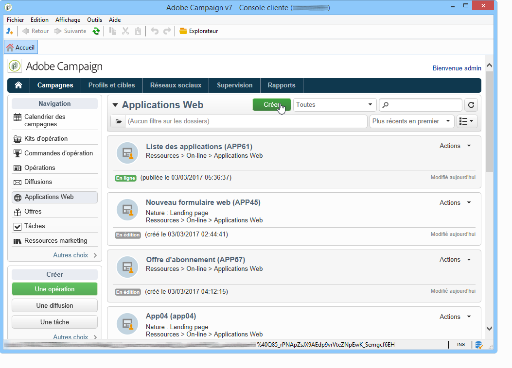

## Étape 2 - Sélectionner le modèle {#step-2---selecting-the-template}

Sélectionnez un modèle de questionnaire, puis nommez le questionnaire. Ce nom ne sera pas visible par les utilisateurs finaux mais permettra d&#39;identifier le questionnaire dans Adobe Campaign. Cliquez sur **[!UICONTROL Enregistrer]** : le questionnaire est ajouté dans la liste des applications Web.

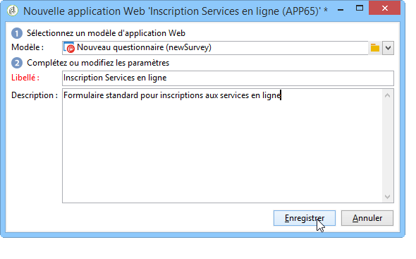

## Étape 3 - Construire le questionnaire {#step-3---building-the-survey}

Les questionnaires sont construits dans un diagramme où sont positionnées : la ou les pages où seront créés les contenus, les étapes de préchargement et d&#39;enregistrement des données, et des étapes de tests. Il est également possible d&#39;insérer des scripts et des requêtes.

Pour construire le diagramme, cliquez sur l&#39;onglet **[!UICONTROL Edition]** du questionnaire.

Un questionnaire doit contenir **au minimum** les trois composants suivants : une page, une boîte d&#39;enregistrement et une page de fin.

* Pour créer une page, sélectionnez l&#39;objet **[!UICONTROL Page]** dans la section gauche de l&#39;éditeur et déposez-le dans la section centrale, comme ci-dessous :

   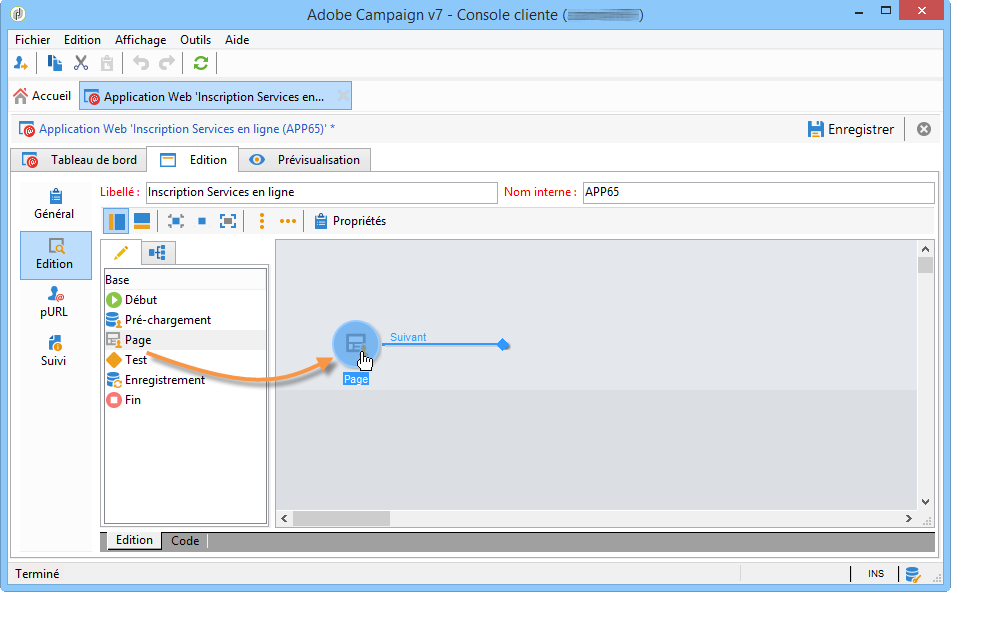

* Sélectionnez ensuite l&#39;objet **[!UICONTROL Enregistrement]** et positionnez-le sur l&#39;extrémité de la transition sortante de la page.
* Enfin, sélectionnez l&#39;objet **[!UICONTROL Fin]** et positionnez-le sur l&#39;extrémité de la transition sortante de la boîte d&#39;enregistrement, afin d&#39;obtenir le diagramme suivant :

   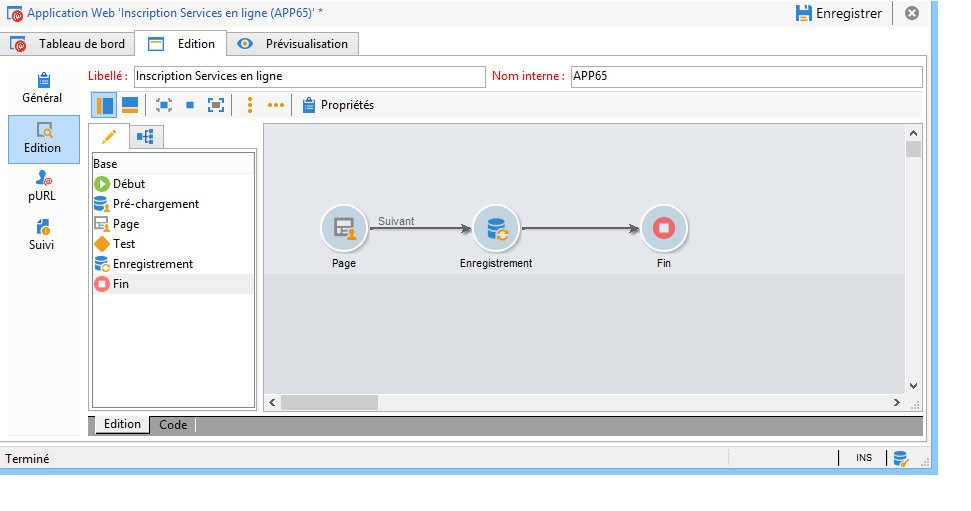

## Étape 4 - Créer le contenu de la page {#step-4---creating-the-page-content}

Dans l&#39;exemple suivant, nous utiliserons une page de type **[!UICONTROL Page (compatibilité v5)]**. Ce type de page est accessible à partir de la palette avancée de l&#39;onglet **[!UICONTROL Edition]**.

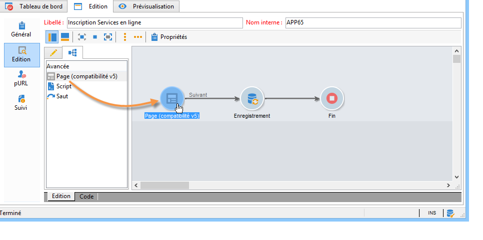

* **Ajouter des champs de saisie**

   Pour créer le contenu de la page, vous devez d&#39;abord l&#39;éditer : pour cela, double-cliquez sur l&#39;objet **[!UICONTROL Page]**. Cliquez sur la première icône de la barre d&#39;outils pour exécuter l&#39;assistant de création de champ. Pour créer un champ de saisie du nom de l&#39;utilisateur qui sera stocké dans le champ correspondant du profil du destinataire, choisissez **[!UICONTROL Editer un destinataire]**.

   

   Cliquez sur le bouton **[!UICONTROL Suivant]** afin de sélectionner le champ de stockage des informations dans la base de données : ici, le champ &#39;Nom&#39;.

   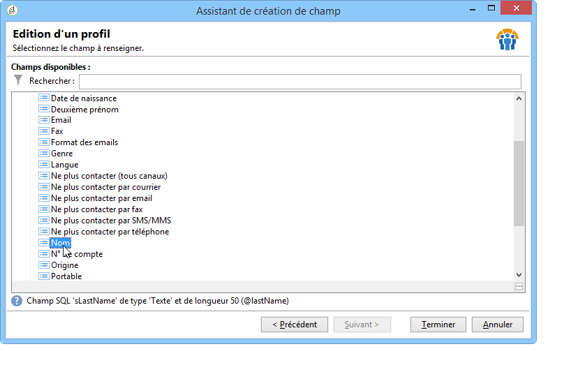

   Cliquez sur **[!UICONTROL Terminer]** pour valider la création de ce champ.

   Par défaut, lorsque les informations sont stockées dans un champ déjà existant de la base de données, le libellé du champ reprend le nom du champ sélectionné, soit dans notre exemple &#39;Nom&#39;. Vous pouvez modifier ce libellé, comme dans l&#39;exemple ci-dessous :

   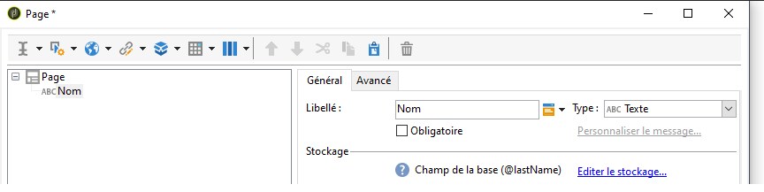

   Créez à présent un champ de saisie pour le numéro de compte de l&#39;utilisateur : répétez l&#39;opération et choisissez le champ &#39;N° de compte&#39;. 

   Ajoutez de la même façon un champ pour permettre à l&#39;utilisateur de saisir son email.

* **Créer une question**

   Pour créer une question, cliquez avec le bouton droit de la souris sur le dernier élément de l&#39;arborescence, et choisissez **[!UICONTROL Conteneurs > Question]**, ou cliquez sur l&#39;icône **[!UICONTROL Conteneurs]** et choisissez **[!UICONTROL Question]**.

   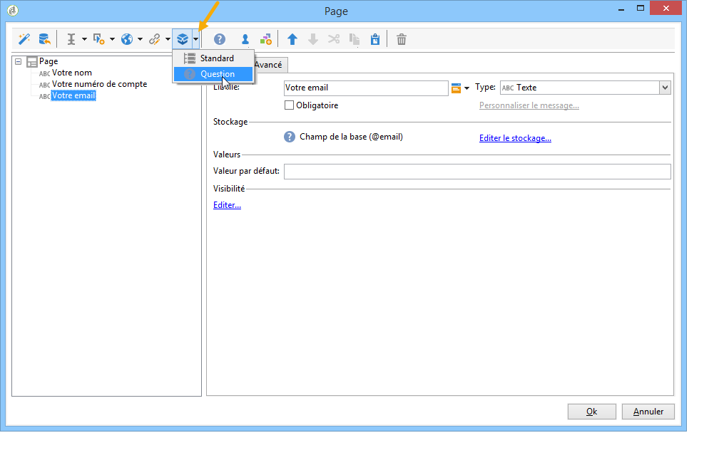

   Saisissez le libellé de la question et insérez le ou les champs de réponse en sous-arborescence de la question. Pour cela, le noeud correspondant à la question doit être sélectionné lors de la création du champ de réponse. Ajoutez une **[!UICONTROL liste déroulante]**, à partir de l&#39;icône **[!UICONTROL Contrôles de sélection]** ou en cliquant sur le bouton droit de la souris, comme ci-dessous :

   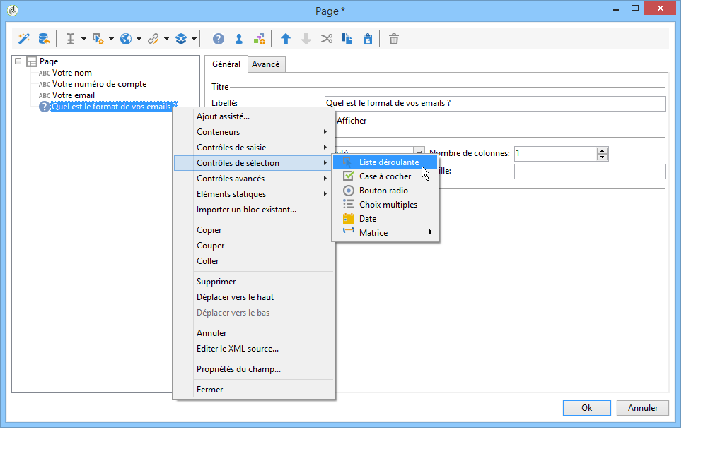

   Sélectionnez un espace de stockage : choisissez un champ de type énumération afin de récupérer automatiquement les valeurs (ici, le format des emails).

   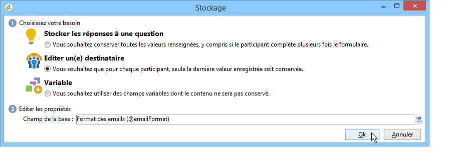

   Dans l&#39;onglet **[!UICONTROL Général]**, cliquez sur le lien **[!UICONTROL Initialiser la liste des valeurs depuis la base de données]** : le tableau des valeurs est automatiquement renseigné.

   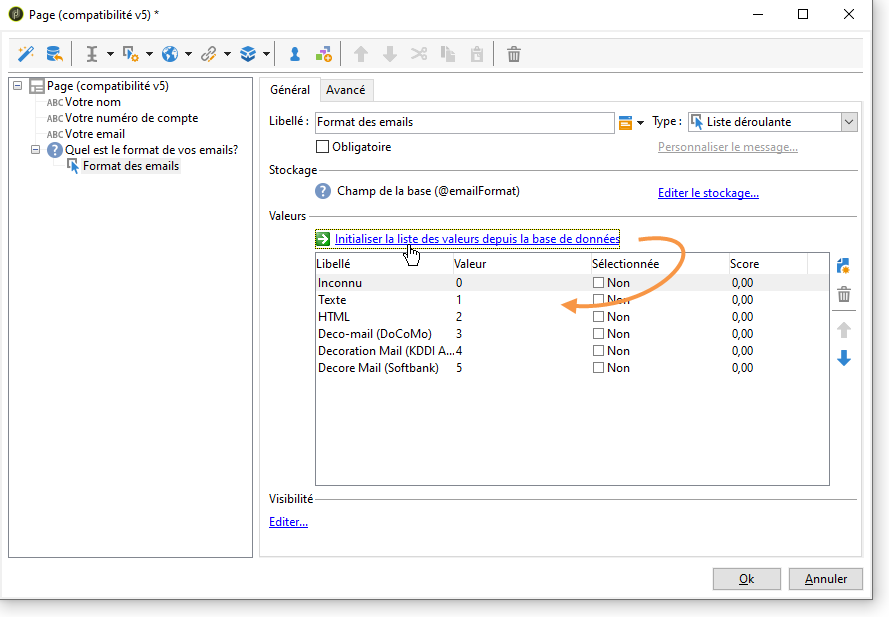

   Cliquez sur **[!UICONTROL OK]** pour fermer l&#39;éditeur, puis sur **[!UICONTROL Enregistrer]** pour sauvegarder les modifications.

   >[!NOTE]
   >
   >Pour chaque champ ou chaque question, vous pouvez adapter la mise en page à vos besoins en utilisant les options de l&#39;onglet **[!UICONTROL Avancé]**. La mise en page des écrans du questionnaire est présentée dans [cette section](../../web/using/about-web-forms.md).

   Dans l&#39;écran de détail, cliquez sur l&#39;onglet **[!UICONTROL Prévisualisation]** pour consulter le rendu du questionnaire que vous venez de créer.

   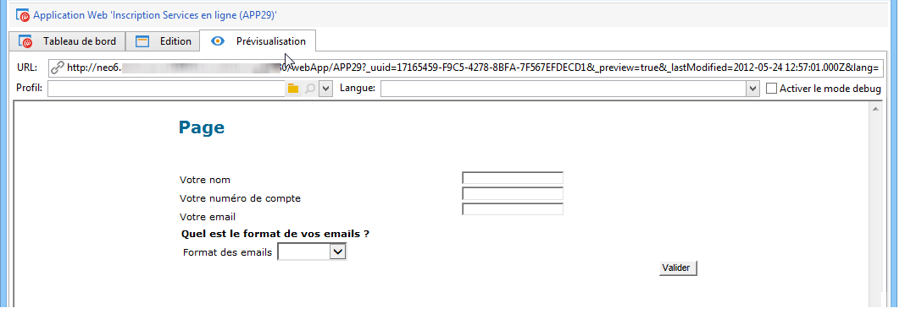

## Étape 5 - Enregistrer les données du questionnaire {#step-5---storing-the-survey-data-}

La boîte d&#39;enregistrement permet de sauvegarder les réponses fournies par les utilisateurs dans la base de données. Vous devez sélectionner une clé de réconciliation afin d&#39;identifier les profils déjà présents dans la base de données.

Pour cela, éditez la boîte et cochez le champ qui sera utilisé comme clé de réconciliation à l&#39;enregistrement des données.

Dans l&#39;exemple ci-dessous, lors de l&#39;enregistrement (validation), si un profil est enregistré en base avec le même numéro de compte que celui saisi dans le formulaire, le profil sera mis à jour. Si le profil n&#39;existe pas, il sera créé.

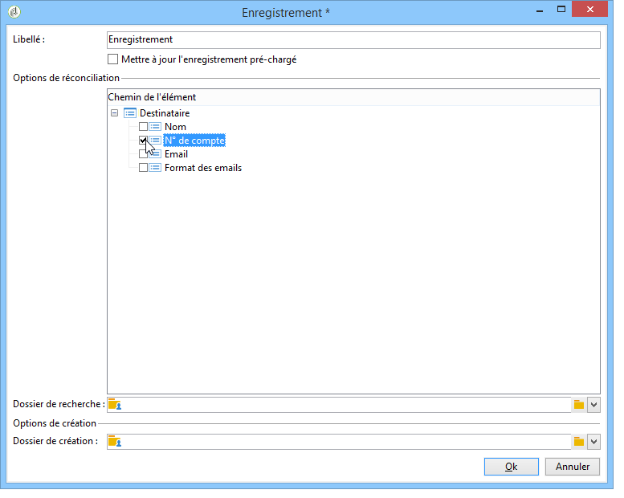

Cliquez sur **[!UICONTROL OK]** pour valider puis sur **[!UICONTROL Enregistrer]** pour sauvegarder le questionnaire.

## Étape 6 - Publier les pages {#step-6---publishing-the-pages}

Afin de permettre aux utilisateurs d&#39;accéder aux pages HTML, le questionnaire doit être rendu disponible : il ne doit plus être en édition mais en production. Pour mettre en production un questionnaire, vous devez le publier. Pour cela :

* Cliquez sur le bouton **[!UICONTROL Publier]** situé dans le tableau de bord du questionnaire.
* Cliquez sur **[!UICONTROL Démarrer]** pour lancer la publication et fermez l&#39;assistant.

   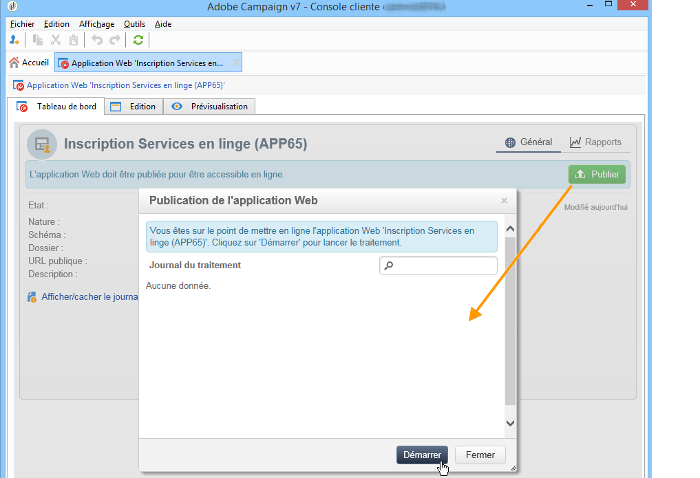

   Le statut du questionnaire est alors modifié : il est **En ligne**.

   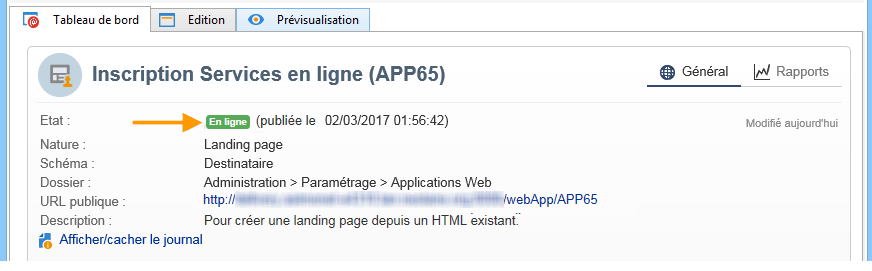

## Étape 7 - Partager votre questionnaire en ligne {#step-7---sharing-your-online-survey}

Une fois en production, le questionnaire est accessible sur le serveur et vous pouvez le diffuser. L&#39;URL d&#39;accès au questionnaire est affichée dans le tableau de bord.

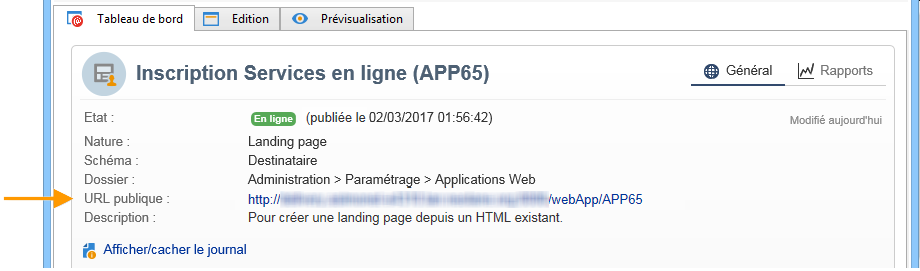

Pour diffuser le questionnaire, vous pouvez envoyer un message contenant le lien d&#39;accès au questionnaire à la population cible ou positionner l&#39;URL d&#39;accès au questionnaire sur une page web, par exemple.

Vous pouvez ensuite suivre les réponses des utilisateurs au travers des rapports et des logs. Voir [Suivre les réponses](../../surveys/using/publish--track-and-use-collected-data.md#response-tracking).

>[!CAUTION]
>
>L&#39;URL publique contient le nom interne du questionnaire. En cas de modification du nom interne, l&#39;URL automatiquement mise à jour : tous les liens vers le questionnaires doivent alors être mis à jour.
>
>Si des diffusions contenant un lien vers le formulaire ont déjà été envoyées, ce lien ne fonctionnera plus.
