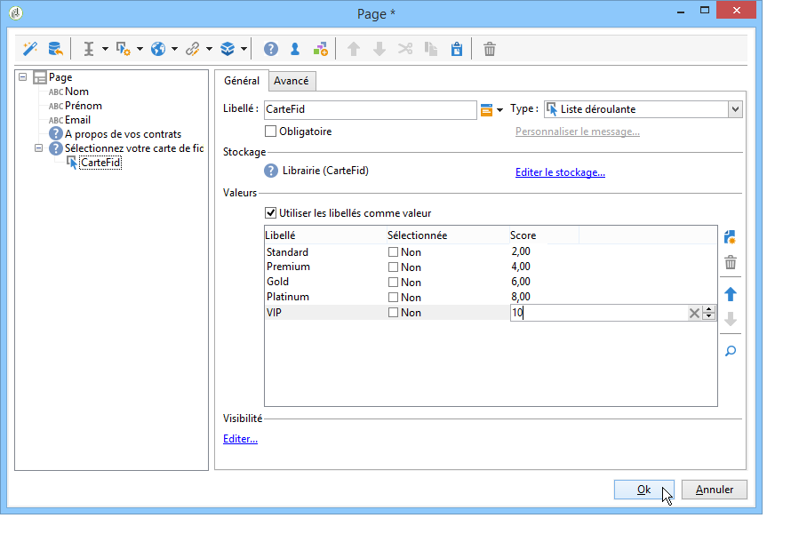

# Gestion des réponses{#managing-answers}


## Stocker les réponses collectées {#storing-collected-answers}

En complément des modes de stockage standard communs à tous les formulaires Web sous Adobe Campaign (champ de la base et variable locale), les questionnaires permettent l&#39;extension dynamique du modèle de données au travers de champs archivés.

>[!CAUTION]
>
>Cette option n&#39;est disponible que pour les formulaires web de type **Questionnaires**. Elle n&#39;est pas proposée pour d&#39;autres types de formulaires web.

### Stocker les réponses dans un champ archivé {#storing-in-an-archived-field}

Vous pouvez facilement étendre le modèle de données en ajoutant de nouveaux espaces de stockage pour enregistrer les réponses fournies dans les questionnaires. Vous devez pour cela choisir l&#39;option **[!UICONTROL Stocker les réponses à une question]** lors de la création du champ de saisie. Cliquez sur le lien **[!UICONTROL Nouveau champ...]** et indiquez ses propriétés :


Saisissez le libellé et le nom du champ, puis sélectionnez le type de champ : Texte, Booléen, Nombre entier ou à virgule, Date, etc.

Le type de champ sélectionné implique un contrôle des données lors de la saisie des réponses par les utilisateurs. Pour les champs de **texte**, vous pouvez ajouter une contrainte (casse, format) ou un lien vers une énumération existante pour forcer la sélection.

Pour ajouter une contrainte, sélectionnez-la dans la liste déroulante. Deux types de contraintes existent :

1. Sur la casse des caractères

   Les informations saisies peuvent être stockées dans le champ dans les formats suivants : tout en majuscule, tout en minuscule ou avec la première lettre en majuscule. Cette contrainte n&#39;oblige pas l&#39;utilisateur à saisir les informations dans le format choisi, mais le contenu saisi dans le champ sera transformé lors de l&#39;enregistrement.

1. Sur le format des données saisies

Si ce champ est utilisé dans une liste, les valeurs de l’énumération pourront être récupérées automatiquement dans le tableau des valeurs à partir du lien **[!UICONTROL Initialiser la liste des valeurs depuis la base de données]** situé au-dessus de la liste des valeurs.

Vous pouvez par exemple créer une liste déroulante dans laquelle l’utilisateur pourra sélectionner sa langue maternelle. Le champ archivé correspondant peut être associé à l’énumération **langue** contenant une liste de langues :


L&#39;icône **[!UICONTROL Editer le lien]** située à droite du champ permet d&#39;éditer le contenu de cette énumération :


Dans l&#39;onglet **[!UICONTROL Général]** du champ, le lien **[!UICONTROL Initialiser la liste des valeurs depuis la base de données]** permet de renseigner automatiquement la liste des libellés proposés.


**Exemple** : stocker tous les contrats d&#39;un destinataire dans un même champ

Pour stocker les types de contrats d&#39;un utilisateur dans un même champ, créez un champ de saisie de type **[!UICONTROL Texte]** et sélectionnez l&#39;option **[!UICONTROL Stocker les réponses à une question]**.

Cliquez sur le lien **[!UICONTROL Nouveau champ...]** et indiquez les propriétés du champ. Sélectionnez l&#39;option **[!UICONTROL Choix multiples]** afin de permettre le stockage de plusieurs valeurs.


Créez les champs de saisie des autres contrats, et stockez les informations dans le même champ archivé.


Lorsque l&#39;utilisateur valide le questionnaire, ses réponses sont stockées dans le champ **[!UICONTROL Contrats]**.

Dans notre exemple, pour les réponses suivantes :


Le profil du répondant contiendra les quatre contrats renseignés.

Vous pouvez les visualiser dans l&#39;onglet **[!UICONTROL Réponses]** du questionnaire, en affichant les colonnes correspondantes.


Vous pouvez également filtrer les destinataires en fonction des réponses fournies pour n&#39;afficher que les utilisateurs recherchés. Pour cela, créez un workflow de ciblage et utilisez la boîte **[!UICONTROL Réponses à un questionnaire]**.


Construisez votre requête en fonction des profils à récupérer. Dans l&#39;exemple ci-dessous, la requête permet de sélectionner les profils ayant au moins deux contrats dont un contrat de type A.


Pour chaque formulaire, les réponses fournies peuvent être réutilisées dans les champs ou les libellés. La syntaxe à utiliser pour un contenu stocké dans un champ archivé est la suivante :

```
<%= ctx.webAppLogRcpData.name of the archived field %
```

>[!NOTE]
>
>Pour les autres types de champs, la syntaxe à utiliser est présentée dans [cette section](../../platform/using/about-queries-in-campaign.md).

### Paramètres de stockage {#storage-settings}

Vous pouvez archiver les réponses aux questionnaires au format XML. Vous pouvez ainsi conserver une copie brute des réponses collectées, ce qui peut s&#39;avérer utile en cas de normalisation excessive des données dans une liste détaillée d&#39;informations. [En savoir plus](../../surveys/using/publish--track-and-use-collected-data.md#standardizing-data)

>[!CAUTION]
>
>L&#39;archivage des réponses brutes affecte l&#39;espace de stockage requis. Utilisez cette option avec précaution.

Pour cela :

* Editez les propriétés du questionnaire à partir du bouton **[!UICONTROL Propriétés]** de l&#39;onglet **[!UICONTROL Edition]**.
* Cliquez sur le lien **[!UICONTROL Paramètres avancés]** et cochez l&#39;option **[!UICONTROL Conserver une copie des réponses brutes]**.


Vous pouvez l&#39;activer par défaut pour tous les questionnaires (cette option est appliquée à la publication du questionnaire). Pour cela, créez l&#39;option **[!UICONTROL NmsWebApp_XmlBackup]** et attribuez-lui la valeur **[!UICONTROL 1]**, comme ci-dessous :


## Gestion des scores {#score-management}

Vous pouvez attribuer un score aux options proposées dans les pages du questionnaire. Les scores ne peuvent être associés qu’à des questions fermées : cases à cocher, valeur d’une liste déroulante, abonnement, etc.



Les scores sont cumulés et sauvegardés côté serveur, au moment de la validation de la page, c&#39;est-à-dire lorsque l&#39;utilisateur clique sur un bouton **[!UICONTROL Suivant]** ou **[!UICONTROL Terminer]**.

>[!NOTE]
>
>Vous pouvez utiliser des valeurs positives ou négatives, entières ou non.

Les scores peuvent être utilisés dans des tests et dans des scripts.

>[!CAUTION]
>
>Vous ne pouvez pas utiliser le score dans les conditions de visibilité pour les champs d&#39;une même page. Le score peut être utilisé dans les pages suivantes.

* Pour utiliser les scores dans des tests, vous devez utiliser le champ **[!UICONTROL Score]** dans la formule de calcul du test, comme dans l&#39;exemple ci-dessous :

  

* Vous pouvez utiliser le score dans un script.

**Exemple** : calculer un score et conditionner l&#39;affichage de la page suivante :

* Dans un questionnaire, la page suivante permet d&#39;attribuer un score différent à l&#39;utilisateur en fonction de la valeur sélectionnée dans la liste déroulante :

  

* Vous pouvez cumuler ce score avec une seconde valeur, en fonction de l&#39;option sélectionnée :

  

* Lorsque l&#39;utilisateur clique sur le bouton **[!UICONTROL Suivant]**, les deux valeurs sont additionnées.

  

* Il est possible de conditionner la page à afficher en fonction du score. Le paramétrage sera le suivant :

  

  
