# Publier, suivre et utiliser les données collectées{#publish-track-and-use-collected-data}


Une fois que le formulaire a été créé, paramétré et publié, vous pouvez partager le lien avec votre audience et suivre les réponses.

>[!NOTE]
>
>Le cycle de vie d’un questionnaire sous Adobe Campaign ainsi que ses modes de publication et de diffusion sont similaires à ceux d’un formulaire web : ils sont présentés dans [cette section](../../web/using/about-web-forms.md).

## Tableau de bord du questionnaire {#survey-dashboard}

Pour chaque questionnaire, le tableau de bord permet de visualiser rapidement l’état, la description, l’URL publique et le planning de disponibilité. Il permet également d’afficher les rapports disponibles. [En savoir plus](#reports-on-surveys).

L&#39;URL publique du questionnaire est affichée dans le tableau de bord :

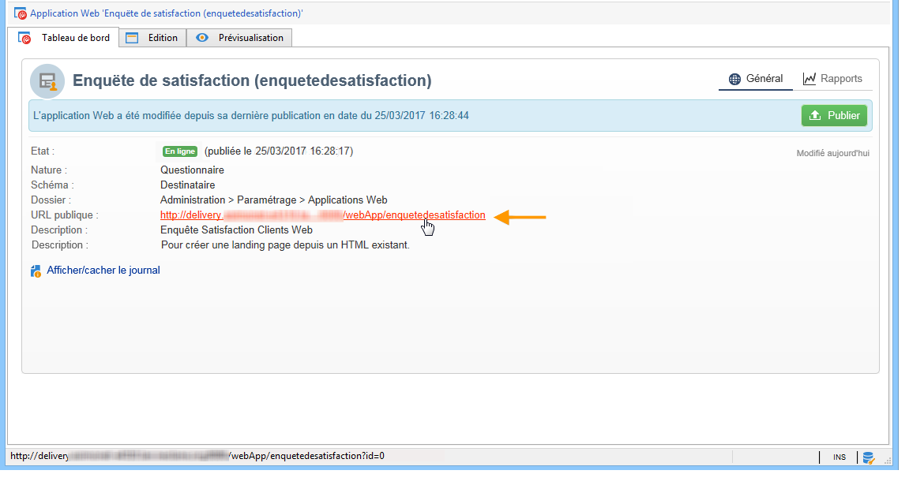

## Suivre les réponses {#response-tracking}

Vous pouvez suivre les réponses au questionnaire dans les logs et dans les rapports.

### Les logs de questionnaires {#survey-logs}

Pour chaque questionnaire diffusé, vous pouvez suivre les réponses dans l&#39;onglet **[!UICONTROL Réponses]**. Cet onglet affiche la liste des utilisateurs ayant remplis le questionnaire et les réponses fournies.

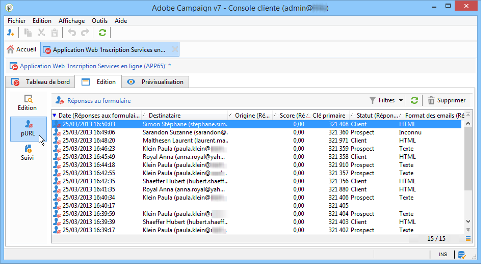

Double-cliquez sur une ligne pour afficher le questionnaire tel qu’il a été rempli par le destinataire. Vous pouvez consulter toutes les pages du questionnaire et ainsi accéder à l’intégralité des réponses. Il est possible d’exporter ensuite ces réponses dans un fichier externe. Voir à ce sujet la section [Exporter les réponses](#exporting-answers).

L&#39;origine est une information indiquée dans l&#39;URL du questionnaire en y ajoutant les caractères suivants :

```
?origin=xxx
```

Tant que le questionnaire est en édition, son URL contient le paramètre **[!UICONTROL __uuid]**, qui permet de signifier qu&#39;il est en phase de test et pas encore en ligne. Lorsque vous accédez au questionnaire via cette URL, les enregistrements créés ne sont pas pris en compte dans le suivi (rapports). L&#39;origine est alors forcée à la valeur **[!UICONTROL Adobe Campaign]**.

Pour plus d&#39;informations sur les paramètres d&#39;URL, consultez [cette page](../../web/using/defining-web-forms-properties.md#form-url-parameters).

### Les rapports sur les questionnaires {#reports-on-surveys}

Le tableau de bord permet d&#39;accéder aux rapports sur le questionnaire. Cliquez sur le nom d&#39;un rapport pour le visualiser.


La structure du questionnaire est synthétisée dans le rapport **[!UICONTROL Documentation]**.

Deux autres rapports sur les questionnaires Web sont également disponibles par défaut dans l&#39;onglet **[!UICONTROL Rapports]** des questionnaires : **[!UICONTROL Général]** et **[!UICONTROL Répartition des réponses]**.

* Général

   Ce rapport regroupe des informations générales sur le questionnaire : l&#39;évolution du nombre de réponses dans le temps, la répartition par origines et par langues.

   Exemple de rapport général :

   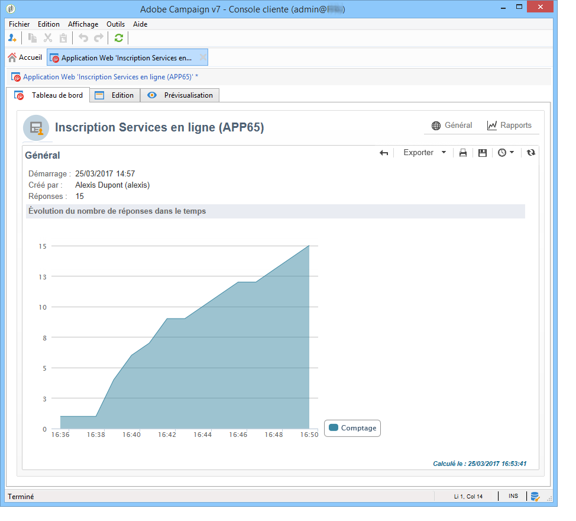

* Répartition des réponses

   Ce rapport permet de consulter la répartition des réponses pour chaque question. Cette répartition n&#39;est disponible que pour les réponses fournies à des champs stockés dans des conteneurs de type **[!UICONTROL Question]**. Elle n&#39;est valable que pour les contrôles de sélection (pas de répartition sur les champs de type texte, par exemple).

   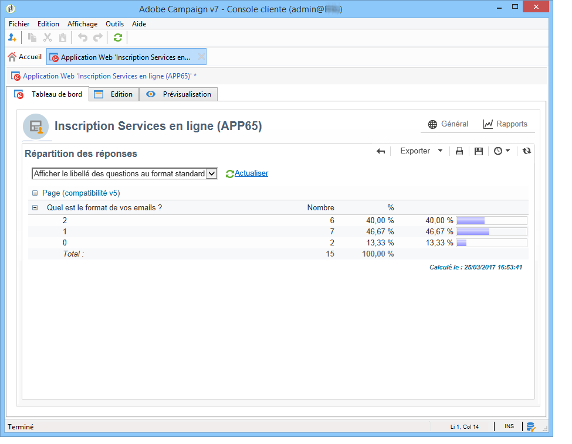

## Exporter les réponses {#exporting-answers}

Les réponses à un questionnaire peuvent être exportées dans un fichier externe afin d&#39;être réexploitées ultérieurement. Pour cela, deux opérations sont possibles :

1. Exporter les données d&#39;un rapport

   Pour exporter les données d&#39;un rapport, cliquez sur le bouton **[!UICONTROL Exporter]** et sélectionnez le format d&#39;export.

   L&#39;export des données d&#39;un rapport est présenté dans [cette section](../../reporting/using/about-reports-creation-in-campaign.md).

1. Exporter les réponses

   Pour exporter les réponses, cliquez sur l&#39;onglet **[!UICONTROL Réponses]** du questionnaire et cliquez avec le bouton droit de la souris. Choisissez **[!UICONTROL Exporter...]**.

   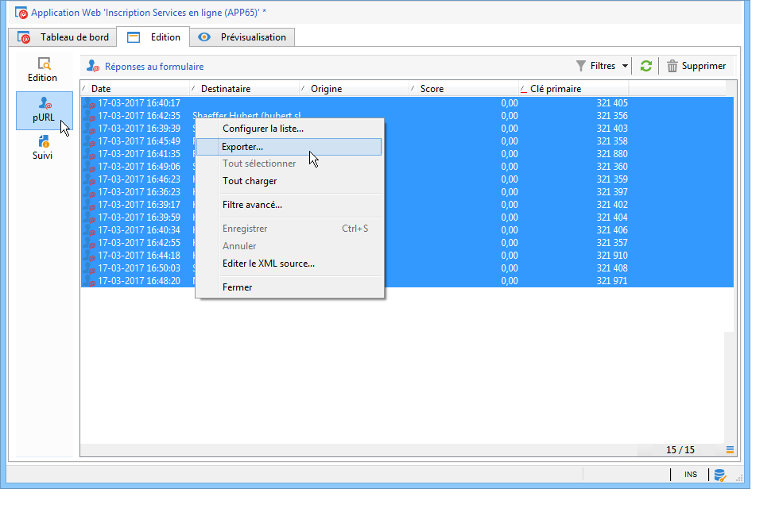

   Indiquez ensuite les informations à exporter et fichier d&#39;enregistrement.

   Vous pouvez paramétrer le contenu et le format du fichier de sortie dans l&#39;assistant d&#39;export.

   Ainsi, vous pouvez :

   * ajouter des colonnes supplémentaires dans le fichier de sortie et ainsi récupérer les informations stockées en base relatives au destinataire,
   * appliquer un formatage sur les données exportées,
   * sélectionner le format d&#39;encodage des informations dans le fichier.

   Si le questionnaire dont vous souhaitez exporter les réponses contient un ou plusieurs champs de type **[!UICONTROL Texte multi-lignes]** ou **[!UICONTROL Texte HTML]**, vous devez l&#39;exporter au format **[!UICONTROL XML]**. Pour cela, sélectionnez ce format dans la liste déroulante du champ **[!UICONTROL Format de sortie]**, comme ci-dessous :

   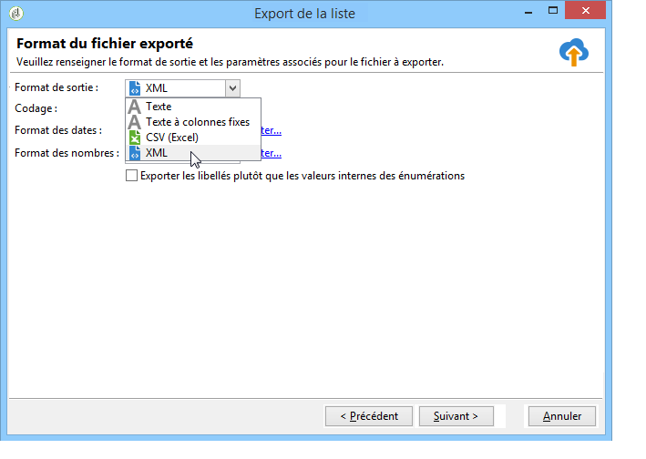

   Cliquez sur **[!UICONTROL Démarrer]** pour lancer l&#39;export.

   >[!NOTE]
   >
   >Le déroulement d&#39;un export de données et les étapes de son paramétrage sont détaillés dans [cette section](../../platform/using/about-generic-imports-exports.md).

## Utiliser les données collectées {#using-the-collected-data}

Les informations collectées au travers des questionnaires en ligne peuvent être récupérées dans le cadre d&#39;un workflow de ciblage. Pour cela, utilisez la boîte **[!UICONTROL Réponses à un questionnaire]**.

Dans l&#39;exemple suivant, nous allons proposer une offre Web spécifique aux cinq destinataires parents d&#39;au moins deux enfants et ayant réalisé le meilleur score à un questionnaire en ligne. Les réponses à ce questionnaire sont les suivantes :

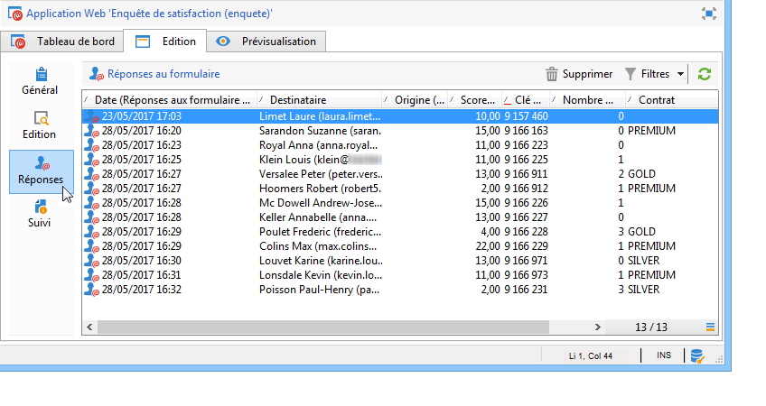

Dans le workflow de ciblage, la boîte **[!UICONTROL Réponses à un questionnaire]** sera paramétrée comme suit :

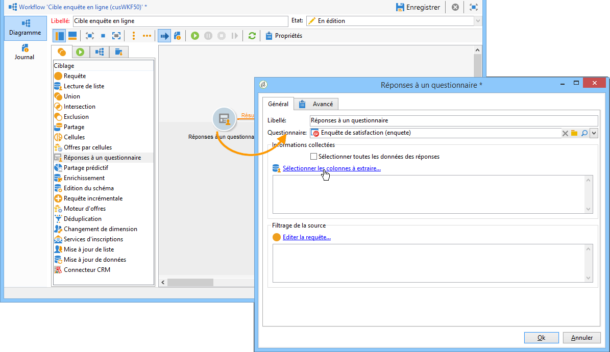

Sélectionnez le questionnaire concerné puis les données à extraire dans la section centrale de la fenêtre. Ici, il est nécessaire d&#39;extraire au moins la colonne du score car elle sera utilisée dans la boîte de partage afin de ne récupérer que les cinq meilleurs scores parmi les réponses fournies.

Indiquez les conditions de filtrage des réponses en cliquant sur le lien **[!UICONTROL Editer la requête...]**.

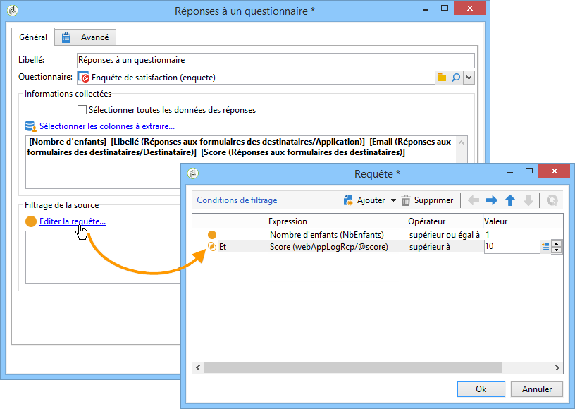

Démarrez le workflow de ciblage. La requête permet de récupérer 8 destinataires.

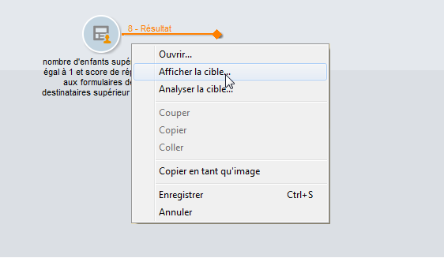

Cliquez avec le bouton droit de la souris sur la transition sortante de la boîte de collecte pour les visualiser.

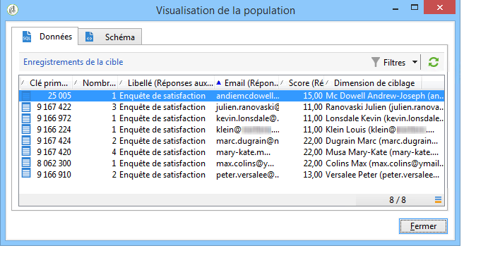

Positionnez ensuite dans le workflow une boîte de partage afin de ne récupérer que les 5 destinataires ayant obtenu le meilleur score.

Editez la boîte de partage pour la paramétrer :

* Sélectionnez d&#39;abord le schéma adéquat dans l&#39;onglet **[!UICONTROL Général]** avant de paramétrer le sous-ensemble :

   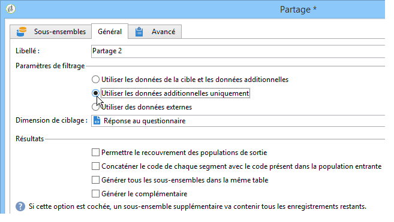

* Dans l&#39;onglet **[!UICONTROL Sous-ensembles]**, sélectionnez l&#39;option **[!UICONTROL Limiter les enregistrements sélectionnés]** puis cliquez sur le lien **[!UICONTROL Editer...]**.

   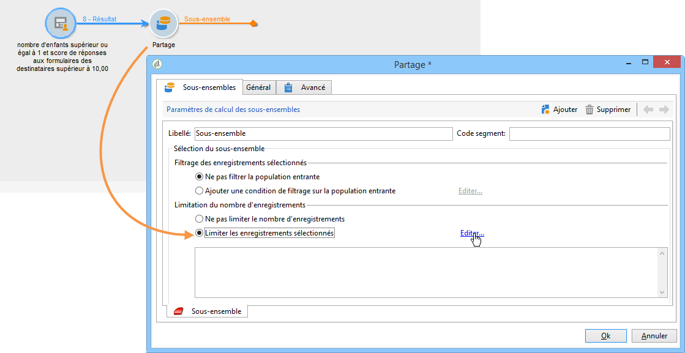

* Sélectionnez l&#39;option **[!UICONTROL Conserver les premiers suite à un tri]** et indiquez la colonne de tri. Cochez l&#39;option **[!UICONTROL Tri descendant]**.

   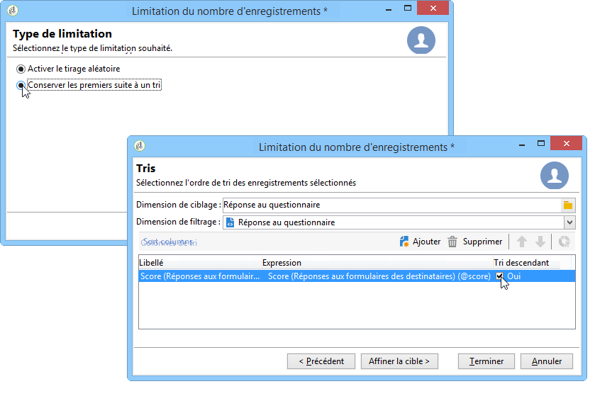

* Cliquez sur le bouton **[!UICONTROL Suivant]** et limitez le nombre d&#39;enregistrements à 5.

   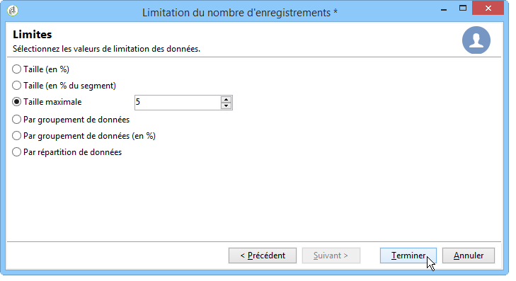

* Cliquez sur **[!UICONTROL Terminer]** puis relancez le workflow pour valider le ciblage.

## Normaliser les données {#standardizing-data}

Vous pouvez mettre en place dans Adobe Campaign des processus de normalisation des données collectées en utilisant les alias. Il est alors possible de normaliser les données stockées en base : pour cela, vous devez définir des alias au niveau des énumérations dans lesquelles les informations sont stockées. [En savoir plus](../../platform/using/managing-enumerations.md#about-enumerations)
