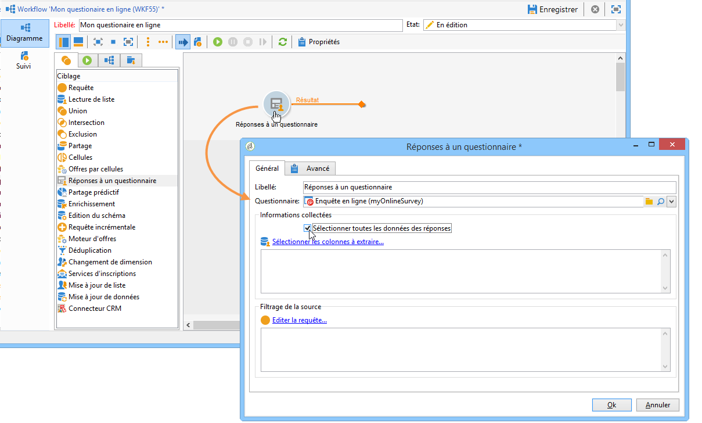
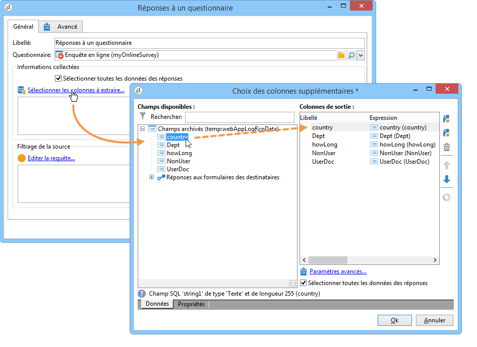
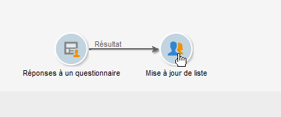
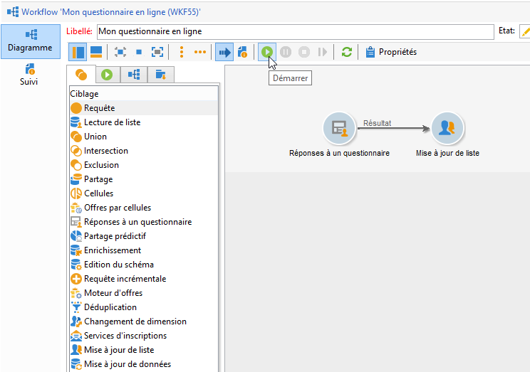
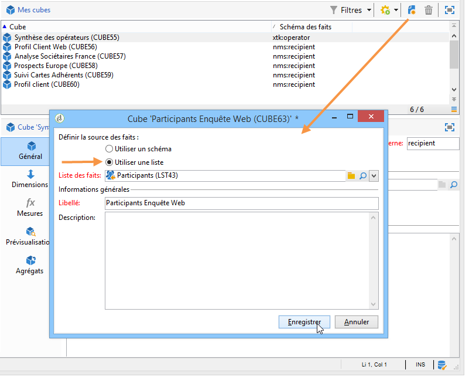
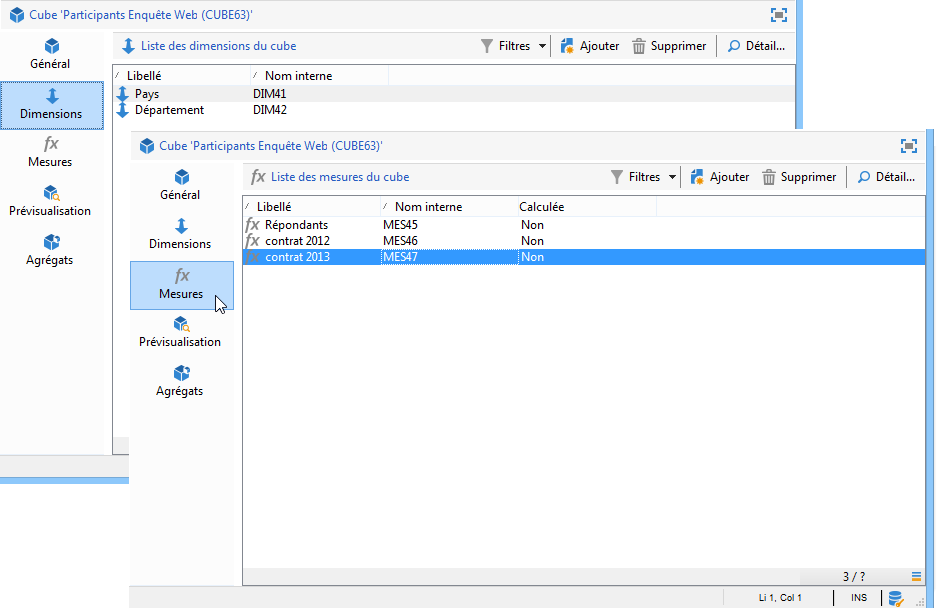
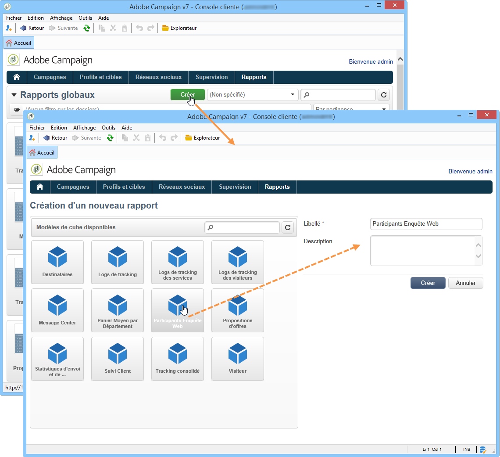
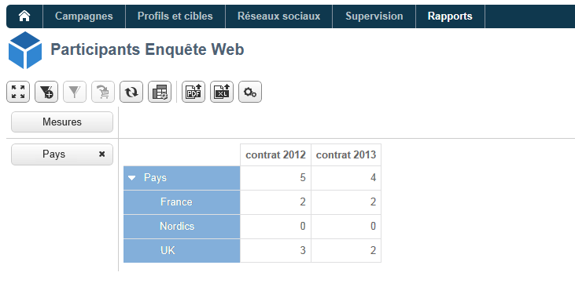

# Cas d’utilisation : affichage d’un rapport sur les réponses à un questionnaire en ligne{#use-case-displaying-report-on-answers-to-an-online-survey}

Les réponses à des questionnaires Adobe Campaign peuvent être collectées et analysées dans des rapports dédiés.

Dans l&#39;exemple ci-dessous, nous allons collecter les réponses à un questionnaire en ligne et les afficher dans un rapport sous la forme d&#39;un tableau croisé dynamique.

Les étapes sont les suivantes :

1. Créer un workflow pour récupérer les réponses au questionnaire et les stocker dans une liste.
1. Créer un cube utilisant les données de la liste.
1. Créer un rapport avec un tableau croisé dynamique et consulter la répartition des réponses.

Avant de démarrer ce cas pratique, vous devez disposer d&#39;un questionnaire et d&#39;un jeu de réponses à analyser.

>[!NOTE]
>
>Ce cas pratique ne peut être mis en oeuvre que si vous avez acquis l&#39;option **Survey Manager**. Vérifiez votre contrat de licence.

## Etape 1 - Créer le workflow de collecte et stockage des données {#step-1---creating-the-data-collection-and-storage-workflow}

Pour collecter les réponses du questionnaire, les étapes sont les suivantes :

1. Créez un workflow et positionnez une activité **[!UICONTROL Réponses à un questionnaire]**. L’utilisation de cette activité est présentée dans [cette section](../../surveys/using/publish--track-and-use-collected-data.md#using-the-collected-data).
1. Editez l&#39;activité et sélectionnez le questionnaire dont vous souhaitez analyser les réponses.
1. Activez l&#39;option **[!UICONTROL Sélectionner toutes les données des réponses]** afin de collecter toutes les informations.

   

1. Sélectionnez les colonnes à extraire (ici : tous les champs archivés). Les réponses sont stockées dans ces champs.

   

1. Une fois la boîte de collecte des réponses paramétrée, positionnez une activité de type **[!UICONTROL Mise à jour de liste]** pour sauvegarder ces données.

   

   Dans cette activité, indiquez la liste à mettre à jour et désélectionnez l&#39;option **[!UICONTROL Purger puis réutiliser la liste si elle existe (sinon la compléter)]** : les réponses seront ajoutées à la table existante. Cette option permettra de référencer la liste dans un cube : le schéma associé à la liste ne sera pas regénéré à chaque mise à jour, ce qui permet de garantir l&#39;intégrité du cube utilisant cette liste.

   

1. Démarrez le workflow pour en valider la configuration.

   

   La liste spécifiée est alors créée et contient le schéma des réponses au questionnaire.

1. Ajoutez un planificateur afin d&#39;automatiser une collecte quotidienne des réponses et la mise à jour de la liste.

   Les activités **[!UICONTROL Mise à jour de liste]** et **[!UICONTROL Planificateur]** sont présentées dans la section.

## Etape 2 - Créer le cube, ses mesures et ses indicateurs {#step-2---creating-the-cube--its-measures-and-its-indicators}

Vous pouvez ensuite créer le cube et paramétrer ses mesures : elles seront utilisées lors de la création des indicateurs. Ces indicateurs seront affichés dans le rapport. La création et le paramétrage des cubes sont présentés dans la section [À propos des cubes](../../reporting/using/about-cubes.md).

Dans cet exemple, le cube est basé sur les données de la liste alimentée par le workflow créé à l&#39;étape précédente.

Définissez les dimensions et mesures à afficher dans le rapport. Ici, nous afficherons la date du contrat et le pays du participant.

L&#39;onglet **[!UICONTROL Prévisualisation]** permet de contrôler le rendu du rapport.

## Etape 3 - Créer le rapport et paramétrer l&#39;affichage des données dans le tableau {#step-3---creating-the-report-and-configuring-the-data-layout-within-the-table}

Vous pouvez ensuite créer un rapport basé sur ce cube et en exploiter les données et les informations.

Adaptez les informations à afficher selon vos besoins.

