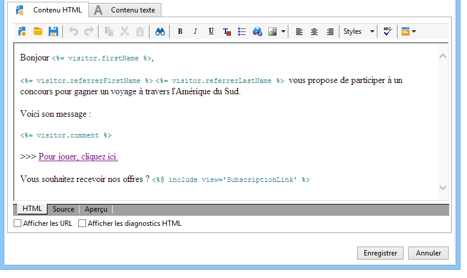

# Cas d’utilisation : création d’un formulaire de référence{#use-case-creating-a-refer-a-friend-form}


Dans cet exemple, nous allons proposer un jeu-concours aux destinataires de la base de données. Le formulaire Web de participation permettra au destinataire, en plus de ses réponses, de parrainer un ami auquel ce jeu pourra être proposé, en communiquant son adresse email.


Les blocs d&#39;identification et de jeu sont construits selon les procédures décrites ci-avant, dans ce document.

Les étapes de paramétrage et de réalisation du bloc de parrainage sont les suivantes :

1. Créez un formulaire Web de jeu-concours, avec des questions et une zone de saisie des coordonnées d&#39;un ami, comme dans l&#39;exemple ci-dessous :

   

   Le champ **Votre message** permet de saisir un message à l&#39;intention du filleul. Le parrain doit également saisir **Son nom**, **Son prénom** et **Son email**.

   Les informations saisies dans les champs sont stockées dans une table spécifique : la table des visiteurs.

   >[!NOTE]
   >
   >Tant que le destinataire n&#39;a pas exprimé son consentement, vous ne pouvez pas le stocker parmi les destinataires la base de données. Elles seront stockées temporairement dans la table **visiteur** (**nms:visitor**) conçue pour les campagnes marketing virales. Cette table est régulièrement purgée de son contenu par les opérations de **cleansing**.
   >
   >Dans notre exemple, nous allons en cibler les destinataires pour leur proposer de participer à ce concours, sur les conseils de leur parrain. Vous allez toutefois leur proposer, dans ce message, un abonnement à l&#39;un de vos services d&#39;information. S&#39;ils acceptent, ils pourront être stockés en base.

   

   Le contenu des champs relatifs au filleul sera utilisé dans le script de création de son profil ainsi que dans le message qui lui sera adressé.

1. Créez un premier script afin d&#39;associer le parrain à son filleul.

   Il contient les instructions suivantes :

   

   ```
   ctx.recipient.visitor.@id = xtk.session.GetNewIds(1)
   ctx.recipient.visitor.@forwardUrl = "APP5"
   ctx.recipient.visitor.@referrerEmail = ctx.recipient.@email
   ctx.recipient.visitor.@referrerFirstName = ctx.recipient.@firstName
   ctx.recipient.visitor.@referrerLastName = ctx.recipient.@lastName
   ```

   Le nom, le prénom et l&#39;adresse email renseignées dans le bloc d&#39;identification de la page sont identifiés comme les nom, prénom et adresse email du parrain. Ces champs seront réinjectées dans le corps du message adressé au filleul.

   La valeur APP5 correspond au nom interne du formulaire Web : cette information permet de connaître l&#39;origine du filleul, c&#39;est-à-dire d&#39;associer le visiteur au formulaire Web à partir duquel il a été créé.

1. La boîte d&#39;enregistrement permet de collecter les informations et les stocker dans la base de données.

   

1. Créez ensuite le modèle de diffusion associé au service d&#39;information créé lors de l&#39;étape 1. Il sera sélectionné dans le champ **[!UICONTROL Choix du scénario]** du service d&#39;information.

   Le modèle de diffusion utilisé pour créer le message de proposition de parrainage contient les informations suivantes :

   

   Les caractéristiques de ce modèle sont les suivantes :

   * Vous devez sélectionner la table des visiteurs comme mapping de ciblage.

     

   * Les coordonnées du filleul, ainsi que les informations relatives au parrain, proviennent de la table des visiteurs. Elles sont insérées en utilisant le bouton de personnalisation.

     

   * Ce modèle contient un lien vers le formulaire du jeu-concours et le lien d&#39;inscription pour que le filleul puisse s&#39;abonner à la newsletter.

     Le lien d&#39;inscription est inséré au travers d&#39;un bloc de personnalisation. Par défaut, il permet d&#39;abonner les profils au service **newsletter**. Ce bloc de personnalisation peut être modifié selon vos besoins, par exemple pour inscrire à un autre service.

   * Le nom interne (ici &#39;referrer&#39;) sera utilisé dans le script d&#39;envoi du message, à l&#39;étape suivante.

   >[!NOTE]
   >
   >Pour plus d’informations sur les modèles de diffusion[&#x200B; consultez la documentation &#x200B;](https://experienceleague.adobe.com/docs/campaign/campaign-v8/send/create-templates.html?lang=fr){target="_blank"} Campaign v8 .

1. Créez le second script qui permet de procéder à l&#39;envoi des messages de parrainage.

   

   ```
   // Updtate visitor to have a link to the referrer recipient
   ctx.recipient.visitor.@referrerId = ctx.recipient.@id
   ctx.recipient.visitor.@xtkschema = "nms:visitor"
   ctx.recipient.visitor.@_operation = "update" 
   ctx.recipient.visitor.@_key = "@id" 
   xtk.session.Write(ctx.recipient.visitor)
   
   // Send email to friend
   nms.delivery.QueueNotification("referrer",
   <delivery>
   <targets>
     <deliveryTarget>
       <targetPart type='query' exclusion='false' ignoreDeleteStatus='false'>
         <where>
           <condition expr={'@id IN ('+ ctx.recipient.visitor.@id +')' }/>
         </where>
       </targetPart>
      </deliveryTarget>
     </targets>
    </delivery>)
   ```

1. Publiez le formulaire du jeu-concours et envoyez une proposition de participation aux destinataires de la cible initiale. Lorsque l&#39;un d&#39;entre eux souhaite inviter un ami à participer, une diffusion basée sur le modèle **Offre de parrainage** est créée.

   

   Le filleul est ajouté dans le dossier des visiteurs, sous le noeud **[!UICONTROL Administration > Visiteurs]** :

   

   Son profil contient les informations saisies par son parrain. Elles sont stockées selon les paramétrages saisis dans le script du formulaire. Il sera enregistré dans la table des destinataires s&#39;il choisit de s&#39;inscrire à la newsletter.
