# Protection de la confidentialité des e-mails dans l’application Mail d’Apple


## Qu’est-ce qui a changé ?

En 2021, Apple a mis en place de nouvelles fonctionnalités de protection de la confidentialité pour son application de messagerie native. Cette application comprend désormais la fonctionnalité Protection de la confidentialité dans Mail d’Apple. En substance, les expéditeurs et les expéditrices ne peuvent plus utiliser les pixels de tracking pour collecter des informations sur les destinataires qui ont choisi d’activer la fonctionnalité de protection de la confidentialité dans Mail d’Apple.

## Comment cela affecte-t-il mes campagnes ?

Adobe Campaign permet d’utiliser les pixels de tracking pour suivre les ouvertures d’e-mail. Vous pouvez non seulement utiliser cette fonctionnalité pour le ciblage et les campagnes, mais également pour les mesures. Vous pouvez, par exemple, utiliser les taux d’ouverture d’e-mails pour mesurer l’efficacité d’une campagne ainsi que l’interaction client. En bref, il peut y avoir une incidence sur la segmentation, le ciblage et les mesures de vos campagnes.

## Quelles actions dois-je entreprendre ?

La nouvelle fonctionnalité mise en place par Apple est un indicateur des évolutions à venir du secteur en ce qui concerne la protection de la confidentialité des e-mails. Nous vous invitons fortement à suivre les recommandations d’Adobe.

### Évaluation de l’incidence sur vos déclencheurs de campagne

Évaluez l’incidence de ces modifications sur vos déclencheurs de campagne actuels. Identifiez les workflows dans lesquels les ouvertures d’e-mails sont utilisées comme critère de segmentation, de ciblage ou de reciblage. Lisez les [conseils et astuces](#find-email-open-tracking).

### Conservation de vos données

Préservez vos données et consolidez vos connaissances actuelles sur les appareils. Vous pouvez baser les indicateurs clés de performance (KPI) sur l’agent utilisateur. Vous pouvez, par exemple, créer des KPI en fonction de profils d’utilisateurs qui ont recours à iOS et à l’application Mail d’Apple. Lisez les [conseils et astuces](#preserve-tracking-data).

### Archivage de vos logs de tracking au-delà de la période de conservation

Archivez vos logs de tracking au-delà de la période de conservation d’Adobe Campaign :

1. Vérifiez la durée de la période de conservation dans votre instance de campagne.
1. Vérifiez à nouveau vos mappings de ciblage actifs. Déterminez si vous utilisez des tables de profils personnalisés en plus de la table des profils d’usine (`nmsRecipient`).
1. Exportez vos logs de tracking depuis Adobe Campaign. Incluez les logs qui contiennent des données sur l’agent utilisateur et le système d’exploitation.

### Évaluation de la tendance actuelle des taux d’ouverture

Déterminez quelle proportion de votre audience utilise l’application Mail d’Apple sur un appareil iOS.
Grâce à cette évaluation, vous pouvez identifier les anomalies potentielles et leur cause. Vous pouvez déterminer si un écart est dû à des problèmes de performances de campagne ou à la fonctionnalité de protection de la confidentialité d’Apple. Lisez les [conseils et astuces](#measure-ios-footprint).

### Réévaluation de votre stratégie de campagne et de vos mesures de performances

Surtout, nous vous recommandons vivement de réévaluer de manière proactive votre stratégie de campagne et vos mesures de performances de campagne. Vous pouvez rediriger votre attention sur des mesures plus fiables, comme les clics publicitaires, les consultations de produits et les achats.

Nous vous recommandons d’explorer les données actuellement disponibles et d’évaluer la corrélation entre les taux d’ouverture et d’autres mesures. Si la corrélation de ces mesures est cohérente, vous pouvez améliorer vos déclencheurs avec un degré de confiance élevé.

## Conseils et astuces

### Mesure de l’empreinte globale d’iOS {#measure-ios-footprint}

Pour collecter des informations à partir des données Adobe Campaign, vous pouvez utiliser les rapports d’usine suivants :

* Rapport sur les **[!UICONTROL Systèmes d’exploitation]**

  Pour identifier la proportion de visiteurs par système d’exploitation et par version, utilisez ce rapport. [En savoir plus](../../reporting/using/global-reports.md#operating-systems).

  Vous pouvez afficher la répartition des visiteurs par système d’exploitation au regard du nombre total de visiteurs.

  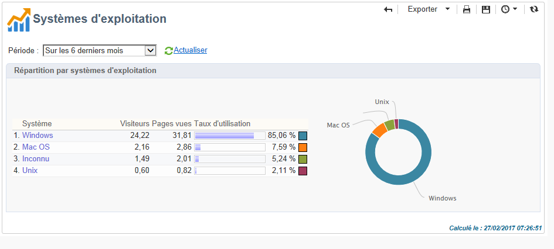

  Pour chaque système d’exploitation, vous pouvez afficher la répartition des visiteurs en fonction de la version du système d’exploitation.

  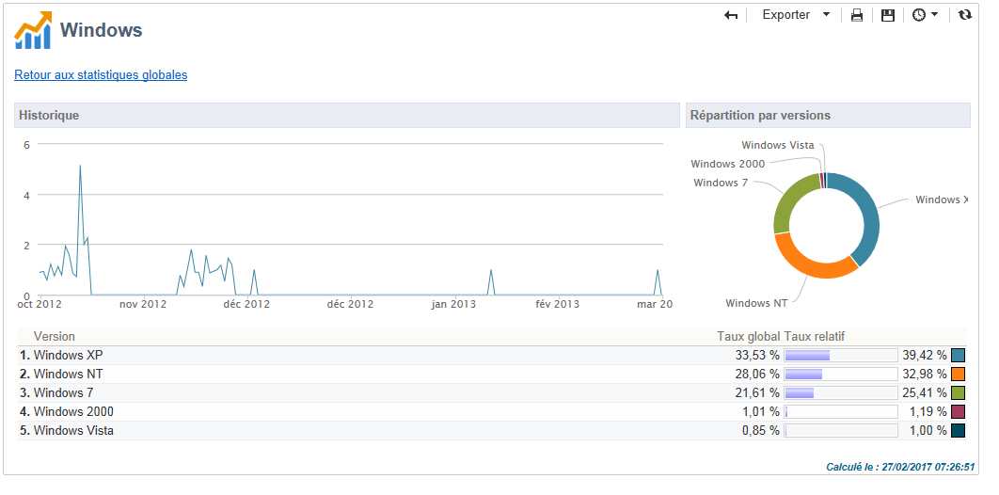

* Rapport sur la **[!UICONTROL Répartition des ouvertures]**

  Utilisez ce rapport pour identifier la proportion d’ouvertures d’e-mails par système d’exploitation. [En savoir plus](../../reporting/using/global-reports.md#breakdown-of-opens).

  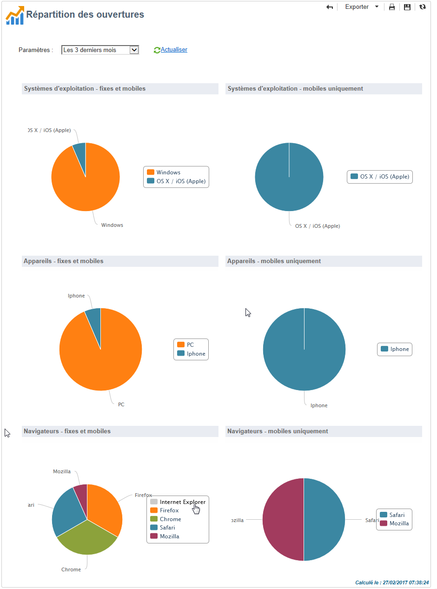

### Déterminer l’utilisation du suivi des ouvertures d’e-mails {#find-email-open-tracking}

Vous pouvez identifier les workflows qui utilisent les ouvertures d’e-mails comme critère de segmentation, de ciblage et de reciblage.

Pour cela, vous pouvez utiliser l’attribut **[!UICONTROL type]** de l’URL du lien suivi (**[!UICONTROL url/@type]**). Pour les ouvertures d’e-mail, cet attribut est défini sur **[!UICONTROL Ouverture]**. Cet attribut est disponible à partir du requêteur, de l’activité **[!UICONTROL Requête]** d’un workflow et des filtres prédéfinis. Vous pouvez utiliser cet attribut comme critère de ciblage pour les campagnes marketing.

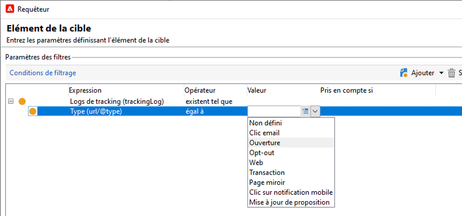

Dans cet exemple, un spécialiste marketing souhaite envoyer une offre de récompense aux destinataires qui ont ouvert un e-mail de diffusion particulier au cours des sept derniers jours et effectué un achat au cours du dernier mois. Dans les requêtes de workflow, vous pouvez utiliser les ouvertures d’e-mail de différentes manières :

* Vous pouvez utiliser les ouvertures d’e-mail comme critère de ciblage dans une requête.

  Vous pouvez indiquer, sous forme de condition de filtrage, que le type d’URL des logs de tracking d’une diffusion spécifique doit être défini sur **[!UICONTROL Ouverture]**.

  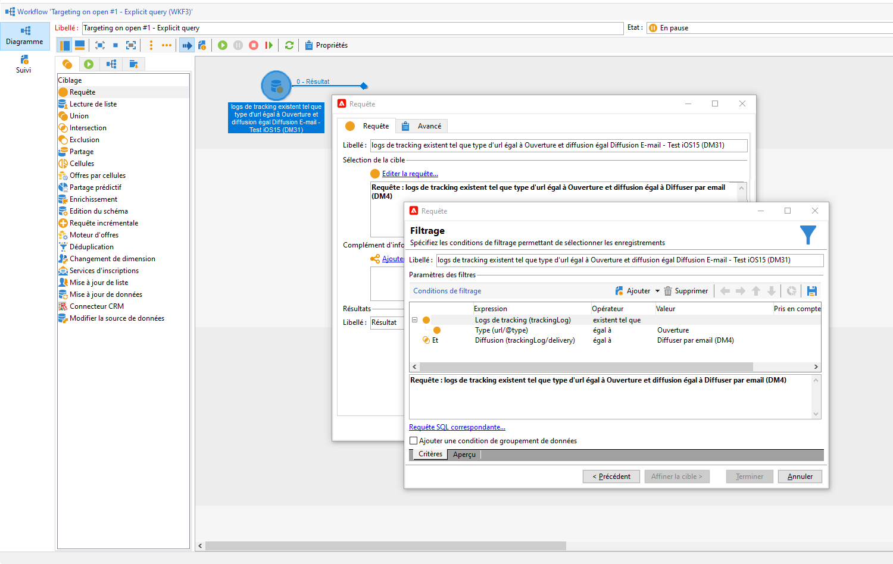

* Vous pouvez utiliser un filtre prédéfini. Consultez la [documentation de Campaign v8](https://experienceleague.adobe.com/docs/campaign/automation/workflows/use-cases/designing-queries/create-a-filter.html?lang=fr){target="_blank"}.

  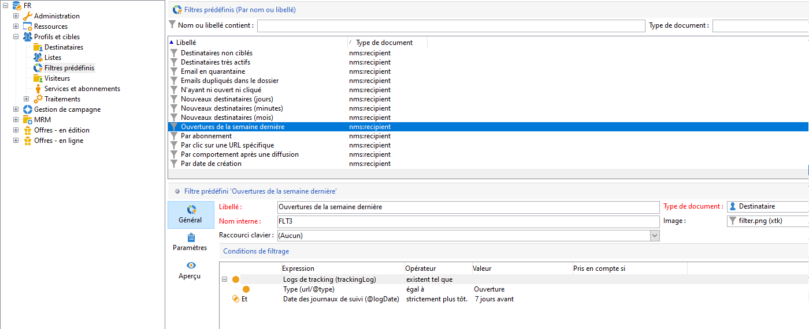

  Vous pouvez utiliser ce filtre prédéfini dans les activités de requête des workflows.

  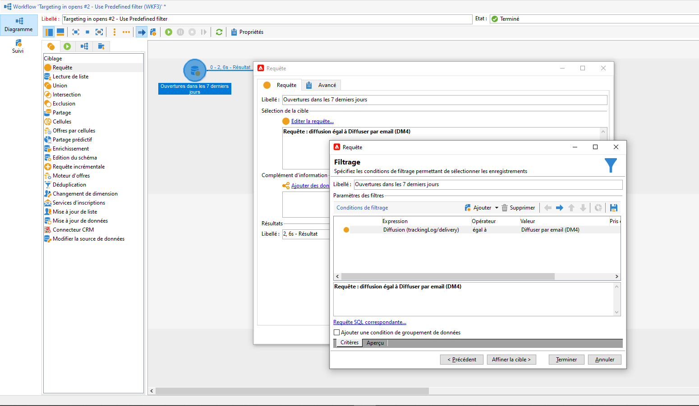

  >[!NOTE]
  >
  >Vous ne pouvez pas afficher les critères de ciblage d’un filtre prédéfini depuis un workflow.

Pour récupérer la liste de workflows qui utilisent les ouvertures d’e-mail comme critère de ciblage, vous devez effectuer une requête au schéma `xtk:workflow`. Le contenu du workflow est stocké dans le champ **[!UICONTROL Mémo XML (données)]** au format XML.

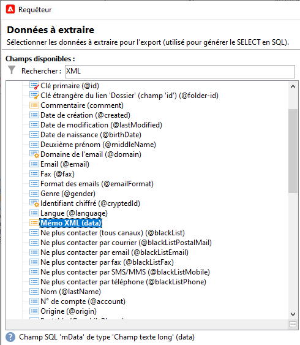

Vous pouvez préciser que les workflows doivent inclure le contenu suivant :

`expr="[url/@type] = 2"`

Ce critère de ciblage signifie que le type de l’URL suivie doit être défini sur **[!UICONTROL Ouverture]**.

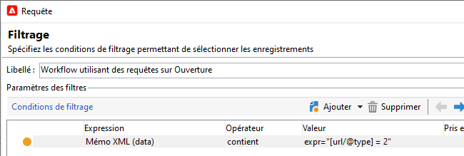

#### Exemple d’implémentation et de package

Vous pouvez utiliser cet exemple d’implémentation pour identifier les workflows qui utilisent les ouvertures d’e-mail comme critère de ciblage et envoyer une notification à l’opérateur de campagne de votre choix. Vous pouvez utiliser cette implémentation à ces fins :

* Vous pouvez mesurer l’impact potentiel que peut avoir le fait de passer des ouvertures d’e-mail à un autre KPI dans vos workflows de ciblage. Si vous n’utilisez pas les ouvertures d’e-mail, aucune autre action n’est requise.
* Au moment de réévaluer votre implémentation, vous pouvez utiliser cet exemple pour éviter la non prise en compte de workflows.

Cet exemple présente une implémentation personnalisée dans un seul workflow technique.

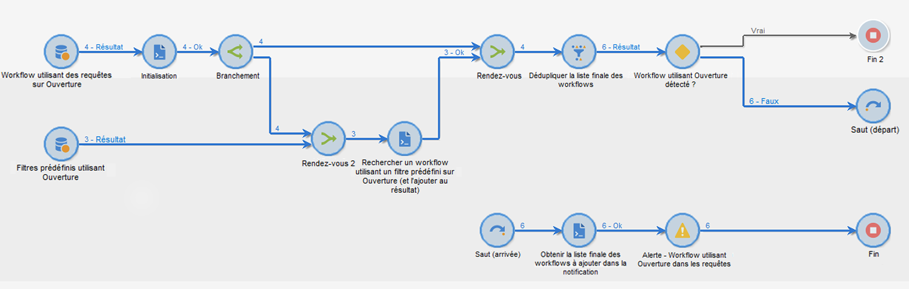

>[!IMPORTANT]
>
>Le package est fourni uniquement à titre d’exemple. Il n’est pas pris en charge par Adobe en tant que fonctionnalité de produit.
>
>Vous devrez peut-être adapter l’exemple de code à votre implémentation de campagne.
>
>L’utilisateur final est le seul responsable de l’installation et de l’utilisation de cet exemple de package.
>
>Nous vous recommandons vivement de tester et de valider ce package dans un environnement hors production.

Téléchargez et installez l’[exemple de package](assets/PKG_Search_workflows_using_Opens_in_queries_V1.xml). [En savoir plus](../../platform/using/working-with-data-packages.md#importing-packages).

Après avoir installé le package, vous pouvez accéder au workflow à partir du dossier contenant les workflows techniques d’usine de votre instance :

`/Administration/Production/Technical workflows/nmsTechnicalWorkflow`

Dans l’interface utilisateur, sélectionnez **[!UICONTROL Administration]** > **[!UICONTROL Production]** > **[!UICONTROL Workflows techniques]**.

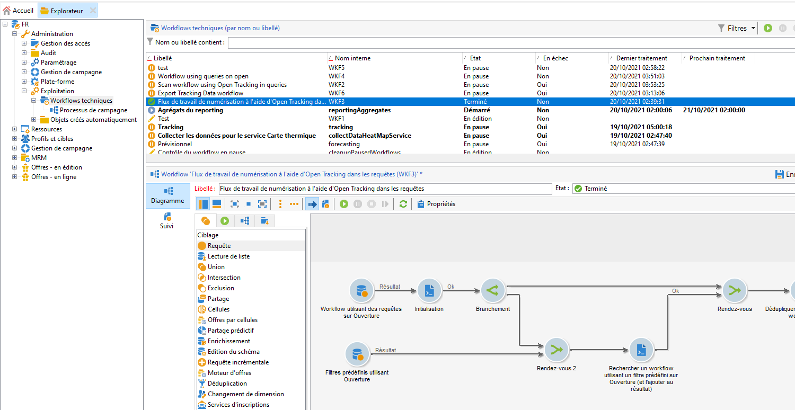

Le workflow comprend les étapes principales suivantes :

1. Répertorier les workflows qui utilisent les ouvertures d’e-mail comme critère de ciblage.
1. Répertorier les filtres prédéfinis qui utilisent les ouvertures d’e-mail comme critère de ciblage.
1. Répertorier les workflows qui utilisent ces filtres prédéfinis.
1. Fusionner les deux listes de workflows en une seule.
1. Envoyer une notification à l’opérateur spécifié par e-mail.

Le workflow comprend les étapes détaillées suivantes :

1. L’activité initiale est une activité de requête dans le schéma `xtk:workflow`. Cette activité est utilisée pour rechercher, dans l’instance correspondante, les requêtes de workflow explicites qui incluent les ouvertures d’e-mail comme critère de ciblage.

   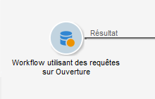

   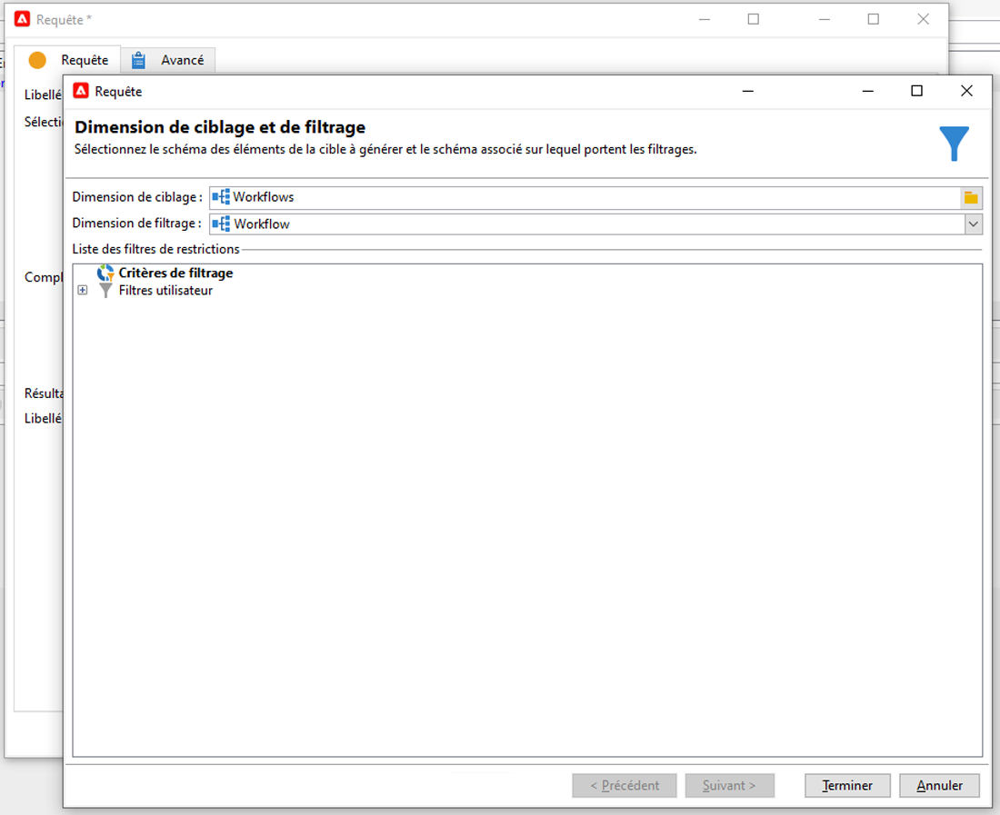

   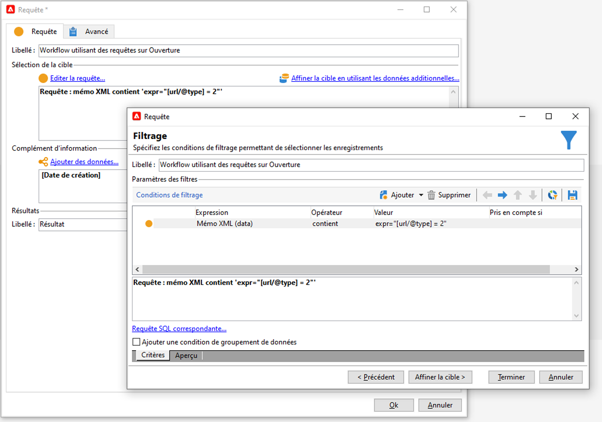

   Une liste de workflows est alors renvoyée.

   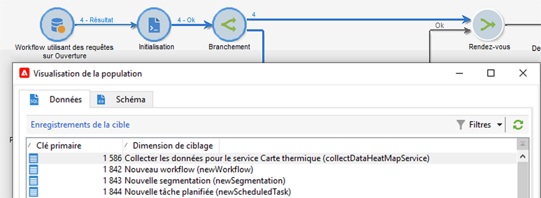

   Comme il s’agit d’informations réutilisées, le nom de la table de travail est stocké dans une variable d’instance de workflow globale.

   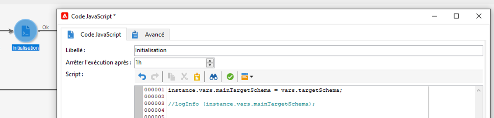

1. Une seconde requête est utilisée pour rechercher les filtres prédéfinis qui incluent les ouvertures d’e-mail.

   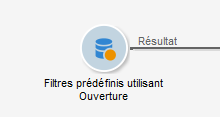

   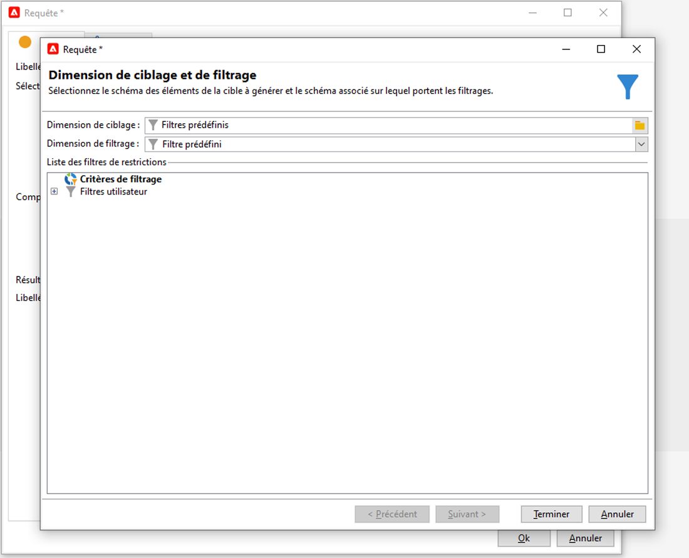

   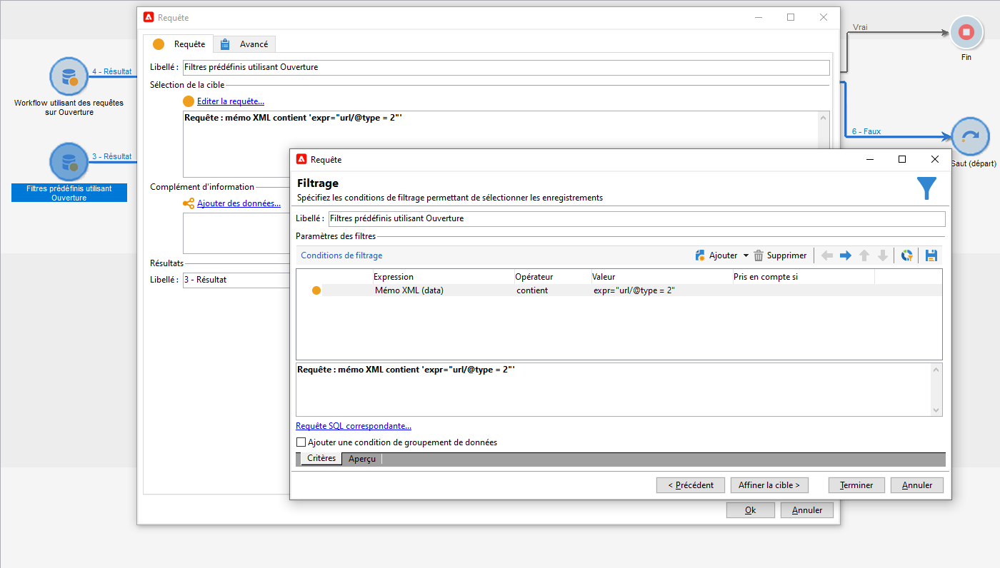

   Une liste de filtres prédéfinis est alors renvoyée.

   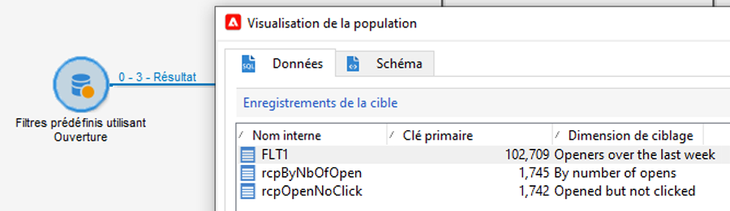

1. Cette liste de filtres prédéfinis est utilisée pour trouver les workflows dans lesquels ces filtres sont utilisés.
1. Les deux listes de workflows sont fusionnées en une seule.

   Pour cela, un code JavaScript est utilisé.

   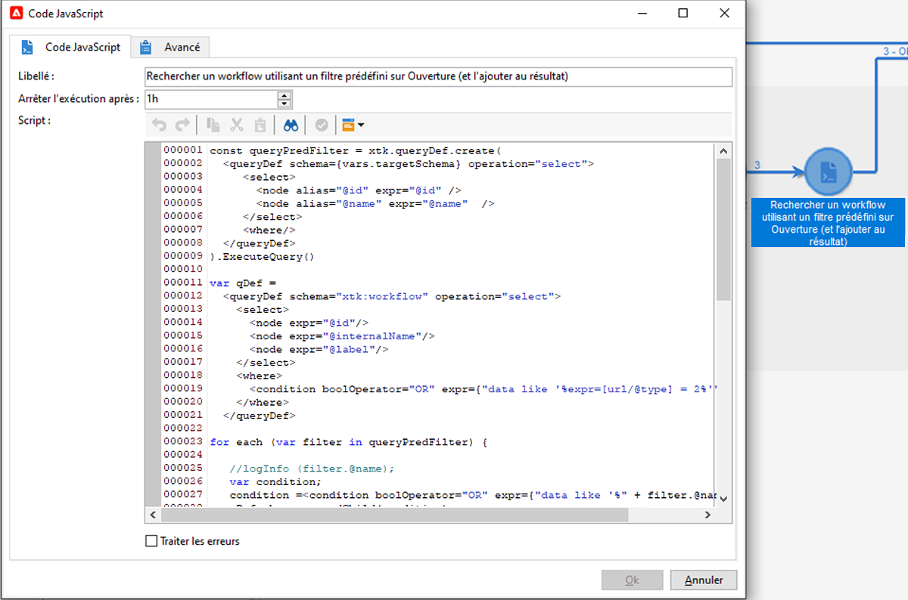

   ```javascript
   const queryPredFilter = xtk.queryDef.create(
     <queryDef schema={vars.targetSchema} operation="select">
        <select>
          <node alias="@id" expr="@id" />
          <node alias="@name" expr="@name"  />
        </select>
        <where/>
     </queryDef>
       ).ExecuteQuery()
   
   var qDef =
     <queryDef schema="xtk:workflow" operation="select">
       <select>
         <node expr="@id"/>
         <node expr="@internalName"/>
         <node expr="@label"/>
       </select>
       <where>
         <condition boolOperator="OR" expr={"data like '%expr=[url/@type] = 2%'" }/>
       </where>
     </queryDef>
   
   for each (var filter in queryPredFilter) {       
   
      //logInfo (filter.@name);
      var condition;
      condition =<condition boolOperator="OR" expr={"data like '%" + filter.@name + "%'" }/>
      qDef.where.appendChild(condition);   
   
   }
   
   var queryWorkflowList = xtk.queryDef.create(qDef);
   var workflowList = queryWorkflowList.ExecuteQuery();
   
   var sWorkflowList = "";
   var iCount = 0
   for each (var workflow in workflowList) {       
   
      //logInfo ("Workflow ID: " + workflow.@id + " in " + instance.vars.mainTargetSchema);
   
      iWorkflowId = workflow.@id;
      iWorkflowName = workflow.@internaName;
      iWorkflowLabel = workflow.@label;
   
       xtk.session.Write(
             <{instance.vars.mainTargetSchema.split(':')[1]}
               _operation="insertOrUpdate"       
               _key="@id"
               xtkschema={instance.vars.mainTargetSchema}
               id={iWorkflowId}
               internaName={iWorkflowName}
               label={iWorkflowLabel}
             />
       )
   }
   ```

1. Les workflows en double sont supprimés de la liste fusionnée.

   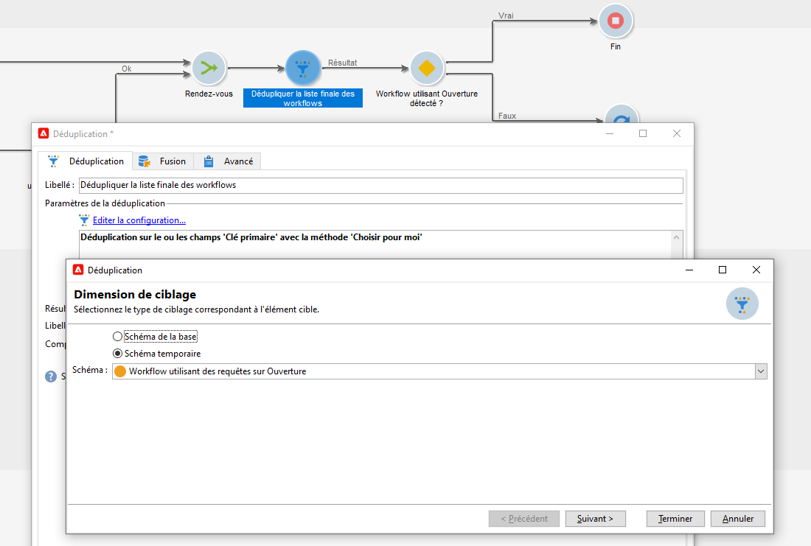

1. Un test est effectué pour vérifier que la liste n’est pas vide.

   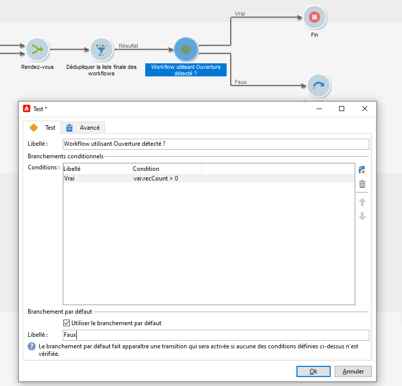

   Si la liste n’est pas vide, elle est alors insérée dans une table HTML dédiée aux notifications par e-mail.

   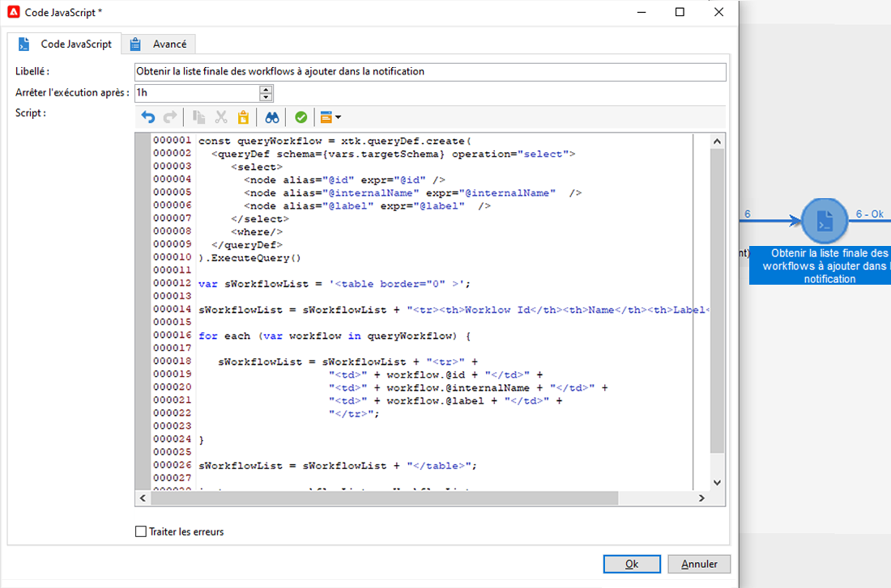

   ```js
   const queryWorkflow = xtk.queryDef.create(
       <queryDef schema={vars.targetSchema} operation="select">
           <select>
               <node alias="@id" expr="@id" />
               <node alias="@internalName" expr="@internalName"  />
               <node alias="@label" expr="@label"  />
           </select>
           <where/>
       </queryDef>
   ).ExecuteQuery()
   
   var sWorkflowList = '<table border="0" >';
   
   sWorkflowList = sWorkflowList + "<tr><th>Worklow Id</th><th>Name</th><th>Label</th></tr>";
   
   for each (var workflow in queryWorkflow) {       
   
      sWorkflowList = sWorkflowList + "<tr>" +
                       "<td>" + workflow.@id + "</td>" +
                       "<td>" + workflow.@internalName + "</td>" +
                       "<td>" + workflow.@label + "</td>" +
                       "</tr>";
   
   }
   
   sWorkflowList = sWorkflowList + "</table>";
   
   instance.vars.workflowList = sWorkflowList;
   ```

1. La table HTML est ajoutée au modèle de notification.

   ```js
   <%= instance.vars.workflowLIst%>
   ```

   

   Les notifications par e-mail contiennent la liste des workflows dont les requêtes incluent les ouvertures d’e-mail comme critère de ciblage.

   

### Conservation des données actuelles de tracking {#preserve-tracking-data}

#### Quelles sont les données affectées ?

Les données de profil sont enrichies avec les données de tracking provenant d’actions telles que les ouvertures d’e-mail et les clics publicitaires. Le tracking fournit également des informations clés sur les appareils de l’utilisateur par l’intermédiaire de l’agent utilisateur, lorsque cette information est disponible.

En résumé, les données de tracking Adobe Campaign fournissent les informations suivantes :

* Le profil associé à l’utilisateur à l’origine du clic ou de l’ouverture d’un e-mail spécifique.
* La date d’ouverture.
* L’appareil utilisé, par exemple un iPhone ou un Mac.
* Le système d’exploitation et la version, par exemple iOS 15, macOS 12 ou Windows 10.
* L’application, telle qu’une application de messagerie ou un navigateur web, ainsi que la version, par exemple Outlook 2019.

#### Pourquoi dois-je conserver les données de tracking ?

Nous vous recommandons vivement de conserver ces données, et ce, pour diverses raisons :

* Ces données sont conservées par Adobe Campaign pendant une période limitée. La période de rétention varie en fonction de la configuration de votre instance.

  Vérifiez la configuration de votre instance. [En savoir plus](../../platform/using/privacy-management.md#data-retention).

* En dépit des modifications récentes effectuées par Apple, vous pouvez utiliser les données de tracking pour ajouter une énorme valeur afin de stimuler l’engagement de votre audience.
* Il est possible qu’Apple apporte des modifications supplémentaires à son application Mail native et à sa fonctionnalité de protection de la confidentialité dans Mail.

Pour toutes ces raisons, il est vivement recommandé d’exporter ces données dès que possible. Dans le cas contraire, il peut y avoir une incidence négative sur les données de tracking d’une partie de votre audience.

#### Comment conserver les données de tracking ?

Pour conserver les données de tracking, vous devez les exporter depuis Adobe Campaign pour les transférer vers votre système d’informations. [En savoir plus](../../platform/using/get-started-data-import-export.md).

>[!IMPORTANT]
>
>L’exemple suivant se concentre sur le schéma `nms:Recipient` d’usine, qui est le schéma de profil par défaut. Si vous utilisez d’autres mappings de ciblage personnalisés associés à des profils personnalisés, nous vous recommandons d’étendre cette stratégie d’exportation à toutes les tables de logs personnalisées. [En savoir plus](../../configuration/using/target-mapping.md).

##### Principe

Par défaut, le schéma `nms:Recipient` est lié à trois schémas que vous devez exporter :

| Schéma | Contenu |
| --- | --- |
| nms:trackingLogRcp | Données de tracking, à savoir, utilisateur ou utilisatrice, heure et message concerné. |
| nms:trackingUrl | Détails concernant le lien, notamment sa nature. Par exemple, ouverture d’e-mail ou clic publicitaire. |
| nms:userAgent | Informations sur l’appareil. |

Les tables sont liées dans le modèle de données.


Utilisez ces relations pour créer une requête d’exportation unique.

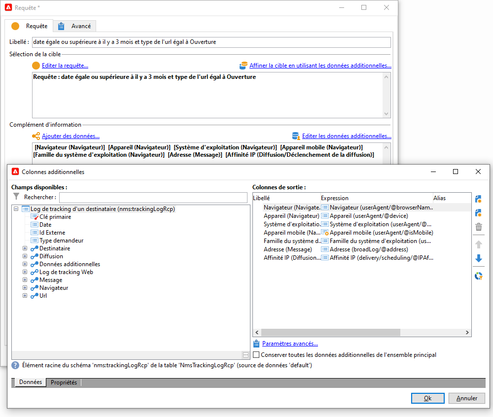

Vous pouvez enrichir ces données avec des informations utiles issues de schémas liés :

| Schéma | Contenu |
| --- | --- |
| nms:Recipient | Détails liés aux profils. |
| nms:Delivery | Informations relatives au message auquel l’utilisateur a répondu. |

Vous pouvez exporter le résultat vers une solution de stockage externe prise en charge par Adobe Campaign :

* SFTP
* S3
* Azure Blob

##### Implémentation

Cet exemple illustre comment exporter des données de tracking depuis Adobe Campaign.

1. Créez un workflow qui démarre par une requête.

   La requête initiale est utilisée pour récupérer les logs de tracking des trois derniers mois.
Vous pouvez utiliser une requête incrémentale pour extraire uniquement les enregistrements que vous n’avez pas encore exportés.

   Ajoutez toutes les informations requises à partir du nœud **[!UICONTROL Données additionnelles]**.

   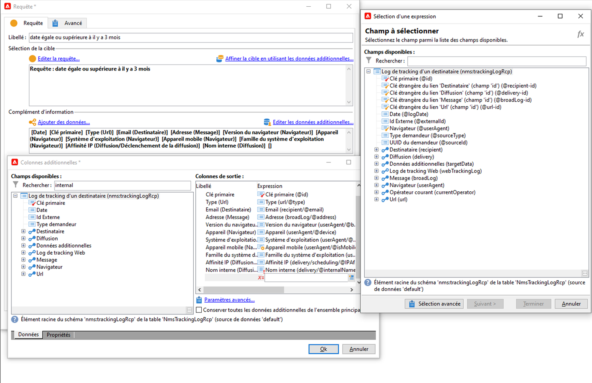

1. Ajoutez une activité **[!UICONTROL Extraction des données (fichier)]**. Mappez toutes les données de la requête vers un format de fichier d’extraction.

   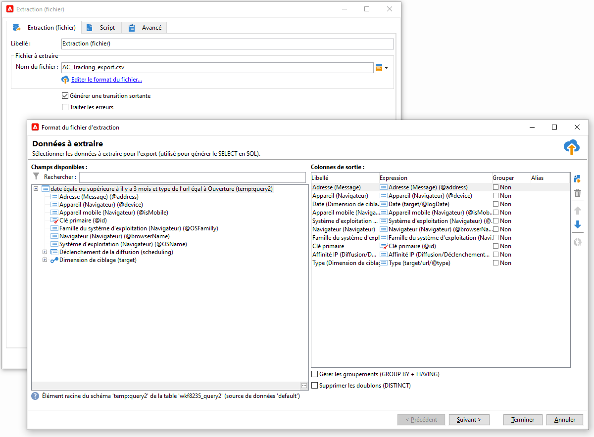

   Choisissez le format du fichier, par exemple TXT ou CSV.

   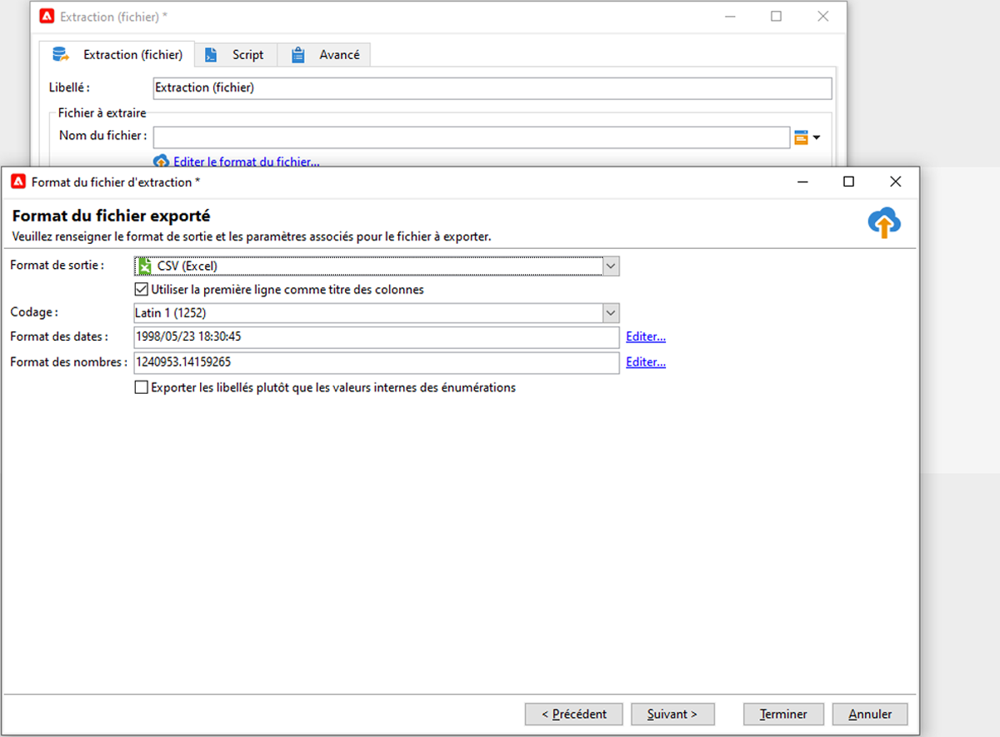

1. Ajoutez la troisième et dernière activité de téléchargement du fichier vers une solution de stockage prise en charge.

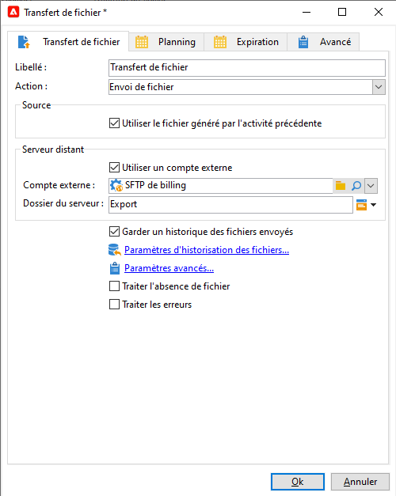

##### Implémentation avancée : répartition par appareil iOS

Vous pouvez utiliser des workflows pour déterminer si un destinataire utilise l’application Mail d’Apple. Vous pouvez fractionner les logs de tracking par appareil. Par exemple, vous pouvez utiliser des filtres de requête pour ventiler les enregistrements par appareil iOS :

| Application | Système d’exploitation ou appareil | Filtre de requête |
| --- | --- | --- |
| Apple Mail | iOS 15 | `operating System (Browser) contains 'iOS 15' and browser (Browser) contains 'ApplewebKit'` |
| Apple Mail | iOS 14 ou iOS 13 | `browser contains 'AppleWebKit' and operating System of browser contains 'iOS 14' or operating System of browser contains 'iOS 13'` |
| Apple Mail | Appareils mobiles iOS : iPad, iPod et iPhone | `device (Browser) contains iPhone or device (Browser) equal to iPod or device (Browser) equal to iPad and browser (Browser) equal to 'AppleWebKit'` |
| Apple Mail | iPhone, iPad ou iPod | `browser (Browser) equal to 'AppleWebKit' and device (Browser) equal to iPhone or device (Browser) equal to iPod or device (Browser) equal to iPad` |
| Apple Mail | Mac | `browser (Browser) equal to 'AppleWebKit' and operating System (Browser) contains 'Mac'` |
| Safari | macOS | `browser (Browser) equal to 'Safari' and device (Browser) equal to PC and operating System (Browser) contains 'Mac'` |
| Safari | Appareils mobiles | `browser (Browser) equal to 'Safari' and device (Browser) equal to iPad or device (Browser) equal to iPod or device (Browser) equal to iPhone` |

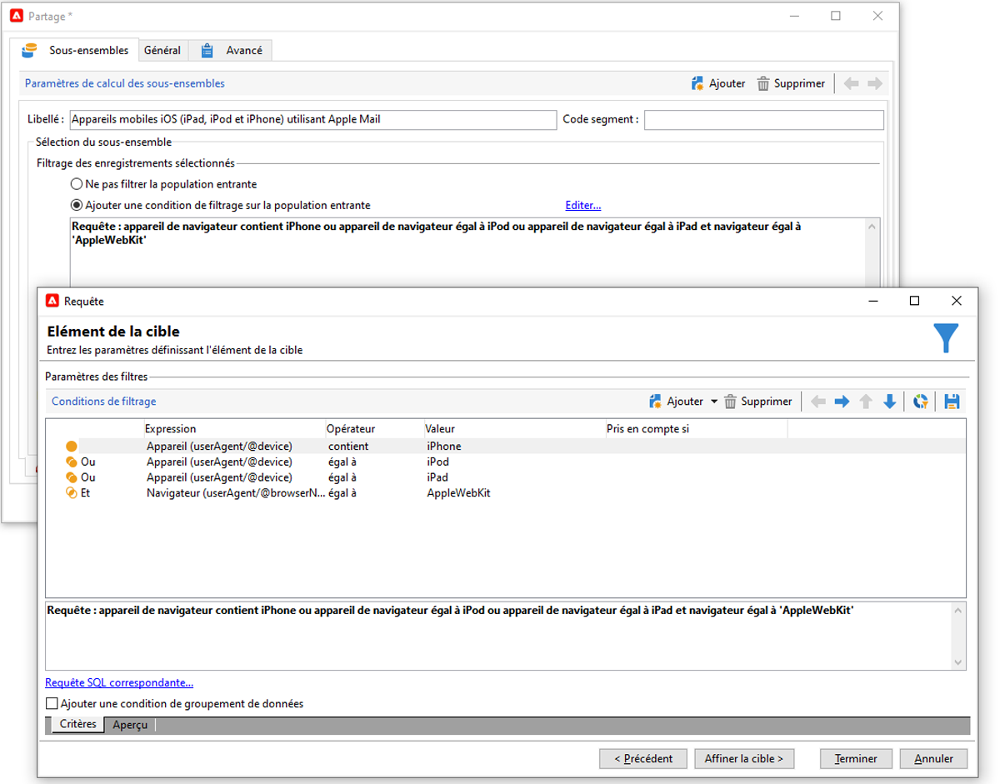

Vous pouvez utiliser ces règles à diverses fins :

* Exporter et archiver des données vers une solution de stockage externe.
* Calculer les KPI à joindre aux profils.
* Créer des listes de suppression.
* Effectuer un reporting.

Ces exemples illustrent comment utiliser des workflows pour ventiler des enregistrements par appareil iOS :

* Le premier exemple de workflow regroupe les activités suivantes :

   1. L’activité **[!UICONTROL Requête]** initiale permet de sélectionner toutes les ouvertures d’e-mail des trois derniers mois.
   1. Une activité **[!UICONTROL Partage]** permet de diviser la sélection par application de messagerie, navigateur, système d’exploitation et appareil.

   1. Une activité **[!UICONTROL Déduplication]** suit chaque activité **[!UICONTROL Partage]**. L’activité **[!UICONTROL Déduplication]** permet de supprimer les adresses e-mail en double.

      L’activité **[!UICONTROL Déduplication]** est positionnée à la suite de l’activité **[!UICONTROL Partage]** afin d’éviter la perte d’informations concernant les destinataires qui utilisent divers appareils.

   1. Une activité **[!UICONTROL Fin]** suit chaque activité **[!UICONTROL Déduplication]**.

  Ce type de workflow est utile si vous stockez uniquement les destinataires dans la table des destinataires d’usine pour le ciblage.

  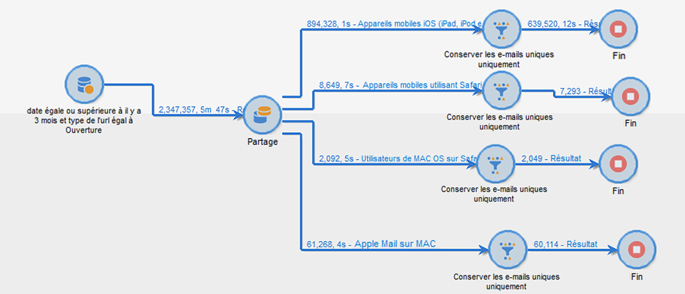

* Le deuxième exemple de workflow comprend les activités suivantes :

   1. L’activité **[!UICONTROL Requête]** initiale permet de sélectionner toutes les ouvertures d’e-mail au cours des trois derniers mois.
   1. Une activité **[!UICONTROL Déduplication]** permet de supprimer les adresses e-mail en double.
   1. Une activité **[!UICONTROL Branchement]** permet de réaliser les actions suivantes :

      * Dans une transition, l’activité **[!UICONTROL Changement de dimension]** permet de trouver les destinataires auxquels le log de tracking fait référence.
      * Dans l’autre transition, l’activité **[!UICONTROL Partage]** permet de diviser la sélection par application de messagerie, navigateur, système d’exploitation et appareil.

   1. Une activité **[!UICONTROL Fin]** suit chaque transition après l’activité **[!UICONTROL Partage]**.

  Ce type de workflow est utile si vous stockez les destinataires dans une table distincte de la table des destinataires d’usine.

  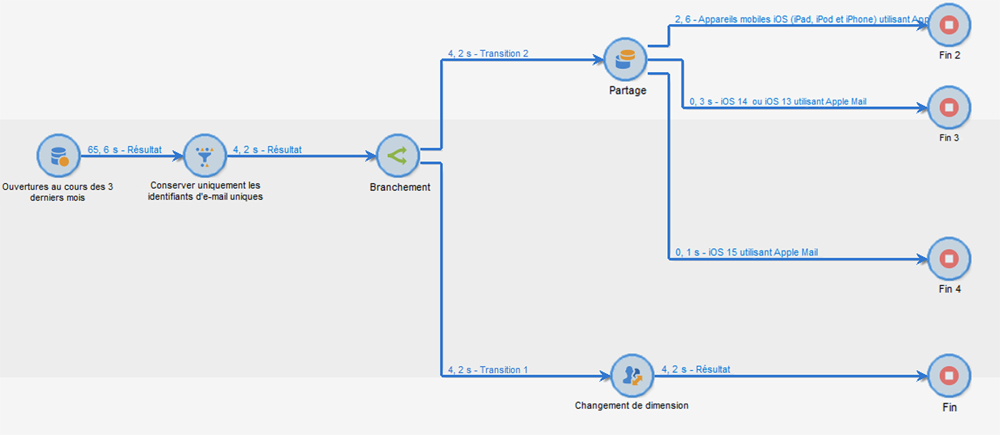
