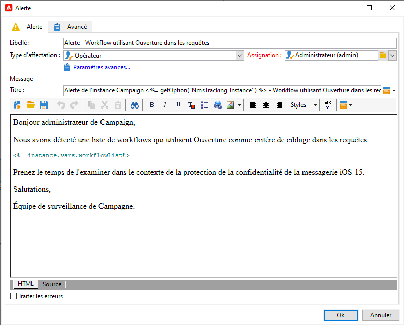

# Protection de la confidentialité des emails dans l’application de messagerie Apple


## Qu&#39;est-ce qui a changé ?

En 2021, Apple a introduit de nouvelles fonctionnalités de protection de la vie privée pour son application de messagerie native. Cette application comprend désormais la fonction de protection de la confidentialité d’Apple Mail. Fondamentalement, les expéditeurs ne peuvent plus utiliser les pixels de suivi pour collecter des informations sur les destinataires qui ont choisi d’activer la fonctionnalité de protection de la confidentialité du courrier Apple. [En savoir plus](https://experienceleague.adobe.com/docs/deliverability-learn/deliverability-best-practice-guide/additional-resources/technotes/apple-mail-privacy-faq.html){target=&quot;_blank&quot;}.

## Comment mes campagnes sont-elles affectées ?

Adobe Campaign permet d’utiliser les pixels de suivi pour suivre les ouvertures d’email. Vous pouvez utiliser cette fonctionnalité non seulement pour le ciblage et les campagnes, mais également pour les mesures. Vous pouvez, par exemple, utiliser les taux d’ouverture des courriers électroniques pour mesurer l’efficacité de la campagne et l’engagement des utilisateurs. En bref, la segmentation, le ciblage et les mesures peuvent être affectés dans vos campagnes. [En savoir plus](https://experienceleague.adobe.com/docs/deliverability-learn/deliverability-best-practice-guide/additional-resources/technotes/apple-mail-privacy-faq.html#in-addition-to-measuring-opens%2C-what-else-is-impacted%3F){target=&quot;_blank&quot;}.

## Quelles actions dois-je entreprendre ?

Apple une nouvelle fonctionnalité : la forme des éléments à venir dans le secteur en termes de protection de la confidentialité des emails. Nous vous recommandons vivement de suivre les recommandations de l’Adobe.

### Évaluer l’impact sur les déclencheurs de campagne

Évaluez l’impact de ces modifications sur les déclencheurs de campagne actuels. Identifiez les workflows dans lesquels les ouvertures d&#39;email sont utilisées comme critère de segmentation, de ciblage ou de reciblage. Lisez les [conseils et astuces](#find-email-open-tracking).

### Préserver vos données

Conserver vos données et consolider vos connaissances actuelles sur les appareils. Vous pouvez baser les indicateurs de performances clés (IPC) sur l’agent utilisateur. Vous pouvez, par exemple, créer des indicateurs de performance clés sur les profils de personnes qui utilisent l’application de messagerie iOS et Apple. Lisez les [conseils et astuces](#preserve-tracking-data).

### Archivez vos logs de tracking au-delà de la période de conservation des données.

Archivez vos logs de tracking au-delà de la période de conservation d’Adobe Campaign :

1. Check the duration of the retention period in your campaign instance.
1. Vérifiez deux fois vos principaux mappings de ciblage. Déterminez si vous utilisez des tables de profils personnalisés en plus de la table des profils d’usine (`nmsRecipient`).
1. Exportez vos logs de tracking depuis Adobe Campaign. Incluez les journaux qui contiennent des données sur l’agent utilisateur et le système d’exploitation.

### Évaluation de la tendance actuelle des taux d’ouverture

Déterminez la proportion de votre audience qui utilise l’application de messagerie Apple sur un appareil iOS.
Grâce à cette évaluation, vous pouvez identifier les anomalies potentielles et leur cause. Vous pouvez déterminer si un écart est dû à des problèmes de performances de campagne ou à la fonctionnalité de protection de la confidentialité d’Apple. Lisez les [conseils et astuces](#measure-ios-footprint).

### Réévaluer votre stratégie de campagne et vos mesures de performances

Par-dessus tout, nous vous recommandons vivement de réévaluer de manière proactive votre stratégie de campagne et vos mesures de performances de campagne. Vous pouvez vous concentrer à nouveau sur des mesures plus fiables, par exemple, les clics publicitaires, les consultations de produits et les achats.

Nous vous recommandons d’explorer les données actuellement disponibles et d’évaluer la corrélation entre les taux d’ouverture et d’autres mesures. Si ces mesures sont corrélées de manière cohérente, vous pouvez améliorer vos déclencheurs avec un bon niveau de confiance.

## Astuces

### Mesurer l’empreinte globale d’iOS {#measure-ios-footprint}

Pour collecter des informations à partir des données Adobe Campaign, vous pouvez utiliser des rapports d’usine :

* **[!UICONTROL Rapport]** Systèmes d’exploitation

   Pour identifier la proportion de visiteurs par système d&#39;exploitation et par version, utilisez ce rapport. [En savoir plus](../../reporting/using/global-reports.md#operating-systems).

   You can view the breakdown of visitors per operating system in relation to the total number of visitors.

   

   Pour chaque système d’exploitation, vous pouvez afficher la répartition des visiteurs, par version du système d’exploitation.

   

* **[!UICONTROL Répartition des]** opensreport

   Pour identifier la proportion d&#39;ouvertures d&#39;email par système d&#39;exploitation, utilisez ce rapport. [En savoir plus](../../reporting/using/global-reports.md#breakdown-of-opens).

   

### Déterminer l’utilisation du suivi des ouvertures de courrier électronique {#find-email-open-tracking}

Vous pouvez identifier les workflows dans lesquels les ouvertures d&#39;email sont utilisées comme critère de segmentation, de ciblage et de reciblage.

Pour cela, vous pouvez utiliser l’attribut **[!UICONTROL type]** de l’URL du lien tracké (**[!UICONTROL url/@type]**). Pour les ouvertures de courrier électronique, cet attribut est défini sur **[!UICONTROL Open]**. Cet attribut est disponible à partir de l&#39;éditeur de requêtes, de l&#39;activité **[!UICONTROL Requête]** dans un workflow, et des filtres prédéfinis. Vous pouvez utiliser cet attribut comme critère de ciblage pour les campagnes marketing.


Dans cet exemple, un marketeur souhaite envoyer une offre de récompense aux destinataires ayant ouvert un email de diffusion spécifique au cours des sept derniers jours et effectué un achat au cours du dernier mois. Dans les requêtes de workflow, vous pouvez utiliser les ouvertures d&#39;email de différentes manières :

* Vous pouvez utiliser les ouvertures d&#39;email comme critère de ciblage dans une requête.

   Vous pouvez spécifier, comme condition de filtrage, que le type d&#39;URL des logs de tracking d&#39;une diffusion spécifique doit être défini sur **[!UICONTROL Ouvrir]**.

   

* Vous pouvez utiliser un filtre prédéfini. [En savoir plus](../../workflow/using/creating-a-filter.md).

   

   Vous pouvez utiliser ce filtre prédéfini dans les activités de requête des workflows.

   

   >[!NOTE]
   >
   >From a workflow, you cannot view the targeting criteria of a predefined filter.

To retrieve the list of workflows in which email opens are used as a targeting criterion, you must query the `xtk:workflow` schema. Le contenu du workflow est stocké dans le champ **[!UICONTROL Mémoire XML (data)]** au format XML.


Vous pouvez spécifier que les workflows doivent inclure ce contenu :

`expr="[url/@type] = 2"`

Ce critère de ciblage signifie que le type de l&#39;URL trackée doit être défini sur **[!UICONTROL Ouvrir]**.


#### Exemple de mise en oeuvre et exemple de package

Vous pouvez utiliser cet exemple d&#39;implémentation pour identifier les workflows dans lesquels les ouvertures d&#39;email sont utilisées comme critère de ciblage et envoyer une notification à l&#39;opérateur de campagne de votre choix. Vous pouvez utiliser cette implémentation à ces fins :

* Vous pouvez mesurer l’impact potentiel du passage de l’ouverture d’un email à un autre IPC dans vos workflows de ciblage. Si vous n’utilisez pas d’ouvertures de courrier électronique, aucune autre action n’est requise.
* Lorsque vous réévaluez votre mise en oeuvre, vous pouvez utiliser cet exemple pour éviter d’ignorer les workflows.

Cet exemple présente une implémentation personnalisée dans un seul workflow technique.


>[!IMPORTANT]
>
>Le package est fourni uniquement à titre d’exemple et n’est pas pris en charge par Adobe en tant que fonctionnalité de produit.
>
>Vous devrez peut-être adapter l’exemple de code à votre implémentation de campagne.
>
>L’utilisateur final est le seul responsable de l’installation et de l’utilisation de cet exemple de package.
>
>Nous vous recommandons vivement de tester et de valider ce package dans un environnement hors production.

Téléchargez l’ [exemple de package](assets/PKG_Search_workflows_using_Opens_in_queries_V1.xml) et installez-le. [En savoir plus](../../platform/using/working-with-data-packages.md#importing-packages).

Après avoir installé le package, vous pouvez accéder au workflow à partir du dossier contenant les workflows techniques d&#39;usine de votre instance :

`/Administration/Production/Technical workflows/nmsTechnicalWorkflow`

Dans l’interface utilisateur, sélectionnez **[!UICONTROL Administration]** > **[!UICONTROL Production]** > **[!UICONTROL Workflows techniques]**.


Le workflow comprend les étapes principales suivantes :

1. Répertorier les workflows dans lesquels les ouvertures d&#39;email sont utilisées comme critère de ciblage.
1. Répertorier les filtres prédéfinis dans lesquels les ouvertures d&#39;email sont utilisées comme critère de ciblage.
1. Répertorier les workflows dans lesquels ces filtres prédéfinis sont utilisés.
1. Fusionnez les deux listes de workflows en une seule liste.
1. Envoyez une notification électronique à l’opérateur spécifié.

Le workflow comprend les étapes détaillées suivantes :

1. The initial activity is a query activity in the `xtk:workflow` schema. Cette activité est utilisée pour rechercher, dans l’instance correspondante, les requêtes de workflow explicites qui incluent les ouvertures d’email comme critère de ciblage.

   

   

   

   Une liste de workflows est alors renvoyée.

   

   Comme ces informations sont réutilisées, le nom de la table de travail est stocké dans une variable d’instance de workflow globale.

   

1. Une seconde requête est utilisée pour rechercher les filtres prédéfinis qui incluent les ouvertures d&#39;email.

   

   

   

   Une liste de filtres prédéfinis est alors renvoyée.

   

1. Cette liste de filtres prédéfinis est utilisée pour trouver les workflows dans lesquels ces filtres sont utilisés.
1. Les deux listes de workflows sont fusionnées en une seule liste.

   À cette fin, du code JavaScript est utilisé.

   

   ```javascript
   const queryPredFilter = xtk.queryDef.create(
     <queryDef schema={vars.targetSchema} operation="select">
        <select>
          <node alias="@id" expr="@id" />
          <node alias="@name" expr="@name"  />
        </select>
        <where/>
     </queryDef>
       ).ExecuteQuery()
   
   var qDef =
     <queryDef schema="xtk:workflow" operation="select">
       <select>
         <node expr="@id"/>
         <node expr="@internalName"/>
         <node expr="@label"/>
       </select>
       <where>
         <condition boolOperator="OR" expr={"data like '%expr=[url/@type] = 2%'" }/>
       </where>
     </queryDef>
   
   for each (var filter in queryPredFilter) {       
   
      //logInfo (filter.@name);
      var condition;
      condition =<condition boolOperator="OR" expr={"data like '%" + filter.@name + "%'" }/>
      qDef.where.appendChild(condition);   
   
   }
   
   var queryWorkflowList = xtk.queryDef.create(qDef);
   var workflowList = queryWorkflowList.ExecuteQuery();
   
   var sWorkflowList = "";
   var iCount = 0
   for each (var workflow in workflowList) {       
   
      //logInfo ("Workflow ID: " + workflow.@id + " in " + instance.vars.mainTargetSchema);
   
      iWorkflowId = workflow.@id;
      iWorkflowName = workflow.@internaName;
      iWorkflowLabel = workflow.@label;
   
       xtk.session.Write(
             <{instance.vars.mainTargetSchema.split(':')[1]}
               _operation="insertOrUpdate"       
               _key="@id"
               xtkschema={instance.vars.mainTargetSchema}
               id={iWorkflowId}
               internaName={iWorkflowName}
               label={iWorkflowLabel}
             />
       )
   }
   ```

1. Les workflows en double sont supprimés de la liste fusionnée.

   

1. Un test est effectué pour vérifier que la liste n’est pas vide.

   

   Si la liste n’est pas vide, elle est alors insérée dans un tableau de HTML pour les notifications électroniques.

   

   ```js
   const queryWorkflow = xtk.queryDef.create(
       <queryDef schema={vars.targetSchema} operation="select">
           <select>
               <node alias="@id" expr="@id" />
               <node alias="@internalName" expr="@internalName"  />
               <node alias="@label" expr="@label"  />
           </select>
           <where/>
       </queryDef>
   ).ExecuteQuery()
   
   var sWorkflowList = '<table border="0" >';
   
   sWorkflowList = sWorkflowList + "<tr><th>Worklow Id</th><th>Name</th><th>Label</th></tr>";
   
   for each (var workflow in queryWorkflow) {       
   
      sWorkflowList = sWorkflowList + "<tr>" +
                       "<td>" + workflow.@id + "</td>" +
                       "<td>" + workflow.@internalName + "</td>" +
                       "<td>" + workflow.@label + "</td>" +
                       "</tr>";
   
   }
   
   sWorkflowList = sWorkflowList + "</table>";
   
   instance.vars.workflowList = sWorkflowList;
   ```

1. Le tableau HTML est ajouté au modèle de notification.

   ```js
   <%= instance.vars.workflowLIst%>
   ```

   

   Les notifications électroniques contiennent la liste des workflows qui incluent les ouvertures d’email comme critère de ciblage dans les requêtes.

   

### Préserver les données de suivi actuelles {#preserve-tracking-data}

#### Quelles données sont affectées ?

Les données de profil sont enrichies avec les données de suivi provenant d’actions telles que les ouvertures d’email et les clics publicitaires. Tracking also provides, through the user agent when this information is available, key information about the user&#39;s devices.

En résumé, les données de suivi Adobe Campaign fournissent les informations suivantes :

* Le profil associé à la personne qui a ouvert ou cliqué par le biais d’un message électronique spécifique
* Date d’ouverture
* Appareil utilisé, par exemple, iPhone ou Mac
* The operating system and the version, for example, iOS 15, macOS 12, or Windows 10
* L’application, telle qu’une application de messagerie ou un navigateur web, et la version, par exemple Outlook 2019

#### Pourquoi dois-je conserver les données de suivi ?

Nous vous recommandons vivement de conserver ces données, pour plusieurs raisons :

* Ces données sont conservées par Adobe Campaign pendant une période limitée. La période de conservation varie, selon la configuration de votre instance.

   Vérifiez la configuration de votre instance. [En savoir plus](../../platform/using/privacy-management.md#data-retention).

* Outre les modifications récentes d’Apple, vous pouvez utiliser les données de suivi pour ajouter une valeur immense afin de stimuler l’engagement de votre audience.
* Apple peut apporter d’autres modifications à son application de messagerie native et à sa fonction de protection de la confidentialité du courrier.

Pour toutes ces raisons, il est vivement recommandé d&#39;exporter ces données dès que possible. Sinon, vos données de suivi pour une partie de votre audience pourraient être affectées négativement.

#### Comment conserver les données de suivi ?

To preserve tracking data, you must export it from Adobe Campaign to your information system. [En savoir plus](../../platform/using/get-started-data-import-export.md).

>[!IMPORTANT]
>
>L’exemple suivant se concentre sur le schéma `nms:Recipient` d’usine, qui est le schéma de profil par défaut. Si vous utilisez d’autres mappings de ciblage personnalisés associés à des profils personnalisés, nous vous recommandons d’étendre cette stratégie d’exportation à toutes les tables de logs personnalisés. [En savoir plus](../../configuration/using/target-mapping.md).

##### Principe

Par défaut, le schéma `nms:Recipient` est lié à trois schémas que vous devez exporter :

| Schéma | Content |
| --- | --- |
| nms:trackingLogRcp | Tracking des données, à l&#39;intention de l&#39;utilisateur, de l&#39;heure et du message concerné |
| nms:trackingUrl | Informations détaillées sur le lien, y compris sa nature, par exemple une ouverture de courrier électronique ou un clic publicitaire |
| nms:userAgent | Informations sur l’appareil |

Les tables sont liées dans le modèle de données.


Utilisez ces relations pour créer une requête d’exportation unique.


Vous pouvez enrichir ces données avec des informations utiles issues de schémas liés :

| Schéma | Contenu |
| --- | --- |
| nms:Recipient | Détails liés aux profils |
| nms:Delivery | Informations sur le message auquel l’utilisateur a répondu |

Vous pouvez exporter le résultat vers une solution de stockage externe prise en charge par Adobe Campaign :

* SFTP
* S3
* Azure Blob

##### Mise en œuvre

This example shows how you can export tracking data from Adobe Campaign.

1. Create a workflow that starts with a query.

   La requête initiale est utilisée pour récupérer les logs de tracking des trois derniers mois.
Vous pouvez utiliser une requête incrémentale pour extraire uniquement les enregistrements que vous n’avez pas encore exportés.

   Ajoutez toutes les informations requises à partir du noeud **[!UICONTROL Données additionnelles]** .

   

1. Ajoutez une activité **[!UICONTROL Extraction de données (fichier)]** . Mappez toutes les données de la requête vers un format de fichier d&#39;extraction.

   

   Choisissez le format de fichier, par exemple, TXT ou CSV.

   

1. Ajoutez la troisième et dernière activité pour le téléchargement du fichier vers une solution de stockage prise en charge.


##### Mise en oeuvre avancée : ventilation par appareil iOS

Vous pouvez utiliser des workflows pour déterminer si un destinataire utilise l’application de messagerie Apple. Vous pouvez fractionner les logs de suivi par appareil. Par exemple, vous pouvez utiliser des filtres de requête pour ventiler les enregistrements par appareil iOS :

| Application | Système d’exploitation ou appareil  | Filtre de requête |
| --- | --- | --- |
| Apple Mail | iOS 15 | `operating System (Browser) contains 'iOS 15' and browser (Browser) contains 'ApplewebKit'` |
| Apple Mail | iOS 14 or iOS 13 | `browser contains 'AppleWebKit' and operating System of browser contains 'iOS 14' or operating System of browser contains 'iOS 13'` |
| Apple Mail | Appareils mobiles iOS : iPad, iPod et iPhone | `device (Browser) contains iPhone or device (Browser) equal to iPod or device (Browser) equal to iPad and browser (Browser) equal to 'AppleWebKit'` |
| Apple Mail | iPhone , iPad, or iPod | `browser (Browser) equal to 'AppleWebKit' and device (Browser) equal to iPhone or device (Browser) equal to iPod or device (Browser) equal to iPad` |
| Apple Mail | Mac | `browser (Browser) equal to 'AppleWebKit' and operating System (Browser) contains 'Mac'` |
| Safari | macOS | `browser (Browser) equal to 'Safari' and device (Browser) equal to PC and operating System (Browser) contains 'Mac'` |
| Safari | Appareils mobiles | `browser (Browser) equal to 'Safari' and device (Browser) equal to iPad or device (Browser) equal to iPod or device (Browser) equal to iPhone` |


Vous pouvez utiliser ces règles à diverses fins :

* Exporter et archiver des données vers une solution de stockage externe
* Calculer les indicateurs de performance clés à joindre aux profils
* Créer des listes de suppression
* Reporting

These examples show how you can use workflows to break down records by iOS device:

* Le premier exemple de workflow regroupe les activités suivantes :

   1. L&#39;activité **[!UICONTROL Requête]** initiale permet de sélectionner toutes les ouvertures de l&#39;email pour les trois derniers mois.
   1. Une activité **[!UICONTROL Partage]** permet de fractionner la sélection par application de messagerie, navigateur, système d’exploitation et appareil.

   1. Une activité **[!UICONTROL Déduplication]** suit chaque activité **[!UICONTROL Partage]**. L&#39;activité **[!UICONTROL Déduplication]** est utilisée pour supprimer les adresses email en double.

      L&#39;activité **[!UICONTROL Déduplication]** est positionnée à la suite de l&#39;activité **[!UICONTROL Partage]** afin d&#39;éviter de perdre des informations sur les destinataires qui utilisent divers appareils.

   1. Une activité **[!UICONTROL Fin]** suit chaque activité **[!UICONTROL Déduplication]**.

   Ce type de workflow est utile si vous ne stockez des destinataires que dans la table des destinataires d&#39;usine pour le ciblage.

   

* Le deuxième exemple de workflow comprend les activités suivantes :

   1. L&#39;activité **[!UICONTROL Requête]** initiale permet de sélectionner toutes les ouvertures de l&#39;email pour les trois derniers mois.
   1. Une activité **[!UICONTROL Déduplication]** est utilisée pour supprimer les adresses email en double.
   1. Une activité **[!UICONTROL Branchement]** est utilisée :

      * Dans une transition, l&#39;activité **[!UICONTROL Changement de dimension]** est utilisée pour trouver les destinataires auxquels le log de tracking fait référence.
      * Dans l&#39;autre transition, l&#39;activité **[!UICONTROL Partage]** permet de fractionner la sélection par application de messagerie, navigateur, système d&#39;exploitation et appareil.
   1. Une activité **[!UICONTROL Fin]** suit chaque transition après l&#39;activité **[!UICONTROL Partage]**.

   Ce type de workflow est utile si vous stockez des destinataires dans une table autre que la table des destinataires d&#39;usine.

   

## Liens utiles

[FAQ sur la protection des données personnelles dans Apple Mail](https://experienceleague.adobe.com/docs/deliverability-learn/deliverability-best-practice-guide/additional-resources/technotes/apple-mail-privacy-faq.html){target=&quot;_blank&quot;}
