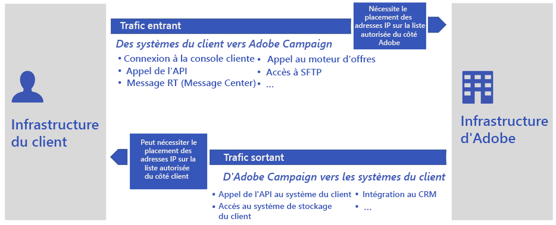

# FAQ sur la migration vers le cloud public{#dc-faq}

Adobe désactive l’ancien centre de données : les instances Campaign Classic doivent être transférées vers le cloud public Amazon Web Services (AWS). [En savoir plus sur cette initiative](dc-migration.md).

Vous trouverez ci-dessous un ensemble de questions courantes concernant ce projet, l’impact sur vos environnements Campaign et d’autres ressources utiles.

Pour toute autre question, contactez l’[Assistance clientèle d’Adobe](https://experienceleague.adobe.com/?support-solution=Campaign#support).

## Incidences sur l’infrastructure

Les incidences globales sur la base de données et l’infrastructure sont répertoriées ci-dessous.

* **La base de données va-t-elle changer ? Quelle est la version de la nouvelle base de données ? Quel sera le système d’exploitation ?**

   Adobe se réserve le droit de choisir et de déployer le moteur de gestion de base de données le plus approprié pour assurer le fonctionnement d’Adobe Campaign Service dans des conditions optimales.

   En outre, pour préserver le meilleur niveau de sécurité, Adobe ne fournira aucune information détaillée relative à l’infrastructure.

* **Existe-t-il un risque de perte de données ?**

   La base de données sera extraite de l’ancien centre de données, puis restaurée dans le cloud public (AWS). Une fois redémarrée dans le nouveau centre de données, l’application reprendra à partir de l’état exact dans lequel elle se trouvait avant la migration. Les utilisateurs ne verront aucune différence, à l’exception du report de certaines tâches planifiées.

* **Existe-t-il des différences de taille du package entre l’ancien centre de données et le cloud public ?**

   Nous fournissons de nouvelles définitions de package dans le cloud public (AWS) en fonction de la taille actuelle de la base de données, de la taille du disque, etc. Par exemple, si un client dispose d’un serveur applicatif dans les anciens centres de données, il peut utiliser deux serveurs applicatifs dans le cloud public (AWS) en fonction des définitions de package.

* **Le numéro de build ou la version de Campaign vont-ils changer ?**

   Dans un premier temps, nous allons conserver le même build de Campaign Classic avec la migration.

   Lors d’une étape ultérieure, nous procéderons à la mise à niveau vers la dernière version de build de Campaign Classic GA. Pour plus dʼinformations, consultez [cette page](../../rn/using/rn-overview.md).

* **En quoi consiste le plan pour résoudre les problèmes consécutifs à la migration ?**

   Des tests approfondis doivent être effectués avant la migration des systèmes de production. Toutefois, en cas de problèmes, l’[Assistance clientèle d’Adobe](https://experienceleague.adobe.com/?support-solution=Campaign#support) reste le principal point de contact. Adobe a mis en place une équipe d’experts chargée, si nécessaire, d’apporter une assistance avancée.

## Incidences sur la délivrabilité

Les incidences globales sur les adresses IP, la liste bloquée, les sous-domaines et les URL sont répertoriées ci-dessous.

* **Comment les adresses IP sur la liste autorisée seront-elles gérées ? Les clients devront-ils ajouter de nouvelles adresses IP à la liste autorisée pour le trafic entrant en provenance de Campaign ?**

   L’adresse IP des serveurs Adobe va changer. Il se peut donc que les clients doivent ajouter ces nouvelles adresses IP à la liste autorisée de leur système.

   [En savoir plus](#config) sur les adresses IP placées sur la liste autorisée.

* **Comment allons-nous gérer le port ajouté à la liste autorisée pour l’accès SFTP/FTP ?**

   La configuration SFTP (clés publiques + adresses IP de la liste autorisée) sera également déplacée de l’ancien centre de données vers le cloud public (AWS). Aucune action n’est requise de la part du client.

* **Changeons-nous les adresses IP ?**

   L’adresse IP des serveurs Adobe va changer. Il se peut donc que les clients doivent ajouter ces nouvelles adresses IP à la liste autorisée de leur système.

   [En savoir plus](#config) sur les adresses IP placées sur la liste autorisée.

* **Comment la délégation des sous-domaines sera-t-elle gérée ?**

   Les sous-domaines existants seront déplacés de l’ancien centre de données vers le cloud public (AWS). Cette partie sera gérée par l’équipe chargée de la délivrabilité chez Adobe dans le cadre du processus de migration.

   Adobe accompagne le client tout au long des tests nécessaires pour s’assurer qu’après la migration, la configuration fonctionne sur les nouveaux serveurs du cloud public (AWS).

* **La migration produira-t-elle de nouvelles URL pour le tracking, les ressources et les applications web ?**

   Non, nous allons conserver les URL existantes.

* **Y aura-t-il un changement de sous-domaine entre Neolane.net et campaign.adobe.com ?**

   Après la migration, les sites `neolane.net` et `campaign.adobe.com` seront l’un et l’autre en place. En des termes simples, nous allons rediriger neolane.net vers de nouvelles instances du cloud public (AWS), de sorte que le client n’ait aucune modification à effectuer.

* **En quoi consiste le plan concernant le préchauffage des adresses IP ?**

   Tout d’abord, l’équipe chargée de la délivrabilité d’Adobe évaluera le statut de la plateforme concernant la délivrabilité et recommandera un plan de basculement vers les nouvelles adresses IP.

   Aucun préchauffage n’est nécessaire après la migration. Il peut y avoir certaines exceptions. Dans ce cas, l’[Assistance clientèle d’Adobe](https://experienceleague.adobe.com/?support-solution=Campaign#support) contactera les clients.

   Cependant, le plan est destiné à réaliser cette opération de manière transparente pour l’entreprise, contrairement à la montée en réputation initiale qui est effectuée pendant la phase de démarrage.

   Une fois la migration terminée, les adresses IP d’envoi de l’instance Campaign seront entièrement différentes. Pour assurer une transition progressive, Adobe effectuera une montée en réputation des nouvelles adresses IP d’envoi en transférant progressivement le trafic des anciennes vers les nouvelles adresses IP.

* **Déplaçons-nous les URL sur la liste autorisée ?**

   Oui. Elles sont stockées dans le fichier de configuration du serveur, qui sera copié de la source vers la nouvelle instance.

* **Quelle pourrait être l’incidence sur le sous-domaine délégué que nous utilisons pour mettre en avant notre marque dans nos communications ?**

   Le ou les sous-domaines utilisés pour la communication marketing restent les mêmes. Cependant, en fonction de l’implémentation, des actions peuvent être nécessaires côté client :
   * Dans le cas d’une délégation de sous-domaines à Adobe (par défaut), Adobe prend en charge toutes les modifications afin d’assurer une transition fluide.
   * Dans le cas d’une configuration CNAME (exception), le client est invité à implémenter les modifications, en coordination avec Adobe.

## Incidences sur la configuration et la connectivité

### Remarque concernant l’ajout d’adresses IP à la liste autorisée{#config}

La migration vers le cloud public s’accompagne de nouvelles adresses IP pour les serveurs applicatifs Adobe Campaign. La modification de ces adresses peut avoir une incidence sur la connectivité entre les serveurs Adobe et vos systèmes d’information.

Examinons les deux cas suivants :

* Trafic entrant : toute activité réseau déclenchée à partir de vos systèmes ou de tout autre tiers vers les serveurs Adobe Campaign. La configuration est gérée par Adobe, puis copiée de l’ancienne plateforme vers le cloud public au cours de la migration. Suite à la migration, la connectivité du trafic entrant est donc préservée et aucune action n’est requise de la part du client.

* Trafic sortant : toute activité réseau déclenchée par les serveurs Adobe Campaign vers votre système d’information ou tout autre tiers (par exemple, un fournisseur de services SMS). Selon les stratégies de sécurité mises en place au sein de votre organisation, le changement des adresses IP peut nécessiter une opération d’ajout à la liste autorisée à partir de votre système d’information ou de tout autre tiers.

### Incidences globales

Les incidences globales sur la configuration, la connectivité avec d’autres systèmes et produits, les API et les fuseaux horaires sont répertoriés ci-dessous.

* **La migration aura-t-elle une incidence sur la connectivité avec les comptes externes ?**

   Oui. Les intégrations tierces, les fournisseurs de services SMS par exemple, doivent ajouter les nouvelles adresses IP des serveurs applicatifs Adobe Campaign à la liste autorisée.

* **La migration aura-t-elle une incidence sur la connectivité avec Adobe Analytics par le biais du connecteur Genesis ? Qu’en est-il de l’ajout d’adresses IP Campaign à la liste autorisée du côté Adobe Analytics ?**

   Les adresses IP des serveurs d’applications Adobe Campaign vont changer. Cette étape sera gérée après la migration par l’assistance clientèle d’Adobe.

* **La migration aura-t-elle une incidence sur la connectivité avec d’autres solutions Adobe (AEM, Target, etc.) ?**

   Les intégrations correspondent à une combinaison entre les adresses IP déclarées sur la liste autorisée et la configuration du compte de service web. Ces opérations sont prises en compte et en charge par l’Assistance clientèle d’Adobe.

   Certaines adresses IP de la liste autorisée seront requises dans la solution externe lorsque l’adresse IP des serveurs applicatifs changera. Cette information sera fournie. Les autres composants de l’intégration, basés sur IMS, doivent fonctionner en l’état.

* **Qu’en est-il des clients qui ne sont pas associés à l’identifiant de l’organisation pour l’intégration IMS ?**

   Les clients qui ne disposent pas d’IMS recevront un identifiant d’organisation joint à leur instance.

* **Les configurations multi-marques sont-elles affectées par la migration ?**

   Il ne devrait y avoir aucune incidence résultant du déplacement/de la redirection du sous-domaine et des configurations associées entre l’ancien centre de données et le cloud public (AWS).

* **La connectivité avec l’API est-elle affectée par la migration ?**

   L’adresse IP des serveurs Adobe va changer. Il se peut donc que les clients doivent ajouter ces nouvelles adresses IP à la liste autorisée de leur système.

   [En savoir plus](#config) sur les adresses IP placées sur la liste autorisée.

* **Allons-nous nous assurer que tous les paramètres de configuration de la mémoire JavaScript sont correctement définis après la migration ?**

   Nous allons copier la configuration d’instance entre l’ancien centre de données et le cloud public (AWS). Ces valeurs seront donc préservées suite à la migration.

* **Existe-t-il un risque d’accès à certaines extensions de fichiers ?**

   Le client souhaitera éventuellement autoriser le chargement des fichiers de polices de caractères et de réunion Outlook dans le dossier des ressources publiques. Cette configuration est effectuée dans le fichier `config-<instance>.xml` actuel. Elle sera copiée avec les fichiers de configuration.

* **Le fuseau horaire change-t-il sur le nouveau serveur ? Le client pourra-t-il conserver son fuseau horaire actuel ?**

   Il peut changer en fonction de la nouvelle localisation des serveurs. Toutefois, le client pourra conserver son fuseau horaire actuel.

   [En savoir plus](../../workflow/using/managing-time-zones.md) sur la gestion des fuseaux horaires dans Adobe Campaign Classic v7.

## Sécurité et autorisations

Pour cette migration vers le cloud public (AWS), les environnements clients seront tenus à jour avec toutes les exigences de sécurité nécessaires. Ceci inclut les éléments suivants :

* Correctifs de sécurité et de système d’exploitation les plus récents proposés périodiquement
* Isolation de l’infrastructure par client
* Validation de la sécurité et des audits en infogérance pour la prise en charge de l’infrastructure cloud, notamment les équilibreurs de charge, les règles de sécurité réseau et le chiffrement du stockage

Les incidences sur les autorisations, les certificats et les accès SFTP sont répertoriées ci-dessous.

* **Allons-nous déplacer tous les certificats vers les nouveaux serveurs ?**

   Oui, tous les certificats seront déplacés dans le cadre de cette migration.

* **Faut-il demander de nouvelles clés d’accès STP au client ?**

   Non, Adobe copiera les clés d’accès SFTP en l’état sur le nouveau serveur.

* **Comment les autorisations SFTP sont-elles gérées ?**

   Nous nous assurons que le nouveau serveur SFTP, les utilisateurs, les répertoires et les fichiers ont exactement les mêmes niveaux d’autorisation.

* **Si la connexion SFTP n’a pas pu être établie, quelle est la solution/le plan pour que le client reste opérationnel ?**

   Le seul problème de connectivité possible est lié à la liste autorisée côté client. Le client doit ajouter ce test dans un environnement hors production pour s’assurer qu’il fonctionne avant de passer en production.

* **Existe-t-il des configurations de liste autorisée spécifiques au centre de données qu’il est nécessaire de déplacer ?**

   Non, il n’y a aucune configuration de liste autorisée spécifique au centre de données à gérer.

* **Nous assurons-nous que les scripts personnalisés seront exécutés avec succès dans le nouvel environnement ?**

   L’implémentation des clients peut utiliser des scripts personnalisés (Perl/Shell/Python/JavaScript) dans les workflows pour manipuler, par exemple, des fichiers et des dossiers.

   Sur l’instance hébergée, les scripts sont exécutés uniquement via le moteur JavaScript. Ces implémentations spécifiques peuvent entraîner des problèmes de sécurité et des problèmes suite à la mise à niveau. Elles ne sont pas prises en charge.

* **Avec l’intégration IMS, le fonctionnement sera-t-il identique dans la nouvelle instance ou faudra-t-il mettre à jour la configuration ?**

   Comme nous conservons des noms DNS identiques, le fonctionnement devrait être identique après la migration.

## Réalisation de la migration

Les incidences globales au cours de la migration sont répertoriées ci-dessous.

* **Devons-nous prévoir l’arrêt de l’activité marketing pendant la migration ?**

   Adobe recommande de ralentir, voire idéalement de suspendre toutes les exécutions de workflows et de diffusions juste avant l’arrêt de l’application sur l’ancien centre de données. Il sera ainsi plus facile de redémarrer les activités sur le serveur cloud (AWS), car les processus auront eu le temps nécessaire pour s’interrompre de manière « élégante » et enregistrer l’état d’exécution en cours.

* **Devons-nous prévoir un temps d’arrêt de notre service Adobe Campaign ?**

   La migration s’accompagnera d’un temps d’arrêt inévitable de la plateforme. Le but de ce plan est de contribuer à minimiser ces temps d’inactivité.

   Le transfert de données entre centres de données entraîne les temps d’arrêt les plus importants. Les données sont stockées de deux manières :

   * La base de données, le dispositif de stockage de loin le plus important
   * Les fichiers sur le serveur d’applications (importation et exportation des données)

   La réduction de la taille de la base de données revêt une importance primordiale pour accélérer le transfert des données. Suggestions :

   * Réduire les périodes de rétention des données historiques (logs de diffusion, logs de tracking, etc.)
   * Supprimer les enregistrements inutiles sur d’autres tables (diffusions, destinataires, tables personnalisées)

* **À combien est estimé le temps d’arrêt pour la migration d’une instance ?**

   Le temps d’arrêt dépend entièrement de la taille de la base de données du client et du volume de stockage des fichiers SFTP. Contactez votre interlocuteur de l’assistance clientèle pour obtenir une estimation de la durée.

* **Qu’en est-il des messages envoyés depuis l’ancien serveur ? Les liens seront-ils toujours accessibles ?**

   Pendant la migration, seul un service reste fonctionnel : la redirection des liens des emails. Tous les destinataires pourront accéder à la landing page en cliquant sur un email. Cependant, ces clics ne feront l’objet d’aucun tracking. Les taux de clics des diffusions lancées peu de temps avant la migration seront donc inférieurs aux taux habituels.

* **Qu’en est-il des environnements RT/de mid-sourcing ?**

   Les environnements RT et de mid-sourcing sont gérés comme tous les autres éléments d’infrastructure hébergés.

* **Dans quel ordre les migrations sont-elles effectuées ?**

   La migration des environnements est effectuée dans l’ordre suivant :

   1. Environnements de développement
   1. Environnements d’évaluation
   1. Environnements de production
   1. Environnements RT
   1. Environnements de mid-sourcing

* **Quel est le plan de restauration ?**

   Le plan de restauration consiste à rétablir le DNS et à reconfigurer en lecture-écriture la base de données source qui est en lecture seule. Cette restauration est au final effectuée par des fonctions automatiques.

* **Après la migration, pouvons-nous toujours accéder aux anciennes instances ?**

   Une fois la migration de l’application terminée, aucune exécution d’autre processus n’est prévue dans l’ancien centre de données. Nous prévoyons que toutes les données de l’ancien centre de données puissent être effacées, sauf à des fins de sauvegarde temporaire, jusqu’à ce que les processus de sauvegarde planifiés soient exécutés sur le cloud public (AWS).

* **Pendant combien de temps le test de chaque instance sera-t-il autorisé après la migration vers le cloud public ?**

   Selon la complexité du client, un délai d’au moins une semaine est nécessaire entre la migration de l’environnement d’évaluation et celle de l’environnement de production.

* **Qui va gérer l’ajout de nouvelles adresses IP à la liste autorisée ?**

   L’Assistance clientèle d’Adobe veillera à ce que le client et les tiers éventuels puissent accéder au nouveau système en ajoutant les nouvelles adresses IP à la liste autorisée.

## Support et autres liens utiles{#support}

* [Migration vers Adobe Managed Services (cloud public)](dc-migration.md)
* [Mise à niveau annuelle de Campaign](../../rn/using/rn-overview.md#yeary-upgrade)
* [FAQ sur la mise à niveau des builds](../../platform/using/faq-build-upgrade.md)
