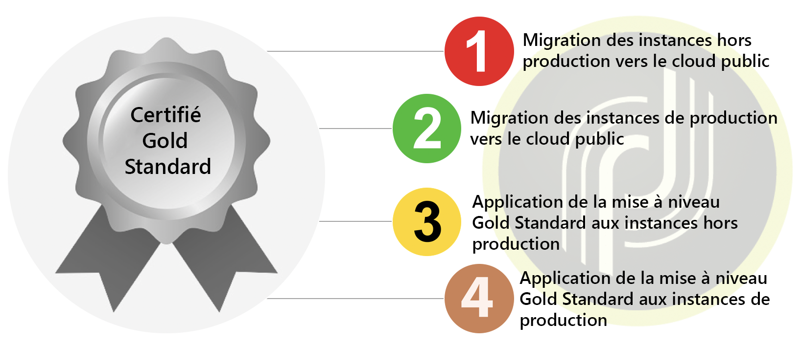

# Vue d&#39;ensemble{#dc-ovv}

## Contexte

En tant que client Adobe Campaign Classic précieux, nous nous engageons à vous offrir la meilleure expérience et la meilleure valeur. Au fil des ans, nous avons réalisé l’intérêt et la fiabilité de l’hébergement de nos clients dans le cloud.  Dans le cadre de notre [initiative Gold Standard](../../rn/using/gold-standard.md), nous déplaçons tous nos clients vers Adobe Managed Services (cloud public sur AWS) afin de fournir des services meilleurs et plus fiables.

Ce programme a trois objectifs principaux :

* Combler les vulnérabilités de sécurité identifiées en transférant l’infrastructure vers un environnement sécurisé et moderne (AWS)
* Éliminez les processus de mise à l’échelle potentiellement encombrants, fournissez l’accès à nos [MTA amélioré](../../delivery/using//sending-with-enhanced-mta.md) et améliorez tous les niveaux de service de maintenance.
* Préparez votre instance pour le futur de Adobe Campaign Classic, y compris des mises à niveau plus automatisées et régulières qui ne nécessiteront pas autant de ressources, ni autant de temps.

### Glossaire

* **Upgrade de build**  : lorsque le logiciel Adobe Campaign Classic est mis à jour vers le dernier numéro de build sécurisé, tout en restant au même niveau de build majeur/mineur. Par exemple : Campaign v7 20.2.3 build 9182 vers Campaign v7 21.2.5 build 9188. [En savoir plus](../../platform/using/faq-build-upgrade.md).
* **MID/RT**  : serveurs d’exécution de messages hébergés sur Adobe Cloud (MID pour les campagnes par lots et RT pour les messages unitaires en temps réel)
* **Mise à niveau**  Gold Standard : ce programme offre une sécurité améliorée, une prise en charge améliorée, une maintenance et une stabilité améliorées. Il facilite également les futures mises à niveau et donne accès aux nouvelles fonctionnalités de Campaign.  [En savoir plus](../../rn/using/gs-overview.md).
* **AWS**  - Amazon Web Services (Amazon Public Cloud)
* **SFTP**  : protocole de transfert de fichiers sécurisé. [En savoir plus](../../platform/using/sftp-server-usage.md).

>[!NOTE]
>La migration de Campaign Classic v7 vers le cloud public affecte uniquement les clients qui utilisent **Adobe Managed Services**.

## Avantages

**Sécurité**

* Derniers correctifs de sécurité
* Cryptage des données inactives
* Authentification améliorée (IMS)

**Infrastructures**

* Agilité des évolutions de matériel
* Restauration plus rapide
* Fiabilité et stabilité améliorées
* Procédures opérationnelles harmonisées

**Performances**

* Amélioration des capacités pour les emails
* Bases de données plus volumineuses
* Version éprouvée de Campaign - Gold Standard

**Proposer une solution fiable et robuste aux clients d’Adobe Campaign Classic**

1. Procédures de production plus performantes pour gagner en fiabilité, accroître la réactivité en cas de problème et accélérer la récupération suite à un incident majeur.
1. Capacités supérieures d’envoi d’emails. Les instances hébergées dans le nouveau centre de données pourront bénéficier d’une infrastructure spécialisée pour la diffusion des emails. Ce choix pourrait entraîner une diffusion plus rapide des emails ou une diminution du nombre d’adresses IP d’envoi.
1. Plus grande évolutivité du matériel. L’extension des ressources matérielles peut être plus rapide. Techniquement, cela se traduit par un ordre de grandeur d’une heure contre plusieurs jours auparavant.

**La version Gold Standard facilite les mises à niveau ultérieures**

1. Plus votre entreprise attend avant d’effectuer la mise à niveau, plus celle-ci se complexifie et plus le risque de vulnérabilité augmente (en particulier lorsque le transfert se fait à partir d’une version ancienne).
1. Grâce à la mise à niveau Gold Standard, votre instance sera modernisée. Elle sera prête à recevoir des mises à jour plus régulières et automatisées, en limitant les interventions manuelles et les ressources nécessaires.

## À propos de la migration

La migration vers Adobe Managed Services (cloud public) aura lieu en 2020/2021 pour les comptes concernés. Adobe accompagnera votre organisation tout au long de ce parcours.

À cet effet, les comptes nécessitant cette migration recevront un email de la part d’Adobe avec un calendrier et un accès à la documentation. Cette notification indiquera que la migration de votre compte est planifiée.

Une migration peut être lancée par [l’ouverture d’un nouveau ticket d’assistance clientèle](https://experienceleague.adobe.com/?support-solution=Campaign#support). Utilisez la ligne d’objet « Migration vers AWS ».

### Cette migration est-elle obligatoire ?

Cette migration vers le cloud est **la première étape vers la [certification Gold Standard](../../rn/using/gs-overview.md)** de vos instances Adobe Campaign. Elle est obligatoire si vous êtes hébergé dans un centre de données hors cloud public (AWS).

Le cloud Adobe Managed Services est hébergé sur Amazon Web Services (AWS), un environnement moderne, sécurisé et optimisé. [En savoir plus sur AWS](https://aws.amazon.com/application-hosting/benefits/).

Adobe prévoit de mettre hors service l’ancien centre de données. Les instances d’Adobe Campaign qui y sont exécutées doivent être transférées vers AWS, le nouveau centre de données de référence.

Il s’agit d’un chemin critique, car votre localisation actuelle peut être exposée à **des vulnérabilités concernant la sécurité et les performances**.

En outre, cette migration est désormais une **condition préalable à toute mise à niveau future** de votre version d’Adobe Campaign. La mise à niveau de build n’est plus possible pour l’ancien centre de données.

Adobe s’engage à sécuriser vos données et à vous préparer pour les versions futures d’Adobe Campaign. Nous avons besoin de votre esprit de partenariat pour en faire un succès commun !

**Nous avons mis sur pied une** équipe de représentants de l’assistance clientèle, de responsables du succès client, de chefs de produit, d’ingénieurs, de spécialistes des opérations techniques et de consultants produit dédiés pour vous aider et vous assurer que l’expérience est fluide et transparente. Nous nous engageons à mettre à votre disposition des informations pertinentes concernant le projet et les coordonnées de contact.

Nous nous sommes énormément investis dans le développement de technologies destinées à faire de cette migration un processus rapide, transparent et sécurisé.

### Contraintes

* La migration s’accompagnera d’un temps d’arrêt inévitable de la plateforme. Le but de ce plan est de contribuer à minimiser ces temps d’inactivité.
* Modification de l’adresse IP pour les intégrations de données.
* Phase d’amélioration de la délivrabilité des nouvelles adresses IP d’envoi. Cependant, le plan est destiné à réaliser cette opération de manière transparente pour l’entreprise, contrairement à la montée en réputation initiale qui est effectuée pendant la phase de démarrage.

Pour en savoir plus, consultez la [FAQ sur le cloud public](dc-migration-faq.md) de la migration de Campaign vers cloud public.

## Parcours d’obtention de la certification Gold Standard

Nous vous aiderons à valider les étapes entre chaque jalon.

## Chemin de migration vers le cloud public

Adobe gère l’essentiel des actions. Nous avons besoin de vous pour la validation et l’approbation.

## Instructions de migration

### Approche globale

**Base de données**

La base de données sera vidée du centre de données hérité et restaurée dans le cloud public (AWS). Une fois redémarrée dans le nouveau centre de données, l’application reprendra à partir de l’état exact antérieur à l’arrêt. Les utilisateurs ne verront aucune différence, à l’exception du report de certaines tâches planifiées.

**Adresses IP servant à l’envoi d’emails**

Une fois la migration terminée, les adresses IP d’envoi de l’instance Campaign seront entièrement différentes. Pour assurer une transition progressive, Adobe effectuera une montée en réputation des nouvelles adresses IP d’envoi en transférant progressivement le trafic des anciennes vers les nouvelles adresses IP.

**IP d’intégration des données**

L’intégration des données côté client peut être affectée par le changement des adresses IP pour l’intégration des données. La modification peut concerner les deux directions selon que Campaign fonctionne comme serveur ou client.
 Cas types :

* SFTP, éventuellement dans les deux directions
* HTTP, éventuellement dans les deux directions
* SMPP (connexion aux fournisseurs de services SMS), Campaign en tant que client, changement d’adresse IP source

En général, le client doit vérifier les éventuelles restrictions d’adresses IP sur ses pare-feu et les adapter en conséquence.*

**Serveurs Campaign**

Les serveurs Campaign existants (en fait, les conteneurs) seront déplacés vers le cloud public (AWS) selon une approche &quot;d’effet élévateur et de changement&quot;. En d’autres termes, l’ensemble du serveur sera transféré vers le nouveau centre de données et aucune installation nouvelle ne sera nécessaire. L’opération ne nécessitera pas plus de travail qu’une reconfiguration technique de bas niveau.

**Noms de serveur**

Sous le ou les sous-domaines utilisés pour la communication marketing : restera identique. Cependant, selon la mise en œuvre, il est possible que des actions soient nécessaires côté client :

* Dans le cas d’une délégation de sous-domaines (cas normal), Adobe prendra en charge toutes les modifications et assurera une transition fluide
* Dans le cas d’une configuration CNAME (exception), le client est invité à mettre en œuvre les modifications. Une coordination avec Adobe sera nécessaire.

Pour l’accès utilisateur et l’intégration des données, les noms définis sous neolane.net resteront inchangés.

Cela signifie que le changement sera transparent pour les utilisateurs et les implémentations d’intégration des données si les noms de serveur n’ont pas été remplacés par des adresses IP codées en dur.

### Préparation 

**Adresses IP servant à l’envoi d’emails**

Tout d’abord, la délivrabilité des Adobes évaluera l’état de délivrabilité de la plateforme et recommandera un plan pour passer aux nouvelles adresses IP.

Adobe attribuera le même nombre d’adresses IP au nouveau centre de données.

La montée en réputation des nouvelles adresses IP peut commencer dès qu’elles sont mises en service.

**Nettoyage de l’application** Le transfert de données entre centres de données entraîne les temps d’arrêt les plus importants.

Les données sont stockées de deux manières :

1. La base de données, le dispositif de stockage de loin le plus important
1. Les fichiers sur le serveur d’applications (importation et exportation des données)

La réduction de la taille de la base de données revêt une importance primordiale pour accélérer le transfert des données.

 Suggestions :

* Réduire les périodes de rétention des données historiques (logs de diffusion, logs de tracking, etc.)
* Supprimer les enregistrements inutiles sur d’autres tables (diffusions, destinataires, tables personnalisées)

### Exécution

**Pause des exécutions**

Il est recommandé de ralentir et idéalement de suspendre toutes les exécutions juste avant l’arrêt de l’application sur l’ancien centre de données : diffusions et workflows. Il sera ainsi plus facile de redémarrer les activités sur le cloud public (AWS), car les processus auront eu le temps nécessaire pour s’interrompre de manière « élégante » et enregistrer l’état d’exécution en cours.

**Pendant la migration**

Lors de la migration, un seul service reste fonctionnel : redirection des liens vers les emails. En d’autres termes, les destinataires pourront accéder à la landing page en cliquant sur un email. Cependant, ces clics ne feront l’objet d’aucun enregistrement. Les taux de clics des diffusions lancées peu de temps avant la migration seront donc inférieurs à la normale.

**Redémarrer**

Une fois la migration vers le nouvel environnement effectuée, l’application redémarre progressivement :

* Tout d’abord, l’accès à la console pour permettre aux utilisateurs de vérifier l’état sans rien exécuter encore
* Ensuite, les workflows et les diffusions.

### Post-migration

**Suppression d’instances sur le centre de données hérité**

Une fois la migration de l’application terminée, il n’est plus prévu d’exécuter aucun processus sur l’ancien centre de données. Nous prévoyons que toutes les données de l’ancien centre de données puissent être effacées, sauf à des fins de sauvegarde temporaire, jusqu’à ce que les processus de sauvegarde planifiés soient effectués sur le cloud public (AWS).

**Délégation DNS**

En règle générale, le domaine utilisé pour l’envoi d’emails (partie à droite du signe @ dans l’adresse d’erreur) à l’aide de Campaign est délégué à Adobe. Il est possible de modifier la délégation et de transférer aux serveurs DNS AWS.

## Support et autres liens utiles{#support}

* [FAQ sur la migration vers Adobe Managed Services (cloud public)](dc-migration-faq.md)
* [Mettre à niveau vers Gold Standard](../../rn/using/gs-overview.md)
* [FAQ sur la mise à niveau des builds](../../platform/using/faq-build-upgrade.md)
