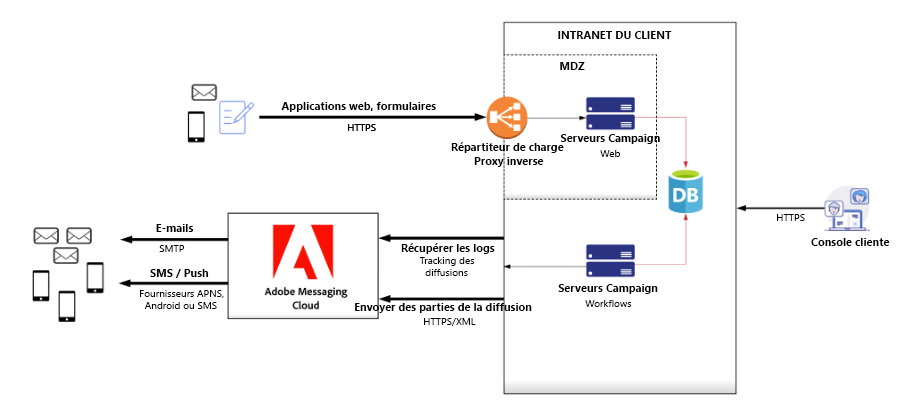
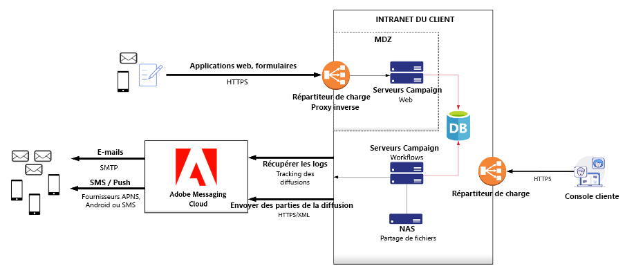
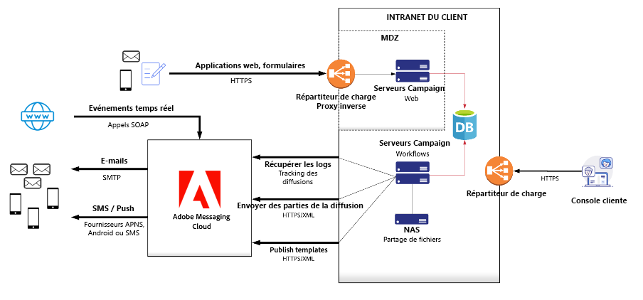

# Recommandations relatives au dimensionnement du matériel{#hardware-sizing-reco}

## Vue d&#39;ensemble

>[!CAUTION]
>
>Cet article est fourni comme exemple général uniquement. Vous devez demander à votre responsable du succès client Adobe Campaign de mesurer la taille exacte de votre déploiement avant de démarrer votre projet Campaign. **N’acquérez** ni ne déployez d’infrastructure ou de matériel tant que ce n’est pas fait.

Ce document fournit des recommandations générales pour le déploiement de Adobe Campaign Classic v7 dans votre centre de données local ou environnement cloud virtualisé. Ce type de déploiement, appelé **hybride** ou **mid-sourcing**, place l’instance marketing et la base de données marketing Campaign sous votre contrôle opérationnel, tout en utilisant les services de messagerie Cloud Adobe pour envoyer des emails, des SMS ou des messages SMPP, et collecter les données d’ouverture, de rebond et de suivi des clics des emails.

L’instance marketing est la partie de l’architecture Adobe Campaign qui génère toute l’activité marketing et stocke toutes les données de destinataires et données d’analyse renvoyées par les campagnes. L’instance marketing est un ensemble de serveurs on-premise exécutant les services Adobe Campaign et une base de données relationnelle.

>[!CAUTION]
>
>Les informations de ce document ne s’appliquent pas si vous utilisez une instance Adobe Campaign entièrement hébergée (déployée dans les Cloud Services d’Adobe).

La compatibilité logicielle est présentée dans la [Matrice de compatibilité](../../rn/using/compatibility-matrix.md).

### Scénarios

Les diagrammes de déploiement et les recommandations de dimensionnement du matériel sont fournis pour trois scénarios représentatifs :

1. [Taille moyenne](#scenario-1)  : 5 millions de destinataires principal dans le système
1. [Grande taille](#scenario-2)  : 20 millions de destinataires principal dans le système
1. [Entreprise](#scenario-3)  : 50 millions de destinataires principaux, avec messagerie transactionnelle

### Hypothèses

Ce document suppose également les types d’utilisation suivants pour les trois scénarios :

* Les campagnes par e-mail volumineuses sont envoyées deux fois par semaine, à environ 50 % de vos principaux destinataires.
* Les envois directs sont générés une fois par mois pour chaque destinataire du système.
* Les SMS sont envoyés à environ 10 % de vos principaux destinataires chaque mois.
* Le schéma de base de données définissant chaque destinataire a été étendu avec une table supplémentaire contenant environ 200 octets de données pour chaque destinataire.
* Le module Interaction d’Adobe Campaign est utilisé pour ajouter des offres aux emails sortants.
* Les données de tracking des emails sont conservées dans le système Campaign pendant 90 jours.

## Directives générales

Campaign est une application centrée sur la base de données et les performances du serveur de base de données sont essentielles. Les workflows en cours d’exécution, la segmentation, le suivi des téléchargements de données, les interactions entrantes, les analyses et autres activités génèrent toutes une activité de base de données. En règle générale, la taille et la fréquence de ces opérations déterminent la taille des serveurs de base de données.

Les serveurs d’applications de votre instance marketing nécessitent suffisamment de processeur et de mémoire pour exécuter des workflows et répondre aux appels d’API SOAP, y compris les demandes des utilisateurs de la console Campaign. Les exigences du processeur peuvent être importantes pour les workflows qui utilisent des interactions sortantes avec des règles d’offre complexes, des workflows qui exécutent du code JavaScript personnalisé et des applications web avec des niveaux de trafic élevés.

Les applications web de Campaign peuvent également être déployées sur les serveurs d’applications de l’instance marketing ou sur des systèmes de serveur web distincts. Les charges de travail des applications web étant en conflit avec les workflows critiques et les utilisateurs de la console Campaign, les applications web et les interactions entrantes peuvent être déployées sur des serveurs distincts, afin de garantir que les fonctionnalités de base de Campaign s’exécutent de manière fiable avec de bonnes performances.

Pour des raisons de sécurité et de disponibilité, Adobe recommande de séparer le trafic Internet du trafic généré par les utilisateurs professionnels. Pour cette raison, les diagrammes contiennent deux groupes de serveurs : le serveur Web (Web1 et Web2) et les serveurs App (processus d’entreprise App1 et App2).

Pour les expéditeurs de courrier électronique commercial, il est légal d’avoir une page web d’exclusion fonctionnelle. Adobe recommande de disposer d’une machine redondante dans chaque serveur de groupe pour les scénarios de basculement. Cela est particulièrement vrai si Adobe Campaign héberge les pages d’exclusion.

### Reverse proxys

L’architecture de Campaign applique une sécurité élevée en utilisant SSL via HTTP (HTTPS) pour communiquer entre votre instance marketing et Adobe Cloud Messaging. La sécurité, la fiabilité et la disponibilité sont renforcées par l’utilisation de proxys inverses dans un sous-réseau &quot;zone démilitarisée&quot; (DMZ) afin d’isoler et de sécuriser les serveurs d’instances marketing et la base de données.

### Équilibreur de charge

L’équilibreur de charge des serveurs d’applications est configuré dans une configuration principale/passive, avec HTTPS arrêté au niveau du proxy. L&#39;équilibreur de charge des serveurs Web est configuré dans une configuration principale/principale, avec HTTPS arrêté au niveau du proxy.

Adobe fournit la liste exclusive des chemins d’URL qui peuvent être relayés au serveur Adobe Campaign dans votre environnement de déploiement.

### Architecture

L&#39;architecture générale est presque identique, quels que soient les volumes. Les exigences de sécurité et de haute disponibilité imposent un minimum de quatre serveurs ; deux serveurs si aucune application WebApps n’est utilisée. La différence de configuration varie principalement dans la configuration matérielle, comme le noyau du processeur et la mémoire.

## Scénario 1 : Déploiement de taille moyenne{#scenario-1}

Volume estimé :

| Canal | Volume |
| ----------------------- | ----------------- |
| Destinataires principaux | 5 millions |
| E-mail | 4,2 millions/mois |
| Courrier | 1 million/mois |
| SMS mobile | 100 000/mois |
| Pic du volume quotidien d’emails | 500 |

Pour ces volumes, une paire de systèmes de serveur d’applications Adobe Campaign fournit toutes les fonctionnalités pour les utilisateurs clients Adobe Campaign et l’exécution des workflows. Pour 5 millions de destinataires principal et ce volume d’email, les charges de travail du serveur applicatif ne consomment pas d’unité centrale ni d’E/S ; la plus grande partie du stress est sur la base de données.

Les serveurs Web Adobe Campaign sont affichés dans la zone sécurisée.

### Serveurs web et d’applications

Ce scénario recommande d’installer Adobe Campaign sur quatre machines, avec la spécification suivante :

**3Ghz+ quad-core CPU, 8-GB RAM, RAID 1 ou 10, 2 x 80-GB SSD**

Ces systèmes créent l’instance marketing Application Server, qui prend directement en charge les utilisateurs de votre console Campaign et exécute les workflows de campagne.

Des proxies inversées dans le trafic de l’équilibre de charge DMZ vers les serveurs web Adobe Campaign. Il n’est pas nécessaire d’installer la pile logicielle Adobe Campaign sur des ordinateurs proxy ; tout logiciel ou équipement réseau de proxy inverse peut être utilisé.

Les fonctionnalités de centre d’opt-in/opt-out et de centre de préférences d’abonnement peuvent être fournies par Campaign ou par votre propre site web. Si vous choisissez d&#39;implémenter cette fonctionnalité sur votre site web, vous devez vous assurer que les informations de préférence et d&#39;abonnement sont propagées à la base de données marketing de Campaign. Pour ce faire, vous devez normalement créer des fichiers d&#39;extraction qui sont automatiquement chargés par les workflows de Campaign.

La consommation d’espace disque sur les serveurs d’applications dépend de la période de conservation des fichiers échangés avec des prestataires de services tiers (par exemple, les fournisseurs de services d’impression pour le courrier), ainsi que de la taille et de la conservation des fichiers plats importés, comme les mises à jour d’abonnement ou de préférences de votre site web, ou des extraits de vos propres systèmes CRM ou marketing.

### Base de données

Les recommandations matérielles pour le serveur de base de données sont les suivantes :

**3Ghz+ 4 coeurs CPU, 16 Go RAM, RAID 1 ou 10, 128 Go SSD minimum**

L’estimation de la mémoire suppose une mise en cache complète d’environ 500 000 destinataires pour un lancement de campagne volumineux, ainsi qu’un espace mémoire tampon RDBMS pour l’exécution des workflows, l’importation de données de suivi et d’autres activités simultanées.

Il est estimé que l’espace disque requis dans la base de données pour stocker toutes les données techniques Adobe Campaign (campagnes, suivi, tables de travail, etc.) est d’environ 35 Go sur la base d’une période de conservation de trois mois. Si vous choisissez de conserver les données de suivi pendant 6 mois, la taille de la base de données augmente à environ 40 Go et la rétention de 12 mois augmente la taille de la base de données à environ 45 Go. Les données des destinataires consomment environ 5 Go pour cet environnement.

>[!CAUTION]
>
>Cette estimation n’inclut aucune donnée client supplémentaire. Si vous prévoyez de répliquer des colonnes ou des tableaux de données client supplémentaires dans la base de données Adobe Campaign, vous devez estimer l’espace disque supplémentaire requis pour cette tâche. Les segments/listes téléchargés nécessitent également plus de stockage, selon leur taille, leur fréquence et leur période de conservation.

En raison du volume d&#39;informations traitées quotidiennement, le IOPS du serveur de base de données est essentiel. Par exemple, un jour de pointe, vous pouvez déployer des campagnes ciblant un total de 500 000 destinataires. Pour exécuter chaque opération, Adobe Campaign insère 500 000 enregistrements dans une table contenant environ 12 millions d&#39;enregistrements (la table des logs de diffusion). Pour offrir des performances acceptables lors du déploiement de la campagne, Adobe recommande un minimum de 60 000 IOPS 4 Ko de lecture/écriture aléatoire pour ce scénario.

## Scénario 2 : Déploiement de grande taille{#scenario-2}

Volume estimé :

| Canal | Volume |
| ----------------------- | ----------------- |
| Destinataires principaux | 20 millions |
| E-mail | 42 millions/mois |
| Courrier | 10 millions/mois |
| SMS mobile | 1 000 000/mois |
| Pic du volume quotidien d’emails | 5 000 000 |

### Serveurs web et d’applications

Dans ce scénario, Adobe recommande d’installer Adobe Campaign sur quatre machines, deux serveurs applicatifs et deux serveurs web, avec la spécification suivante :

**3Ghz+ quad-core CPU, 8-GB RAM, RAID 1 ou 10, 80-GB SSD**

Les serveurs d’applications prennent directement en charge les utilisateurs de la console Campaign et l’exécution des workflows de campagne. Cette fonctionnalité est déployée sur deux serveurs identiques pour une haute disponibilité, partageant un système de fichiers NAS (Network-Attached Storage) pour activer le basculement.

Les serveurs Web hébergent des applications Web Campaign qui prennent en charge les 10 millions de principaux destinataires du système.

Voir [Scénario 1 : Déploiement de taille moyenne ](#scenario-1) pour plus de commentaires sur les proxies, les centres de préférences/la gestion des abonnements et l’utilisation de l’espace disque.

### Base de données

Les recommandations matérielles pour le serveur de base de données sont les suivantes :

**3Ghz+ 8 coeurs CPU, 64 Go RAM, RAID 1 ou 10, 2 x 320 Go SSD ou RAID 10, 640 Go SSD minimum**

L’estimation de la mémoire suppose une mise en cache complète d’environ 5 000 000 destinataires pour un lancement de campagne volumineux, ainsi qu’un espace mémoire tampon RDBMS pour l’exécution des workflows, l’importation de données de suivi et d’autres activités simultanées.

Il est estimé que l’espace disque requis dans la base de données pour stocker toutes les données techniques Adobe Campaign (campagnes, suivi, tables de travail, etc.) est d’environ 280 Go sur la base d’une période de conservation de 3 mois. Si vous choisissez de conserver les données de suivi pendant 6 mois, la taille de la base de données augmente à environ 450 Go et la rétention de 12 mois augmente la taille de la base de données à environ 900 Go. Les données des destinataires consomment environ 15 Go pour cet environnement.

## Scénario 3 : Déploiement Entreprise avec Message Center{#scenario-3}

Volume estimé :

| Canal | Volume |
| ----------------------- | ----------------- |
| Destinataires principaux | 50 millions |
| E-mail | 108 millions/mois |
| Courrier | 25 millions/mois |
| SMS mobile | 2,5 millions/mois |
| Messages transactionnels | 2,5 millions/mois |
| Pic du volume quotidien d’emails | 2,5 millions |

Le déploiement qui prend en charge 50 millions de destinataires est essentiellement le même que dans [Scénario 2](#scenario-2) : Le trafic des applications web de Campaign est acheminé vers les serveurs web de Campaign. De ce fait, les rafales de trafic web après les lancements de campagnes volumineux n’ont aucune incidence sur les workflows de Campaign et les utilisateurs de la console cliente.

Ce déploiement comprend également des appels Message Center, pilotés à partir de vos propres sites web et applications.

### Serveurs web et d’applications

Dans ce scénario, Adobe recommande d’installer Adobe Campaign sur quatre machines, comme suit :

* Serveurs d’application
   **Deux systèmes, 3Ghz+ quad-core CPU, 8-GB RAM, RAID 1 ou 10, 80-GB SSD**

* Serveurs web
   **Deux systèmes, 3Ghz+ quad-core CPU, 16-GB RAM, RAID 1 ou 10, 80-GB SSD**

Les serveurs d’applications prennent directement en charge les utilisateurs de la console Campaign et l’exécution des workflows de campagne. Cette fonctionnalité est déployée sur deux serveurs identiques pour une haute disponibilité, partageant un système de fichiers NAS (Network-Attached Storage) pour activer le basculement.

Les serveurs Web hébergent des applications Web Campaign qui prennent en charge les 10 millions de principaux destinataires du système.

Voir [Scénario 1 : Déploiement de taille moyenne ](#scenario-1) pour plus de commentaires sur les proxies, les centres de préférences/la gestion des abonnements et l’utilisation de l’espace disque.

### Base de données

Les recommandations matérielles pour le serveur de base de données sont les suivantes :

**3Ghz+ 8 coeurs CPU, 96 Go RAM, RAID 1 ou 10, 1,5 To SSD minimal**

L’estimation de la mémoire suppose une mise en cache complète d’environ 12 500 000 destinataires pour un lancement de campagne volumineux, ainsi qu’un espace mémoire tampon SGBDR pour l’exécution des workflows, l’importation de données de suivi et d’autres activités simultanées.

Il est estimé que l’espace disque requis dans la base de données pour stocker toutes les données techniques d’Adobe Campaign (campagnes, suivi, tables de travail, etc.) est d’environ 700 Go sur une période de conservation de 3 mois. Si vous choisissez de conserver les données de suivi pendant 6 mois, la taille de la base de données passe à environ 1,2 To et la conservation de 12 mois augmente la taille de la base de données à environ 2 To. Les données des destinataires consomment environ 50 Go pour cet environnement.

## Consignes relatives à la modification des hypothèses

Les hypothèses faites pour ces scénarios ont toutes un impact significatif sur les recommandations matérielles et l’architecture de déploiement. Cette section décrit les directives relatives aux différentes hypothèses. Contactez l’équipe de conseillers d’Adobe Campaign pour obtenir des recommandations spécifiques afin de répondre à vos besoins.

* **Nombre de**
destinataires Les destinataires actifs nécessitent à la fois un espace de stockage et un espace de mémoire tampon de la base de données. De ce fait, plus de destinataires ont généralement besoin d&#39;une plus grande capacité de mémoire et de processeur sur le serveur de base de données. Les augmentations de stockage sont relativement faibles pour les destinataires eux-mêmes, mais peuvent être significatives pour les données de suivi des événements conservées pour les campagnes email.

* **Email Campaign**
SizeLa fréquence des lancements de campagne a un impact sur les exigences du processeur du serveur de base de données. Associées au publipostage, aux interactions entrantes et autres workflows, les opérations de segmentation pour les campagnes email placent une charge importante sur le serveur de base de données.

* ****
Fréquence de courrier : la fréquence des envois directs peut avoir une incidence sur les exigences du processeur du serveur de base de données. Combinées aux lancements de campagne et autres workflows, les opérations de segmentation pour les envois directs placent une charge importante sur le serveur de base de données.

* **Volume**
de messages SMS : tout comme la taille de la campagne par e-mail, le volume de messages SMS ne place pas de charge importante sur les serveurs Campaign situés sur site ; la charge se trouve principalement sur les serveurs Adobe Cloud Messaging sur le cloud. La segmentation des campagnes SMS, comme les courriers électroniques et les courriers, peut placer une charge importante sur la base de données marketing. Par conséquent, la fréquence des lancements de campagnes SMS et la complexité de la segmentation sont plus pertinentes que le volume des messages SMS.

* ****
Complexité du schéma de base de données : la quantité de données pour chaque destinataire principal nécessite à la fois de l’espace de stockage et de l’espace de mémoire tampon de la base de données. Par conséquent, un plus grand nombre de destinataires nécessitent généralement plus de mémoire et d’unité centrale sur le serveur de base de données. Les schémas complexes nécessitent également la jonction de davantage de tableaux pour la segmentation. De ce fait, les opérations de segmentation peuvent s’exécuter beaucoup plus lentement et nécessitent davantage de processeur et de mémoire de base de données lorsque les données sont réparties sur plusieurs tableaux.

   La mémoire du serveur de base de données est estimée en veillant à ce que le pool de mémoire tampon de la base de données puisse contenir toutes les données des destinataires, ainsi que des tables temporaires pour exécuter les workflows, avec une marge pour les autres opérations de base de données.

* **Les règles**
d’utilisation des interactions sortantes pour les interactions en mode batch sont évaluées dans les workflows qui transmettent toute la complexité du calcul à la base de données. Le principal facteur d&#39;effort sur la base de données est le nombre total d&#39;offres éligibles calculées lors d&#39;un appel au moteur (taille de la cible X nombre moyen d&#39;offres par destinataire avant de conserver les N meilleures offres). La vitesse du processeur du serveur de base de données est le premier facteur de performance.

* **Les règles et offres d’interaction entrante ou d’**
utilisation de l’API SOAP sont évaluées dans la base de données marketing, ce qui nécessite d’importantes ressources de serveur de base de données, notamment le processeur. L’utilisation intensive des interactions entrantes ou des API SOAP nécessite des serveurs web distincts pour séparer la charge de travail des workflows Campaign en cours d’exécution.

* **Suivi de la**
période de conservation des données : l’augmentation de la conservation des données de suivi au-delà de 90 jours nécessite davantage de stockage dans la base de données et peut ralentir le système car l’insertion de nouvelles données de suivi va dans des tables volumineuses. Les données de suivi ne sont pas utiles pour la segmentation des campagnes au bout de 90 jours. Il est donc recommandé d’utiliser une période de conservation plus courte.

   Les données de suivi doivent être déplacées dans Adobe Analytics ou dans un autre système d’analyse si vous avez besoin d’une analyse à long terme de l’expérience marketing des destinataires.

## Virtualisation

Tous les serveurs Campaign sont de bons candidats à la virtualisation. Plusieurs problèmes doivent être résolus pour garantir une disponibilité et des performances appropriées.

* **Échec de la**
configuration Les serveurs en grappe, par exemple, les serveurs d’applications redondants sous un proxy à répartition de charge, doivent être déployés sur un matériel distinct pour s’assurer que les deux machines virtuelles ne tombent pas en panne en cas de défaillance matérielle.

* ****
Configuration d’E/S : toute configuration RAID recommandée doit être conservée pour la sécurité de la base de données, afin de garantir que la perte d’un périphérique de stockage ne provoque pas de perte de données.

* ****
Performances des E/S : l’évaluation IOPS recommandée pour le stockage dans la base de données doit être respectée. Les services cloud tels qu’Amazon EC2 peuvent ne pas fournir les performances requises et doivent être soigneusement évalués. Par exemple, les volumes de SSD fournis par Amazon EC2 sont actuellement évalués à 20 000 IOPS chacun. En savoir plus dans la [documentation Amazon](http://docs.aws.amazon.com/AWSEC2/latest/UserGuide/EBSVolumeTypes.html), de sorte qu’une configuration RAID à 4 volumes serait évaluée à 80 000 IOPS, ce qui peut ne pas être suffisant.

Adobe recommande de tester les performances pour tout déploiement virtualisé d’Adobe Campaign avant de mettre le système en production.

## Rubriques connexes :

* [Processus de surveillance des campagnes](../../production/using/monitoring-processes.md)
* [Architecture générale de Campaign](../../installation/using/general-architecture.md)
* [Performances et problèmes de débit](../../production/using/performance-and-throughput-issues.md)
* [Liste de contrôle relative à la sécurité et à la confidentialité](../../installation/using/get-started-security-privacy.md)
