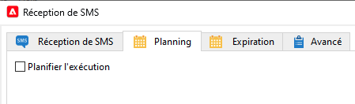

# Activité de workflow de SMS entrants pour une infrastructure de midsourcing {#inbound-sms}

## Limites {#limitations}

* Ce cas pratique ne s&#39;applique qu&#39;à l&#39;instance Marketing sur laquelle vous collectez des données SMS depuis la ou les instances de mid-sourcing.
* Ne mettez pas en oeuvre ce cas pratique sur l&#39;instance Mid-sourcing.
* Un seul workflow personnalisé par compte externe Mid-sourcing.

## Implémentation {#implementation}

1. Ajoutez une extension au `nms:inSMS` schéma sur votre instance Marketing. L’extension ajoute un nouvel attribut à la variable `nms:inSMS` et tracker la clé primaire de l&#39;enregistrement inSMS provenant de l&#39;instance Mid-sourcing.

   ```xml
   <element img="nms:miniatures/mini-sms.png" label="Incoming SMS"
          labelSingular="Incoming SMS" name="inSMS">
   <dbindex name="midInSMSId" unique="false">
     <keyfield xpath="@extAccount-id"/>
     <keyfield xpath="@midInSMSId"/>
   </dbindex>
   
   <attribute label="External Mid SMS ID" name="midInSMSId" type="long"/>
   </element>
   ```

1. Pour appliquer les modifications apportées aux schémas, lancez l&#39;assistant de mise à jour de la base de données. Cet assistant est accessible à partir de **Outils** > **Avancé** > **Mettre à jour la structure de la base de données**. Il vérifie si la structure physique de la base de données correspond à sa description logique et exécute les scripts SQL de mise à jour. [En savoir plus](../../configuration/using/updating-the-database-structure.md)

1. Arrêtez et sauvegardez votre workflow contenant les **Activité Réception de SMS**.

   Sauvegardez le pointeur d&#39;option correspondant avec le format suivant. `SMS_MO_INDEX_{internal name of the workflow}_{name of the insms workflow activity}_{internal name of the external account to access the mid}`.

[En savoir plus sur la sauvegarde](../../production/using/backup.md)

1. (**FACULTATIF**) si vous utilisez déjà une activité Planificateur , ouvrez le workflow et reconfigurez-le comme suit :

   1. Répliquez les paramètres actuels de la **Planification** de votre **Réception de SMS** activité dans votre **Planificateur** activité.

   1. Désactivez le paramètre actuel dans la variable **Planification** de **Réception de SMS** activité.

      

1. Mettez à jour le **Réception de SMS** script personnalisé.

   Remplacez le bloc ci-dessous. Notez que ce script peut varier si vous avez déjà personnalisé ce code.

   ```Javascript
   var lastSynchKey = getOption('SMS_MO_INDEX_WKF1105_inSmsUS_smsmidus');
   
   var smsId = application.getNewIds(1);
   
   xtk.session.Write(<inSMS xtkschema="nms:inSMS" _operation="insert"
       id={smsId}
       origin={smsMessage.origin}
       message={smsMessage.message}
       providerId={smsMessage.messageId}/>);
   
   return 2;
   ```

   Avec le nouveau script personnalisé suivant pour mettre à jour les données inSMS à partir d&#39;une clé composite, combinant la clé primaire de l&#39;enregistrement Mid-sourcing et l&#39;identifiant du compte externe du routage Marketing SMS.

   Procédez comme suit :

   * Saisissez la valeur réelle pour `<EXTERNAL_ACCOUNT_ID>`, par exemple, `var iExtAccountId=72733155`.
   * Veillez à conserver les éléments suivants dans le script personnalisé :
      * `_operation="insertOrUpdate"`
      * `_key="@midInSMSId,@extAccount-id"`
      * `midInSMSId={smsMessage.id}`
      * `inSms.@["extAccount-id"] = iExtAccountId;{}`

   ```Javascript
   // please enter real external account ID to replace <EXTERNAL ACCOUNT ID>
   var iExtAccountId=<EXTERNAL_ACCOUNT_ID>;
   
   var inSms = <inSMS xtkschema="nms:inSMS" _operation="insertOrUpdate"
   
               _key="@midInSMSId,@extAccount-id"
               midInSMSId={smsMessage.id}
               message={smsMessage.message}
               origin={smsMessage.origin}
               providerId={smsMessage.providerId}
               alias={smsMessage.alias}
               messageDate = {smsMessage.messageDate}
               receivalDate = {smsMessage.receivalDate}
               deliveryDate = {smsMessage.deliveryDate}
               largeAccount = {smsMessage.largeAccount}
               countryCode = {smsMessage.countryCode}
               operatorCode = {smsMessage.operatorCode}
               linkedSmsId={smsMessage.linkedSmsId}
               separator = {smsMessage.separator}/>
   
   inSms.@["extAccount-id"] = iExtAccountId;
   
   xtk.session.Write(inSms);
   
   return 2;
   ```

1. Mettez à jour le script d&#39;initialisation avancé du SMS entrant avec le script suivant.

   Le script réinitialise le pointeur de la clé primaire sur 24 heures auparavant. Le workflow tentera de retraiter toutes les données inSMS de l&#39;instance Mid-sourcing au cours des dernières 24 heures et d&#39;ajouter toutes les données manquantes à l&#39;instance Marketing.

   ```Javascript
   // please enter real external account ID to replace <EXTERNAL_ACCOUNT_ID>
   // please enter real pointer option name to replace '<POINTER_OPTION_NAME>'
   // OPTION NAME format: SMS_MO_INDEX_{internal name of the workflow}_inSms_{internal name of the external account to access the mid}
   
   var queryDef = xtk.queryDef.create(
       <queryDef operation="getIfExists" schema="nms:inSMS" lineCount="1">
       <select>
           <node expr="@midInSMSId" alias="@midInSMSId"/>
       </select>
       <where>
           <condition expr="@midInSMSId != 0"/>
           <condition expr={"@created > SubHours(GetDate(), 24)"}/>
           <condition expr={"[@extAccount-id]=<EXTERNAL_ACCOUNT_ID>"}/>
       </where>
       <orderBy>
           <node expr="@midInSMSId"/>
       </orderBy>
       </queryDef>);
   
   var res = parseInt(queryDef.ExecuteQuery().@midInSMSId.toString());
   
   if( !isNaN(res) )
   setOption('<POINTER_OPTION_NAME>', res);
   ```

   >[!WARNING]
   >
   > * Si plusieurs comptes de routage SMS sont liés à la même instance Mid-sourcing, un seul workflow par instance Mid-sourcing est autorisé.
   > * Vous pouvez utiliser n’importe quel ID de compte externe. Le rôle de la clé étrangère est de maintenir l&#39;intégrité de la réconciliation des données dans les scénarios impliquant différents serveurs de mid-sourcing où l&#39;ID SMS de mid-sourcing peut être identique dans d&#39;autres instances de mid-sourcing.
   > * S&#39;il existe plusieurs workflows InSMS par instance Mid-sourcing, la duplication des données peut se produire, car l&#39;identifiant SMS Mid-sourcing reste constant tandis que les identifiants du compte externe varient.

1. Enregistrez et redémarrez le workflow.
