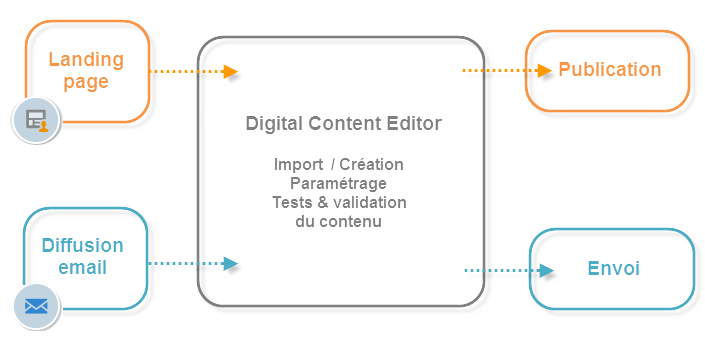

# Prise en main de l‘éditeur HTML Campaign{#about-campaign-html-editor}

Le **Digital Content Editor (DCE)** est un éditeur de contenus HTML qui permet de créer ou modifier facilement des modèles ou du contenu au format HTML dans Adobe Campaign.

Avec le Digital Content Editor, vous pouvez insérer et mettre en forme des éléments de page, et mapper des champs de base de données à des éléments d‘une page HTML. Cet éditeur est disponible lors de la création d’une page pour une application web ou de la création de diffusions basées sur un modèle du DCE.

>[!NOTE]
>
>Si vous devez ajouter du code JavaScript côté serveur, utilisez des blocs de personnalisation. [En savoir plus](../../delivery/using/personalization-blocks.md).

>[!CAUTION]
>
>Toutes les ressources externes doivent être référencées avec une URL HTTPS.

## Étapes clés d‘utilisation du Digital Content Editor {#content-editor-general-operation}

Cette section présente les étapes clés de modification et de chargement du contenu modifié avec le DCE, dans le contexte d‘une application web et d‘une conception de diffusion.

Le fonctionnement général est le suivant :

Pour créer une **application web** simple, vous devez :

1. Créer une application web - [En savoir plus](creating-a-landing-page.md)
1. Sélectionner un contenu existant ou créer du contenu à partir d‘un modèle standard - [En savoir plus](template-management.md)
1. Modifier et configurer le contenu - [En savoir plus](editing-content.md)
1. Publier l‘application web - [En savoir plus](creating-a-landing-page.md#step-3---publishing-content)

>[!NOTE]
>
>Un exemple complet d’implémentation dans le contexte d’une application web est disponible dans [cette section](creating-a-landing-page.md).

Pour créer une **diffusion email**, vous devez :

1. Créer une diffusion à partir d‘un modèle du DCE - [En savoir plus](use-case-creating-an-email-delivery.md)
1. Sélectionner un contenu existant ou créer un contenu à partir d’un [modèle standard](template-management.md)
1. Modifier et configurer du contenu en ligne
1. Envoyer la diffusion - [En savoir plus](../../delivery/using/steps-about-delivery-creation-steps.md)

>[!NOTE]
>
>Un exemple complet d‘implémentation dans le contexte d’une diffusion email est disponible dans [ce cas pratique](use-case-creating-an-email-delivery.md).
