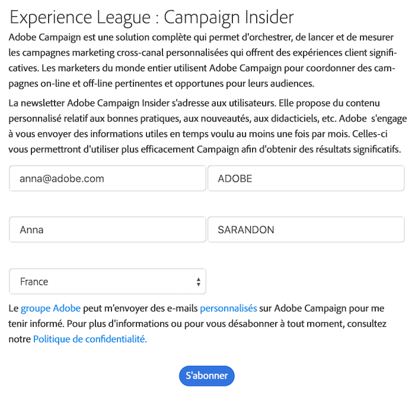

# Prise en main des applications web{#about-web-applications}

Adobe Campaign permet la création d’applications web dynamiques et interactives, composées de données issues de la base et dont le contenu est adapté en fonction des droits de l’utilisateur connecté.

Vous pouvez créer des pages, par exemple un formulaire d’édition sur un extranet, ou des formulaires de notification incluant des données issues de la base de données avec des tables, des graphiques, des formulaires de saisie, etc. Cette fonctionnalité permet de concevoir et de publier des pages web dans lesquelles les utilisateurs peuvent rechercher ou saisir des informations.

Il peut par exemple s’agir d’un formulaire d’inscription dont les données ont été pré-remplies avec les informations contenues dans la base Adobe Campaign, comme dans l’exemple ci-dessous :

Ce chapitre présente la gestion des applications web.

>[!NOTE]
>
>Consultez la [Liste de contrôle relative à la sécurité et à la confidentialité](https://helpx.adobe.com/fr/campaign/kb/acc-security.html) pour savoir comment optimiser la sécurité pour les applications web.

>[!CAUTION]
>
>Pour des raisons de confidentialité, nous vous recommandons d’utiliser HTTPS pour toutes les ressources externes.

## Portée des applications web {#web-application-scope}

Sous Adobe Campaign, les applications web permettent d’accéder aux fonctionnalités suivantes :

* Création de formulaires multi-pages. Voir à ce propos [cette page](about-web-forms.md).
* Gestion de formulaires multilingues, avec un outil de traduction intégré. Voir à ce propos [cette page](translating-a-web-application.md).
* Interface graphique de gestion des pages, mise en page en multi-colonnes. Voir à ce propos [cette page](designing-a-web-application.md).
* Personnalisation du rendu et du positionnement des champs. Voir à ce propos [cette page](editing-content.md#adding-personalization-content).
* Affichage conditionnel des champs du formulaire en fonction des réponses. Voir à ce propos [cette page](form-rendering.md#defining-fields-conditional-display).
* Affichage aléatoire de questions. Voir à ce propos [cette page](../../surveys/using/building-a-survey.md#adding-questions).
* Affichage conditionnel des pages. Voir à ce propos [cette page](defining-web-forms-page-sequencing.md#conditional-page-display).
* Vérification des informations avant validation en fonction du type de données attendu (numéro, adresse e-mail, date, etc.) et des champs obligatoires. Pour en savoir plus à ce sujet, consultez cette [page](form-rendering.md#defining-control-settings).
* Invitations ou notifications par e-mail. Voir à ce propos [cette page](publishing-a-web-form.md#delivering-a-form-via-email).
* Personnalisation des messages d’erreur et de fin. Voir à ce propos [cette page](defining-web-forms-properties.md#setting-up-an-error-page).
* Ajout d’images, vidéos, liens hypertexte, captcha, etc. Voir à ce propos [cette page](editing-content.md).
* Suivi des réponses en temps réel. Voir à ce propos [cette page](../../surveys/using/publish-track-and-use-collected-data.md#response-tracking).

Le module de création **Questionnaire** optionnel offre les fonctionnalités additionnelles suivantes :

* Extension dynamique de la base de données : création de réponses ne faisant pas partie du modèle de données initial. Voir à ce propos [cette page](../../surveys/using/managing-answers.md#storing-collected-answers).
* Génération de rapports dédiés. Voir à ce propos [cette page](../../surveys/using/publish-track-and-use-collected-data.md#reports-on-surveys).

Par rapport aux applications Web, les questionnaires proposent une interface graphique allégée : le nombre de contrôles d’édition est réduit.

>[!NOTE]
>
>Les enquêtes sont présentées dans [cette section](../../surveys/using/about-surveys.md).
>
>Les fonctionnalités générales des formulaires web sous Adobe Campaign sont présentées dans [cette section](about-web-forms.md).

## Implémentation d’applications web {#web-application-implementation}

Pour créer et rendre disponible une application web, vous devez :

1. Créer le contenu (champs, listes, tableaux, graphiques, etc.)

   Vous pouvez également consulter la section qui présente les champs disponibles pour les formulaires : tous ces champs sont aussi disponibles pour les applications web. Ces informations sont disponibles dans [cette page](adding-fields-to-a-web-form.md).

1. Ajouter, au besoin, des étapes de préchargement, de test, d’enregistrement et paramétrer le contrôle d’accès (principalement dans le cadre d’une publication sur un extranet).
1. Publier l’application web pour la rendre disponible sur un extranet ou dans Adobe Campaign.

## Configuration initiale des applications web {#web-application-initial-configuration}

Les application web sont créées à partir du lien **[!UICONTROL Applications web]** dans les onglets **[!UICONTROL Campagne]** et **[!UICONTROL Profils et cibles]**.

Les applications web sont stockées dans le noeud **[!UICONTROL Ressources > On-line > Applications Web]** de l&#39;arborescence Adobe Campaign. Les paramétrages sont répartis dans les dossiers suivants :

* **[!UICONTROL Administration > Configuration > Rendus des formulaires]** : contient les modèles de rendu pour la présentation des formulaires Web (applications et questionnaires). Le modèle permet de générer le formulaire. Il utilise également une feuille de style CSS. Cette feuille peut être surchargée au niveau du modèle. Pour plus d’informations, consultez [cette page](form-rendering.md#selecting-the-form-rendering-template).
* **[!UICONTROL Ressources > Modèles > Modèles d’application web]** : contient des modèles de formulaires. Pour créer un formulaire ou une application web, vous devez utiliser un modèle.

## Modèles d’applications web {#web-application-templates}

Par défaut, Adobe Campaign fournit un modèle par type d’application web disponible sur votre instance.

>[!NOTE]
>
>Vous pouvez transformer une application web existante en modèle. Pour cela, sélectionnez le formulaire concerné et cliquez sur le bouton droit de la souris. Choisissez **[!UICONTROL Actions > Sauver comme modèle]**.

Vous pouvez créer des modèles à partir du nœud **[!UICONTROL Ressources > Modèles > Modèles d&#39;applications web]** de l&#39;arborescence Adobe Campaign.

L’assistant de création vous permet de sélectionner les options à activer, comme dans l’exemple ci-dessous.

>[!CAUTION]
>
>Les types d’applications disponibles dépendent des options et modules installés. Consultez votre contrat de licence.
