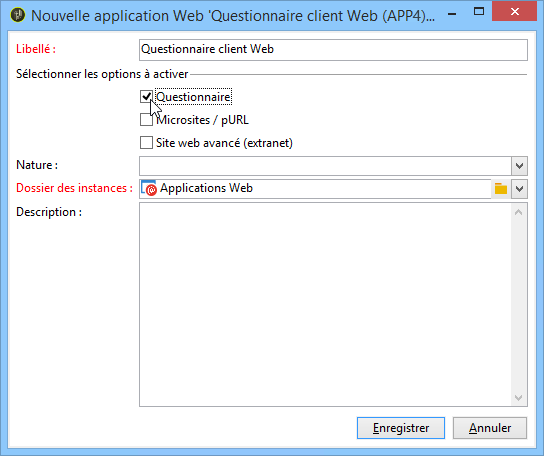

# A propos des applications web{#about-web-applications}

Adobe Campaign permet de créer et publier des applications web interactives et dynamiques avec des données de la base et du contenu adapté aux droits de l&#39;utilisateur connecté. Vous pouvez créer des pages, par exemple pour formulaire d&#39;édition sur un extranet ou des formulaires de notification, incluant des données de la base avec des tableaux, graphiques, champs de saisie, etc. Cette fonctionnalité vous permet de concevoir et mettre en ligne des pages web auxquelles les utilisateurs pourront accéder pour consulter ou renseigner des informations.

Il peut par exemple s&#39;agir d&#39;un formulaire d&#39;inscription dont les données ont été pré-remplies avec les informations contenues dans la base Adobe Campaign, comme dans l&#39;exemple ci-dessous :

Ce chapitre présente la gestion des applications web.

>[!CAUTION]
>
>Pour des raisons de confidentialité, nous vous recommandons d&#39;utiliser HTTPS pour toutes les ressources externes.

## Champ d&#39;application Web {#web-application-scope}

Les applications Web d’Adobe Campaign donnent accès aux fonctionnalités suivantes :

* Création de formulaires multi-pages,
* Gestion de formulaires multilingues, avec un outil de traduction intégré,
* Interface graphique de gestion des pages, mise en page en multi-colonnes,
* Personnalisation du rendu et du positionnement des champs,
* Affichage conditionnel des champs du formulaire en fonction des réponses,
* Affichage aléatoire de questions,
* Conditionnement de l&#39;affichage des pages,
* Vérification des informations avant validation, en fonction du type de données attendu (nombre, adresse email, date, etc.) et des champs obligatoires,
* Invitations/Notification par email,
* Personnalisation des messages d&#39;erreur et de fin,
* Ajout d&#39;images, vidéos, liens hypertextes, captcha, etc.
* Suivi des réponses en temps réel.

The optional **Survey** creation module offers the following additional functionalities:

* Extension dynamique de la base de données : création de réponses ne faisant pas partie du modèle de données initial,
* Génération de rapports dédiés.

Par rapport aux applications Web, les questionnaires proposent une interface graphique allégée : le nombre de contrôles d&#39;édition est réduit.

>[!NOTE]
>
>Les enquêtes sont présentées dans [cette section](../../web/using/about-surveys.md).
>
>Les fonctionnalités générales des formulaires web sous Adobe Campaign sont présentées dans [cette section](../../web/using/about-web-forms.md).

## Implémentation d’applications Web {#web-application-implementation}

Pour créer et rendre disponible une application web, vous devez :

1. Créer le contenu (champs, listes, tableaux, graphiques, etc.)

   Vous pouvez également consulter la section qui présente les champs disponibles pour les formulaires : tous ces champs sont aussi disponibles pour les applications web. Ces informations sont disponibles dans [cette page](../../web/using/adding-fields-to-a-web-form.md).

1. Ajouter, au besoin, des étapes de préchargement, de test, d&#39;enregistrement et paramétrer le contrôle d&#39;accès (principalement dans le cadre d&#39;une publication sur un extranet).
1. Publier l&#39;application web pour la rendre disponible sur un extranet ou dans Adobe Campaign.

## Configuration initiale de l&#39;application Web {#web-application-initial-configuration}

Web application are created via the **[!UICONTROL Web Applications]** link in the **[!UICONTROL Campaigns]** and **[!UICONTROL Profiles and targets]** tabs.

Les applications web sont stockées dans le noeud **[!UICONTROL Ressources > On-line > Applications Web]** de l&#39;arborescence Adobe Campaign. Les paramétrages sont répartis dans les dossiers suivants :

* **[!UICONTROL Administration > Paramétrage > Rendus des formulaires]** : contient les modèles de rendu pour la présentation des formulaires web (applications et questionnaires). Le modèle permet de générer le formulaire. Il utilise également une feuille de style CSS. Cette feuille peut être surchargée au niveau du modèle. Voir à ce sujet [cette page](../../web/using/form-rendering.md#selecting-the-form-rendering-template).
* **[!UICONTROL Ressources > Modèles > Modèles d&#39;application web]** : contient des modèles de formulaires. Pour créer un formulaire ou une application web, vous devez utiliser un modèle.

## Modèles d&#39;applications web {#web-application-templates}

Par défaut, Adobe Campaign fournit un modèle par type d&#39;application web disponible sur votre instance.

>[!NOTE]
>
>Vous pouvez transformer une application Web existante en modèle. Pour cela, sélectionnez le formulaire concerné et cliquez sur le bouton droit de la souris. Choisissez **[!UICONTROL Actions > Sauver comme modèle]**.

Vous pouvez créer des modèles à partir du nœud **[!UICONTROL Ressources > Modèles > Modèles d&#39;applications web]** de l&#39;arborescence Adobe Campaign.

L&#39;assistant de création vous permet de sélectionner les options à activer, comme dans l&#39;exemple ci-dessous.

>[!CAUTION]
>
>Les types d&#39;applications disponibles dépendent des options et modules installés. Consultez votre contrat de licence.

