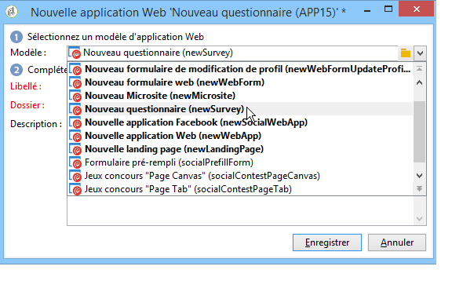
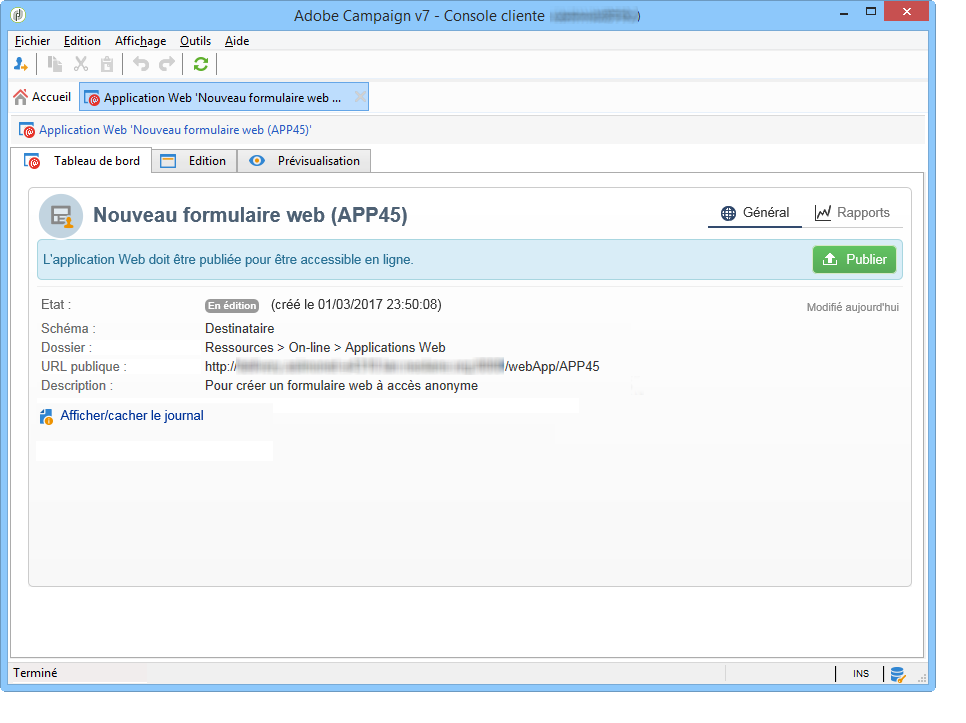
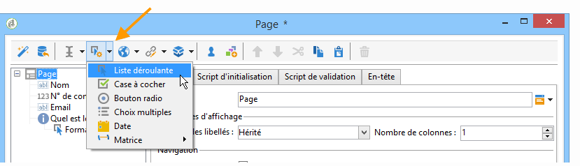
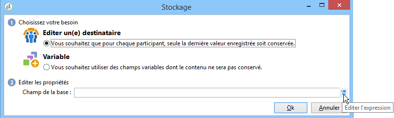
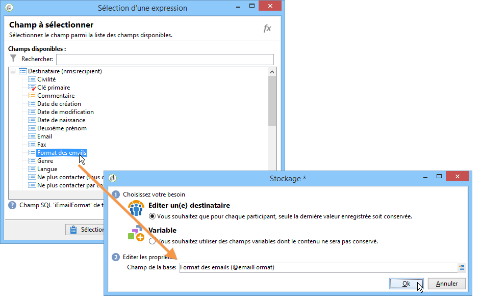

# Prise en main des formulaires web{#about-web-forms}

Adobe Campaign intègre un module graphique de définition et de publication de formulaires web afin de créer des pages proposant des champs de saisie et de sélection, et pouvant inclure des données de la base de données. Vous pouvez ainsi concevoir et publier des pages web auxquelles les utilisateurs peuvent accéder pour afficher ou saisir des informations.

Ce chapitre présente le mode de création et de gestion d&#39;un formulaire Web, la gestion des champs et des pages, les modes de stockage et d&#39;enregistrement.

>[!CAUTION]
>
>Pour des raisons de confidentialité, nous vous recommandons d&#39;utiliser HTTPS pour toutes les ressources externes.

## Etapes de création d&#39;un formulaire web {#steps-for-creating-a-web-form}

Ce chapitre présente les étapes de conception d&#39;un formulaire de type **webForm** dans Adobe Campaign, ainsi que les options et paramétrages disponibles. Adobe Campaign vous permet de mettre ce formulaire Web à disposition des utilisateurs, ainsi que de collecter et archiver les réponses dans la base de données.

>[!CAUTION]
>
>Lors de la configuration d&#39;applications web et de formulaires web, vous devez disposer d&#39;une résolution verticale minimale de 900 pixels (ex : 1 600x900).

Les formulaires web sont accessibles via le menu Applications Web de l&#39;onglet **Campagnes**. Dans l’arborescence d’Adobe Campaign, ils sont regroupés sous le nœud **[!UICONTROL Ressources > En ligne > Applications Web]**.

Pour créer un formulaire Web, cliquez sur le bouton **[!UICONTROL Créer]** situé au-dessus de la liste des applications Web.

Choisissez le modèle de formulaire Web (par défaut **[!UICONTROL newWebForm]**).

Vous accédez alors au tableau de bord du formulaire.

L&#39;onglet **[!UICONTROL Edition]** permet d&#39;en créer le contenu.

Pour définir le paramétrage et le contenu du formulaire Web, les étapes sont les suivantes :

* Commencez par créer les pages et contrôles requis : champs de saisie, listes déroulantes, contenus HTML, etc.

  Cette étape est présentée ci-dessous.

* Définir de l&#39;enchaînement des pages et conditionner l&#39;affichage.

  Cette étape est présentée dans la section [Définir l&#39;enchaînement des pages des formulaires web](defining-web-forms-page-sequencing.md).

* Au besoin, traduire le contenu.

  Cette étape est présentée dans la section [Traduire un formulaire web](translating-a-web-form.md).

## À propos de la conception des formulaires web {#about-web-forms-designing}

Les pages du formulaire sont créées au travers d&#39;un éditeur spécifique qui permet de définir et paramétrer des zones de saisie (texte), des champs de sélection (listes, cases à cocher, etc.) et les éléments statiques (images, contenus HTML, etc.). Ces éléments peuvent être regroupés en conteneurs et leur disposition modifiée en fonction de vos besoins (voir à ce sujet la section [Créer des conteneurs](defining-web-forms-layout.md#creating-containers)).

La définition du contenu et de la mise en page des écrans du formulaire sont présentés dans les sections suivantes :

* [Ajouter des champs à un formulaire web](adding-fields-to-a-web-form.md),
* [Insérer du contenu HTML](static-elements-in-a-web-form.md#inserting-html-content),
* [Eléments statiques dans un formulaire web](static-elements-in-a-web-form.md),
* [Définir la disposition des formulaires web](defining-web-forms-layout.md).

>[!NOTE]
>
>* Lors de la conception de la page, vous pouvez afficher le rendu final dans l’onglet **[!UICONTROL Aperçu]**. Pour afficher les modifications, commencez par enregistrer le formulaire. Les erreurs éventuelles sont affichées dans l&#39;onglet **[!UICONTROL Log]**.
>* Vous pouvez contrôler le bon enchaînement des pages et le stockage des informations en activant le mode debug au niveau du formulaire web. Pour cela, à partir du sous-onglet **[!UICONTROL Aperçu]**, cochez l&#39;option **[!UICONTROL Activer le mode debug]** : les informations collectées et les éventuelles erreurs d&#39;exécution seront alors affichées en bas de chaque page.
>

### Utiliser les icônes de la barre d&#39;outils {#using-the-icons-in-the-toolbar}

Vous pouvez également utiliser les icônes de la barre d’outils ou le bouton droit de la souris pour insérer une zone de saisie.

Dans ce cas, vous devez d&#39;abord sélectionner le type de champ à ajouter puis le mode de stockage des réponses.

Cliquez sur **[!UICONTROL Ok]** pour valider la sélection.

