# Ajouter des champs à un formulaire web{#adding-fields-to-a-web-form}

Dans un formulaire web, les champs permettent aux utilisateurs et utilisatrices de saisir des informations et sélectionner des options. Le formulaire web peut proposer champs de saisie, des champs de sélection, des contenus statiques ainsi que des contenus avancés de type captcha, abonnements, etc.

Lorsque vous utilisez l’assistant d’ajout de champs, le type de champ est automatiquement détecté en fonction du champ ou de la variable de stockage sélectionnée. Au besoin, vous pouvez le modifier à partir de la liste déroulante **[!UICONTROL Type]** de l&#39;onglet **[!UICONTROL Général]**.

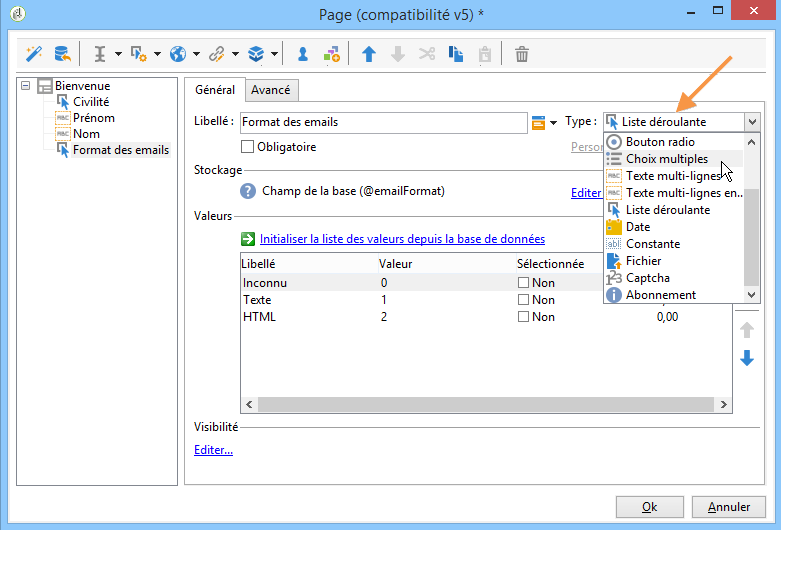

Lorsque vous utilisez les boutons de la barre d&#39;outils, sélectionnez directement le type de champ à ajouter.

Les types de champs disponibles sont les suivants :

* Entrée texte/nombre. Voir [Ajouter des champs de saisie](#adding-input-fields).
* Sélection d&#39;une liste déroulante. Voir [Ajouter des listes déroulantes](#adding-drop-down-lists).
* Choix multiple via des cases à cocher. Voir [Ajouter des cases à cocher](#adding-checkboxes).
* Sélection exclusive via des boutons radio. Voir [Ajouter des boutons radio](#adding-radio-buttons).
* Vote dans une grille d&#39;options. Voir [Ajouter des matrices](#adding-grids).
* Nombres et dates. Voir [Ajouter des dates et des nombres](#adding-dates-and-numbers).
* Abonnement/désabonnement à un service d&#39;informations. Voir [Cases à cocher d&#39;abonnement](#subscription-checkboxes).
* Validation de captcha. Voir [Insérer un captcha](#inserting-a-captcha).
* Bouton de téléchargement. [Télécharger un fichier](#uploading-a-file).
* Constante masquée. Voir [Insérer une constante masquée](#inserting-a-hidden-constant).

Spécifiez le mode de stockage des réponses : mise à jour d&#39;un champ de la base (seule la dernière valeur enregistrée est conservée) ou stockage dans une variable (la réponse ne sera pas stockée). Voir à ce sujet la section [Champs de stockage des réponses](web-forms-answers.md#response-storage-fields).

>[!NOTE]
>
>Par défaut, la zone est toujours insérée à la fin de l&#39;arborescence courante. Elle peut être déplacée en utilisant les flèches de la barre d&#39;outils.

## Assistant de création de champs {#field-creation-assistant}

Pour chaque page du formulaire, vous pouvez ajouter un champ à l’aide du premier bouton de la barre d’outils. Pour ce faire, accédez au menu **[!UICONTROL Ajouter à l’aide de l’assistant]**.

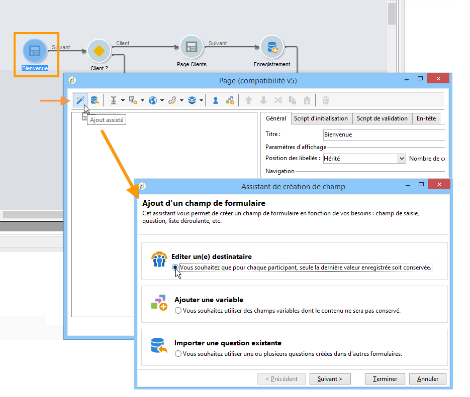

Sélectionnez le type de champ que vous souhaitez créer : vous pouvez choisir d&#39;ajouter un champ de la base, une variable ou d&#39;importer un groupe de champs créé dans un autre formulaire et regroupés dans un conteneur.

Cliquez sur le bouton **[!UICONTROL Suivant]** et choisissez le champ ou la variable de stockage, ou le conteneur à importer.

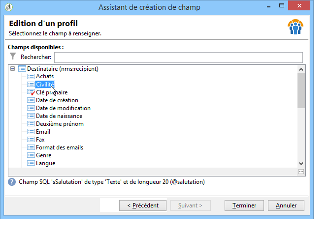

Cliquez sur **[!UICONTROL Terminer]** pour insérer le champ sélectionné dans la page.

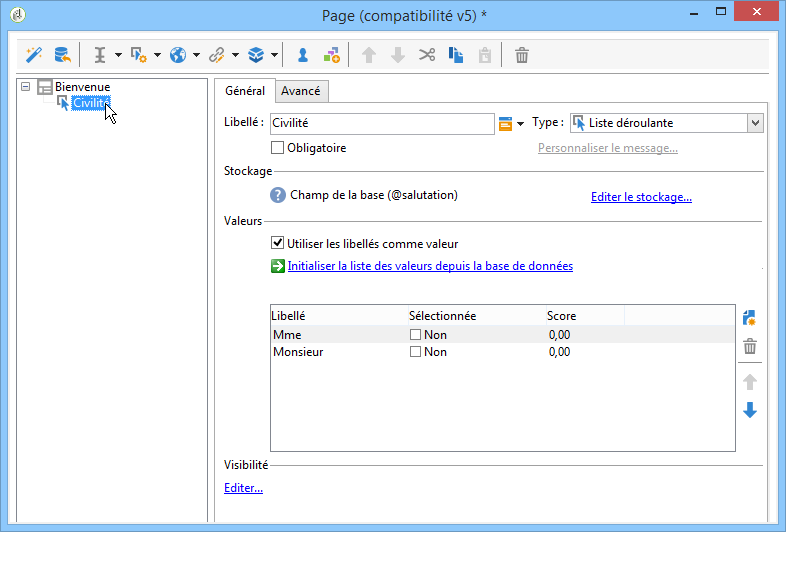

## Ajouter des champs de saisie {#adding-input-fields}

Pour ajouter un champ de saisie, cliquez sur le bouton **[!UICONTROL Contrôle de saisie]** et sélectionnez le type de champ à ajouter.

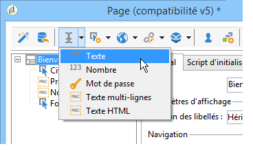

### Types de champs de saisie {#types-of-input-fields}

Dans une page de formulaire, vous pouvez insérer cinq types de champs texte :

* **Texte** : permet à l&#39;utilisateur de saisir du texte, sur une ligne.

  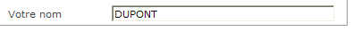

* **Nombre** : permet à l&#39;utilisateur de saisir un nombre sur une ligne. Voir à ce sujet la section [Ajouter des nombres](#adding-numbers).

  Lors de la validation de la page, le contenu des champs est contrôlé afin de vérifier que la valeur saisie est compatible avec le champ. Voir à ce sujet la section [Définir les paramètres de contrôle](form-rendering.md#defining-control-settings).

* **Mot de passe** : permet à l&#39;utilisateur de saisir du texte sur une seule ligne. Lors de la saisie, les caractères sont remplacés par des points :

  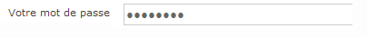

  >[!CAUTION]
  >
  >Les mots de passe sont stockés en clair dans la base, sans chiffrement.

* **Texte multi-lignes** : permet à l&#39;utilisateur de saisir du texte sur plusieurs lignes.

  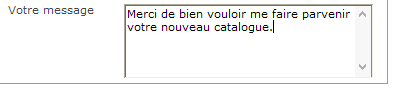

  >[!CAUTION]
  >
  >Les champs de texte multi-lignes sont des champs spécifiques qui peuvent contenir des retours à la ligne. Leur espace de stockage doit être associé à un champ mappé sur un élément XML et non sur un attribut XML.
  >   

* **Texte multi-lignes enrichi** : permet à l&#39;utilisateur de saisir du texte avec une certaine disposition, qui sera stocké au format HTML.

  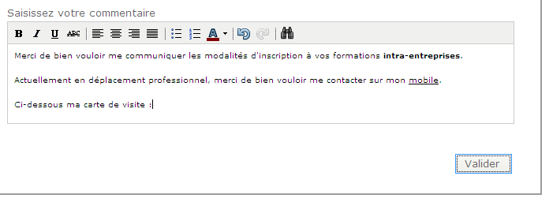

  Vous pouvez sélectionner le type d&#39;éditeur qui sera proposé aux utilisateurs. Pour cela, utilisez la liste déroulante du champ **[!UICONTROL Editeur Html]** de l&#39;onglet **[!UICONTROL Avancé]**.

  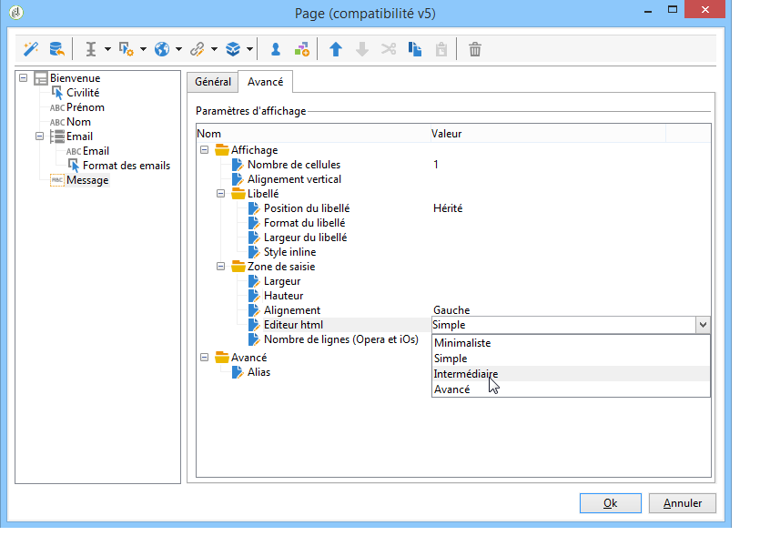

  Le nombre d’icônes affichées varie en fonction du type d’éditeur. Pour un éditeur **[!UICONTROL Avancé]**, le rendu sera le suivant :

  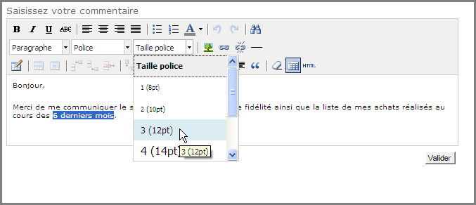

### Paramétrage des champs de saisie {#configure-input-fields}

Les champs de saisie sont tous paramétrés selon le même mode, au travers des options suivantes :

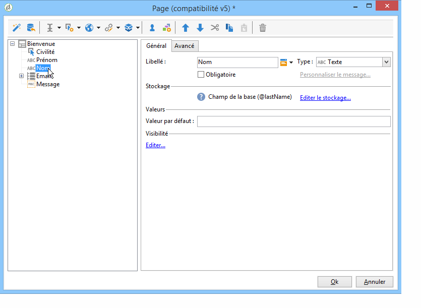

L&#39;onglet **[!UICONTROL Général]** permet de saisir le nom du champ et éventuellement de lui attribuer une valeur par défaut.

Vous pouvez modifier le mode de stockage des réponses à partir du lien **[!UICONTROL Editer le stockage...]**. Les valeurs peuvent être enregistrées dans un champ existant de la base de données, mais vous pouvez choisir de ne pas enregistrer les informations dans la base, en utilisant une variable locale.

>[!NOTE]
>
>Les modes de stockage sont détaillés dans [Champs de stockage des réponses](web-forms-answers.md#response-storage-fields).

L&#39;onglet **[!UICONTROL Avancé]** permet de définir des paramètres d&#39;affichage du champ (position des libellés, alignement, etc.). Voir [Définir la disposition des formulaires web](defining-web-forms-layout.md).

## Ajouter des listes déroulantes {#adding-drop-down-lists}

Dans une page de formulaire, vous pouvez insérer une liste déroulante : elle permet à l&#39;utilisateur de sélectionner une valeur parmi celles proposées dans un menu déroulant.

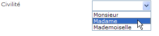

Pour ajouter une liste déroulante dans une page de formulaire, cliquez sur le bouton **[!UICONTROL Contrôles de sélection > Liste déroulante...]** dans la barre d&#39;outils de l&#39;éditeur de page.

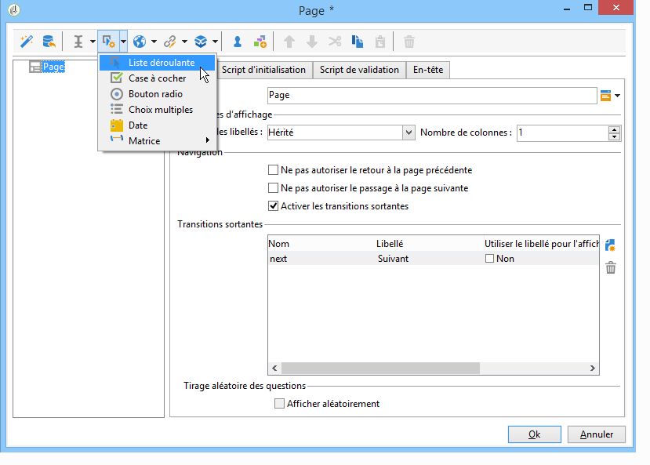

Sélectionnez le mode de stockage des réponses et validez votre choix.

Définissez les libellés et les valeurs de la liste dans la section inférieure de l’onglet **[!UICONTROL Général]** . Si les informations sont stockées dans un champ existant de la base de données et s’il s’agit d’un champ d’énumération, vous pouvez renseigner automatiquement les valeurs en cliquant sur **[!UICONTROL Initialiser la liste des valeurs depuis la base de données]**, comme illustré ci-dessous :

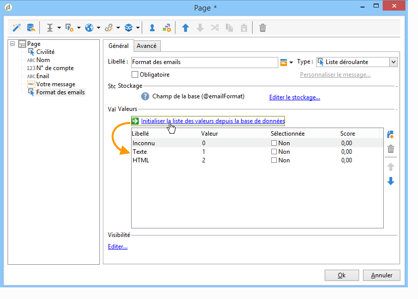

>[!NOTE]
>
>Utilisez les flèches situées à droite de la liste des valeurs pour les ordonner.

Si les données sont stockées dans une table liée, vous pouvez sélectionner le champ où sont enregistrées les valeurs à proposer dans la liste. Par exemple, si vous sélectionnez le tableau des pays, cliquez sur **[!UICONTROL Initialiser la liste des valeurs depuis la base de données]** et sélectionnez le champ souhaité.

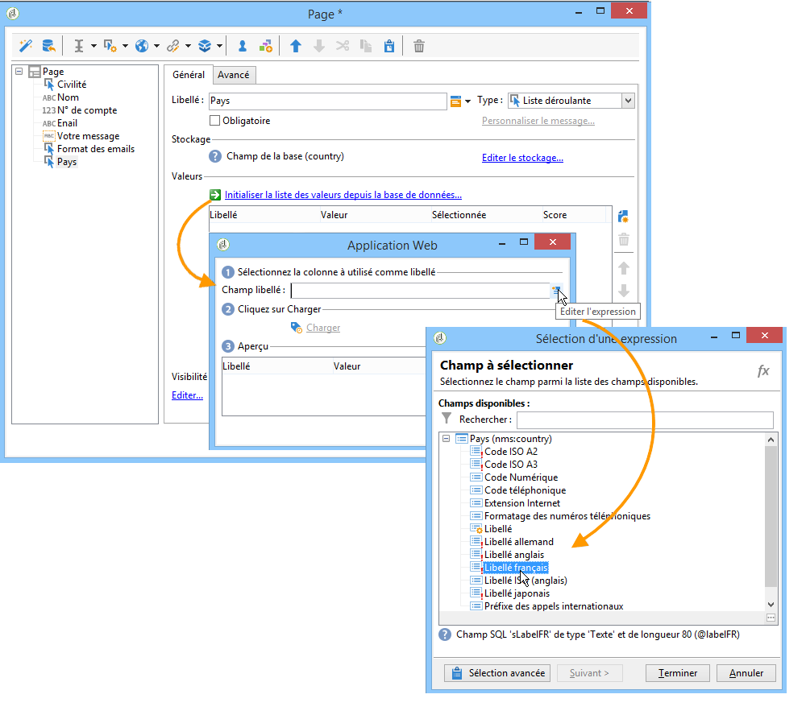

Cliquez ensuite sur le lien **[!UICONTROL Charger]** pour récupérer les valeurs :

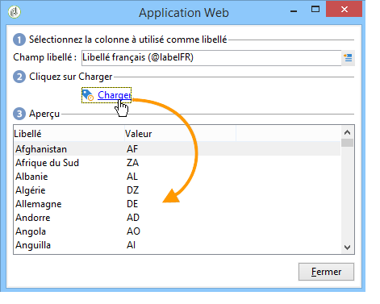

>[!CAUTION]
>
>En cas de mise à jour des valeurs de la liste, vous devez renouveler cette opération pour actualiser les valeurs proposées.

## Ajouter des cases à cocher {#adding-checkboxes}

Pour que l&#39;utilisateur puisse sélectionner une option, utilisez une case à cocher.

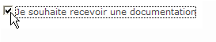

Pour ajouter une case à cocher dans une page de formulaire, cliquez sur l&#39;icône **[!UICONTROL Contrôles de sélection > Case à cocher...]** dans la barre d&#39;outils de l&#39;éditeur de page.

Sélectionnez le mode de stockage des réponses et validez votre choix.

Saisissez le libellé de la case dans le champ **[!UICONTROL Libellé]** de l&#39;onglet **[!UICONTROL Général]**.

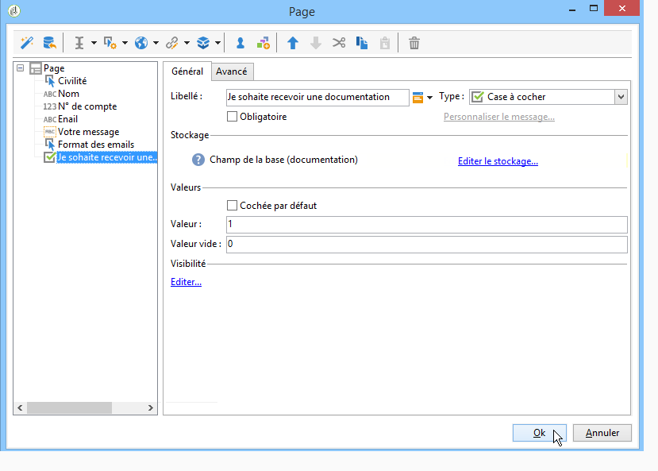

Une case à cocher permet d&#39;attribuer au champ (ou à la variable) de stockage une valeur ou une autre selon que la case est cochée ou non. La section **[!UICONTROL Valeurs]** permet de saisir la valeur à attribuer si la case est cochée (dans le champ **[!UICONTROL Valeur]**) et la valeur à attribuer si la case est décochée (dans le champ **[!UICONTROL Valeur vide]**). Ces valeurs dépendent du format de stockage des données.

Si le champ (ou la variable) de stockage est de type booléen, la valeur à attribuer si la case n’est pas cochée est déduite automatiquement. Dans ce cas, seul le champ **[!UICONTROL Valeur si coché]** est proposé, comme illustré ci-dessous :

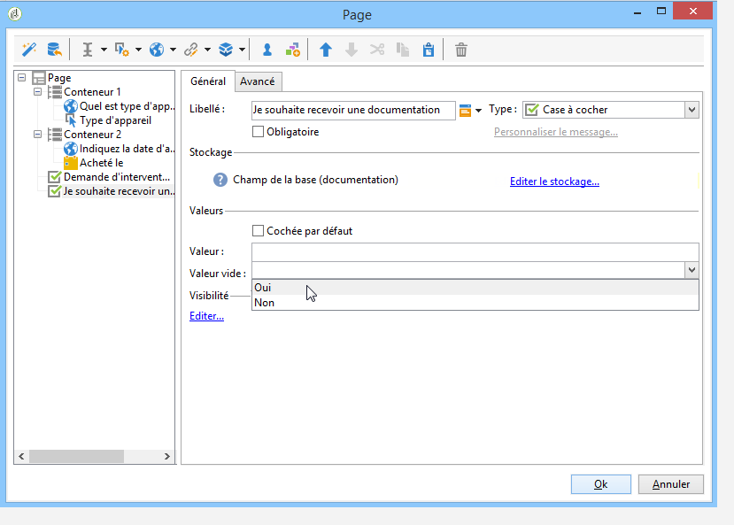

## Exemple : attribuer une valeur à un champ si une case est cochée {#example--assign-a-value-to-a-field-if-a-box-is-checked}

Nous allons insérer une case à cocher dans un formulaire afin de transmettre une demande d&#39;intervention, comme ci-dessous :

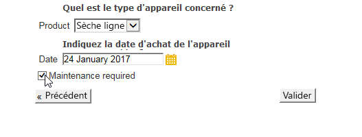

Les informations seront chargées vers la base de données dans un champ existant (ici, le champ **[!UICONTROL Commentaire]**) :

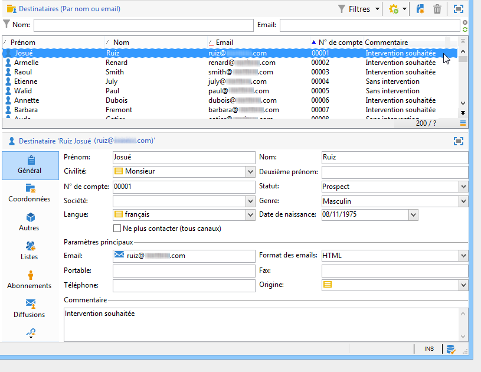

Si la case &quot;Demande d&#39;intervention&quot; est cochée, la colonne **[!UICONTROL Commentaire]** contiendra le message &quot;Intervention souhaitée&quot;, si elle est décochée, elle contiendra le message &quot;Sans intervention&quot;. Pour obtenir ce résultat, le paramétrage de la case à cocher dans la page du formulaire doit être le suivant :

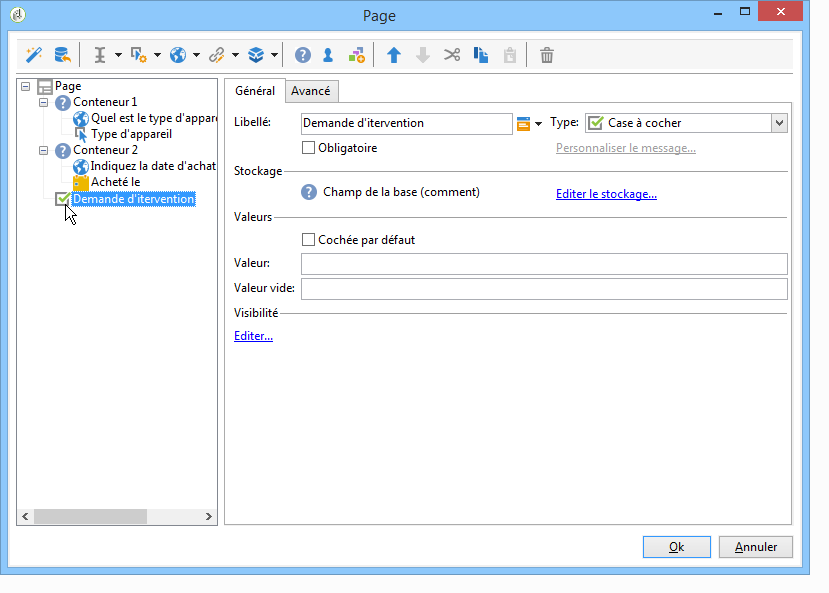

## Ajouter des boutons radio {#adding-radio-buttons}

Les boutons radio permettent de proposer à l&#39;utilisateur une série d&#39;options à sélection exclusive. Il s&#39;agit des différentes valeurs d&#39;un même champ.

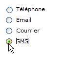

Vous pouvez créer les boutons radio individuellement (boutons unitaires) ou via une liste à choix multiples. Toutefois, le principe du bouton radio étant de sélectionner une option ou une autre, il sera toujours nécessaire de créer au moins deux boutons radio, et jamais un bouton isolé.

>[!CAUTION]
>
>Si vous souhaitez rendre la sélection obligatoire, vous devez créer une liste à choix multiples.

### Ajouter des boutons uniques {#add-single-buttons}

Pour ajouter un bouton radio dans une page de formulaire, sélectionnez le menu **[!UICONTROL Contrôles de saisie > Bouton radio]** dans la barre d&#39;outils de l&#39;éditeur de page et choisissez le mode de stockage.

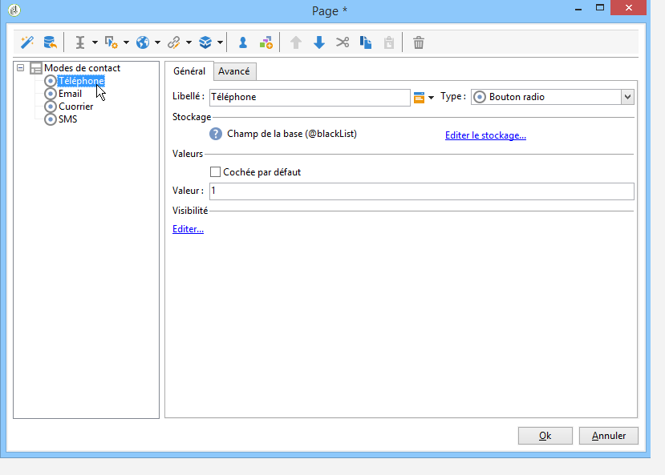

Les boutons radio sont configurés de la même manière que les cases à cocher (voir [Ajouter des cases à cocher](#adding-checkboxes)). Toutefois, aucune valeur n&#39;est affectée si l&#39;option n&#39;est pas sélectionnée. Pour que plusieurs boutons soient interdépendants, c&#39;est-à-dire que le fait de les sélectionner désélectionne automatiquement les autres, ils doivent être stockés dans le même champ. S&#39;ils ne sont pas stockés dans la base de données, la même variable locale doit être utilisée pour le stockage temporaire. Voir [Champs de stockage des réponses](web-forms-answers.md#response-storage-fields).

### Ajouter une liste de boutons {#add-a-list-of-buttons}

Pour ajouter des boutons radio via une liste, sélectionnez le menu **[!UICONTROL Contrôles de sélection > Choix multiples]** dans la barre d&#39;outils de l&#39;éditeur de page.

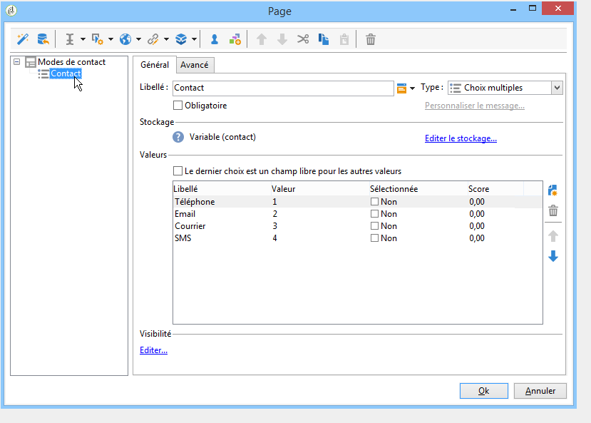

Vous ajoutez autant de boutons radio que de libellés. L&#39;avantage est de pouvoir importer les valeurs d&#39;un champ existant, s&#39;il s&#39;agit d&#39;un champ énuméré, et de permettre le choix d&#39;une des options proposées. En revanche, la disposition des boutons radio sera moins souple que celle des boutons unitaires.

>[!NOTE]
>
>Vous ne pouvez pas activer la sélection multiple dans une application web.
>Il est toutefois possible d&#39;insérer un champ de type **[!UICONTROL Choix multiple]** dans une application web, mais cela ne permettra pas à l&#39;utilisateur de sélectionner plusieurs valeurs.

## Ajouter des matrices {#adding-grids}

Les matrices sont utilisées pour réaliser des pages de votes dans les applications Web. Vous pouvez ainsi proposer des listes de boutons radio afin de répondre à des formulaires Web de type sondages ou évaluation, comme dans l&#39;exemple ci-dessous :

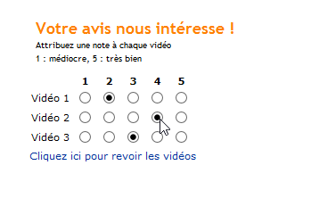

Pour intégrer des éléments de ce type dans un formulaire, vous devez créer une matrice simple et ajouter une ligne pour chaque élément à évaluer.

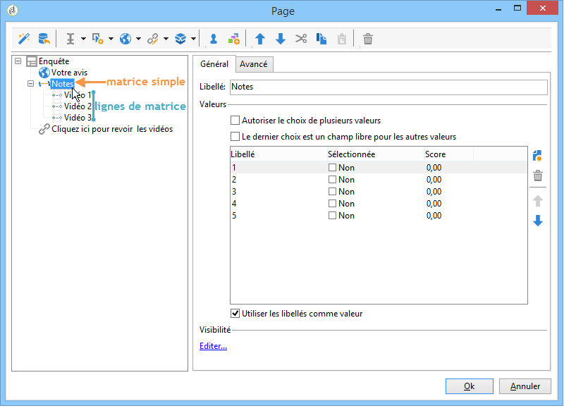

Le nombre de boutons radio de chaque ligne de matrice correspond au nombre de valeurs définies dans la matrice simple.

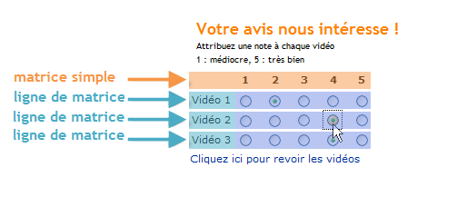

Dans chaque ligne de matrice, une seule option peut être sélectionnée.

>[!NOTE]
>
>Dans notre exemple, le libellé de la grille est masqué. Pour ce faire, accédez à l&#39;onglet **[!UICONTROL Avancé]**. L&#39;affichage de la **[!UICONTROL Position du libellé]** est défini sur **[!UICONTROL Caché]**. Voir [Définir la position des libellés](defining-web-forms-layout.md#defining-the-position-of-labels).

## Ajouter des dates et des nombres {#adding-dates-and-numbers}

Le contenu des champs du formulaire peut être formaté pour correspondre aux données stockées dans la base ou répondre à un besoin spécifique. Vous pouvez créer des champs adaptés pour la saisie de nombres et de dates.

### Ajouter des dates {#adding-dates}

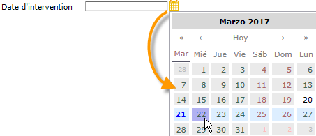

Pour permettre à l&#39;utilisateur de saisir une date dans une page de formulaire, ajoutez un champ de saisie et sélectionnez le type **[!UICONTROL Date...]**.

Indiquez le libellé du champ et le mode de stockage des données.

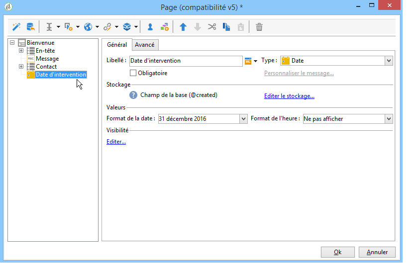

La section inférieure de la fenêtre permet de sélectionner les formats de date et d&#39;heure pour les valeurs renseignées dans ce champ.

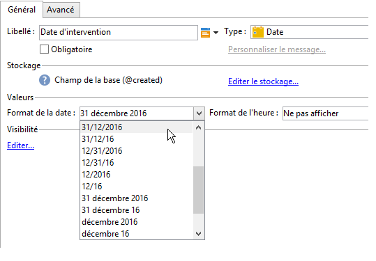

Vous pouvez également choisir de ne pas afficher la date (ou l&#39;heure).

Les dates peuvent être sélectionnées via un calendrier ou des listes déroulantes. Vous pouvez aussi les saisir directement dans le champ. Toutefois, elles doivent respecter le format spécifié dans l&#39;écran ci-dessus.

>[!NOTE]
>
>Par défaut, les dates utilisées dans les formulaires sont renseignées via un calendrier. Dans le cadre de formulaires multilingues, nous vous invitons à vérifier que les calendriers sont disponibles pour toutes les langues utilisées. Voir [Traduire un formulaire web](translating-a-web-form.md).

Toutefois, il peut être plus adapté, par exemple pour indiquer une date de naissance, d&#39;utiliser des listes déroulantes.

Pour cela, cliquez sur l&#39;onglet **[!UICONTROL Avancé]** et choisissez un mode de saisie par **[!UICONTROL Listes déroulantes]**.

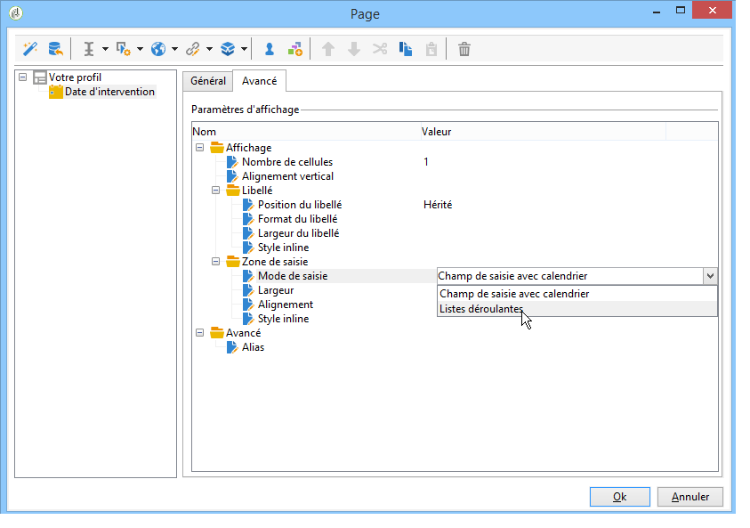

Vous pouvez alors borner les valeurs proposées dans la liste.

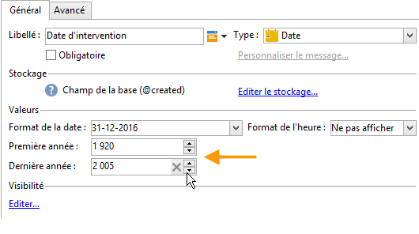

### Ajouter des nombres {#adding-numbers}

Vous pouvez créer des champs adaptés pour la saisie de nombres.

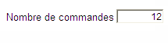

Dans un champ numérique, l&#39;utilisateur ne peut saisir que des chiffres : un contrôle de saisie est automatiquement appliqué lors de la validation de la page.

En fonction du champ de stockage des données dans la base, un formatage spécifique ou certaines restrictions peuvent être appliqués. Vous pouvez également définir des valeurs minimales et maximales. Le paramétrage de ce type de champ est le suivant :

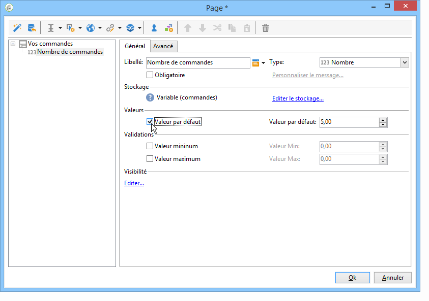

La valeur par défaut est la valeur affichée dans le champ lors de l&#39;affichage du formulaire. Elle peut être corrigée par l&#39;utilisateur.

Vous pouvez ajouter un préfixe et/ou un suffixe au champ numérique, à partir de l&#39;onglet **[!UICONTROL Avancé]**, comme dans l&#39;exemple suivant :

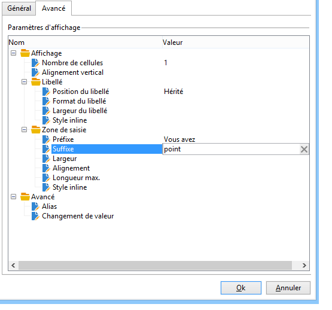

Dans le formulaire, le rendu sera :

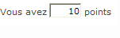

## Cases à cocher d&#39;abonnement {#subscription-checkboxes}

Vous pouvez ajouter des contrôles pour permettre aux utilisateurs de s&#39;abonner ou se désabonner à un ou plusieurs services d&#39;information (newsletters, alertes, notifications en temps réel, etc.). Pour s&#39;abonner, l&#39;utilisateur coche le service correspondant.

Pour créer une case à cocher d&#39;abonnement, cliquez sur **[!UICONTROL Contrôles avancés > Abonnement]**.

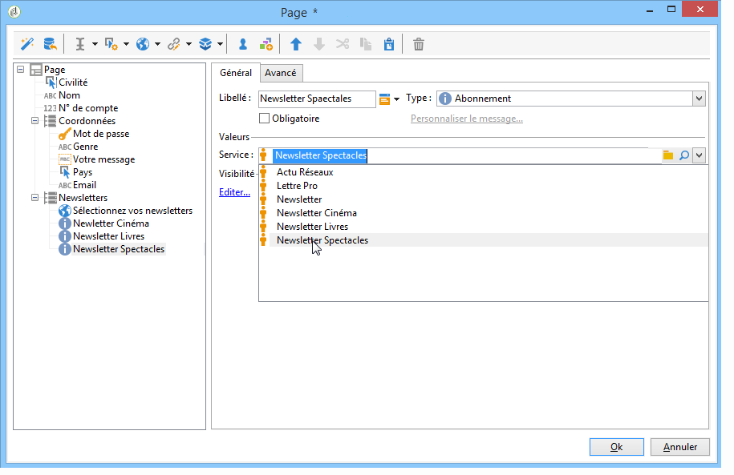

Indiquez le libellé de la case à cocher et sélectionnez le service d&#39;information concerné dans la liste déroulante **[!UICONTROL Service]**.

>[!NOTE]
>
>Les services d&#39;informations sont présentés dans cette [page](../../delivery/using/managing-subscriptions.md).

L&#39;utilisateur sera abonné au service spécifié s&#39;il coche l&#39;option correspondante.

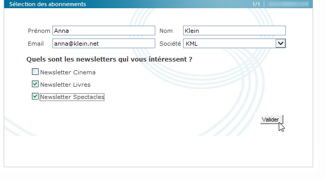

>[!CAUTION]
>
>Si l&#39;utilisateur est déjà abonné à un service d&#39;information et que la case correspondant à ce service est décochée lorsqu&#39;il valide le formulaire, il sera alors désabonné.

## Insérer un captcha {#inserting-a-captcha}

Les **captcha** permettent de prévenir l&#39;utilisation frauduleuse de vos formulaires Web.

>[!CAUTION]
>
>Si votre formulaire est composé de plusieurs pages, le Captcha doit toujours être positionné dans la dernière page, immédiatement avant la boîte d&#39;enregistrement, afin de prévenir tout contournement de la sécurité.

Pour insérer un Captcha dans un formulaire, cliquez sur le premier bouton de la barre d&#39;outils et choisissez **[!UICONTROL Contrôles avancés > Captcha]**.

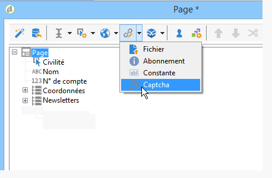

Saisissez le libellé du champ. Ce libellé sera affiché devant la zone d’affichage du Captcha. Vous pouvez modifier le positionnement de ce libellé à partir de l&#39;onglet **[!UICONTROL Avancé]**.

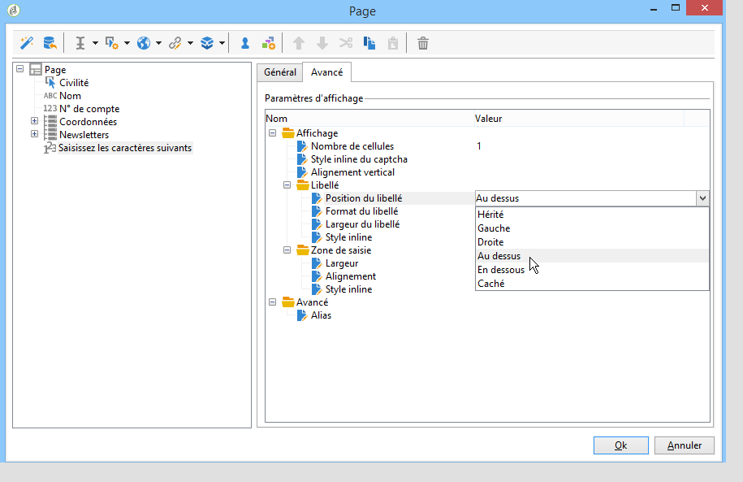

>[!NOTE]
>
>Pour les contrôles de type **[!UICONTROL captcha]**, il n&#39;est pas nécessaire d&#39;indiquer de champ ou variable de stockage.

Le Captcha est inséré dans la page avec un champ de saisie positionné sous le visuel afin de permettre la saisie. Ces deux éléments sont indissociables : pour la mise en page, ils sont considérés comme un seul élément (ils n&#39;occupent qu&#39;une seule cellule).

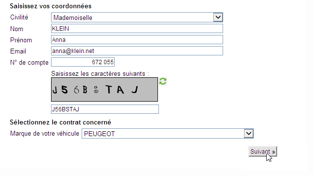

Lors de la validation de la page, le champ de saisie est affiché en rouge si le contenu du Captcha n&#39;a pas été saisi correctement.

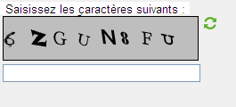

Vous pouvez créer un message d’erreur à afficher. Pour cela, utilisez le lien **[!UICONTROL Personnaliser le message]** dans l’onglet **[!UICONTROL Général]**.

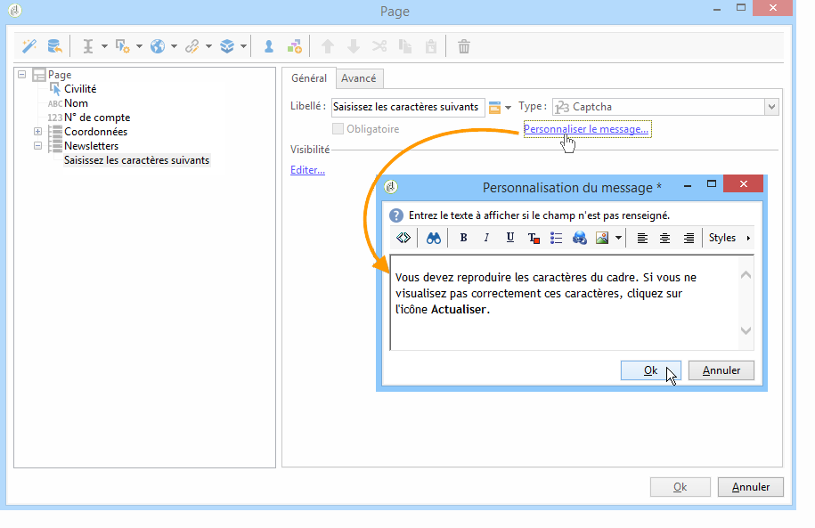

>[!NOTE]
>
>Les captchas sont composés de 8 caractères. Vous ne pouvez pas modifier cette valeur.

## Télécharger un fichier {#uploading-a-file}

Vous pouvez ajouter dans une page un champ de téléchargement. Cette fonctionnalité peut être utile, par exemple dans le contexte d&#39;un intranet, afin de partager des fichiers.

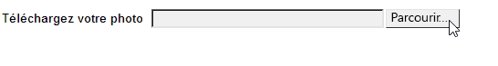

Pour ajouter un champ de téléchargement dans une page de formulaire, sélectionnez le menu **[!UICONTROL Contrôles avancés > Fichier...]** dans la barre d&#39;outils de l&#39;éditeur de page.

Par défaut, les fichiers chargés sont stockés dans des fichiers de ressources accessibles via le menu **[!UICONTROL Ressources > En ligne > Ressources publiques]**. Vous pouvez utiliser un script pour modifier ce comportement. Ce script peut utiliser les fonctions définies dans la [documentation JSAPI Campaign](https://experienceleague.adobe.com/developer/campaign-api/api/index.html?lang=fr) notamment celles relatives à la manipulation des fichiers.

Vous pouvez stocker le lien vers ces fichiers dans une variable locale ou dans un champ de la base. Vous pouvez, par exemple, étendre le schéma des destinataires afin d&#39;ajouter un lien vers les ressources fichiers.

>[!CAUTION]
>
>* Ce type de champ doit être réservé aux formulaires dont l&#39;accès est sécurisé (à l’aide d’informations d’identification).
>* Adobe Campaign n&#39;applique aucun contrôle sur la taille ou le type de ressource téléchargée : il est donc vivement recommandé de n&#39;utiliser les champs de téléchargement que pour les sites de type intranet sécurisé.
>* Lorsque plusieurs serveurs sont associés à l&#39;instance (architecture « load balancing »), vous devez vous assurer que les appels au formulaire web arrivent sur le même serveur.
>* Ce type d&#39;implémentation peut nécessiter l&#39;intervention de l&#39;équipe Consulting d&#39;Adobe Campaign.
>

## Insérer une constante masquée {#inserting-a-hidden-constant}

Lorsque l’utilisateur valide l’une des pages du formulaire, vous pouvez définir une valeur spécifique pour un champ de son profil ou une variable.

Ce champ n‘est pas visible par l‘utilisateur mais permet d‘enrichir les données de son profil.

Pour ce faire, placez une **constante** dans la page et indiquez la valeur et l&#39;emplacement de stockage.

Dans l&#39;exemple suivant, le champ **origine** du profil du destinataire est renseigné automatiquement chaque fois qu&#39;un utilisateur valide cette page. La constante n&#39;est pas affichée sur la page.

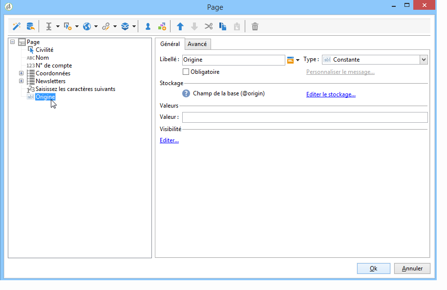
