<?xml version="1.0" encoding="UTF-8"?>
<xliff xmlns="urn:oasis:names:tc:xliff:document:1.2" xmlns:okp="okapi-framework:xliff-extensions" xmlns:its="http://www.w3.org/2005/11/its" xmlns:itsxlf="http://www.w3.org/ns/its-xliff/" version="1.2" its:version="2.0">
<file original="help/web/using/adding-fields-to-a-web-form.md.mdsc" source-language="en-US" target-language="en-XX" datatype="x-text/markdown">
<body>
<trans-unit id="tu186" xml:space="preserve">
<source xml:lang="en-US">https://experienceleague.adobe.com/en/tools/campaign-api</source>
<target xml:lang="en-XX">https://experienceleague.adobe.com/fr/tools/campaign-api</target>
</trans-unit>
<trans-unit id="tu1" restype="x-YAML_METADATA_HEADER_VALUE" xml:space="preserve">
<source xml:lang="en-US">Add fields to a web form</source>
<target xml:lang="en-XX">Ajouter des champs à un formulaire web</target>
</trans-unit>
<trans-unit id="tu2" restype="x-YAML_METADATA_HEADER_VALUE" xml:space="preserve">
<source xml:lang="en-US">Add fields to a web form</source>
<target xml:lang="en-XX">Ajouter des champs à un formulaire web</target>
</trans-unit>
<trans-unit id="tu3" xml:space="preserve">
<source xml:lang="en-US">Also applies to v8</source>
<target xml:lang="en-XX">S’applique également à la v8.</target>
</trans-unit>
<trans-unit id="tu4" xml:space="preserve">
<source xml:lang="en-US">Also applies to Campaign v8</source>
<target xml:lang="en-XX">S’applique également à Campaign v8.</target>
</trans-unit>
<trans-unit id="tu5" xml:space="preserve">
<source xml:lang="en-US">Add fields to a web form</source>
<target xml:lang="en-XX">Ajouter des champs à un formulaire web</target>
</trans-unit>
<trans-unit id="tu6" xml:space="preserve">
<source xml:lang="en-US">In a Web form, fields enable users to enter information and select options. Web forms can offer input fields, selection fields, static and advanced content (captchas, subscriptions, etc.).</source>
<target xml:lang="en-XX">Dans un formulaire web, les champs permettent aux utilisateurs et utilisatrices de saisir des informations et de sélectionner des options. Les formulaires web peuvent proposer des champs de saisie, des champs de sélection, ainsi que des contenus statiques et avancés (captcha, abonnements, etc.).</target>
</trans-unit>
<trans-unit id="tu7" xml:space="preserve">
<source xml:lang="en-US">When you use the assistant to add fields, the field type is detected automatically based on the selected field or storage variable. You can edit it using the <ph id="1" ctype="x-STRONG_EMPHASIS">**[!UICONTROL </ph>Type<ph id="3" ctype="x-LINK_REF">]**</ph> drop-down box in the <ph id="5" ctype="x-STRONG_EMPHASIS">**[!UICONTROL </ph>General<ph id="7" ctype="x-LINK_REF">]**</ph> tab.</source>
<target xml:lang="en-XX">Lorsque vous utilisez l’assistant d’ajout de champs, le type de champ est automatiquement détecté en fonction du champ ou de la variable de stockage sélectionnée. Au besoin, vous pouvez le modifier à partir de la liste déroulante <ph id="1" ctype="x-STRONG_EMPHASIS">**[!UICONTROL </ph>Type<ph id="3" ctype="x-LINK_REF">]**</ph> de l'onglet <ph id="5" ctype="x-STRONG_EMPHASIS">**[!UICONTROL </ph>Général<ph id="7" ctype="x-LINK_REF">]**</ph>.</target>
</trans-unit>
<trans-unit id="tu8" xml:space="preserve">
<source xml:lang="en-US"><ph id="1" ctype="x-IMAGE">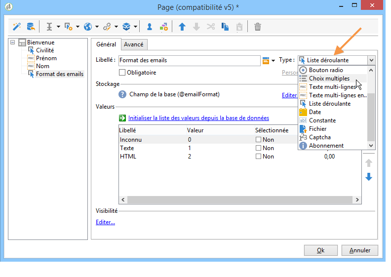</ph></source>
<target xml:lang="en-XX"><ph id="1" ctype="x-IMAGE"></ph></target>
</trans-unit>
<trans-unit id="tu9" xml:space="preserve">
<source xml:lang="en-US">When using the buttons in the toolbar, select the type of field you want to add.</source>
<target xml:lang="en-XX">Lorsque vous utilisez les boutons de la barre d'outils, sélectionnez directement le type de champ à ajouter.</target>
</trans-unit>
<trans-unit id="tu10" xml:space="preserve">
<source xml:lang="en-US">The following types of field are available:</source>
<target xml:lang="en-XX">Les types de champs disponibles sont les suivants :</target>
</trans-unit>
<trans-unit id="tu11" xml:space="preserve">
<source xml:lang="en-US">Text/number input. See <ph id="1" ctype="x-LINK">[</ph>Adding input fields<ph id="2" ctype="x-LINK">](#adding-input-fields)</ph>.</source>
<target xml:lang="en-XX">Entrée texte/nombre. Voir <ph id="1" ctype="x-LINK">[</ph>Ajouter des champs de saisie<ph id="2" ctype="x-LINK">](#adding-input-fields)</ph>.</target>
</trans-unit>
<trans-unit id="tu12" xml:space="preserve">
<source xml:lang="en-US">Drop-down list selection. See <ph id="1" ctype="x-LINK">[</ph>Adding drop-down lists<ph id="2" ctype="x-LINK">](#adding-drop-down-lists)</ph>.</source>
<target xml:lang="en-XX">Sélection d'une liste déroulante. Voir <ph id="1" ctype="x-LINK">[</ph>Ajouter des listes déroulantes<ph id="2" ctype="x-LINK">](#adding-drop-down-lists)</ph>.</target>
</trans-unit>
<trans-unit id="tu13" xml:space="preserve">
<source xml:lang="en-US">Multiple choice via checkboxes. See <ph id="1" ctype="x-LINK">[</ph>Adding checkboxes<ph id="2" ctype="x-LINK">](#adding-checkboxes)</ph>.</source>
<target xml:lang="en-XX">Choix multiple via des cases à cocher. Voir <ph id="1" ctype="x-LINK">[</ph>Ajouter des cases à cocher<ph id="2" ctype="x-LINK">](#adding-checkboxes)</ph>.</target>
</trans-unit>
<trans-unit id="tu14" xml:space="preserve">
<source xml:lang="en-US">Exclusive selection via radio buttons. See <ph id="1" ctype="x-LINK">[</ph>Adding radio buttons<ph id="2" ctype="x-LINK">](#adding-radio-buttons)</ph>.</source>
<target xml:lang="en-XX">Sélection exclusive via des boutons radio. Voir <ph id="1" ctype="x-LINK">[</ph>Ajouter des boutons radio<ph id="2" ctype="x-LINK">](#adding-radio-buttons)</ph>.</target>
</trans-unit>
<trans-unit id="tu15" xml:space="preserve">
<source xml:lang="en-US">Vote in an option grid. See <ph id="1" ctype="x-LINK">[</ph>Adding grids<ph id="2" ctype="x-LINK">](#adding-grids)</ph>.</source>
<target xml:lang="en-XX">Vote dans une grille d'options. Voir <ph id="1" ctype="x-LINK">[</ph>Ajouter des matrices<ph id="2" ctype="x-LINK">](#adding-grids)</ph>.</target>
</trans-unit>
<trans-unit id="tu16" xml:space="preserve">
<source xml:lang="en-US">Numbers and dates. See <ph id="1" ctype="x-LINK">[</ph>Adding dates and numbers<ph id="2" ctype="x-LINK">](#adding-dates-and-numbers)</ph>.</source>
<target xml:lang="en-XX">Nombres et dates. Voir <ph id="1" ctype="x-LINK">[</ph>Ajouter des dates et des nombres<ph id="2" ctype="x-LINK">](#adding-dates-and-numbers)</ph>.</target>
</trans-unit>
<trans-unit id="tu17" xml:space="preserve">
<source xml:lang="en-US">Subscription/unsubscription to an information service. See <ph id="1" ctype="x-LINK">[</ph>Subscription checkboxes<ph id="2" ctype="x-LINK">](#subscription-checkboxes)</ph>.</source>
<target xml:lang="en-XX">Abonnement/désabonnement à un service d'informations. Voir <ph id="1" ctype="x-LINK">[</ph>Cases à cocher d'abonnement<ph id="2" ctype="x-LINK">](#subscription-checkboxes)</ph>.</target>
</trans-unit>
<trans-unit id="tu18" xml:space="preserve">
<source xml:lang="en-US">Captcha validation. See <ph id="1" ctype="x-LINK">[</ph>Inserting a captcha<ph id="2" ctype="x-LINK">](#inserting-a-captcha)</ph>.</source>
<target xml:lang="en-XX">Validation de captcha. Voir <ph id="1" ctype="x-LINK">[</ph>Insérer un captcha<ph id="2" ctype="x-LINK">](#inserting-a-captcha)</ph>.</target>
</trans-unit>
<trans-unit id="tu19" xml:space="preserve">
<source xml:lang="en-US">Download button. <ph id="1" ctype="x-LINK">[</ph>Uploading a file<ph id="2" ctype="x-LINK">](#uploading-a-file)</ph>.</source>
<target xml:lang="en-XX">Bouton de téléchargement. <ph id="1" ctype="x-LINK">[</ph>Télécharger un fichier<ph id="2" ctype="x-LINK">](#uploading-a-file)</ph>.</target>
</trans-unit>
<trans-unit id="tu20" xml:space="preserve">
<source xml:lang="en-US">Hidden constant. See <ph id="1" ctype="x-LINK">[</ph>Inserting a hidden constant<ph id="2" ctype="x-LINK">](#inserting-a-hidden-constant)</ph>.</source>
<target xml:lang="en-XX">Constante masquée. Voir <ph id="1" ctype="x-LINK">[</ph>Insérer une constante masquée<ph id="2" ctype="x-LINK">](#inserting-a-hidden-constant)</ph>.</target>
</trans-unit>
<trans-unit id="tu21" xml:space="preserve">
<source xml:lang="en-US">Please specify the response storage mode: update a field in the database (stores only the last value saved) or store in a variable (the answer is not stored). For more on this, refer to <ph id="1" ctype="x-LINK">[</ph>Response storage fields<ph id="2" ctype="x-LINK">](web-forms-answers.md#response-storage-fields)</ph>.</source>
<target xml:lang="en-XX">Spécifiez le mode de stockage des réponses : mise à jour d'un champ de la base (seule la dernière valeur enregistrée est conservée) ou stockage dans une variable (la réponse ne sera pas stockée). Voir à ce sujet la section <ph id="1" ctype="x-LINK">[</ph>Champs de stockage des réponses<ph id="2" ctype="x-LINK">](web-forms-answers.md#response-storage-fields)</ph>.</target>
</trans-unit>
<trans-unit id="tu22" xml:space="preserve">
<source xml:lang="en-US"><ph id="1" ctype="x-regxph" equiv-text="&lbrack;!NOTE">[!NOTE]</ph></source>
<target xml:lang="en-XX"><ph id="1" ctype="x-regxph" equiv-text="&lbrack;!NOTE">[!NOTE]</ph></target>
</trans-unit>
<trans-unit id="tu23" xml:space="preserve">
<source xml:lang="en-US">By default, the field is inserted at the bottom of the current tree. Use the arrows in the toolbar to move it up or down.</source>
<target xml:lang="en-XX">Par défaut, le champ est inséré à la fin de l’arborescence actuelle. Il peut être déplacé vers le haut ou vers le bas en utilisant les flèches de la barre d’outils.</target>
</trans-unit>
<trans-unit id="tu24" xml:space="preserve">
<source xml:lang="en-US">Field creation assistant</source>
<target xml:lang="en-XX">Assistant de création de champs</target>
</trans-unit>
<trans-unit id="tu25" xml:space="preserve">
<source xml:lang="en-US">For each page of the form, you can add a field via the first button in the toolbar. To do this, go to the <ph id="1" ctype="x-STRONG_EMPHASIS">**[!UICONTROL </ph>Add using the assistant<ph id="3" ctype="x-LINK_REF">]**</ph> menu.</source>
<target xml:lang="en-XX">Pour chaque page du formulaire, vous pouvez ajouter un champ à l’aide du premier bouton de la barre d’outils. Pour ce faire, accédez au menu <ph id="1" ctype="x-STRONG_EMPHASIS">**[!UICONTROL </ph>Ajouter à l’aide de l’assistant<ph id="3" ctype="x-LINK_REF">]**</ph>.</target>
</trans-unit>
<trans-unit id="tu26" xml:space="preserve">
<source xml:lang="en-US"><ph id="1" ctype="x-IMAGE">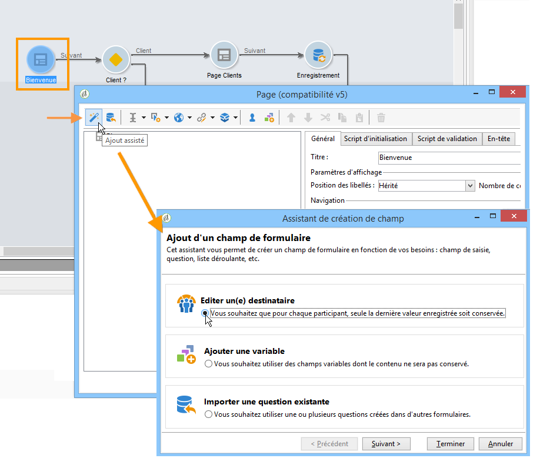</ph></source>
<target xml:lang="en-XX"><ph id="1" ctype="x-IMAGE"></ph></target>
</trans-unit>
<trans-unit id="tu27" xml:space="preserve">
<source xml:lang="en-US">Select the type of field you want to create: you can choose to add a field in the database, a variable or to import a group of fields created in another form and collected in a container.</source>
<target xml:lang="en-XX">Sélectionnez le type de champ que vous souhaitez créer : vous pouvez choisir d'ajouter un champ de la base, une variable ou d'importer un groupe de champs créé dans un autre formulaire et regroupés dans un conteneur.</target>
</trans-unit>
<trans-unit id="tu28" xml:space="preserve">
<source xml:lang="en-US">Click <ph id="1" ctype="x-STRONG_EMPHASIS">**[!UICONTROL </ph>Next<ph id="3" ctype="x-LINK_REF">]**</ph> and select the storage field or variable, or the container you want to import.</source>
<target xml:lang="en-XX">Cliquez sur le bouton <ph id="1" ctype="x-STRONG_EMPHASIS">**[!UICONTROL </ph>Suivant<ph id="3" ctype="x-LINK_REF">]**</ph> et choisissez le champ ou la variable de stockage, ou le conteneur à importer.</target>
</trans-unit>
<trans-unit id="tu29" xml:space="preserve">
<source xml:lang="en-US"><ph id="1" ctype="x-IMAGE"></ph></source>
<target xml:lang="en-XX"><ph id="1" ctype="x-IMAGE"></ph></target>
</trans-unit>
<trans-unit id="tu30" xml:space="preserve">
<source xml:lang="en-US">Click <ph id="1" ctype="x-STRONG_EMPHASIS">**[!UICONTROL </ph>Finish<ph id="3" ctype="x-LINK_REF">]**</ph> to insert the selected field into the page.</source>
<target xml:lang="en-XX">Cliquez sur <ph id="1" ctype="x-STRONG_EMPHASIS">**[!UICONTROL </ph>Terminer<ph id="3" ctype="x-LINK_REF">]**</ph> pour insérer le champ sélectionné dans la page.</target>
</trans-unit>
<trans-unit id="tu31" xml:space="preserve">
<source xml:lang="en-US"><ph id="1" ctype="x-IMAGE">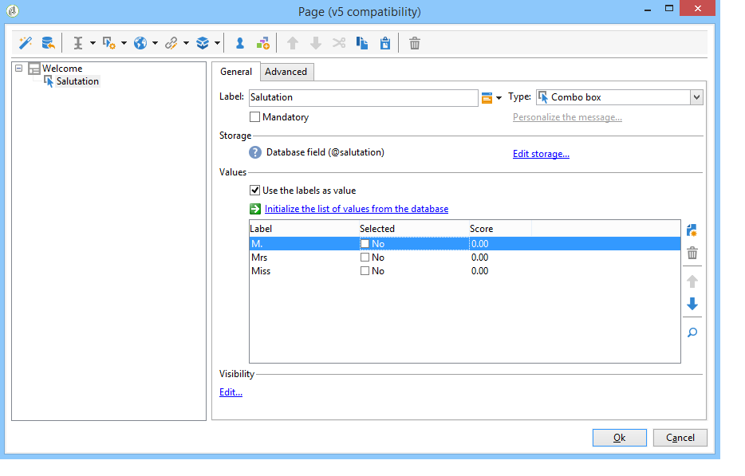</ph></source>
<target xml:lang="en-XX"><ph id="1" ctype="x-IMAGE"></ph></target>
</trans-unit>
<trans-unit id="tu32" xml:space="preserve">
<source xml:lang="en-US">Adding input fields</source>
<target xml:lang="en-XX">Ajouter des champs de saisie</target>
</trans-unit>
<trans-unit id="tu33" xml:space="preserve">
<source xml:lang="en-US">To add an input field, click the <ph id="1" ctype="x-STRONG_EMPHASIS">**[!UICONTROL </ph>Input control<ph id="3" ctype="x-LINK_REF">]**</ph> button and choose the type of field you want to add.</source>
<target xml:lang="en-XX">Pour ajouter un champ de saisie, cliquez sur le bouton <ph id="1" ctype="x-STRONG_EMPHASIS">**[!UICONTROL </ph>Contrôle de saisie<ph id="3" ctype="x-LINK_REF">]**</ph> et sélectionnez le type de champ à ajouter.</target>
</trans-unit>
<trans-unit id="tu34" xml:space="preserve">
<source xml:lang="en-US"><ph id="1" ctype="x-IMAGE">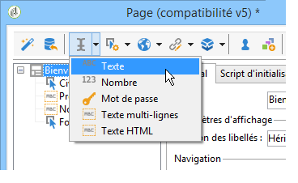</ph></source>
<target xml:lang="en-XX"><ph id="1" ctype="x-IMAGE"></ph></target>
</trans-unit>
<trans-unit id="tu35" xml:space="preserve">
<source xml:lang="en-US">Types of input fields</source>
<target xml:lang="en-XX">Types de champs de saisie</target>
</trans-unit>
<trans-unit id="tu36" xml:space="preserve">
<source xml:lang="en-US">Five different types of text fields can be inserted into a form page:</source>
<target xml:lang="en-XX">Dans une page de formulaire, vous pouvez insérer cinq types de champs texte :</target>
</trans-unit>
<trans-unit id="tu37" xml:space="preserve">
<source xml:lang="en-US"><ph id="1" ctype="x-STRONG_EMPHASIS">**</ph>Text<ph id="2" ctype="x-STRONG_EMPHASIS">**</ph>: lets the user enter a text on one line.</source>
<target xml:lang="en-XX"><ph id="1" ctype="x-STRONG_EMPHASIS">**</ph>Texte<ph id="2" ctype="x-STRONG_EMPHASIS">**</ph> : permet à l'utilisateur de saisir du texte, sur une ligne.</target>
</trans-unit>
<trans-unit id="tu38" xml:space="preserve">
<source xml:lang="en-US"><ph id="1" ctype="x-IMAGE"></ph></source>
<target xml:lang="en-XX"><ph id="1" ctype="x-IMAGE"></ph></target>
</trans-unit>
<trans-unit id="tu39" xml:space="preserve">
<source xml:lang="en-US"><ph id="1" ctype="x-STRONG_EMPHASIS">**</ph>Number<ph id="2" ctype="x-STRONG_EMPHASIS">**</ph>: lets the user enter a number on one line. for more on this, refer to <ph id="3" ctype="x-LINK">[</ph>Adding numbers<ph id="4" ctype="x-LINK">](#adding-numbers)</ph>.</source>
<target xml:lang="en-XX"><ph id="1" ctype="x-STRONG_EMPHASIS">**</ph>Nombre<ph id="2" ctype="x-STRONG_EMPHASIS">**</ph> : permet à l'utilisateur de saisir un nombre sur une ligne. Voir à ce sujet la section <ph id="3" ctype="x-LINK">[</ph>Ajouter des nombres<ph id="4" ctype="x-LINK">](#adding-numbers)</ph>.</target>
</trans-unit>
<trans-unit id="tu40" xml:space="preserve">
<source xml:lang="en-US">When the page is approved, field content is checked to make sure the value entered is compatible with the field. For more on this, refer to <ph id="1" ctype="x-LINK">[</ph>Defining control settings<ph id="2" ctype="x-LINK">](form-rendering.md#defining-control-settings)</ph>.</source>
<target xml:lang="en-XX">Lors de la validation de la page, le contenu des champs est contrôlé afin de vérifier que la valeur saisie est compatible avec le champ. Voir à ce sujet la section <ph id="1" ctype="x-LINK">[</ph>Définir les paramètres de contrôle<ph id="2" ctype="x-LINK">](form-rendering.md#defining-control-settings)</ph>.</target>
</trans-unit>
<trans-unit id="tu41" xml:space="preserve">
<source xml:lang="en-US"><ph id="1" ctype="x-STRONG_EMPHASIS">**</ph>Password<ph id="2" ctype="x-STRONG_EMPHASIS">**</ph>: lets the user enter text on a single line. During text entry, the characters are replaced by periods:</source>
<target xml:lang="en-XX"><ph id="1" ctype="x-STRONG_EMPHASIS">**</ph>Mot de passe<ph id="2" ctype="x-STRONG_EMPHASIS">**</ph> : permet à l’utilisateur ou à l’utilisatrice de saisir du texte sur une seule ligne. Lors de la saisie, les caractères sont remplacés par des points :</target>
</trans-unit>
<trans-unit id="tu42" xml:space="preserve">
<source xml:lang="en-US"><ph id="1" ctype="x-IMAGE">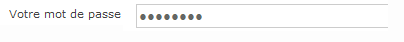</ph></source>
<target xml:lang="en-XX"><ph id="1" ctype="x-IMAGE"></ph></target>
</trans-unit>
<trans-unit id="tu43" xml:space="preserve">
<source xml:lang="en-US"><ph id="1" ctype="x-regxph" equiv-text="&lbrack;!CAUTION">[!CAUTION]</ph></source>
<target xml:lang="en-XX"><ph id="1" ctype="x-regxph" equiv-text="&lbrack;!CAUTION">[!CAUTION]</ph></target>
</trans-unit>
<trans-unit id="tu44" xml:space="preserve">
<source xml:lang="en-US">Passwords are stored unencrypted in the database.</source>
<target xml:lang="en-XX">Les mots de passe sont stockés en clair dans la base, sans chiffrement.</target>
</trans-unit>
<trans-unit id="tu45" xml:space="preserve">
<source xml:lang="en-US"><ph id="1" ctype="x-STRONG_EMPHASIS">**</ph>Multi-line text<ph id="2" ctype="x-STRONG_EMPHASIS">**</ph>: lets the user enter text on several lines.</source>
<target xml:lang="en-XX"><ph id="1" ctype="x-STRONG_EMPHASIS">**</ph>Texte multi-lignes<ph id="2" ctype="x-STRONG_EMPHASIS">**</ph> : permet à l'utilisateur de saisir du texte sur plusieurs lignes.</target>
</trans-unit>
<trans-unit id="tu46" xml:space="preserve">
<source xml:lang="en-US"><ph id="1" ctype="x-IMAGE">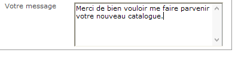</ph></source>
<target xml:lang="en-XX"><ph id="1" ctype="x-IMAGE"></ph></target>
</trans-unit>
<trans-unit id="tu47" xml:space="preserve">
<source xml:lang="en-US"><ph id="1" ctype="x-regxph" equiv-text="&lbrack;!CAUTION">[!CAUTION]</ph></source>
<target xml:lang="en-XX"><ph id="1" ctype="x-regxph" equiv-text="&lbrack;!CAUTION">[!CAUTION]</ph></target>
</trans-unit>
<trans-unit id="tu48" xml:space="preserve">
<source xml:lang="en-US">Multi-line text fields are specific fields that can contain carriage returns. Their storage space must be associated with a field mapped on an XML element, not an XML attribute.</source>
<target xml:lang="en-XX">Les champs de texte multiligne sont des champs spécifiques pouvant contenir des retours à la ligne. Leur espace de stockage doit être associé à un champ mappé sur un élément XML et non sur un attribut XML.</target>
</trans-unit>
<trans-unit id="tu49" xml:space="preserve">
<source xml:lang="en-US"><ph id="1" ctype="x-STRONG_EMPHASIS">**</ph>Enriched multi-line text<ph id="2" ctype="x-STRONG_EMPHASIS">**</ph>: lets the user enter text with a layout which will be stored in HTML format.</source>
<target xml:lang="en-XX"><ph id="1" ctype="x-STRONG_EMPHASIS">**</ph>Texte multi-lignes enrichi<ph id="2" ctype="x-STRONG_EMPHASIS">**</ph> : permet à l'utilisateur de saisir du texte avec une certaine disposition, qui sera stocké au format HTML.</target>
</trans-unit>
<trans-unit id="tu50" xml:space="preserve">
<source xml:lang="en-US"><ph id="1" ctype="x-IMAGE"></ph></source>
<target xml:lang="en-XX"><ph id="1" ctype="x-IMAGE"></ph></target>
</trans-unit>
<trans-unit id="tu51" xml:space="preserve">
<source xml:lang="en-US">You can select the type of editor offered to users. To do this, use the drop-down box of the <ph id="1" ctype="x-STRONG_EMPHASIS">**[!UICONTROL </ph>HTML editor<ph id="3" ctype="x-LINK_REF">]**</ph> field in the <ph id="5" ctype="x-STRONG_EMPHASIS">**[!UICONTROL </ph>Advanced<ph id="7" ctype="x-LINK_REF">]**</ph> tab.</source>
<target xml:lang="en-XX">Vous pouvez sélectionner le type d'éditeur qui sera proposé aux utilisateurs. Pour cela, utilisez la liste déroulante du champ <ph id="1" ctype="x-STRONG_EMPHASIS">**[!UICONTROL </ph>Editeur Html<ph id="3" ctype="x-LINK_REF">]**</ph> de l'onglet <ph id="5" ctype="x-STRONG_EMPHASIS">**[!UICONTROL </ph>Avancé<ph id="7" ctype="x-LINK_REF">]**</ph>.</target>
</trans-unit>
<trans-unit id="tu52" xml:space="preserve">
<source xml:lang="en-US"><ph id="1" ctype="x-IMAGE">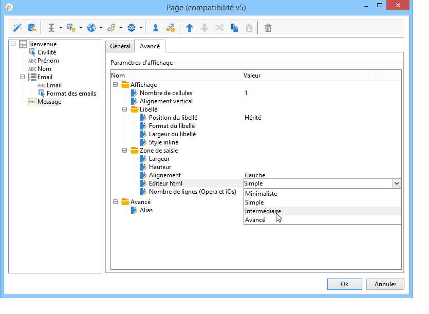</ph></source>
<target xml:lang="en-XX"><ph id="1" ctype="x-IMAGE"></ph></target>
</trans-unit>
<trans-unit id="tu53" xml:space="preserve">
<source xml:lang="en-US">The number of icons displayed varies depending on the type of editor. For an <ph id="1" ctype="x-STRONG_EMPHASIS">**[!UICONTROL </ph>Advanced<ph id="3" ctype="x-LINK_REF">]**</ph> editor, the rendering will be as follows:</source>
<target xml:lang="en-XX">Le nombre d’icônes affichées varie en fonction du type d’éditeur. Pour un éditeur <ph id="1" ctype="x-STRONG_EMPHASIS">**[!UICONTROL </ph>Avancé<ph id="3" ctype="x-LINK_REF">]**</ph>, le rendu sera le suivant :</target>
</trans-unit>
<trans-unit id="tu54" xml:space="preserve">
<source xml:lang="en-US"><ph id="1" ctype="x-IMAGE"></ph></source>
<target xml:lang="en-XX"><ph id="1" ctype="x-IMAGE"></ph></target>
</trans-unit>
<trans-unit id="tu55" xml:space="preserve">
<source xml:lang="en-US">Configure input fields</source>
<target xml:lang="en-XX">Paramétrage des champs de saisie</target>
</trans-unit>
<trans-unit id="tu56" xml:space="preserve">
<source xml:lang="en-US">Input fields are all configured based on the same mode, using the following options:</source>
<target xml:lang="en-XX">Les champs de saisie sont tous paramétrés selon le même mode, au travers des options suivantes :</target>
</trans-unit>
<trans-unit id="tu57" xml:space="preserve">
<source xml:lang="en-US"><ph id="1" ctype="x-IMAGE">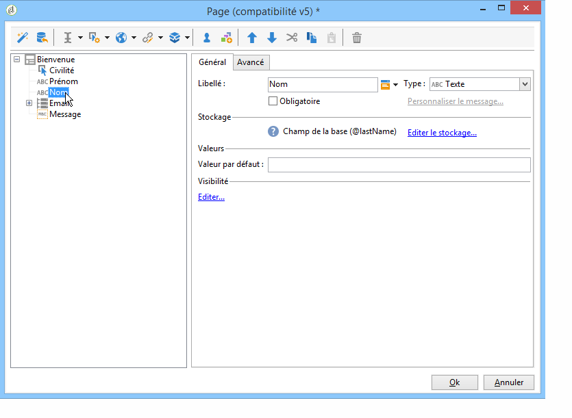</ph></source>
<target xml:lang="en-XX"><ph id="1" ctype="x-IMAGE"></ph></target>
</trans-unit>
<trans-unit id="tu58" xml:space="preserve">
<source xml:lang="en-US">The <ph id="1" ctype="x-STRONG_EMPHASIS">**[!UICONTROL </ph>General<ph id="3" ctype="x-LINK_REF">]**</ph> tab lets you enter the name of the field and attribute a default value to it if necessary.</source>
<target xml:lang="en-XX">L'onglet <ph id="1" ctype="x-STRONG_EMPHASIS">**[!UICONTROL </ph>Général<ph id="3" ctype="x-LINK_REF">]**</ph> permet de saisir le nom du champ et éventuellement de lui attribuer une valeur par défaut.</target>
</trans-unit>
<trans-unit id="tu59" xml:space="preserve">
<source xml:lang="en-US">The answer storage mode can be altered via the <ph id="1" ctype="x-STRONG_EMPHASIS">**[!UICONTROL </ph>Edit storage...<ph id="3" ctype="x-LINK_REF">]**</ph> link. Values can be stored in an existing field of the database; or you can choose not to save information in the database (use a local variable).</source>
<target xml:lang="en-XX">Vous pouvez modifier le mode de stockage des réponses à partir du lien <ph id="1" ctype="x-STRONG_EMPHASIS">**[!UICONTROL </ph>Modifier le stockage…<ph id="3" ctype="x-LINK_REF">]**</ph>. Les valeurs peuvent être enregistrées dans un champ existant de la base de données, mais vous pouvez choisir de ne pas enregistrer les informations dans la base, en utilisant une variable locale.</target>
</trans-unit>
<trans-unit id="tu60" xml:space="preserve">
<source xml:lang="en-US"><ph id="1" ctype="x-regxph" equiv-text="&lbrack;!NOTE">[!NOTE]</ph></source>
<target xml:lang="en-XX"><ph id="1" ctype="x-regxph" equiv-text="&lbrack;!NOTE">[!NOTE]</ph></target>
</trans-unit>
<trans-unit id="tu61" xml:space="preserve">
<source xml:lang="en-US">Storage modes are detailed in <ph id="1" ctype="x-LINK">[</ph>Response storage fields<ph id="2" ctype="x-LINK">](web-forms-answers.md#response-storage-fields)</ph></source>
<target xml:lang="en-XX">Les modes de stockage sont détaillés dans <ph id="1" ctype="x-LINK">[</ph>Champs de stockage des réponses<ph id="2" ctype="x-LINK">](web-forms-answers.md#response-storage-fields)</ph>.</target>
</trans-unit>
<trans-unit id="tu62" xml:space="preserve">
<source xml:lang="en-US">The <ph id="1" ctype="x-STRONG_EMPHASIS">**[!UICONTROL </ph>Advanced<ph id="3" ctype="x-LINK_REF">]**</ph> tab lets you define display parameters for the field (position of labels, alignment, etc.). See <ph id="5" ctype="x-LINK">[</ph>Defining web forms layout<ph id="6" ctype="x-LINK">](defining-web-forms-layout.md)</ph>.</source>
<target xml:lang="en-XX">L'onglet <ph id="1" ctype="x-STRONG_EMPHASIS">**[!UICONTROL </ph>Avancé<ph id="3" ctype="x-LINK_REF">]**</ph> permet de définir des paramètres d'affichage du champ (position des libellés, alignement, etc.). Voir <ph id="5" ctype="x-LINK">[</ph>Définir la disposition des formulaires web<ph id="6" ctype="x-LINK">](defining-web-forms-layout.md)</ph>.</target>
</trans-unit>
<trans-unit id="tu63" xml:space="preserve">
<source xml:lang="en-US">Adding drop-down lists</source>
<target xml:lang="en-XX">Ajouter des listes déroulantes</target>
</trans-unit>
<trans-unit id="tu64" xml:space="preserve">
<source xml:lang="en-US">You can insert a drop-down list into a survey page. This lets the user select a value from those on offer in a drop-down menu.</source>
<target xml:lang="en-XX">Vous pouvez insérer une liste déroulante dans une page de questionnaire. Elle permet à l’utilisateur ou à l’utilisatrice de sélectionner une valeur parmi celles proposées dans un menu déroulant.</target>
</trans-unit>
<trans-unit id="tu65" xml:space="preserve">
<source xml:lang="en-US"><ph id="1" ctype="x-IMAGE">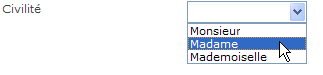</ph></source>
<target xml:lang="en-XX"><ph id="1" ctype="x-IMAGE"></ph></target>
</trans-unit>
<trans-unit id="tu66" xml:space="preserve">
<source xml:lang="en-US">To add a drop-down box to a form page, click the <ph id="1" ctype="x-STRONG_EMPHASIS">**[!UICONTROL </ph>Selection controls > Drop-down list<ph id="3" ctype="x-LINK_REF">]**</ph> button in the toolbar of the page editor.</source>
<target xml:lang="en-XX">Pour ajouter une liste déroulante dans une page de formulaire, cliquez sur le bouton <ph id="1" ctype="x-STRONG_EMPHASIS">**[!UICONTROL </ph>Contrôles de sélection > Liste déroulante...<ph id="3" ctype="x-LINK_REF">]**</ph> dans la barre d'outils de l'éditeur de page.</target>
</trans-unit>
<trans-unit id="tu67" xml:space="preserve">
<source xml:lang="en-US"><ph id="1" ctype="x-IMAGE">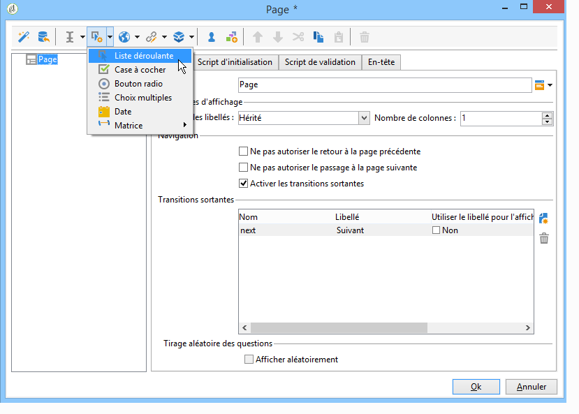</ph></source>
<target xml:lang="en-XX"><ph id="1" ctype="x-IMAGE"></ph></target>
</trans-unit>
<trans-unit id="tu68" xml:space="preserve">
<source xml:lang="en-US">Select the answer storage mode and confirm your choice.</source>
<target xml:lang="en-XX">Sélectionnez le mode de stockage des réponses et validez votre choix.</target>
</trans-unit>
<trans-unit id="tu69" xml:space="preserve">
<source xml:lang="en-US">Define the labels and values of the list in the lower section of the <ph id="1" ctype="x-STRONG_EMPHASIS">**[!UICONTROL </ph>General<ph id="3" ctype="x-LINK_REF">]**</ph> tab. If the information is stored in an existing field of the database and it is an enumeration field, you can fill in the values automatically by clicking <ph id="5" ctype="x-STRONG_EMPHASIS">**[!UICONTROL </ph>Initialize the list of values from the database<ph id="7" ctype="x-LINK_REF">]**</ph> , as shown below:</source>
<target xml:lang="en-XX">Définissez les libellés et les valeurs de la liste dans la section inférieure de l’onglet <ph id="1" ctype="x-STRONG_EMPHASIS">**[!UICONTROL </ph>Général<ph id="3" ctype="x-LINK_REF">]**</ph> . Si les informations sont stockées dans un champ existant de la base de données et s’il s’agit d’un champ d’énumération, vous pouvez renseigner automatiquement les valeurs en cliquant sur <ph id="5" ctype="x-STRONG_EMPHASIS">**[!UICONTROL </ph>Initialiser la liste des valeurs depuis la base de données<ph id="7" ctype="x-LINK_REF">]**</ph>, comme illustré ci-dessous :</target>
</trans-unit>
<trans-unit id="tu70" xml:space="preserve">
<source xml:lang="en-US"><ph id="1" ctype="x-IMAGE">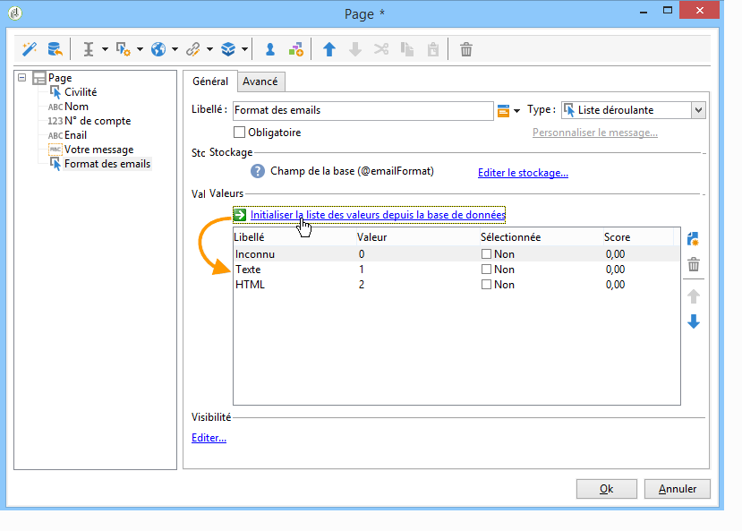</ph></source>
<target xml:lang="en-XX"><ph id="1" ctype="x-IMAGE"></ph></target>
</trans-unit>
<trans-unit id="tu71" xml:space="preserve">
<source xml:lang="en-US"><ph id="1" ctype="x-regxph" equiv-text="&lbrack;!NOTE">[!NOTE]</ph></source>
<target xml:lang="en-XX"><ph id="1" ctype="x-regxph" equiv-text="&lbrack;!NOTE">[!NOTE]</ph></target>
</trans-unit>
<trans-unit id="tu72" xml:space="preserve">
<source xml:lang="en-US">Use the arrows to the right of the list of values to change their sequence.</source>
<target xml:lang="en-XX">Utilisez les flèches situées à droite de la liste des valeurs pour les ordonner.</target>
</trans-unit>
<trans-unit id="tu73" xml:space="preserve">
<source xml:lang="en-US">If the data is stored in a linked table, you can select the field where the values to be suggested in the list are saved. For example, if you select the table of countries, click <ph id="1" ctype="x-STRONG_EMPHASIS">**[!UICONTROL </ph>Initialize the list of values from the database...<ph id="3" ctype="x-LINK_REF">]**</ph> and select the desired field.</source>
<target xml:lang="en-XX">Si les données sont stockées dans une table liée, vous pouvez sélectionner le champ où sont enregistrées les valeurs à proposer dans la liste. Par exemple, si vous sélectionnez le tableau des pays, cliquez sur <ph id="1" ctype="x-STRONG_EMPHASIS">**[!UICONTROL </ph>Initialiser la liste des valeurs depuis la base de données<ph id="3" ctype="x-LINK_REF">]**</ph> et sélectionnez le champ souhaité.</target>
</trans-unit>
<trans-unit id="tu74" xml:space="preserve">
<source xml:lang="en-US"><ph id="1" ctype="x-IMAGE">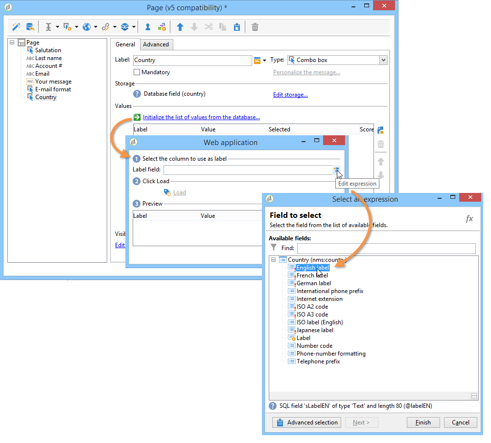</ph></source>
<target xml:lang="en-XX"><ph id="1" ctype="x-IMAGE"></ph></target>
</trans-unit>
<trans-unit id="tu75" xml:space="preserve">
<source xml:lang="en-US">Next, click the <ph id="1" ctype="x-STRONG_EMPHASIS">**[!UICONTROL </ph>Load<ph id="3" ctype="x-LINK_REF">]**</ph> link to retrieve the values:</source>
<target xml:lang="en-XX">Cliquez ensuite sur le lien <ph id="1" ctype="x-STRONG_EMPHASIS">**[!UICONTROL </ph>Charger<ph id="3" ctype="x-LINK_REF">]**</ph> pour récupérer les valeurs :</target>
</trans-unit>
<trans-unit id="tu76" xml:space="preserve">
<source xml:lang="en-US"><ph id="1" ctype="x-IMAGE"></ph></source>
<target xml:lang="en-XX"><ph id="1" ctype="x-IMAGE"></ph></target>
</trans-unit>
<trans-unit id="tu77" xml:space="preserve">
<source xml:lang="en-US"><ph id="1" ctype="x-regxph" equiv-text="&lbrack;!CAUTION">[!CAUTION]</ph></source>
<target xml:lang="en-XX"><ph id="1" ctype="x-regxph" equiv-text="&lbrack;!CAUTION">[!CAUTION]</ph></target>
</trans-unit>
<trans-unit id="tu78" xml:space="preserve">
<source xml:lang="en-US">Repeat this operation whenever the list is updated to refresh the values on offer.</source>
<target xml:lang="en-XX">En cas de mise à jour des valeurs de la liste, vous devez renouveler cette opération pour actualiser les valeurs proposées.</target>
</trans-unit>
<trans-unit id="tu79" xml:space="preserve">
<source xml:lang="en-US">Adding checkboxes</source>
<target xml:lang="en-XX">Ajouter des cases à cocher</target>
</trans-unit>
<trans-unit id="tu80" xml:space="preserve">
<source xml:lang="en-US">In order for the user to select an option, you need to use a checkbox.</source>
<target xml:lang="en-XX">Pour que l'utilisateur puisse sélectionner une option, utilisez une case à cocher.</target>
</trans-unit>
<trans-unit id="tu81" xml:space="preserve">
<source xml:lang="en-US"><ph id="1" ctype="x-IMAGE"></ph></source>
<target xml:lang="en-XX"><ph id="1" ctype="x-IMAGE"></ph></target>
</trans-unit>
<trans-unit id="tu82" xml:space="preserve">
<source xml:lang="en-US">To add a checkbox to a form, click the <ph id="1" ctype="x-STRONG_EMPHASIS">**[!UICONTROL </ph>Selection controls > Checkbox...<ph id="3" ctype="x-LINK_REF">]**</ph> icon in the toolbar of the page editor.</source>
<target xml:lang="en-XX">Pour ajouter une case à cocher dans une page de formulaire, cliquez sur l'icône <ph id="1" ctype="x-STRONG_EMPHASIS">**[!UICONTROL </ph>Contrôles de sélection > Case à cocher...<ph id="3" ctype="x-LINK_REF">]**</ph> dans la barre d'outils de l'éditeur de page.</target>
</trans-unit>
<trans-unit id="tu83" xml:space="preserve">
<source xml:lang="en-US">Select the answer storage mode and confirm your choice.</source>
<target xml:lang="en-XX">Sélectionnez le mode de stockage des réponses et validez votre choix.</target>
</trans-unit>
<trans-unit id="tu84" xml:space="preserve">
<source xml:lang="en-US">Enter the label of the box in the <ph id="1" ctype="x-STRONG_EMPHASIS">**[!UICONTROL </ph>Label<ph id="3" ctype="x-LINK_REF">]**</ph> field of the <ph id="5" ctype="x-STRONG_EMPHASIS">**[!UICONTROL </ph>General<ph id="7" ctype="x-LINK_REF">]**</ph> tab.</source>
<target xml:lang="en-XX">Saisissez le libellé de la case dans le champ <ph id="1" ctype="x-STRONG_EMPHASIS">**[!UICONTROL </ph>Libellé<ph id="3" ctype="x-LINK_REF">]**</ph> de l'onglet <ph id="5" ctype="x-STRONG_EMPHASIS">**[!UICONTROL </ph>Général<ph id="7" ctype="x-LINK_REF">]**</ph>.</target>
</trans-unit>
<trans-unit id="tu85" xml:space="preserve">
<source xml:lang="en-US"><ph id="1" ctype="x-IMAGE">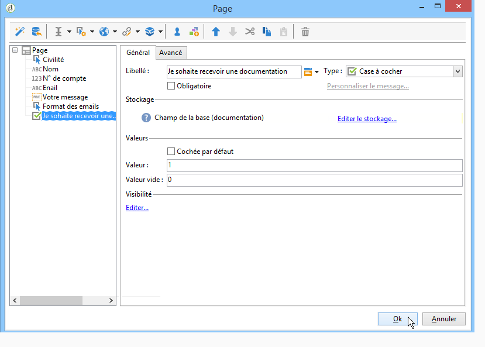</ph></source>
<target xml:lang="en-XX"><ph id="1" ctype="x-IMAGE"></ph></target>
</trans-unit>
<trans-unit id="tu86" xml:space="preserve">
<source xml:lang="en-US">A checkbox lets you assign a value to the storage field (or value) depending on whether or not the box is checked. The <ph id="1" ctype="x-STRONG_EMPHASIS">**[!UICONTROL </ph>Values<ph id="3" ctype="x-LINK_REF">]**</ph> section lets you enter the value to assign if the box is checked (in the <ph id="5" ctype="x-STRONG_EMPHASIS">**[!UICONTROL </ph>Value<ph id="7" ctype="x-LINK_REF">]**</ph> field), and the value to assign if it is not checked (in the <ph id="9" ctype="x-STRONG_EMPHASIS">**[!UICONTROL </ph>Empty value<ph id="11" ctype="x-LINK_REF">]**</ph> field). These values depend on the data storage format.</source>
<target xml:lang="en-XX">Une case à cocher permet d'attribuer au champ (ou à la variable) de stockage une valeur ou une autre selon que la case est cochée ou non. La section <ph id="1" ctype="x-STRONG_EMPHASIS">**[!UICONTROL </ph>Valeurs<ph id="3" ctype="x-LINK_REF">]**</ph> permet de saisir la valeur à attribuer si la case est cochée (dans le champ <ph id="5" ctype="x-STRONG_EMPHASIS">**[!UICONTROL </ph>Valeur<ph id="7" ctype="x-LINK_REF">]**</ph>) et la valeur à attribuer si la case est décochée (dans le champ <ph id="9" ctype="x-STRONG_EMPHASIS">**[!UICONTROL </ph>Valeur vide<ph id="11" ctype="x-LINK_REF">]**</ph>). Ces valeurs dépendent du format de stockage des données.</target>
</trans-unit>
<trans-unit id="tu87" xml:space="preserve">
<source xml:lang="en-US">If the storage field (or variable) is boolean, the value to assign if the box is not checked will be deduced automatically. In this case, only the <ph id="1" ctype="x-STRONG_EMPHASIS">**[!UICONTROL </ph>Value if checked<ph id="3" ctype="x-LINK_REF">]**</ph> field is offered, as shown below:</source>
<target xml:lang="en-XX">Si le champ (ou la variable) de stockage est de type booléen, la valeur à attribuer si la case n’est pas cochée est déduite automatiquement. Dans ce cas, seul le champ <ph id="1" ctype="x-STRONG_EMPHASIS">**[!UICONTROL </ph>Valeur si coché<ph id="3" ctype="x-LINK_REF">]**</ph> est proposé, comme illustré ci-dessous :</target>
</trans-unit>
<trans-unit id="tu88" xml:space="preserve">
<source xml:lang="en-US"><ph id="1" ctype="x-IMAGE"></ph></source>
<target xml:lang="en-XX"><ph id="1" ctype="x-IMAGE"></ph></target>
</trans-unit>
<trans-unit id="tu89" xml:space="preserve">
<source xml:lang="en-US">Example: Assign a value to a field if a box is checked</source>
<target xml:lang="en-XX">Exemple : attribuer une valeur à un champ si une case est cochée</target>
</trans-unit>
<trans-unit id="tu90" xml:space="preserve">
<source xml:lang="en-US">We want to insert a checkbox into a form to send a maintenance request, as shown below:</source>
<target xml:lang="en-XX">Nous allons insérer une case à cocher dans un formulaire afin de transmettre une demande d'intervention, comme ci-dessous :</target>
</trans-unit>
<trans-unit id="tu91" xml:space="preserve">
<source xml:lang="en-US"><ph id="1" ctype="x-IMAGE">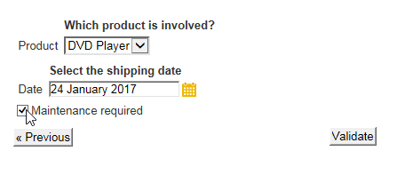</ph></source>
<target xml:lang="en-XX"><ph id="1" ctype="x-IMAGE"></ph></target>
</trans-unit>
<trans-unit id="tu92" xml:space="preserve">
<source xml:lang="en-US">The information will be uploaded to the database and into an existing field (in this case, the <ph id="1" ctype="x-STRONG_EMPHASIS">**[!UICONTROL </ph>Comment<ph id="3" ctype="x-LINK_REF">]**</ph> field):</source>
<target xml:lang="en-XX">Les informations seront chargées vers la base de données dans un champ existant (ici, le champ <ph id="1" ctype="x-STRONG_EMPHASIS">**[!UICONTROL </ph>Commentaire<ph id="3" ctype="x-LINK_REF">]**</ph>) :</target>
</trans-unit>
<trans-unit id="tu93" xml:space="preserve">
<source xml:lang="en-US"><ph id="1" ctype="x-IMAGE">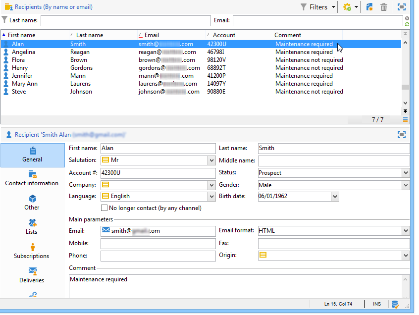</ph></source>
<target xml:lang="en-XX"><ph id="1" ctype="x-IMAGE"></ph></target>
</trans-unit>
<trans-unit id="tu94" xml:space="preserve">
<source xml:lang="en-US">If the "Maintenance required" box is checked, the <ph id="1" ctype="x-STRONG_EMPHASIS">**[!UICONTROL </ph>Comment<ph id="3" ctype="x-LINK_REF">]**</ph> column will contain "Maintenance required". If the box isn't checked, the column will show "Maintenance not required". To obtain this result, apply the following configuration to the checkbox on the form page:</source>
<target xml:lang="en-XX">Si la case « Maintenance nécessaire » est cochée, la colonne <ph id="1" ctype="x-STRONG_EMPHASIS">**[!UICONTROL </ph>Commentaire<ph id="3" ctype="x-LINK_REF">]**</ph> contient le message « Maintenance nécessaire ». Si la case est décochée, elle contient le message « Maintenance non nécessaire ». Pour obtenir ce résultat, le paramétrage de la case à cocher doit être le suivant dans la page du formulaire :</target>
</trans-unit>
<trans-unit id="tu95" xml:space="preserve">
<source xml:lang="en-US"><ph id="1" ctype="x-IMAGE"></ph></source>
<target xml:lang="en-XX"><ph id="1" ctype="x-IMAGE"></ph></target>
</trans-unit>
<trans-unit id="tu96" xml:space="preserve">
<source xml:lang="en-US">Adding radio buttons</source>
<target xml:lang="en-XX">Ajouter des boutons radio</target>
</trans-unit>
<trans-unit id="tu97" xml:space="preserve">
<source xml:lang="en-US">Radio buttons let you offer the user a series of exclusive options to choose from. These are different values for the same field.</source>
<target xml:lang="en-XX">Les cases d’option permettent de proposer une série d’options à sélection exclusive. Il s’agit de valeurs différentes pour le même champ.</target>
</trans-unit>
<trans-unit id="tu98" xml:space="preserve">
<source xml:lang="en-US"><ph id="1" ctype="x-IMAGE">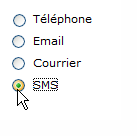</ph></source>
<target xml:lang="en-XX"><ph id="1" ctype="x-IMAGE"></ph></target>
</trans-unit>
<trans-unit id="tu99" xml:space="preserve">
<source xml:lang="en-US">You can create radio buttons individually (unitary buttons) or via a multiple-choice list, but since the point of the radio buttons is to select one option or another, we will always create at least a pair of radio buttons, never just a single button.</source>
<target xml:lang="en-XX">Vous pouvez créer les boutons radio individuellement (boutons unitaires) ou via une liste à choix multiples. Toutefois, le principe du bouton radio étant de sélectionner une option ou une autre, il sera toujours nécessaire de créer au moins deux boutons radio, et jamais un bouton isolé.</target>
</trans-unit>
<trans-unit id="tu100" xml:space="preserve">
<source xml:lang="en-US"><ph id="1" ctype="x-regxph" equiv-text="&lbrack;!CAUTION">[!CAUTION]</ph></source>
<target xml:lang="en-XX"><ph id="1" ctype="x-regxph" equiv-text="&lbrack;!CAUTION">[!CAUTION]</ph></target>
</trans-unit>
<trans-unit id="tu101" xml:space="preserve">
<source xml:lang="en-US">To make selection mandatory, you need to create a multiple choice list.</source>
<target xml:lang="en-XX">Si vous souhaitez rendre la sélection obligatoire, vous devez créer une liste à choix multiples.</target>
</trans-unit>
<trans-unit id="tu102" xml:space="preserve">
<source xml:lang="en-US">Add single buttons</source>
<target xml:lang="en-XX">Ajouter des boutons uniques</target>
</trans-unit>
<trans-unit id="tu103" xml:space="preserve">
<source xml:lang="en-US">To add a radio button to a form page, go to the <ph id="1" ctype="x-STRONG_EMPHASIS">**[!UICONTROL </ph>Selection controls > Radio button<ph id="3" ctype="x-LINK_REF">]**</ph> menu in the toolbar of the page editor and choose a storage mode.</source>
<target xml:lang="en-XX">Pour ajouter un bouton radio dans une page de formulaire, sélectionnez le menu <ph id="1" ctype="x-STRONG_EMPHASIS">**[!UICONTROL </ph>Contrôles de saisie > Bouton radio<ph id="3" ctype="x-LINK_REF">]**</ph> dans la barre d'outils de l'éditeur de page et choisissez le mode de stockage.</target>
</trans-unit>
<trans-unit id="tu104" xml:space="preserve">
<source xml:lang="en-US"><ph id="1" ctype="x-IMAGE">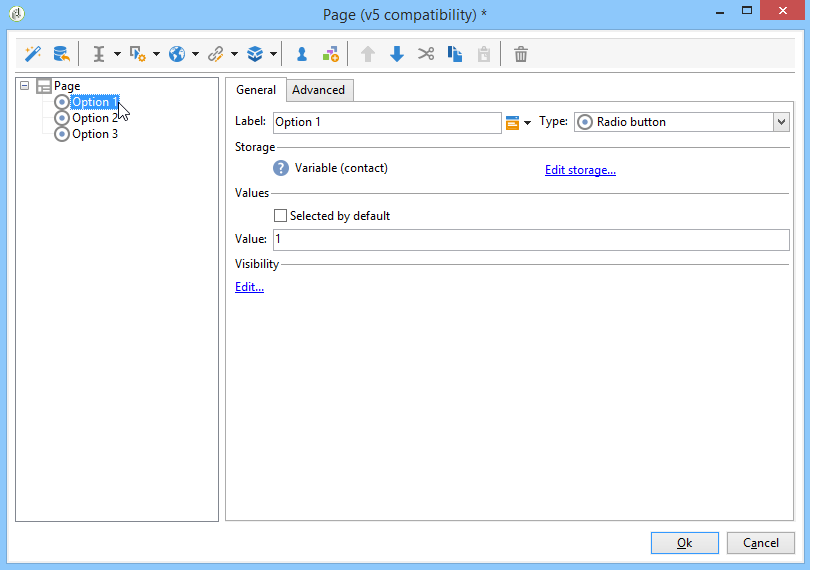</ph></source>
<target xml:lang="en-XX"><ph id="1" ctype="x-IMAGE"></ph></target>
</trans-unit>
<trans-unit id="tu105" xml:space="preserve">
<source xml:lang="en-US">Radio buttons are configured in a similar way to checkboxes (see <ph id="1" ctype="x-LINK">[</ph>Adding checkboxes<ph id="2" ctype="x-LINK">](#adding-checkboxes)</ph>). However, no value is assigned if the option is not selected. In order for several buttons to be interdependent, i.e. selecting one automatically deselects the others, they must be stored in the same field. If they are not stored in the database, the same local variable must be used for temporary storage. See <ph id="3" ctype="x-LINK">[</ph>Response storage fields<ph id="4" ctype="x-LINK">](web-forms-answers.md#response-storage-fields)</ph>.</source>
<target xml:lang="en-XX">Les boutons radio sont configurés de la même manière que les cases à cocher (voir <ph id="1" ctype="x-LINK">[</ph>Ajouter des cases à cocher<ph id="2" ctype="x-LINK">](#adding-checkboxes)</ph>). Toutefois, aucune valeur n'est affectée si l'option n'est pas sélectionnée. Pour que plusieurs boutons soient interdépendants, c'est-à-dire que le fait de les sélectionner désélectionne automatiquement les autres, ils doivent être stockés dans le même champ. S'ils ne sont pas stockés dans la base de données, la même variable locale doit être utilisée pour le stockage temporaire. Voir <ph id="3" ctype="x-LINK">[</ph>Champs de stockage des réponses<ph id="4" ctype="x-LINK">](web-forms-answers.md#response-storage-fields)</ph>.</target>
</trans-unit>
<trans-unit id="tu106" xml:space="preserve">
<source xml:lang="en-US">Add a list of buttons</source>
<target xml:lang="en-XX">Ajouter une liste de boutons</target>
</trans-unit>
<trans-unit id="tu107" xml:space="preserve">
<source xml:lang="en-US">To add radio buttons via a list, go to the <ph id="1" ctype="x-STRONG_EMPHASIS">**[!UICONTROL </ph>Selection controls>Multiple choice<ph id="3" ctype="x-LINK_REF">]**</ph> menu in the toolbar of the page editor.</source>
<target xml:lang="en-XX">Pour ajouter des boutons radio via une liste, sélectionnez le menu <ph id="1" ctype="x-STRONG_EMPHASIS">**[!UICONTROL </ph>Contrôles de sélection > Choix multiples<ph id="3" ctype="x-LINK_REF">]**</ph> dans la barre d'outils de l'éditeur de page.</target>
</trans-unit>
<trans-unit id="tu108" xml:space="preserve">
<source xml:lang="en-US"><ph id="1" ctype="x-IMAGE"></ph></source>
<target xml:lang="en-XX"><ph id="1" ctype="x-IMAGE"></ph></target>
</trans-unit>
<trans-unit id="tu109" xml:space="preserve">
<source xml:lang="en-US">Add as many radio buttons as there are labels. The advantage of this feature is that you can import values from an existing field (in case of an itemized field) and make it for the user to choose one option. However, the layout of buttons is less flexible.</source>
<target xml:lang="en-XX">Ajoutez autant de cases d’option que de libellés. L’avantage est de pouvoir importer les valeurs d’un champ existant, s’il s’agit d’un champ énuméré, et de permettre le choix d’une des options proposées. En revanche, la disposition des boutons est moins souple.</target>
</trans-unit>
<trans-unit id="tu110" xml:space="preserve">
<source xml:lang="en-US"><ph id="1" ctype="x-regxph" equiv-text="&lbrack;!NOTE">[!NOTE]</ph></source>
<target xml:lang="en-XX"><ph id="1" ctype="x-regxph" equiv-text="&lbrack;!NOTE">[!NOTE]</ph></target>
</trans-unit>
<trans-unit id="tu111" xml:space="preserve">
<source xml:lang="en-US">You cannot enable multi-selection in a web application.
<ph id="1" ctype="x-BLOCK_QUOTE">></ph>It is possible, however, to insert a <ph id="2" ctype="x-STRONG_EMPHASIS">**[!UICONTROL </ph>Multiple choice<ph id="4" ctype="x-LINK_REF">]**</ph> type field into a Web application but this will not enable the user to select several values.</source>
<target xml:lang="en-XX">Vous ne pouvez pas activer la sélection multiple dans une application web.
<ph id="1" ctype="x-BLOCK_QUOTE">></ph>Il est toutefois possible d'insérer un champ de type <ph id="2" ctype="x-STRONG_EMPHASIS">**[!UICONTROL </ph>Choix multiple<ph id="4" ctype="x-LINK_REF">]**</ph> dans une application web, mais cela ne permettra pas à l'utilisateur de sélectionner plusieurs valeurs.</target>
</trans-unit>
<trans-unit id="tu112" xml:space="preserve">
<source xml:lang="en-US">Adding grids</source>
<target xml:lang="en-XX">Ajouter des matrices</target>
</trans-unit>
<trans-unit id="tu113" xml:space="preserve">
<source xml:lang="en-US">Grids are used to design voting pages in Web applications. This lets you offer lists of radio buttons for answering survey or assessment type Web forms, as shown below:</source>
<target xml:lang="en-XX">Les grilles servent à concevoir des pages de vote dans les applications web. Vous pouvez ainsi proposer des listes de cases d’option afin de répondre à des formulaires web de type questionnaire ou évaluation, comme dans l’exemple ci-dessous :</target>
</trans-unit>
<trans-unit id="tu114" xml:space="preserve">
<source xml:lang="en-US"><ph id="1" ctype="x-IMAGE">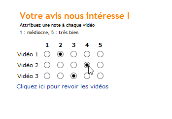</ph></source>
<target xml:lang="en-XX"><ph id="1" ctype="x-IMAGE"></ph></target>
</trans-unit>
<trans-unit id="tu115" xml:space="preserve">
<source xml:lang="en-US">To use this type of element in a form, create a simple grid and add a line for each element to be assessed.</source>
<target xml:lang="en-XX">Pour intégrer des éléments de ce type dans un formulaire, vous devez créer une matrice simple et ajouter une ligne pour chaque élément à évaluer.</target>
</trans-unit>
<trans-unit id="tu116" xml:space="preserve">
<source xml:lang="en-US"><ph id="1" ctype="x-IMAGE"></ph></source>
<target xml:lang="en-XX"><ph id="1" ctype="x-IMAGE"></ph></target>
</trans-unit>
<trans-unit id="tu117" xml:space="preserve">
<source xml:lang="en-US">The number of radio buttons in each line of the grid matches the number of values defined in the simple grid.</source>
<target xml:lang="en-XX">Le nombre de boutons radio de chaque ligne de matrice correspond au nombre de valeurs définies dans la matrice simple.</target>
</trans-unit>
<trans-unit id="tu118" xml:space="preserve">
<source xml:lang="en-US"><ph id="1" ctype="x-IMAGE"></ph></source>
<target xml:lang="en-XX"><ph id="1" ctype="x-IMAGE"></ph></target>
</trans-unit>
<trans-unit id="tu119" xml:space="preserve">
<source xml:lang="en-US">Only one option can be selected per grid line.</source>
<target xml:lang="en-XX">Dans chaque ligne de matrice, une seule option peut être sélectionnée.</target>
</trans-unit>
<trans-unit id="tu120" xml:space="preserve">
<source xml:lang="en-US"><ph id="1" ctype="x-regxph" equiv-text="&lbrack;!NOTE">[!NOTE]</ph></source>
<target xml:lang="en-XX"><ph id="1" ctype="x-regxph" equiv-text="&lbrack;!NOTE">[!NOTE]</ph></target>
</trans-unit>
<trans-unit id="tu121" xml:space="preserve">
<source xml:lang="en-US">In our example, the label of the grid is hidden. To do this, go to the <ph id="1" ctype="x-STRONG_EMPHASIS">**[!UICONTROL </ph>Advanced<ph id="3" ctype="x-LINK_REF">]**</ph> tab, the <ph id="5" ctype="x-STRONG_EMPHASIS">**[!UICONTROL </ph>Label position<ph id="7" ctype="x-LINK_REF">]**</ph> display is defined as <ph id="9" ctype="x-STRONG_EMPHASIS">**[!UICONTROL </ph>Hidden<ph id="11" ctype="x-LINK_REF">]**</ph> . See <ph id="13" ctype="x-LINK">[</ph>Defining the position of labels<ph id="14" ctype="x-LINK">](defining-web-forms-layout.md#defining-the-position-of-labels)</ph>.</source>
<target xml:lang="en-XX">Dans notre exemple, le libellé de la grille est masqué. Pour ce faire, accédez à l'onglet <ph id="1" ctype="x-STRONG_EMPHASIS">**[!UICONTROL </ph>Avancé<ph id="3" ctype="x-LINK_REF">]**</ph>. L'affichage de la <ph id="5" ctype="x-STRONG_EMPHASIS">**[!UICONTROL </ph>Position du libellé<ph id="7" ctype="x-LINK_REF">]**</ph> est défini sur <ph id="9" ctype="x-STRONG_EMPHASIS">**[!UICONTROL </ph>Caché<ph id="11" ctype="x-LINK_REF">]**</ph>. Voir <ph id="13" ctype="x-LINK">[</ph>Définir la position des libellés<ph id="14" ctype="x-LINK">](defining-web-forms-layout.md#defining-the-position-of-labels)</ph>.</target>
</trans-unit>
<trans-unit id="tu122" xml:space="preserve">
<source xml:lang="en-US">Adding dates and numbers</source>
<target xml:lang="en-XX">Ajouter des dates et des nombres</target>
</trans-unit>
<trans-unit id="tu123" xml:space="preserve">
<source xml:lang="en-US">The content of the form fields can be formatted to match the data stored in the database or to satisfy a particular requirement. You can create suitable fields for the entry of numbers and dates.</source>
<target xml:lang="en-XX">Le contenu des champs du formulaire peut être mis en forme afin de correspondre aux données stockées dans la base ou de répondre à un besoin spécifique. Vous pouvez créer des champs adaptés pour la saisie de nombres et de dates.</target>
</trans-unit>
<trans-unit id="tu124" xml:space="preserve">
<source xml:lang="en-US">Adding dates</source>
<target xml:lang="en-XX">Ajouter des dates</target>
</trans-unit>
<trans-unit id="tu125" xml:space="preserve">
<source xml:lang="en-US"><ph id="1" ctype="x-IMAGE"></ph></source>
<target xml:lang="en-XX"><ph id="1" ctype="x-IMAGE"></ph></target>
</trans-unit>
<trans-unit id="tu126" xml:space="preserve">
<source xml:lang="en-US">To allow the user to enter a date in a form page, add an input field and select the type <ph id="1" ctype="x-STRONG_EMPHASIS">**[!UICONTROL </ph>Date...<ph id="3" ctype="x-LINK_REF">]**</ph>.</source>
<target xml:lang="en-XX">Pour permettre à l'utilisateur de saisir une date dans une page de formulaire, ajoutez un champ de saisie et sélectionnez le type <ph id="1" ctype="x-STRONG_EMPHASIS">**[!UICONTROL </ph>Date...<ph id="3" ctype="x-LINK_REF">]**</ph>.</target>
</trans-unit>
<trans-unit id="tu127" xml:space="preserve">
<source xml:lang="en-US">Enter a label for the field and configure the data storage mode.</source>
<target xml:lang="en-XX">Indiquez le libellé du champ et le mode de stockage des données.</target>
</trans-unit>
<trans-unit id="tu128" xml:space="preserve">
<source xml:lang="en-US"><ph id="1" ctype="x-IMAGE"></ph></source>
<target xml:lang="en-XX"><ph id="1" ctype="x-IMAGE"></ph></target>
</trans-unit>
<trans-unit id="tu129" xml:space="preserve">
<source xml:lang="en-US">The lower section of the window lets you select the date and time formats for the values stored in this field.</source>
<target xml:lang="en-XX">La section inférieure de la fenêtre permet de sélectionner les formats de date et d'heure pour les valeurs renseignées dans ce champ.</target>
</trans-unit>
<trans-unit id="tu130" xml:space="preserve">
<source xml:lang="en-US"><ph id="1" ctype="x-IMAGE">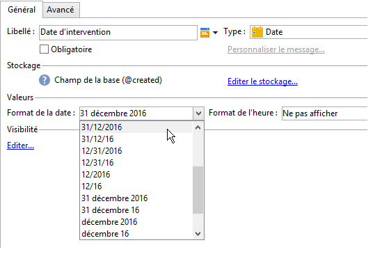</ph></source>
<target xml:lang="en-XX"><ph id="1" ctype="x-IMAGE"></ph></target>
</trans-unit>
<trans-unit id="tu131" xml:space="preserve">
<source xml:lang="en-US">You can also choose not to display the date (or time).</source>
<target xml:lang="en-XX">Vous pouvez également choisir de ne pas afficher la date (ou l'heure).</target>
</trans-unit>
<trans-unit id="tu132" xml:space="preserve">
<source xml:lang="en-US">Dates can be selected via a calendar or drop-down boxes. You can also enter them directly in the field, but they need to match the format specified in the screen above.</source>
<target xml:lang="en-XX">Les dates peuvent être sélectionnées via un calendrier ou des listes déroulantes. Vous pouvez aussi les saisir directement dans le champ. Toutefois, elles doivent respecter le format spécifié dans l’écran ci-dessus.</target>
</trans-unit>
<trans-unit id="tu133" xml:space="preserve">
<source xml:lang="en-US"><ph id="1" ctype="x-regxph" equiv-text="&lbrack;!NOTE">[!NOTE]</ph></source>
<target xml:lang="en-XX"><ph id="1" ctype="x-regxph" equiv-text="&lbrack;!NOTE">[!NOTE]</ph></target>
</trans-unit>
<trans-unit id="tu134" xml:space="preserve">
<source xml:lang="en-US">By default, dates used in forms are entered via a calendar. For multilingual forms, please check that calendars are available in all the languages used. See <ph id="1" ctype="x-LINK">[</ph>Translating a web form<ph id="2" ctype="x-LINK">](translating-a-web-form.md)</ph>.</source>
<target xml:lang="en-XX">Par défaut, les dates utilisées dans les formulaires sont saisies via un calendrier. Dans le cadre de formulaires multilingues, nous vous invitons à vérifier que les calendriers sont disponibles pour toutes les langues utilisées. Voir <ph id="1" ctype="x-LINK">[</ph>Traduire un formulaire web<ph id="2" ctype="x-LINK">](translating-a-web-form.md)</ph>.</target>
</trans-unit>
<trans-unit id="tu135" xml:space="preserve">
<source xml:lang="en-US">However in some cases, (for entering dates of birth, for instance) it may be easier to use drop-down lists.</source>
<target xml:lang="en-XX">Toutefois, il peut être plus adapté, par exemple pour indiquer une date de naissance, d'utiliser des listes déroulantes.</target>
</trans-unit>
<trans-unit id="tu136" xml:space="preserve">
<source xml:lang="en-US"><ph id="1" ctype="x-IMAGE"></ph></source>
<target xml:lang="en-XX"><ph id="1" ctype="x-IMAGE"></ph></target>
</trans-unit>
<trans-unit id="tu137" xml:space="preserve">
<source xml:lang="en-US">To do this, click the <ph id="1" ctype="x-STRONG_EMPHASIS">**[!UICONTROL </ph>Advanced<ph id="3" ctype="x-LINK_REF">]**</ph> tab and choose the input mode using <ph id="5" ctype="x-STRONG_EMPHASIS">**[!UICONTROL </ph>Drop-down lists<ph id="7" ctype="x-LINK_REF">]**</ph>.</source>
<target xml:lang="en-XX">Pour cela, cliquez sur l'onglet <ph id="1" ctype="x-STRONG_EMPHASIS">**[!UICONTROL </ph>Avancé<ph id="3" ctype="x-LINK_REF">]**</ph> et choisissez un mode de saisie par <ph id="5" ctype="x-STRONG_EMPHASIS">**[!UICONTROL </ph>Listes déroulantes<ph id="7" ctype="x-LINK_REF">]**</ph>.</target>
</trans-unit>
<trans-unit id="tu138" xml:space="preserve">
<source xml:lang="en-US"><ph id="1" ctype="x-IMAGE">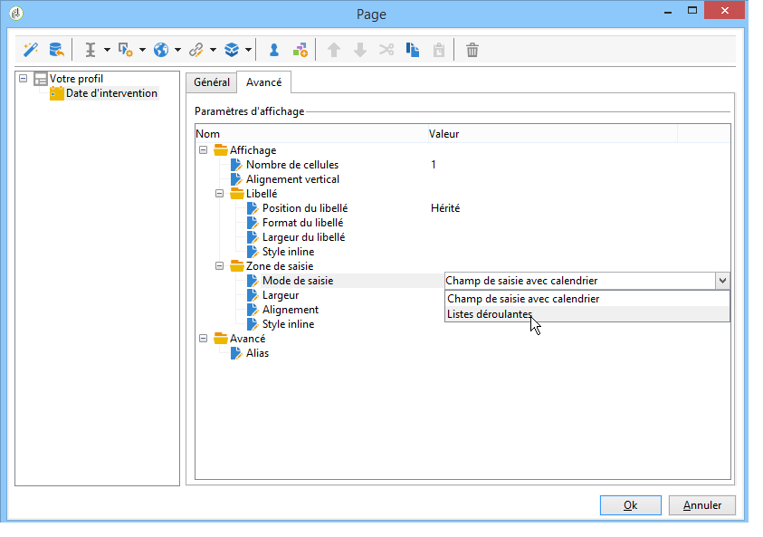</ph></source>
<target xml:lang="en-XX"><ph id="1" ctype="x-IMAGE"></ph></target>
</trans-unit>
<trans-unit id="tu139" xml:space="preserve">
<source xml:lang="en-US">You can then set limits to the values offered in the list.</source>
<target xml:lang="en-XX">Vous pouvez alors borner les valeurs proposées dans la liste.</target>
</trans-unit>
<trans-unit id="tu140" xml:space="preserve">
<source xml:lang="en-US"><ph id="1" ctype="x-IMAGE">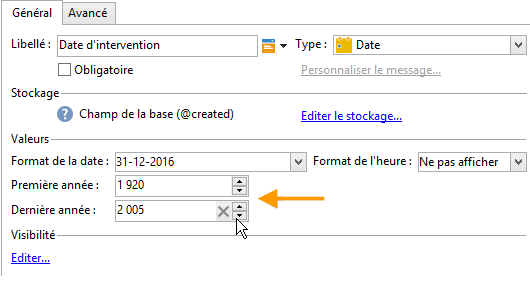</ph></source>
<target xml:lang="en-XX"><ph id="1" ctype="x-IMAGE"></ph></target>
</trans-unit>
<trans-unit id="tu141" xml:space="preserve">
<source xml:lang="en-US">Adding numbers</source>
<target xml:lang="en-XX">Ajouter des nombres</target>
</trans-unit>
<trans-unit id="tu142" xml:space="preserve">
<source xml:lang="en-US">You can create suitable fields for the entry of numbers.</source>
<target xml:lang="en-XX">Vous pouvez créer des champs adaptés pour la saisie de nombres.</target>
</trans-unit>
<trans-unit id="tu143" xml:space="preserve">
<source xml:lang="en-US"><ph id="1" ctype="x-IMAGE">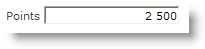</ph></source>
<target xml:lang="en-XX"><ph id="1" ctype="x-IMAGE"></ph></target>
</trans-unit>
<trans-unit id="tu144" xml:space="preserve">
<source xml:lang="en-US">In a numeric field, the user can enter numbers only. Entry control is applied automatically when the page is approved.</source>
<target xml:lang="en-XX">Dans un champ numérique, l’utilisateur ou l’utilisatrice ne peut saisir que des chiffres. Un contrôle de saisie est automatiquement appliqué lors de l’approbation de la page.</target>
</trans-unit>
<trans-unit id="tu145" xml:space="preserve">
<source xml:lang="en-US">Depending on the field in which data is stored in the database, special formatting or certain restrictions may be applied. You can also specify maximum and minimum values. This type of field is configured as follows:</source>
<target xml:lang="en-XX">En fonction du champ de stockage des données dans la base, une mise en forme spécifique ou certaines restrictions peuvent être appliquées. Vous pouvez également définir des valeurs minimales et maximales. Le paramétrage de ce type de champ est le suivant :</target>
</trans-unit>
<trans-unit id="tu146" xml:space="preserve">
<source xml:lang="en-US"><ph id="1" ctype="x-IMAGE">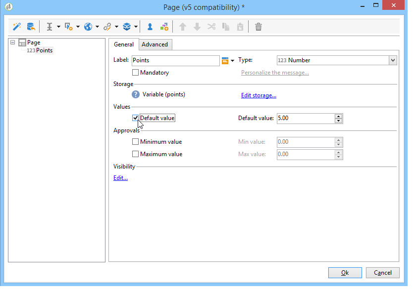</ph></source>
<target xml:lang="en-XX"><ph id="1" ctype="x-IMAGE"></ph></target>
</trans-unit>
<trans-unit id="tu147" xml:space="preserve">
<source xml:lang="en-US">The default value is the value displayed in the field when the form is published. It can be corrected by the user.</source>
<target xml:lang="en-XX">La valeur par défaut est la valeur affichée dans le champ lors de la publication du formulaire. Elle peut être corrigée par l’utilisateur ou l’utilisatrice.</target>
</trans-unit>
<trans-unit id="tu148" xml:space="preserve">
<source xml:lang="en-US">You can add a prefix and/or suffix to the numeric field via the <ph id="1" ctype="x-STRONG_EMPHASIS">**[!UICONTROL </ph>Advanced<ph id="3" ctype="x-LINK_REF">]**</ph> tab, as shown below:</source>
<target xml:lang="en-XX">Vous pouvez ajouter un préfixe et/ou un suffixe au champ numérique, à partir de l'onglet <ph id="1" ctype="x-STRONG_EMPHASIS">**[!UICONTROL </ph>Avancé<ph id="3" ctype="x-LINK_REF">]**</ph>, comme dans l'exemple suivant :</target>
</trans-unit>
<trans-unit id="tu149" xml:space="preserve">
<source xml:lang="en-US"><ph id="1" ctype="x-IMAGE">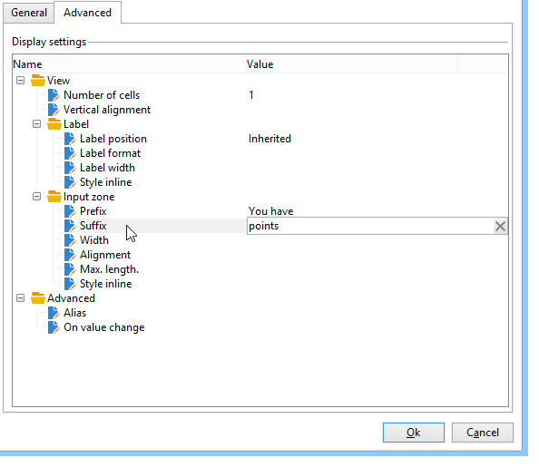</ph></source>
<target xml:lang="en-XX"><ph id="1" ctype="x-IMAGE"></ph></target>
</trans-unit>
<trans-unit id="tu150" xml:space="preserve">
<source xml:lang="en-US">In the form, the rendering will be as follows:</source>
<target xml:lang="en-XX">Dans le formulaire, le rendu sera :</target>
</trans-unit>
<trans-unit id="tu151" xml:space="preserve">
<source xml:lang="en-US"><ph id="1" ctype="x-IMAGE">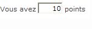</ph></source>
<target xml:lang="en-XX"><ph id="1" ctype="x-IMAGE"></ph></target>
</trans-unit>
<trans-unit id="tu152" xml:space="preserve">
<source xml:lang="en-US">Subscription checkboxes</source>
<target xml:lang="en-XX">Cases à cocher d'abonnement</target>
</trans-unit>
<trans-unit id="tu153" xml:space="preserve">
<source xml:lang="en-US">You can add controls to allow users to subscribe to or unsubscribe from one or more information services (newsletters, warnings, real-time notifications, etc.). To subscribe, the user checks the corresponding service.</source>
<target xml:lang="en-XX">Vous pouvez ajouter des contrôles pour permettre aux utilisateurs et utilisatrices de s’abonner à un ou plusieurs services d’information (newsletters, alertes, notifications en temps réel, etc.) ou de se désabonner. Pour s’abonner, la personne coche le service correspondant.</target>
</trans-unit>
<trans-unit id="tu154" xml:space="preserve">
<source xml:lang="en-US">To create a subscription checkbox, click <ph id="1" ctype="x-STRONG_EMPHASIS">**[!UICONTROL </ph>Advanced controls>Subscription<ph id="3" ctype="x-LINK_REF">]**</ph>.</source>
<target xml:lang="en-XX">Pour créer une case à cocher d'abonnement, cliquez sur <ph id="1" ctype="x-STRONG_EMPHASIS">**[!UICONTROL </ph>Contrôles avancés > Abonnement<ph id="3" ctype="x-LINK_REF">]**</ph>.</target>
</trans-unit>
<trans-unit id="tu155" xml:space="preserve">
<source xml:lang="en-US"><ph id="1" ctype="x-IMAGE">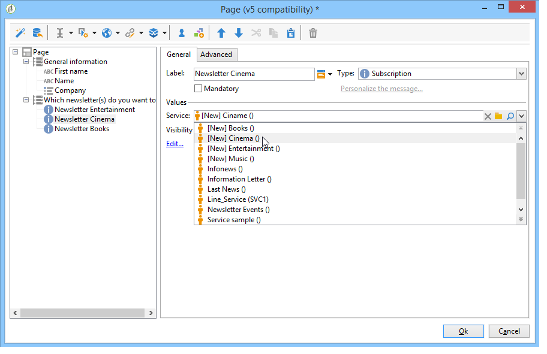</ph></source>
<target xml:lang="en-XX"><ph id="1" ctype="x-IMAGE"></ph></target>
</trans-unit>
<trans-unit id="tu156" xml:space="preserve">
<source xml:lang="en-US">Indicate the label for the checkbox and select the information service concerned using the <ph id="1" ctype="x-STRONG_EMPHASIS">**[!UICONTROL </ph>Service<ph id="3" ctype="x-LINK_REF">]**</ph> drop-down box.</source>
<target xml:lang="en-XX">Indiquez le libellé de la case à cocher et sélectionnez le service d'information concerné dans la liste déroulante <ph id="1" ctype="x-STRONG_EMPHASIS">**[!UICONTROL </ph>Service<ph id="3" ctype="x-LINK_REF">]**</ph>.</target>
</trans-unit>
<trans-unit id="tu157" xml:space="preserve">
<source xml:lang="en-US"><ph id="1" ctype="x-regxph" equiv-text="&lbrack;!NOTE">[!NOTE]</ph></source>
<target xml:lang="en-XX"><ph id="1" ctype="x-regxph" equiv-text="&lbrack;!NOTE">[!NOTE]</ph></target>
</trans-unit>
<trans-unit id="tu158" xml:space="preserve">
<source xml:lang="en-US">Information services are detailed in <ph id="1" ctype="x-LINK">[</ph>this page<ph id="2" ctype="x-LINK">](../../delivery/using/managing-subscriptions.md)</ph>.</source>
<target xml:lang="en-XX">Les services d'informations sont présentés dans cette <ph id="1" ctype="x-LINK">[</ph>page<ph id="2" ctype="x-LINK">](../../delivery/using/managing-subscriptions.md)</ph>.</target>
</trans-unit>
<trans-unit id="tu159" xml:space="preserve">
<source xml:lang="en-US">The user subscribes to the service by checking the relevant option.</source>
<target xml:lang="en-XX">L'utilisateur sera abonné au service spécifié s'il coche l'option correspondante.</target>
</trans-unit>
<trans-unit id="tu160" xml:space="preserve">
<source xml:lang="en-US"><ph id="1" ctype="x-IMAGE">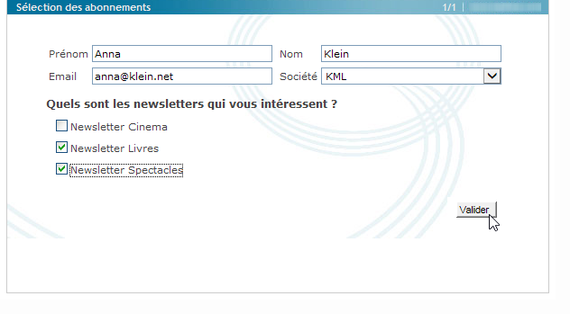</ph></source>
<target xml:lang="en-XX"><ph id="1" ctype="x-IMAGE"></ph></target>
</trans-unit>
<trans-unit id="tu161" xml:space="preserve">
<source xml:lang="en-US"><ph id="1" ctype="x-regxph" equiv-text="&lbrack;!CAUTION">[!CAUTION]</ph></source>
<target xml:lang="en-XX"><ph id="1" ctype="x-regxph" equiv-text="&lbrack;!CAUTION">[!CAUTION]</ph></target>
</trans-unit>
<trans-unit id="tu162" xml:space="preserve">
<source xml:lang="en-US">If the user is already subscribed to an information service and the box linked to this service isn't checked when they approve the form, they will be unsubscribed.</source>
<target xml:lang="en-XX">Si l'utilisateur est déjà abonné à un service d'information et que la case correspondant à ce service est décochée lorsqu'il valide le formulaire, il sera alors désabonné.</target>
</trans-unit>
<trans-unit id="tu163" xml:space="preserve">
<source xml:lang="en-US">Inserting a captcha</source>
<target xml:lang="en-XX">Insérer un captcha</target>
</trans-unit>
<trans-unit id="tu164" xml:space="preserve">
<source xml:lang="en-US">The purpose of <ph id="1" ctype="x-STRONG_EMPHASIS">**</ph>captcha<ph id="2" ctype="x-STRONG_EMPHASIS">**</ph> tests is to prevent fraudulent use of your Web forms.</source>
<target xml:lang="en-XX">Les <ph id="1" ctype="x-STRONG_EMPHASIS">**</ph>captcha<ph id="2" ctype="x-STRONG_EMPHASIS">**</ph> permettent de prévenir l'utilisation frauduleuse de vos formulaires Web.</target>
</trans-unit>
<trans-unit id="tu165" xml:space="preserve">
<source xml:lang="en-US"><ph id="1" ctype="x-regxph" equiv-text="&lbrack;!CAUTION">[!CAUTION]</ph></source>
<target xml:lang="en-XX"><ph id="1" ctype="x-regxph" equiv-text="&lbrack;!CAUTION">[!CAUTION]</ph></target>
</trans-unit>
<trans-unit id="tu166" xml:space="preserve">
<source xml:lang="en-US">If your form contains several pages, the Captcha must always be placed on the last page, just before the storage box, to prevent any circumvention of the security measures.</source>
<target xml:lang="en-XX">Si votre formulaire est composé de plusieurs pages, le Captcha doit toujours être positionné dans la dernière page, immédiatement avant la boîte d'enregistrement, afin de prévenir tout contournement de la sécurité.</target>
</trans-unit>
<trans-unit id="tu167" xml:space="preserve">
<source xml:lang="en-US">To insert a Captcha into a form, click the first button on the toolbar and Select <ph id="1" ctype="x-STRONG_EMPHASIS">**[!UICONTROL </ph>Advanced controls>Captcha<ph id="3" ctype="x-LINK_REF">]**</ph>.</source>
<target xml:lang="en-XX">Pour insérer un Captcha dans un formulaire, cliquez sur le premier bouton de la barre d'outils et choisissez <ph id="1" ctype="x-STRONG_EMPHASIS">**[!UICONTROL </ph>Contrôles avancés > Captcha<ph id="3" ctype="x-LINK_REF">]**</ph>.</target>
</trans-unit>
<trans-unit id="tu168" xml:space="preserve">
<source xml:lang="en-US"><ph id="1" ctype="x-IMAGE">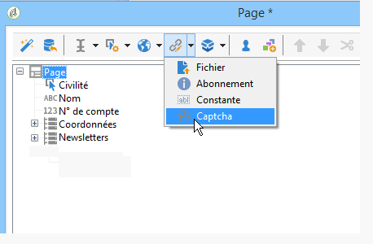</ph></source>
<target xml:lang="en-XX"><ph id="1" ctype="x-IMAGE"></ph></target>
</trans-unit>
<trans-unit id="tu169" xml:space="preserve">
<source xml:lang="en-US">Enter the label of the field. This label will be displayed in front of the Captcha display area. You can change the position of this label in the <ph id="1" ctype="x-STRONG_EMPHASIS">**[!UICONTROL </ph>Advanced<ph id="3" ctype="x-LINK_REF">]**</ph> tab.</source>
<target xml:lang="en-XX">Saisissez le libellé du champ. Ce libellé sera affiché devant la zone d’affichage du captcha. Vous pouvez modifier le positionnement de ce libellé à partir de l'onglet <ph id="1" ctype="x-STRONG_EMPHASIS">**[!UICONTROL </ph>Avancé<ph id="3" ctype="x-LINK_REF">]**</ph>.</target>
</trans-unit>
<trans-unit id="tu170" xml:space="preserve">
<source xml:lang="en-US"><ph id="1" ctype="x-IMAGE"></ph></source>
<target xml:lang="en-XX"><ph id="1" ctype="x-IMAGE"></ph></target>
</trans-unit>
<trans-unit id="tu171" xml:space="preserve">
<source xml:lang="en-US"><ph id="1" ctype="x-regxph" equiv-text="&lbrack;!NOTE">[!NOTE]</ph></source>
<target xml:lang="en-XX"><ph id="1" ctype="x-regxph" equiv-text="&lbrack;!NOTE">[!NOTE]</ph></target>
</trans-unit>
<trans-unit id="tu172" xml:space="preserve">
<source xml:lang="en-US">For <ph id="1" ctype="x-STRONG_EMPHASIS">**[!UICONTROL </ph>captcha<ph id="3" ctype="x-LINK_REF">]**</ph> type controls, there is no need to indicate a storage field or variable.</source>
<target xml:lang="en-XX">Pour les contrôles de type <ph id="1" ctype="x-STRONG_EMPHASIS">**[!UICONTROL </ph>captcha<ph id="3" ctype="x-LINK_REF">]**</ph>, il n'est pas nécessaire d'indiquer de champ ou variable de stockage.</target>
</trans-unit>
<trans-unit id="tu173" xml:space="preserve">
<source xml:lang="en-US">The Captcha is inserted into the page with an input field placed under the visual. These two elements are inseparable and are considered as a single item for the purpose of page layout (they occupy a single cell).</source>
<target xml:lang="en-XX">Le captcha est inséré dans la page avec un champ de saisie placé sous le visuel. Ces deux éléments sont indissociables : pour la mise en page, ils sont considérés comme un seul élément (ils n’occupent qu’une seule cellule).</target>
</trans-unit>
<trans-unit id="tu174" xml:space="preserve">
<source xml:lang="en-US"><ph id="1" ctype="x-IMAGE">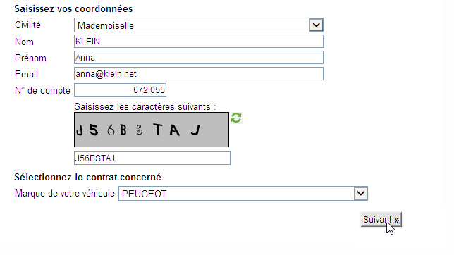</ph></source>
<target xml:lang="en-XX"><ph id="1" ctype="x-IMAGE"></ph></target>
</trans-unit>
<trans-unit id="tu175" xml:space="preserve">
<source xml:lang="en-US">When the page is confirmed, the input field is displayed in red if the content of the Captcha was not entered correctly.</source>
<target xml:lang="en-XX">Lors de la validation de la page, le champ de saisie est affiché en rouge si le contenu du Captcha n'a pas été saisi correctement.</target>
</trans-unit>
<trans-unit id="tu176" xml:space="preserve">
<source xml:lang="en-US"><ph id="1" ctype="x-IMAGE"></ph></source>
<target xml:lang="en-XX"><ph id="1" ctype="x-IMAGE"></ph></target>
</trans-unit>
<trans-unit id="tu177" xml:space="preserve">
<source xml:lang="en-US">You can create an error message to display. To do that, use the <ph id="1" ctype="x-STRONG_EMPHASIS">**[!UICONTROL </ph>Personalize the message<ph id="3" ctype="x-LINK_REF">]**</ph> link in the <ph id="5" ctype="x-STRONG_EMPHASIS">**[!UICONTROL </ph>General<ph id="7" ctype="x-LINK_REF">]**</ph> tab.</source>
<target xml:lang="en-XX">Vous pouvez créer un message d’erreur à afficher. Pour cela, utilisez le lien <ph id="1" ctype="x-STRONG_EMPHASIS">**[!UICONTROL </ph>Personnaliser le message<ph id="3" ctype="x-LINK_REF">]**</ph> dans l’onglet <ph id="5" ctype="x-STRONG_EMPHASIS">**[!UICONTROL </ph>Général<ph id="7" ctype="x-LINK_REF">]**</ph>.</target>
</trans-unit>
<trans-unit id="tu178" xml:space="preserve">
<source xml:lang="en-US"><ph id="1" ctype="x-IMAGE"></ph></source>
<target xml:lang="en-XX"><ph id="1" ctype="x-IMAGE"></ph></target>
</trans-unit>
<trans-unit id="tu179" xml:space="preserve">
<source xml:lang="en-US"><ph id="1" ctype="x-regxph" equiv-text="&lbrack;!NOTE">[!NOTE]</ph></source>
<target xml:lang="en-XX"><ph id="1" ctype="x-regxph" equiv-text="&lbrack;!NOTE">[!NOTE]</ph></target>
</trans-unit>
<trans-unit id="tu180" xml:space="preserve">
<source xml:lang="en-US">Captchas are always 8 characters long. You cannot modify this value.</source>
<target xml:lang="en-XX">Les captchas font toujours 8 caractères. Vous ne pouvez pas modifier cette valeur.</target>
</trans-unit>
<trans-unit id="tu181" xml:space="preserve">
<source xml:lang="en-US">Uploading a file</source>
<target xml:lang="en-XX">Télécharger un fichier</target>
</trans-unit>
<trans-unit id="tu182" xml:space="preserve">
<source xml:lang="en-US">You can add an upload field to a page. This functionality can be useful for intranet file sharing, for instance.</source>
<target xml:lang="en-XX">Vous pouvez ajouter un champ de chargement à une page. Cette fonctionnalité peut être utile, par exemple dans le contexte d’un intranet, afin de partager des fichiers.</target>
</trans-unit>
<trans-unit id="tu183" xml:space="preserve">
<source xml:lang="en-US"><ph id="1" ctype="x-IMAGE">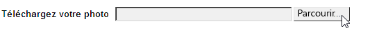</ph></source>
<target xml:lang="en-XX"><ph id="1" ctype="x-IMAGE"></ph></target>
</trans-unit>
<trans-unit id="tu184" xml:space="preserve">
<source xml:lang="en-US">To insert an upload field to a form page, select the <ph id="1" ctype="x-STRONG_EMPHASIS">**[!UICONTROL </ph>Advanced controls > File...<ph id="3" ctype="x-LINK_REF">]**</ph> menu in the toolbar of the page editor.</source>
<target xml:lang="en-XX">Pour ajouter un champ de téléchargement dans une page de formulaire, sélectionnez le menu <ph id="1" ctype="x-STRONG_EMPHASIS">**[!UICONTROL </ph>Contrôles avancés > Fichier...<ph id="3" ctype="x-LINK_REF">]**</ph> dans la barre d'outils de l'éditeur de page.</target>
</trans-unit>
<trans-unit id="tu185" xml:space="preserve">
<source xml:lang="en-US">By default, the uploaded files are stored in resource files accessible via the <ph id="1" ctype="x-STRONG_EMPHASIS">**[!UICONTROL </ph>Resources > Online > Public resources<ph id="3" ctype="x-LINK_REF">]**</ph> menu. You can use a script to change this behavior. This script can use the functions defined in <ph id="5" ctype="x-LINK">&lbrack;</ph>Campaign JSAPI documentation<ph id="6" ctype="x-LINK">[#$tu186]</ph>, including those that concern file manipulation.</source>
<target xml:lang="en-XX">Par défaut, les fichiers chargés sont stockés dans des fichiers de ressources accessibles via le menu <ph id="1" ctype="x-STRONG_EMPHASIS">**[!UICONTROL </ph>Ressources > En ligne > Ressources publiques<ph id="3" ctype="x-LINK_REF">]**</ph>. Vous pouvez utiliser un script pour modifier ce comportement. Ce script peut utiliser les fonctions définies dans la <ph id="5" ctype="x-LINK">&lbrack;</ph>documentation JSAPI Campaign<ph id="6" ctype="x-LINK">[#$tu186]</ph> notamment celles relatives à la manipulation des fichiers.</target>
</trans-unit>
<trans-unit id="tu187" xml:space="preserve">
<source xml:lang="en-US">You can store the link to these files in a local variable or in a database field. For example, you can extend the recipient schema to add a link to file-based resources.</source>
<target xml:lang="en-XX">Vous pouvez stocker le lien vers ces fichiers dans une variable locale ou dans un champ de base de données. Vous pouvez, par exemple, étendre le schéma des destinataires afin d’ajouter un lien vers les ressources fichiers.</target>
</trans-unit>
<trans-unit id="tu188" xml:space="preserve">
<source xml:lang="en-US"><ph id="1" ctype="x-regxph" equiv-text="&lbrack;!CAUTION">[!CAUTION]</ph></source>
<target xml:lang="en-XX"><ph id="1" ctype="x-regxph" equiv-text="&lbrack;!CAUTION">[!CAUTION]</ph></target>
</trans-unit>
<trans-unit id="tu189" xml:space="preserve">
<source xml:lang="en-US">This type of file must be reserved for forms with secure access (using credentials).</source>
<target xml:lang="en-XX">Ce type de champ doit être réservé aux formulaires dont l'accès est sécurisé (à l’aide d’informations d’identification).</target>
</trans-unit>
<trans-unit id="tu190" xml:space="preserve">
<source xml:lang="en-US">Adobe Campaign does not control the size or the type of resource uploaded: we therefore highly recommend using upload fields for secure type intranet sites only.</source>
<target xml:lang="en-XX">Adobe Campaign n'applique aucun contrôle sur la taille ou le type de ressource téléchargée : il est donc vivement recommandé de n'utiliser les champs de téléchargement que pour les sites de type intranet sécurisé.</target>
</trans-unit>
<trans-unit id="tu191" xml:space="preserve">
<source xml:lang="en-US">If several servers are linked to the instance (load balancing architecture), you need to make sure calls to the Web form arrive on the same server.</source>
<target xml:lang="en-XX">Lorsque plusieurs serveurs sont associés à l'instance (architecture « load balancing »), vous devez vous assurer que les appels au formulaire web arrivent sur le même serveur.</target>
</trans-unit>
<trans-unit id="tu192" xml:space="preserve">
<source xml:lang="en-US">These implementations require the assistance of the Adobe Campaign Consulting team.</source>
<target xml:lang="en-XX">Ce type d'implémentation peut nécessiter l'intervention de l'équipe Consulting d'Adobe Campaign.</target>
</trans-unit>
<trans-unit id="tu193" xml:space="preserve">
<source xml:lang="en-US">Inserting a hidden constant</source>
<target xml:lang="en-XX">Insérer une constante masquée</target>
</trans-unit>
<trans-unit id="tu194" xml:space="preserve">
<source xml:lang="en-US">When the user validates one of the pages of the form, you can set a specific value to a field of their profile or to a variable.</source>
<target xml:lang="en-XX">Lorsque l’utilisateur valide l’une des pages du formulaire, vous pouvez définir une valeur spécifique pour un champ de son profil ou une variable.</target>
</trans-unit>
<trans-unit id="tu195" xml:space="preserve">
<source xml:lang="en-US">This field is not visible to the user, but can be used to enrich the data in the user profile.</source>
<target xml:lang="en-XX">Ce champ n‘est pas visible par l‘utilisateur mais permet d‘enrichir les données de son profil.</target>
</trans-unit>
<trans-unit id="tu196" xml:space="preserve">
<source xml:lang="en-US">To do this, place a <ph id="1" ctype="x-STRONG_EMPHASIS">**</ph>constant<ph id="2" ctype="x-STRONG_EMPHASIS">**</ph> in the page and specify the value and the storage location.</source>
<target xml:lang="en-XX">Pour ce faire, placez une <ph id="1" ctype="x-STRONG_EMPHASIS">**</ph>constante<ph id="2" ctype="x-STRONG_EMPHASIS">**</ph> dans la page et indiquez la valeur et l'emplacement de stockage.</target>
</trans-unit>
<trans-unit id="tu197" xml:space="preserve">
<source xml:lang="en-US">In the following example, the <ph id="1" ctype="x-STRONG_EMPHASIS">**</ph>origin<ph id="2" ctype="x-STRONG_EMPHASIS">**</ph> field of the recipient profile is filled in automatically whenever a user approves this page. The constant is not displayed on the page.</source>
<target xml:lang="en-XX">Dans l'exemple suivant, le champ <ph id="1" ctype="x-STRONG_EMPHASIS">**</ph>origine<ph id="2" ctype="x-STRONG_EMPHASIS">**</ph> du profil du destinataire est renseigné automatiquement chaque fois qu'un utilisateur valide cette page. La constante n'est pas affichée sur la page.</target>
</trans-unit>
<trans-unit id="tu198" xml:space="preserve">
<source xml:lang="en-US"><ph id="1" ctype="x-IMAGE">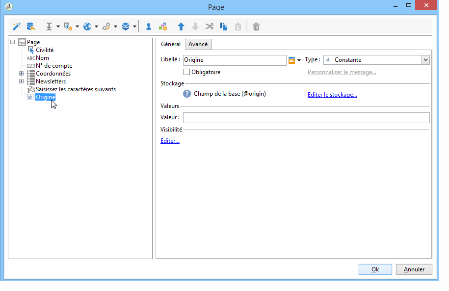</ph></source>
<target xml:lang="en-XX"><ph id="1" ctype="x-IMAGE"></ph></target>
</trans-unit>
</body>
</file>
</xliff>