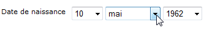

# Ajouter des champs à un formulaire web{#adding-fields-to-a-web-form}

Dans un formulaire Web, les champs permettent aux utilisateurs de saisir des informations et sélectionner des options. Le formulaire Web peut proposer champs de saisie, des champs de sélection, des contenus statiques ainsi que des contenus avancés de type captcha, abonnements, etc.

Lorsque vous utilisez l’assistant pour ajouter des champs, le type de champ est détecté automatiquement en fonction du champ ou de la variable de stockage sélectionné. Vous pouvez le modifier à l’aide de la **[!UICONTROL Type]** liste déroulante de l’ **[!UICONTROL General]** onglet.

Lorsque vous utilisez les boutons de la barre d&#39;outils, sélectionnez directement le type de champ à ajouter.

Les types de champs disponibles sont les suivants :

* Entrée texte/nombre. Voir [Ajout de champs](#adding-input-fields)d’entrée.
* Sélection d’une liste déroulante. Voir [Ajout de listes](#adding-drop-down-lists)déroulantes.
* Choix multiples via des cases à cocher. Voir [Ajout de cases à cocher](#adding-checkboxes).
* Sélection exclusive via des boutons radio. Voir [Ajout de boutons](#adding-radio-buttons)radio.
* Votez dans une grille d&#39;options. Voir [Ajout de grilles](#adding-grids).
* Nombres et dates. See [Adding dates and numbers](#adding-dates-and-numbers).
* Abonnement/désabonnement à un service d’informations. Reportez-vous à la section [Coches](#subscription-checkboxes)Abonnement.
* Validation de Captcha. See [Inserting a captcha](#inserting-a-captcha).
* Télécharger. [Télécharger un fichier](#uploading-a-file).
* Constante masquée. Voir [Insertion d’une constante](#inserting-a-hidden-constant)masquée.

Spécifiez le mode de stockage des réponses : mettez à jour un champ de la base de données (ne stocke que la dernière valeur enregistrée) ou stockez-le dans une variable (la réponse n’est pas stockée). Pour plus d’informations, reportez-vous aux champs [de stockage](../../web/using/web-forms-answers.md#response-storage-fields)Réponse.

>[!NOTE]
>
>Par défaut, la zone est toujours insérée à la fin de l&#39;arborescence courante. Elle peut être déplacée en utilisant les flèches de la barre d&#39;outils.

## Assistant de création de champs {#field-creation-wizard}

Pour chaque page du formulaire, vous pouvez ajouter un champ via le premier bouton de la barre d’outils. Pour ce faire, accédez au **[!UICONTROL Add using the wizard]** menu.

Sélectionnez le type de champ que vous souhaitez créer : vous pouvez choisir d&#39;ajouter un champ de la base, une variable ou d&#39;importer un groupe de champs créé dans un autre formulaire et regroupés dans un conteneur.

Click **[!UICONTROL Next]** and select the storage field or variable, or the container you want to import.

Click **[!UICONTROL Finish]** to insert the selected field into the page.

## Ajouter des champs de saisie {#adding-input-fields}

To add an input field, click the **[!UICONTROL Input control]** button and choose the type of field you want to add.

### Types de champs de saisie {#types-of-input-fields}

Dans une page de formulaire, vous pouvez insérer cinq types de champs texte :

* **Texte** : permet à l&#39;utilisateur de saisir du texte, sur une ligne.

   

* **Nombre**: permet à l’utilisateur de saisir un nombre sur une ligne. for more on this, refer to [Adding numbers](#adding-numbers).

   Lorsque la page est approuvée, le contenu du champ est vérifié pour vérifier que la valeur saisie est compatible avec le champ. For more on this, refer to [Defining control settings](../../web/using/form-rendering.md#defining-control-settings).

* **Mot de passe** : permet à l&#39;utilisateur de saisir du texte sur une seule ligne. Lors de la saisie, les caractères sont remplacés par des points :

   

   >[!CAUTION]
   >
   >Les mots de passe sont stockés en clair dans la base, sans cryptage.

* **Texte multi-lignes** : permet à l&#39;utilisateur de saisir du texte sur plusieurs lignes.

   

   >[!CAUTION]
   >
   >Les champs de texte multi-lignes sont des champs spécifiques qui peuvent contenir des retours chariots. Leur espace de stockage doit être associé à un champ mappé sur un élément de type XML element et non XML attribute. Pour plus d&#39;informations sur les types de données dans les schéma, reportez-vous au chapitre &quot;Référence des schémas&quot; de [cette section](../../configuration/using/about-schema-reference.md).
   >   
   >Si vous utilisez le module **Questionnaire**, vous pouvez stocker les champs de ce type dans un champ archivé qui s&#39;adaptera automatiquement au format. Voir à ce sujet [cette section](../../web/using/about-surveys.md).

* **Texte multi-lignes enrichi** : permet à l&#39;utilisateur de saisir du texte, avec mise en forme, qui sera stocké au format HTML.

   

   Vous pouvez sélectionner le type d’éditeur proposé aux utilisateurs. Pour ce faire, utilisez la liste déroulante du **[!UICONTROL HTML editor]** champ dans l’ **[!UICONTROL Advanced]** onglet.

   

   Le nombre d’icônes affichées varie selon le type d’éditeur. Pour un **[!UICONTROL Advanced]** éditeur, le rendu sera le suivant :

   

### Configuration des champs d’entrée {#configure-input-fields}

Les champs de saisie sont tous paramétrés selon le même mode, au travers des options suivantes :

The **[!UICONTROL General]** tab lets you enter the name of the field and attribute a default value to it if necessary.

Le mode de stockage des réponses peut être modifié via le **[!UICONTROL Edit storage...]** lien. Les valeurs peuvent être stockées dans un champ existant de la base de données ; ou vous pouvez choisir de ne pas enregistrer les informations dans la base de données (utilisez une variable locale).

>[!NOTE]
>
>Les modes de stockage sont détaillés dans les champs de stockage [Réponse](../../web/using/web-forms-answers.md#response-storage-fields)

The **[!UICONTROL Advanced]** tab lets you define display parameters for the field (position of labels, alignment, etc.). See [Defining web forms layout](../../web/using/defining-web-forms-layout.md).

## Ajouter des listes déroulantes {#adding-drop-down-lists}

Dans une page de formulaire, vous pouvez insérer une liste déroulante : elle permet à l&#39;utilisateur de sélectionner une valeur parmi celles proposées dans un menu déroulant.

To add a drop-down box to a form page, click the **[!UICONTROL Selection controls > Drop-down list]** button in the toolbar of the page editor.

Sélectionnez le mode de stockage des réponses et validez votre choix.

Définissez les libellés et les valeurs de la liste dans la section inférieure de l’ **[!UICONTROL General]** onglet. Si les informations sont stockées dans un champ existant de la base de données et qu’il s’agit d’un champ d’énumération, vous pouvez renseigner les valeurs automatiquement en cliquant sur **[!UICONTROL Initialize the list of values from the database]** , comme illustré ci-dessous :

>[!NOTE]
>
>Utilisez les flèches situées à droite de la liste des valeurs pour les ordonner.

Si les données sont stockées dans un tableau lié, vous pouvez sélectionner le champ dans lequel les valeurs à suggérer dans la liste sont enregistrées. Par exemple, si vous sélectionnez le tableau des pays, cliquez sur **[!UICONTROL Initialize the list of values from the database...]** et sélectionnez le champ de votre choix.

Next, click the **[!UICONTROL Load]** link to retrieve the values:

>[!CAUTION]
>
>En cas de mise à jour des valeurs de la liste, vous devez renouveler cette opération pour actualiser les valeurs proposées.

## Ajouter des cases à cocher {#adding-checkboxes}

Pour que l&#39;utilisateur puisse sélectionner une option, utilisez une case à cocher.

To add a checkbox to a form, click the **[!UICONTROL Selection controls > Checkbox...]** icon in the toolbar of the page editor.

Sélectionnez le mode de stockage des réponses et validez votre choix.

Enter the label of the box in the **[!UICONTROL Label]** field of the **[!UICONTROL General]** tab.

Une case à cocher vous permet d’attribuer une valeur au champ de stockage (ou à la valeur) selon que la case est cochée ou non. La **[!UICONTROL Values]** section vous permet de saisir la valeur à affecter si la case est cochée (dans le **[!UICONTROL Value]** champ) et la valeur à affecter si elle n’est pas cochée (dans le **[!UICONTROL Empty value]** champ). Ces valeurs dépendent du format de stockage des données.

Si le champ de stockage (ou la variable) est booléen, la valeur à affecter si la case n’est pas cochée est déduite automatiquement. Dans ce cas, seul le **[!UICONTROL Value if checked]** champ est proposé, comme illustré ci-dessous :

## Example: Assign a value to a field if a box is checked {#example--assign-a-value-to-a-field-if-a-box-is-checked}

Nous allons insérer une case à cocher dans un formulaire afin de transmettre une demande d&#39;intervention, comme ci-dessous :

The information will be uploaded to the database and into an existing field (in this case, the **[!UICONTROL Comment]** field):

Si la case &quot;Maintenance requise&quot; est cochée, la **[!UICONTROL Comment]** colonne contiendra &quot;Maintenance requise&quot;. Si la case n&#39;est pas cochée, la colonne indique &quot;Maintenance non requise&quot;. Pour obtenir ce résultat, appliquez la configuration suivante à la case à cocher de la page du formulaire :

## Ajouter des boutons radio {#adding-radio-buttons}

Les boutons radio permettent de proposer à l&#39;utilisateur une série d&#39;options à sélection exclusive. Il s&#39;agit des différentes valeurs d&#39;un même champ.

Vous pouvez créer les boutons radio individuellement (boutons unitaires) ou via une liste à choix multiples. Toutefois, le principe du bouton radio étant de sélectionner une option ou une autre, on créera toujours au moins un couple de boutons radio, et jamais un bouton isolé.

>[!CAUTION]
>
>Si vous souhaitez rendre la sélection obligatoire, vous devez créer une liste à choix multiples.

### Ajout de boutons uniques {#add-single-buttons}

To add a radio button to a form page, go to the **[!UICONTROL Selection controls > Radio button]** menu in the toolbar of the page editor and choose a storage mode.

Les boutons radio sont configurés de la même manière que les cases à cocher (voir [Ajout de cases à cocher](#adding-checkboxes)). Toutefois, aucune valeur n’est affectée si l’option n’est pas sélectionnée. Pour que plusieurs boutons soient interdépendants, c&#39;est-à-dire que le fait de les sélectionner désélectionne automatiquement les autres, ils doivent être stockés dans le même champ. Si elles ne sont pas stockées dans la base de données, la même variable locale doit être utilisée pour le stockage temporaire. Voir Champs [de stockage](../../web/using/web-forms-answers.md#response-storage-fields)de réponse.

### Add a list of buttons {#add-a-list-of-buttons}

To add radio buttons via a list, go to the **[!UICONTROL Selection controls>Multiple choice]** menu in the toolbar of the page editor.

Vous ajoutez autant de boutons radio que de libellés. L&#39;avantage est de pouvoir importer les valeurs d&#39;un champ existant, s&#39;il s&#39;agit d&#39;un champ énuméré, et de permettre le choix d&#39;une des options proposées. En revanche, la mise en page des boutons radio sera moins souple que celle des boutons unitaires.

>[!NOTE]
>
>Vous ne pouvez pas autoriser le choix de plusieurs valeurs dans les formulaires Web. Les sélections multiples ne peuvent être activées que dans les formulaires de type **Questionnaire.** Voir à ce propos [cette section](../../web/using/about-surveys.md).\
>It is possible, however, to insert a **[!UICONTROL Multiple choice]** type field into a Web application; but without authorizing the selection of several values: the options offered can be selected using radio buttons.

## Ajouter des matrices {#adding-grids}

Les matrices sont utilisées pour réaliser des pages de votes dans les applications Web. Vous pouvez ainsi proposer des listes de boutons radio afin de répondre à des formulaires Web de type sondages ou évaluation, comme dans l&#39;exemple ci-dessous :

Pour intégrer des éléments de ce type dans un formulaire, vous devez créer une matrice simple et ajouter une ligne pour chaque élément à évaluer.

Le nombre de boutons radio de chaque ligne de matrice correspond au nombre de valeurs définies dans la matrice simple.

Dans chaque ligne de matrice, une seule option peut être sélectionnée.

>[!NOTE]
>
>Dans notre exemple, le libellé de la grille est masqué. Pour ce faire, accédez à l’ **[!UICONTROL Advanced]** onglet, l’ **[!UICONTROL Label position]** affichage est défini comme **[!UICONTROL Hidden]** . See [Defining the position of labels](../../web/using/defining-web-forms-layout.md#defining-the-position-of-labels).

## Ajouter des dates et des nombres {#adding-dates-and-numbers}

Le contenu des champs du formulaire peut être formaté pour correspondre aux données stockées dans la base ou répondre à un besoin spécifique. Vous pouvez créer des champs adaptés pour la saisie de nombres et de dates.

### Ajouter des dates {#adding-dates}

To allow the user to enter a date in a form page, select **[!UICONTROL Add input field > Date...]** in the toolbar or page editor.

Indiquez le libellé du champ et le mode de stockage des données.

La section inférieure de la fenêtre permet de sélectionner les formats de date et d&#39;heure pour les valeurs renseignées dans ce champ.

Vous pouvez également choisir de ne pas afficher la date (ou l&#39;heure).

Les dates peuvent être sélectionnées via un calendrier ou des listes déroulantes. Vous pouvez aussi les saisir directement dans le champ. Toutefois, elles doivent respecter le format spécifié dans l&#39;écran ci-dessus.

>[!NOTE]
>
>Par défaut, les dates utilisées dans les formulaires sont saisies via un calendrier. Pour les formulaires multilingues, vérifiez que les calendriers sont disponibles dans toutes les langues utilisées. See [Translating a web form](../../web/using/translating-a-web-form.md).

Toutefois, il peut être plus adapté, par exemple pour indiquer une date de naissance, d&#39;utiliser des listes déroulantes.

To do this, click the **[!UICONTROL Advanced]** tab and choose the input mode using **[!UICONTROL Drop-down lists]**.

Vous pouvez alors borner les valeurs proposées dans la liste.

### Ajouter des nombres {#adding-numbers}

Vous pouvez créer des champs adaptés pour la saisie de nombres.

Dans un champ numérique, l&#39;utilisateur ne peut saisir que des chiffres : un contrôle de saisie est automatiquement appliqué lors de la validation de la page.

En fonction du champ de stockage des données dans la base, un formatage spécifique ou certaines restrictions peuvent être appliqués. Vous pouvez également définir des valeurs minimales et maximales. Le paramétrage de ce type de champ est le suivant :

La valeur par défaut est la valeur affichée dans le champ lors de l&#39;affichage du formulaire. Elle peut être corrigée par l&#39;utilisateur.

You can add a prefix and/or suffix to the numeric field via the **[!UICONTROL Advanced]** tab, as shown below:

Dans le formulaire, le rendu sera :

## Cases à cocher d&#39;abonnement {#subscription-checkboxes}

Vous pouvez ajouter des contrôles pour permettre aux utilisateurs de s&#39;abonner ou se désabonner à un ou plusieurs services d&#39;information (newsletters, alertes, notifications en temps réel, etc.). Pour s&#39;abonner, l&#39;utilisateur coche le service correspondant.

Pour créer une case à cocher d’abonnement, cliquez sur **[!UICONTROL Advanced controls>Subscription]**.

Indiquez le libellé de la case à cocher et sélectionnez le d&#39;information concerné dans la liste déroulante **[!UICONTROL Service]** Service.

>[!NOTE]
>
>Les services d&#39;informations sont présentés dans cette [page](../../delivery/using/managing-subscriptions.md).

L&#39;utilisateur sera abonné au service spécifié s&#39;il coche l&#39;option correspondante.

>[!CAUTION]
>
>Si l&#39;utilisateur est déjà abonné à un service d&#39;information et que la case correspondant à ce service est décochée lorsqu&#39;il valide le formulaire, il sera alors désabonné.

Des exemples de mise en œuvre d&#39;abonnements et de parrainage sont présentés dans [cette section](../../web/using/about-surveys.md).

## Insérer un captcha {#inserting-a-captcha}

Les **captcha** permettent de prévenir l&#39;utilisation frauduleuse de vos formulaires Web.

>[!CAUTION]
>
>Si votre formulaire est composé de plusieurs pages, le Captcha doit toujours être positionné dans la dernière page, immédiatement avant la boîte d&#39;enregistrement, afin de prévenir tout contournement de la sécurité.

To insert a Captcha into a form, click the first button on the toolbar and Select **[!UICONTROL Advanced controls>Captcha]**.

Entrez le libellé du champ. Cette étiquette sera affichée devant la zone d&#39;affichage de Captcha. Vous pouvez modifier la position de ce libellé dans l’ **[!UICONTROL Advanced]** onglet.

>[!NOTE]
>
>Pour les contrôles de type **[!UICONTROL captcha]**, il n&#39;est pas nécessaire d&#39;indiquer de champ ou variable de stockage.

Le Captcha est inséré dans la page avec un champ de saisie positionné sous le visuel afin de permettre la saisie. Ces deux éléments sont indissociables : pour la mise en page, ils sont considérés comme un seul élément (ils n&#39;occupent qu&#39;une seule cellule).

Lors de la validation de la page, le champ de saisie est affiché en rouge si le contenu du Captcha n&#39;a pas été saisi correctement.

Vous pouvez créer un message d’erreur à afficher. Pour ce faire, utilisez le **[!UICONTROL Personalize the message]** lien dans l’ **[!UICONTROL General]** onglet.

>[!NOTE]
>
>Les captchas sont composés de 8 caractères. Vous ne pouvez pas modifier cette valeur.

## Télécharger un fichier {#uploading-a-file}

Vous pouvez ajouter dans une page un champ de téléchargement. Cette fonctionnalité peut être utile, par exemple dans le contexte d&#39;un intranet, afin de partager des fichiers.

To insert an upload field to a form page, select the **[!UICONTROL Advanced controls > File...]** menu in the toolbar of the page editor.

Par défaut, les fichiers téléchargés sont stockés dans des fichiers de ressources accessibles via le **[!UICONTROL Resources > Online > Public resources]** menu. Vous pouvez utiliser un script pour modifier ce comportement. Ce script peut utiliser les fonctions définies dans la documentation [JSAPI de](https://docs.adobe.com/content/help/en/campaign-classic/technicalresources/api/index.html)Campaign, y compris celles qui concernent la manipulation de fichiers.

Vous pouvez stocker le lien vers ces fichiers dans une variable locale ou dans un champ de la base. Vous pouvez, par exemple, étendre le schéma des destinataires afin d&#39;ajouter un lien vers les ressources fichiers.

>[!CAUTION]
>
>* Ce type de champ doit être réservé aux formulaires dont l&#39;accès est sécurisé via la saisie d&#39;un identifiant/mot de passe.
>* Adobe Campaign n&#39;applique aucun contrôle sur la taille ou le type de ressource téléchargée : il est donc vivement recommandé de n&#39;utiliser les champs de téléchargement que pour les sites de type intranet sécurisé.
>* Si plusieurs serveurs sont liés à l’instance (architecture d’équilibrage de charge), vous devez vous assurer que les appels au formulaire Web arrivent sur le même serveur.
>* Ce type d&#39;implémentation peut nécessiter l&#39;intervention de l&#39;équipe Consulting d&#39;Adobe Campaign.
>

## Insertion d’une constante masquée {#inserting-a-hidden-constant}

Vous pouvez valoriser un champ lorsque l&#39;utilisateur passe sur une des pages du formulaire. Pour cela, positionnez une constante dans la page concernée et indiquez la valeur et l&#39;espace de stockage.

Ce champ n&#39;est pas visible par l&#39;utilisateur mais permet d&#39;enrichir les données de son profil.

Dans l&#39;exemple suivant, le champ **origine** du profil du destinataire est automatiquement renseigné lorsqu&#39;un utilisateur valide cette page. La constante n&#39;est pas affichée dans la page.

