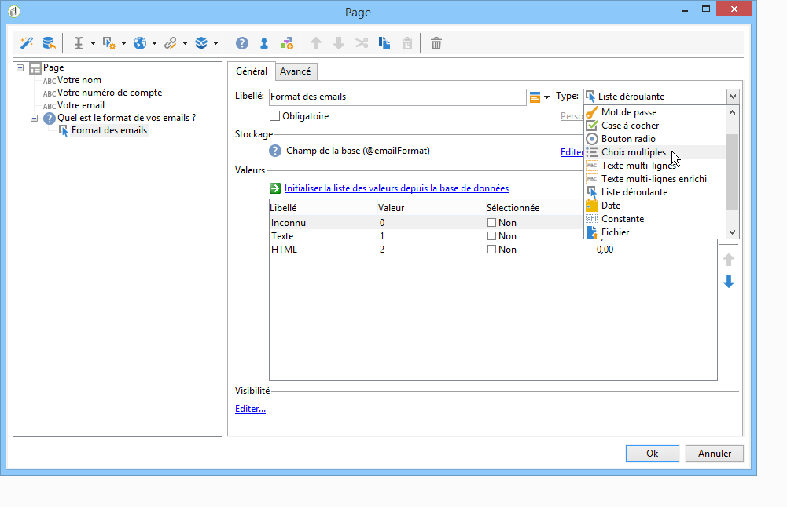
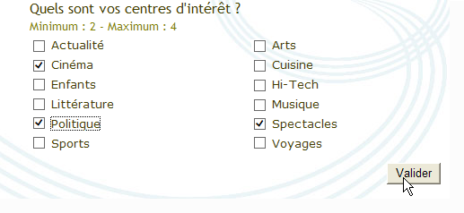
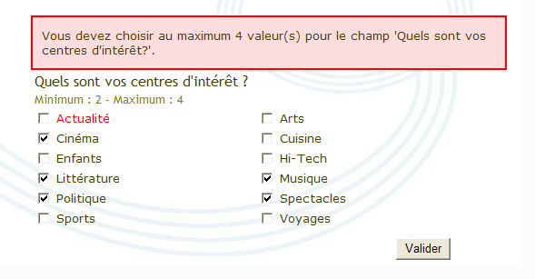
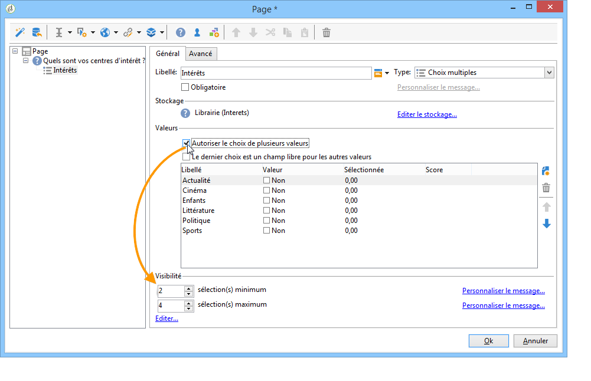
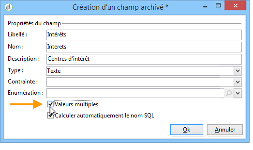
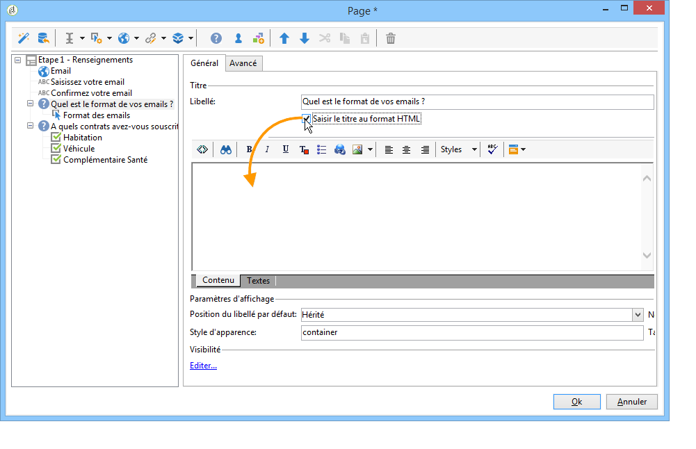
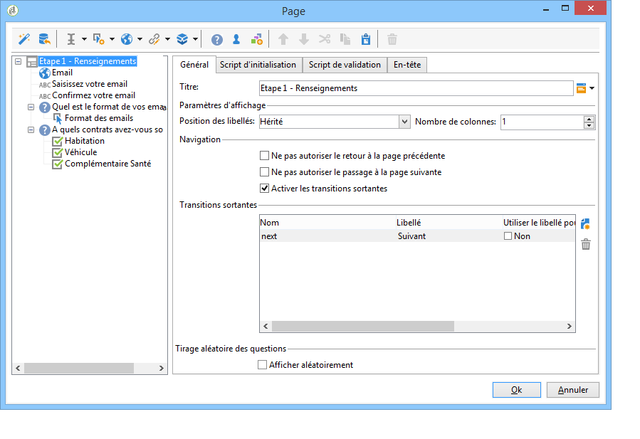
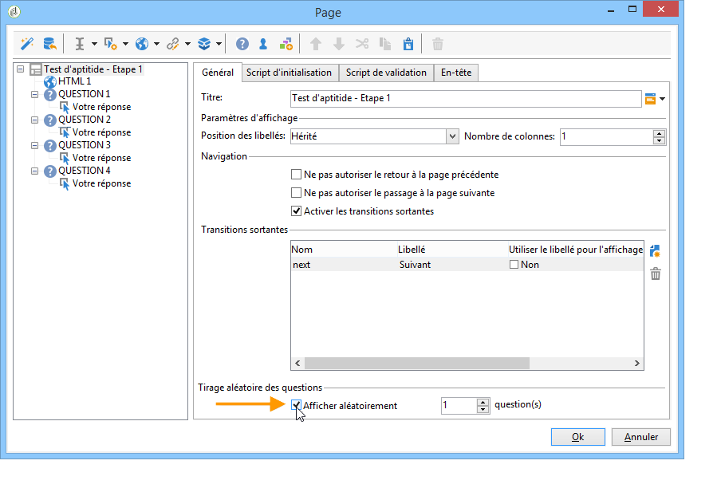
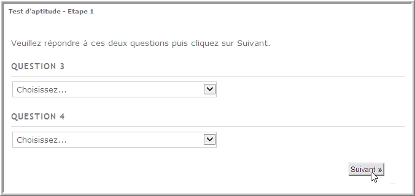

# Construire un questionnaire{#building-a-survey}

## Créer un nouveau questionnaire {#creating-a-new-survey}

Le chapitre suivant présente les étapes de conception d&#39;un formulaire de type **Questionnaire** sous Adobe Campaign, ainsi que les options et paramétrages disponibles. Adobe Campaign permet de mettre ce questionnaire à disposition des utilisateurs, et de collecter et archiver les réponses dans la base de données.

Les formulaires Web sont accessibles via le **[!UICONTROL Resources > Online > Web applications]** noeud de l’arborescence. Pour créer une enquête, cliquez sur le **[!UICONTROL New]** bouton au-dessus de la liste des applications ou cliquez avec le bouton droit de la souris sur la liste et choisissez **[!UICONTROL New]**.

Choisissez le modèle de questionnaire (par défaut **[!UICONTROL newSurvey]**).

Les pages du formulaire sont créées à l’aide d’un éditeur spécial qui vous permet de définir et de configurer des champs de saisie (texte), des champs de sélection (listes, cases à cocher, etc.) et des éléments statiques (images, contenu HTML, etc.). Ils peuvent être collectés dans des &quot;conteneurs&quot; et disposés selon les exigences (voir [Ajout de questions](#adding-questions)).

>[!NOTE]
>
>La définition du contenu et de la mise en page des écrans d&#39;un formulaire web sont présentés dans [cette section](../../web/using/about-web-forms.md).

## Ajouter des champs {#adding-fields}

Les champs d’un formulaire permettent aux utilisateurs de saisir des informations et de sélectionner des options. Pour chaque page du formulaire, elles sont créées via le premier bouton de la barre d’outils à l’aide du **[!UICONTROL Add using the wizard]** menu.

>[!NOTE]
>
>Vous pouvez également utiliser le bouton droit de la souris pour insérer une zone de saisie. Par défaut, la zone est toujours insérée à la fin de l&#39;arborescence courante. Elle peut être déplacée en utilisant les flèches de la barre d&#39;outils.

### Types de champs {#types-of-fields}

Lorsque vous ajouter un champ dans un questionnaire, vous devez sélectionner le type de champ à ajouter. Les options suivantes sont disponibles :

1. **[!UICONTROL Answer a question]**: cette option vous permet de déclarer un nouveau champ (appelé &quot;champ archivé&quot;) pour stocker les réponses. Dans ce cas, toutes les valeurs collectées sont enregistrées, même lorsqu’un participant remplit le formulaire plusieurs fois. Ce mode de stockage est disponible uniquement dans **les enquêtes**. Reportez-vous à [Stockage des réponses](../../web/using/managing-answers.md#storing-collected-answers)collectées.
1. **[!UICONTROL Edit a recipient]**: cette option vous permet de sélectionner un champ dans la base de données. Dans ce cas, les réponses des utilisateurs seront stockées dans ce champ. Pour chaque participant, seule la dernière valeur enregistrée est conservée et ajoutée aux données de profil.
1. **[!UICONTROL Add a variable]**: cette option vous permet de créer une configuration de sorte que les informations ne soient pas stockées dans la base de données.  Les variables locales peuvent être déclarées en amont. Vous pouvez également les ajouter directement lors de la création du champ.
1. **[!UICONTROL Import an existing question]**: cette option vous permet d&#39;importer des questions existantes créées dans d&#39;autres enquêtes.

   >[!NOTE]
   >
   >Les modes de stockage et les importations de champ sont détaillés dans [Stockage des réponses](../../web/using/managing-answers.md#storing-collected-answers)collectées.

La nature du champ à ajouter (liste déroulante, champ de texte, cases à cocher, etc.) s’adapte au mode de stockage sélectionné. Vous pouvez le modifier à l’aide du **[!UICONTROL Type]** champ de l’ **[!UICONTROL General]** onglet, mais assurez-vous de rester cohérent avec le type de données.

Les différents types de champs disponibles sont présentés dans [cette section](../../web/using/about-web-forms.md).

## Eléments spécifiques aux questionnaires {#survey-specific-elements}

Les enquêtes en ligne utilisent les fonctionnalités des applications web. Les fonctions spécifiques liées aux champs des enquêtes sont présentées ci-après.

### Choix multiples {#multiple-choice}

Pour les contrôles **[!UICONTROL Multiple choice]** de type, vous pouvez définir un nombre minimal et maximal de sélections. Par exemple, cette option vous permet de forcer la sélection à au moins **2** valeurs et au plus **4** valeurs des options disponibles :

Si le nombre de sélections n&#39;est pas atteint ou s&#39;il est dépassé, le message correspondant sera affiché.

>[!NOTE]
>
>Dans ce cas, les options sont sélectionnées via des cases à cocher. Lorsqu&#39;un seul choix est possible, il s&#39;agit de boutons radio.

Le paramétrage correspondant sera le suivant :

In addition, the storage location for this input field must be a **[!UICONTROL Multiple values]** type **archived field**:

>[!CAUTION]
>
>* Cette fonctionnalité n&#39;est disponible que dans les formulaires de type **Questionnaires**.
>* Cette option n’est pas compatible avec l’affichage de questions aléatoires. For more on this, refer to [Adding questions](#adding-questions).

### Ajouter des questions {#adding-questions}

Les conteneurs peuvent être de deux types : standard ou question. Les conteneurs standards sont utilisés à des fins de mise en page et pour paramétrer un affichage conditionnel dans une page. Ils sont présentés dans [cette section](../../web/using/about-web-forms.md).

Utilisez un conteneur de type **Question** pour ajouter une question dans la page et insérer les réponses possibles en sous-arborescence. Les réponses des utilisateurs aux questions qui ont été positionnées dans ce type de conteneurs peuvent être analysées dans des rapports.

>[!CAUTION]
>
>Vous ne devez pas insérer un conteneur de type **Question** en sous arborescence d&#39;un autre conteneur de type **Question**.

L&#39;étiquette de la question est saisie dans le champ d&#39;étiquette. Dans ce cas, le style de la feuille de style du formulaire est appliqué. Sélectionnez l’ **[!UICONTROL Enter the title in HTML format]** option pour la personnaliser. Vous aurez ainsi accès à l’éditeur HTML.

>[!NOTE]
>
>L&#39;utilisation de l&#39;éditeur HTML est présentée dans [cette section](../../web/using/about-web-forms.md).

Par exemple :

Dans l&#39;exemple ci-dessus, le rendu sera le suivant :

>[!NOTE]
>
>Chaque question correspond à un conteneur de type **Question**.

Vous pouvez activer le tirage aléatoire des questions par Adobe Campaign. Il est ensuite possible d&#39;indiquer le nombre de questions à afficher dans la page, dans le champ situé en bas de la fenêtre de configuration.

Le rendu sera par exemple :

Lorsque la page est actualisée, les questions affichées ne sont pas les mêmes.

>[!CAUTION]
>
>When you display a question randomly (**[!UICONTROL Display randomly]** option checked on the page), be careful not to use multiple choice questions for which one or more selections are mandatory.

