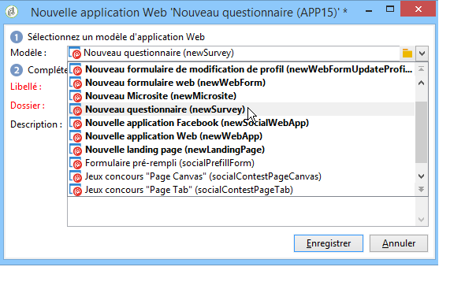

# Construire un questionnaire{#building-a-survey}

## Créer un nouveau questionnaire {#creating-a-new-survey}

Le chapitre suivant présente les étapes de conception d&#39;un formulaire de type **Questionnaire** sous Adobe Campaign, ainsi que les options et paramétrages disponibles. Adobe Campaign permet de mettre ce questionnaire à disposition des utilisateurs, et de collecter et archiver les réponses dans la base de données.

Les formulaires Web sont accessibles à partir du noeud **[!UICONTROL Ressources > On-line > Applications Web]** de l&#39;arborescence. Pour créer un questionnaire, cliquez sur le bouton **[!UICONTROL Nouveau]** situé au-dessus de la liste des applications, ou cliquez avec le bouton droit dans la liste et choisissez **[!UICONTROL Nouveau]**.

Choisissez le modèle de questionnaire (par défaut **[!UICONTROL newSurvey]**).

Les pages du formulaire sont créées à l’aide d’un éditeur spécial qui vous permet de définir et de configurer des champs de saisie (texte), des champs de sélection (listes, cases à cocher, etc.) et des éléments statiques (images, contenu HTML, etc.). Ils peuvent être collectés dans des &quot;conteneurs&quot; et disposés selon les exigences (voir [Ajout de questions](#adding-questions)).

>[!NOTE]
>
>La définition du contenu et de la mise en page des écrans d&#39;un formulaire web sont présentés dans [cette section](../../web/using/about-web-forms.md).

## Ajouter des champs {#adding-fields}

Dans un formulaire, les champs permettent aux utilisateurs de saisir des informations et sélectionner des options. Pour chaque page du formulaire, ils sont créés via le premier bouton de la barre d&#39;outils, depuis le menu **[!UICONTROL Ajout assisté]**.

>[!NOTE]
>
>Vous pouvez également utiliser le bouton droit de la souris pour insérer une zone de saisie. Par défaut, la zone est toujours insérée à la fin de l&#39;arborescence courante. Elle peut être déplacée en utilisant les flèches de la barre d&#39;outils.

### Types de champs {#types-of-fields}

Lorsque vous ajouter un champ dans un questionnaire, vous devez sélectionner le type de champ à ajouter. Les options suivantes sont disponibles :

1. **[!UICONTROL Répondez à une question]**: cette option vous permet de déclarer un nouveau champ (appelé &quot;champ archivé&quot;) pour stocker les réponses.Dans ce cas, toutes les valeurs collectées sont enregistrées, même lorsqu’un participant remplit le formulaire plusieurs fois.Ce mode de stockage est disponible uniquement dans **les enquêtes**. Reportez-vous à [Stockage des réponses](../../web/using/managing-answers.md#storing-collected-answers)collectées.
1. **[!UICONTROL Éditer un destinataire]** : cette option permet de sélectionner un champ de la base de données. Dans ce cas, les réponses des utilisateurs seront stockées dans ce champ. Pour chaque participant, seule la dernière valeur saisie est conservée. Elle est ajoutée aux données de son profil.
1. **[!UICONTROL Ajouter une variable]** : cette option permet de ne pas conserver les informations dans la base de données. Les variables locales peuvent être déclarées en amont. Vous pouvez également en ajouter directement lors de la création du champ.
1. **[!UICONTROL Importer une question existante]** : cette option permet d’importer des questions existantes, créées dans d’autres questionnaires.

   >[!NOTE]
   >
   >Les modes de stockage et les importations de champ sont détaillés dans [Stockage des réponses](../../web/using/managing-answers.md#storing-collected-answers)collectées.

La nature du champ à ajouter (liste déroulante, champ texte, cases à cocher, etc.) s&#39;adapte automatiquement au mode de stockage sélectionné. Vous pouvez toutefois la modifier à partir du champ **[!UICONTROL Type]** de l&#39;onglet **[!UICONTROL Général]**, en veillant à rester cohérent par rapport au type de données.

Les différents types de champs disponibles sont présentés dans [cette section](../../web/using/about-web-forms.md).

## Eléments spécifiques aux questionnaires {#survey-specific-elements}

Les enquêtes en ligne utilisent les fonctionnalités des applications web. Les fonctions spécifiques liées aux champs des enquêtes sont présentées ci-après.

### Choix multiples {#multiple-choice}

Pour les contrôles de type **[!UICONTROL Choix multiples]**, vous pouvez définir un nombre maximal et un nombre minimal de sélections. Cette option permet par exemple de forcer la sélection d&#39;au moins **2** valeurs et au plus **4** valeurs parmi les options proposées :

Si le nombre de sélections n&#39;est pas atteint ou s&#39;il est dépassé, le message correspondant sera affiché.

>[!NOTE]
>
>Dans ce cas, les options sont sélectionnées via des cases à cocher. Lorsqu&#39;un seul choix est possible, il s&#39;agit de boutons radio.

Le paramétrage correspondant sera le suivant :

De plus, l&#39;espace de stockage pour ce champ de saisie doit être un **champ archivé** de type **[!UICONTROL Valeurs Multiples]** :

>[!CAUTION]
>
>* Cette fonctionnalité n&#39;est disponible que dans les formulaires de type **Questionnaires**.
>* Cette option n’est pas compatible avec l’affichage de questions aléatoires. For more on this, refer to [Adding questions](#adding-questions).

### Ajouter des questions {#adding-questions}

Les conteneurs peuvent être de deux types : standard ou question. Les conteneurs standards sont utilisés à des fins de mise en page et pour paramétrer un affichage conditionnel dans une page. Ils sont présentés dans [cette section](../../web/using/about-web-forms.md).

Utilisez un conteneur de type **Question** pour ajouter une question dans la page et insérer les réponses possibles en sous-arborescence. Les réponses des utilisateurs aux questions qui ont été positionnées dans ce type de conteneurs peuvent être analysées dans des rapports.

>[!CAUTION]
>
>Vous ne devez pas insérer un conteneur de type **Question** en sous arborescence d&#39;un autre conteneur de type **Question**.

Le libellé de la question est saisi dans le champ libellé. Dans ce cas, le style appliqué sera celui de la feuille de style du formulaire. Cochez l&#39;option **[!UICONTROL Saisir le titre au format HTML]** pour le personnaliser. Vous accédez alors à l&#39;éditeur HTML.

>[!NOTE]
>
>L&#39;utilisation de l&#39;éditeur HTML est présentée dans [cette section](../../web/using/about-web-forms.md).

Par exemple :

Dans l&#39;exemple ci-dessus, le rendu sera le suivant :

>[!NOTE]
>
>Chaque question correspond à un conteneur de type **Question**.

Vous pouvez activer le tirage aléatoire des questions par Adobe Campaign. Il est ensuite possible d&#39;indiquer le nombre de questions à afficher dans la page, dans le champ situé en bas de la fenêtre de configuration.

Le rendu sera par exemple :

Lorsque la page est actualisée, les questions affichées ne sont pas les mêmes.

>[!CAUTION]
>
>Lorsque vous affichez aléatoirement telle ou telle question (option **[!UICONTROL Tirage aléatoire des questions]** cochée au niveau de la page), vous devez veiller à ne pas utiliser dans ces questions des listes à choix multiples dans lesquelles une ou plusieurs sélections sont obligatoires.

