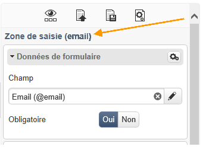
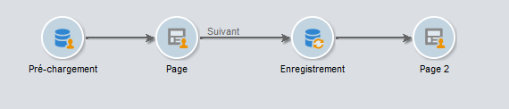

# Bonnes pratiques relatives à l&#39;édition de contenu{#content-editing-best-practices}

Afin de garantir un fonctionnement optimal de l&#39;éditeur, il est recommandé de respecter les recommandations suivantes :

* Avant d&#39;**importer un modèle de page HTML** dans Adobe Campaign, assurez-vous que le modèle s&#39;ouvre et s&#39;affiche correctement dans les différents navigateurs.
* Si la page HTML contient des **scripts en langage JavaScript**, ils doivent s&#39;exécuter **sans erreur** hors de l&#39;éditeur.
* Lors de la construction d&#39;un modèle, il est conseillé d&#39;ajouter un attribut **&#39;type&#39;** aux balises. `<input>` Ces informations seront traitées par l&#39;éditeur et aideront l&#39;utilisateur à lier un champ de la base de données au champ du formulaire lors de la configuration de l&#39;application Web.

   Exemple de code HTML dans le modèle :

   ```
   <input id="email" type="email" name="email"/>
   ```

   L&#39;attribut **&#39;type&#39;** est visible dans l&#39;interface sous la forme :

   

   La liste officielle des attributs de type est disponible [sur ce site](https://www.w3schools.com/tags/att_input_type.asp).

* Enchaînement des étapes pour simuler une page de fin avec le DCE :

   

* Make sure that there is only one `<body> </body>` in the page.
* Lorsqu&#39;un fichier CSS ou JS est téléchargé, les images contenues dans le fichier .zip ne le sont pas. Les références de ces images présentes dans le CSS ne sont donc pas mises à jour.

## Formats pris en charge par l&#39;éditeur de contenus {#content-editor-supported-formats}

Le Digital Content Editor supporte le format HTML : le basculement en mode **source** peut être effectué à tout moment.

La fonction d&#39;import du Digital Content Editor fonctionne comme suit avec les formats supportés :

* CSS : les images présentes dans le fichier .zip ne sont pas importées. Les références à ces images dans le CSS ne sont pas mises à jour.
* JS : les images présentes dans le fichier .zip ne sont pas importées. Les références à ces images dans le JS ne sont pas mises à jour.
* Iframe : les pages liées ne sont pas importées.
* Pages d&#39;entrée et applications Web : si une balise **de formulaire** est absente, un avertissement s’affiche. Un `<form> </form>` doit toujours être présent dans le corps du message.

Le Digital Content Editor fonctionne également avec les code-pages suivants pris en charge :

* iso-8859-1
* iso-8859-2
* utf-7
* utf-8 (recommandé lors de l&#39;utilisation d&#39;un BOM)
* iso-8859-15
* us-ascii
* shift jis
* iso-2022-jp
* big-5
* euc-kr
* utf-16

>[!NOTE]
>
>Le code page de l&#39;HTML doit être défini dans un meta tag (HTML 4 ou HTML 5) ou dans le BOM. Si aucun code page n&#39;est disponible, ouvrez le fichier en latin1.

## États du contenu HTML {#html-content-statuses}

La section supérieure de l&#39;éditeur affiche les message liés à l&#39;état du contenu. Les codes couleurs associés aux messages sont les suivants :

* **Message gris** : message à caractère informatif, aucune action n&#39;est à réaliser au niveau de l&#39;éditeur.
* **Message bleu** : message à caractère informatif en rapport avec le contenu édité.
* **Message jaune** : message d&#39;avertissement ou d&#39;erreur nécessitant une action de l&#39;utilisateur.

### Liste des messages pour l&#39;édition d&#39;application Web {#list-of-messages-when-editing-a-web-application}

* Le contenu HTML est fonctionnel.
* L&#39;application Web n&#39;a pas été publiée, elle n&#39;est pas accessible en ligne.
* L&#39;application Web est en ligne, toute modification nécessite une nouvelle publication.
* Le contenu de la page n&#39;est pas fonctionnel. Il doit contenir un formulaire HTML (`<form>`)
* Il reste n zone(s) de saisie ou boutons à configurer.
* Pour permettre le passage à la page suivante, vous devez associer l&#39;action &#39;Page Suivante&#39; à un bouton ou un lien de la page courante.

### Liste des messages pour l&#39;édition de diffusion {#list-of-messages-when-editing-a-delivery}

* Le contenu de la diffusion est fonctionnel.
* Il reste n champs ou blocs de personnalisation à configurer.
* La contenu de la diffusion a été préparé, toute modification nécessite une nouvelle analyse.
* La diffusion est prête à être diffusée.

