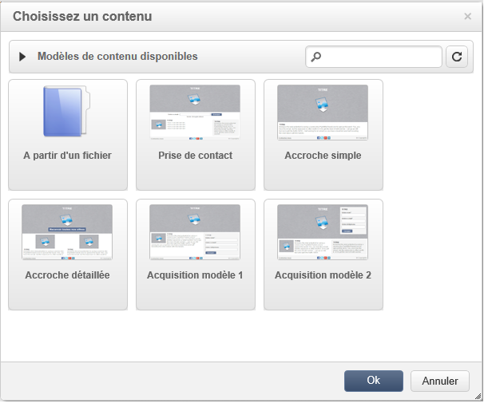

# Interface de l&#39;éditeur de contenu{#content-editor-interface}

## Fenêtre d&#39;édition {#editing-window}

La fenêtre d&#39;édition du DCE est organisée en trois sections distinctes. Elles permettent de visualiser le contenu, le modifier et contrôler son état.

1. La section **supérieure** est une zone d&#39;affichage pour des messages destinés à l&#39;utilisateur. Ces messages indiquent le statut de l&#39;application Web ou de la diffusion en cours de création ainsi que les avertissements et messages d&#39;erreurs liés au contenu. Pour plus d&#39;informations, consultez la section [États du contenu HTML](content-editing-best-practices.md#html-content-statuses).
1. La section **gauche** de la fenêtre est la zone d’édition du contenu. Depuis cette zone, l’utilisateur peut interagir directement avec le contenu, grâce à la barre d’outils pop-up : insérer un lien sur une image, modifier la police de caractères, supprimer un champ, etc. Pour plus d&#39;informations, consultez la section [Editer les formulaires](editing-content.md#editing-forms).
1. La section **droite** de la fenêtre est la zone de contrôle du rendu. Elle regroupe les différentes options de l&#39;éditeur, notamment celles liées aux paramètres de l&#39;entête de la page et aux options générales associées à un bloc : ajouter une bordure, associer un champ de la base à une zone de saisie, accéder aux propriétés de la page Web, etc. Voir à ce propos les sections [Options globales](#global-options) et [Editer le contenu](editing-content.md).

## Options globales {#global-options}

La section supérieure droite de l&#39;éditeur permet d&#39;accéder à des options globales qui permettent d&#39;agir sur le contenu en cours de création.

Elle contient quatre icônes :

* L&#39;icône **Afficher / Masquer les blocs** permet d&#39;afficher des cadres bleus autour des blocs de contenu (correspond à la balise HTML `
`).

* L&#39;icône **Choisir un autre contenu** permet à l&#39;utilisateur de charger un nouveau contenu à partir d&#39;un modèle (existant ou modèle livré d&#39;usine).

  

  >[!CAUTION]
  >
  >Le contenu sélectionné remplace le contenu actuel.

* La variable **Enregistrer en tant que modèle** permet d&#39;enregistrer le contenu actuel en tant que modèle. Vous devez saisir le libellé et le nom interne du modèle. Les modèles sont stockés dans le nœud : **[!UICONTROL Ressources > Modèles > Modèles de contenu]**.

  

  Une fois enregistré, le modèle est disponible et peut être sélectionné lors de la création d&#39;un nouveau contenu.

  

* L&#39;icône **Propriétés de la page** permet de saisir les informations contenues dans la partie supérieure de la page HTML.

  

  >[!NOTE]
  >
  >Ces informations correspondent aux balises HTML **`<title>`** et **`<meta>`** de la page.
  >
  >Les mots-clés doivent être séparés par des virgules.

## Options des blocs {#block-options}

La section droite de l&#39;éditeur regroupe les principales options qui permettent d&#39;agir sur le contenu. Pour afficher ces options, vous devez sélectionner un bloc : la nature de ces options dépend du bloc sélectionné.

Vous pouvez ainsi :

* Déterminer l&#39;affichage d&#39;un ou de plusieurs blocs, voir à ce propos la section [Définir une condition de visibilité](editing-content.md#defining-a-visibility-condition),
* Définir les bordures et les cadres, voir à ce propos la section [Ajouter une bordure et un arrière-plan](editing-content.md#adding-a-border-and-background),
* Définir les attributs d&#39;image (taille, légende), voir à ce propos la section [Modifier les propriétés d&#39;une image](editing-content.md#editing-image-properties),
* Lier la base de données à un élément de formulaire (zone d&#39;entrée, case à cocher), voir à ce propos la section [Modifier les propriétés des données d&#39;un formulaire](editing-content.md#changing-the-data-properties-for-a-form),
* Rendre une partie d&#39;un formulaire obligatoire, voir à ce propos la section [Modifier les propriétés des données d&#39;un formulaire](editing-content.md#changing-the-data-properties-for-a-form),
* Définir une action pour un bouton, voir à ce propos la section [Ajouter une action sur un bouton](editing-content.md#adding-an-action-to-a-button).

## Barre d&#39;outils de contenu {#content-toolbar}

La barre d’outils est un élément pop-up de l’**élément pop-up** de l’interface du DCE qui présente des fonctionnalités différentes selon le bloc sélectionné.

>[!CAUTION]
>
>Certaines fonctionnalités de la barre d’outils permettent de mettre en forme le contenu HTML. Cependant, si la page contient une feuille de style CSS, les **instructions** provenant de la feuille de style peuvent s&#39;avérer **prioritaires** par rapport aux instructions spécifiées avec la barre d&#39;outils.
