# Créer une landing page{#creating-a-landing-page}

## À propos de la création des landing pages {#about-landing-pages-creation}

Ce cas d&#39;utilisation présente l&#39;utilisation du Digital Editor dans le cadre de la création d&#39;une Landing Page à partir de la console Adobe Campaign.

Avant de commencer le paramétrage de la Landing Page dans Adobe Campaign, vous devez avoir **à disposition un ou plusieurs modèles** représentant la ou les pages HTML.

L&#39;objectif principal de ce cas d&#39;utilisation est de faire correspondre les champs des formulaires de la Landing Page avec des champs métiers dans Adobe Campaign en utilisant les fonctionnalités du DCE.

## Création de la Landing Page {#creating-the-landing-page}

Pour créer une nouvelle Application Web de type Landing Page, respectez les étapes suivantes :

1. Dans l’onglet **[!UICONTROL Campagnes]**, cliquez sur le lien **[!UICONTROL Application Web]**, puis sur le bouton **[!UICONTROL Créer]**.
1. Sélectionnez le modèle **[!UICONTROL Nouvelle landing page]**, saisissez un libellé, puis cliquez sur **[!UICONTROL Enregistrer]**.

   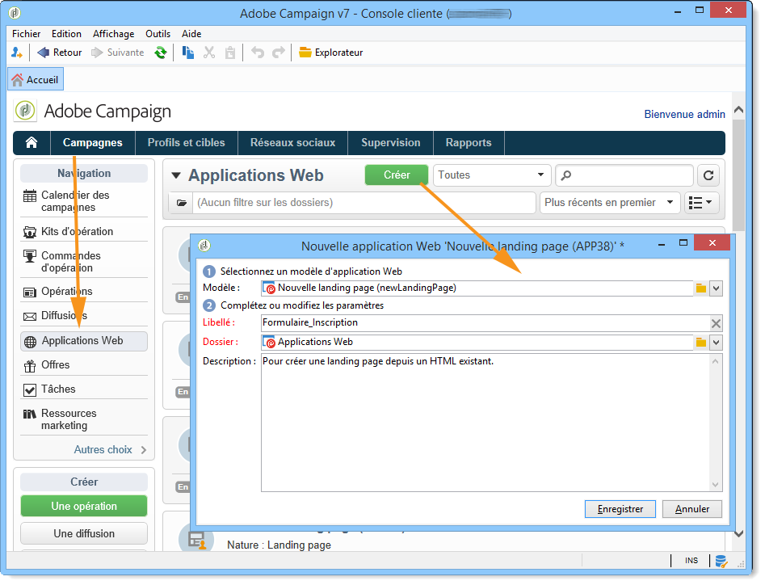

1. Cliquez sur l&#39;onglet **[!UICONTROL Edition]**.
1. Supprimez l&#39;activité **Fin**.
1. Ajoutez une activité **[!UICONTROL Page]** à la suite de l’activité **[!UICONTROL Enregistrement]**.
1. Editez l&#39;activité **Page 2**, puis décochez l&#39;option **[!UICONTROL Activer les transitions sortantes]** dans l&#39;onglet **[!UICONTROL Propriétés]**.

   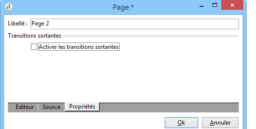

1. Enregistrez les modifications.

Vous obtenez alors le séquencement suivant :

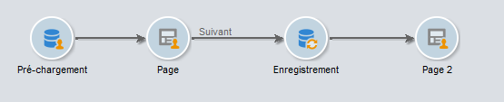

>[!NOTE]
>
>La création d&#39;une application web est présentée dans [cette section](creating-a-new-web-application.md).

## Etape 1 - Sélection et chargement de modèles {#step-1---selecting-and-loading-templates}

Dans cette section nous allons voir comment **importer un contenu HTML** pour chaque page de l&#39;application Web.

Un modèle doit contenir :

* un fichier **HTML** (obligatoire)
* un ou plusieurs fichiers **CSS** (facultatif)
* un ou plusieurs fichiers **image** (facultatif)

Pour charger le modèle dans la première page, respectez les étapes suivantes :

1. Ouvrez la première activité **[!UICONTROL Page]** de l&#39;application Web.
1. Sélectionnez **[!UICONTROL A Partir d&#39;un fichier]** comme choix de modèles de contenus disponibles.

   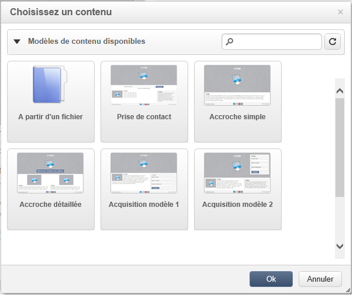

1. Sélectionnez le fichier HTML à utiliser.
1. Cliquez sur **Ouvrir** afin de démarrer l&#39;import.

   Lors du chargement, la liste des fichiers chargés apparait. Le système d&#39;import vérifie que tous les fichiers liés au HTML sélectionné sont présents (CSS, images, etc.).

   Cliquez sur le bouton **[!UICONTROL Fermer]** lorsque l&#39;import est terminé.

   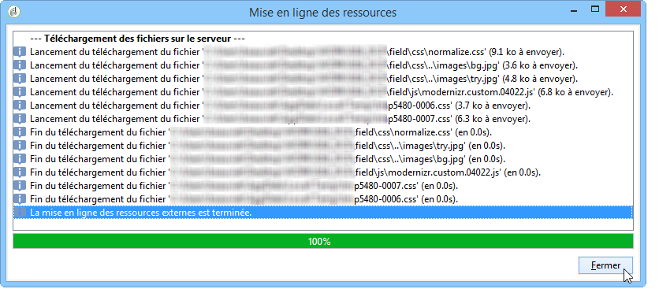

   >[!CAUTION]
   >
   >Vous devez attendre d’avoir reçu le message suivant avant de procéder à la fermeture : **[!UICONTROL La mise en ligne des ressources externes est terminée]**.

1. Cliquez sur l&#39;onglet **[!UICONTROL Propriétés]**.
1. Saisissez un **libellé** pour chaque page (par exemple : Page 1 = Collecte, Page 2 = Remerciements).

   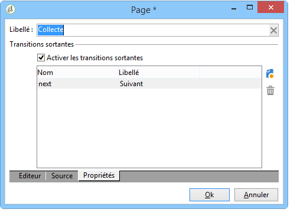

Vous devez effectuer ces étapes pour chacune des pages insérées dans l&#39;application Web.

>[!CAUTION]
>
>**Le DCE exécute le code JavaScript pour la page HTML chargée.** Erreurs JavaScript dans le modèle HTML qui peuvent apparaître dans l’interface d’Adobe Campaign. Ces erreurs ne sont pas liées à l’éditeur. Pour vérifier qu’il n’y a aucune erreur dans les fichiers importés, il est recommandé de les tester dans un navigateur web avant d’importer les fichiers dans le DCE.

## Etape 2 - Paramétrage du contenu {#step-2---configuring-the-content}

Dans cette section, nous allons ajuster le contenu importé puis associer les champs de la base de données avec le formulaire de la page web. L&#39;application Web créée précédemment est la suivante :

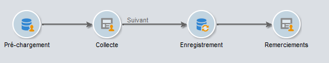

### Modification du contenu {#modifying-content}

Nous allons d&#39;abord modifier les couleurs de la page. Pour cela :

1. Ouvrez la page **[!UICONTROL Collecte]**.
1. Cliquez sur la zone d&#39;arrière-plan.
1. Cliquez sur la zone **Couleur de fond** dans la zone droite.
1. Sélectionnez une nouvelle couleur de fond dans le nuancier.
1. Validez le changement en cliquant sur **OK**

   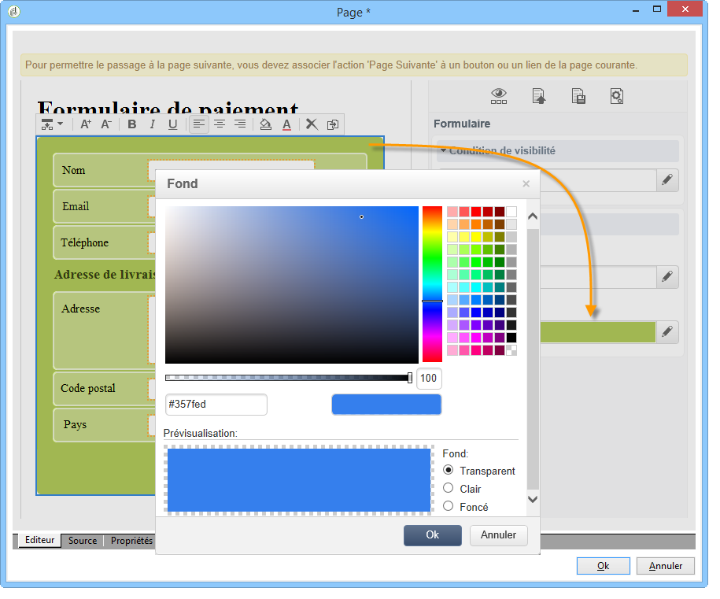

1. Reproduisez les mêmes étapes pour modifier la couleur du bouton

   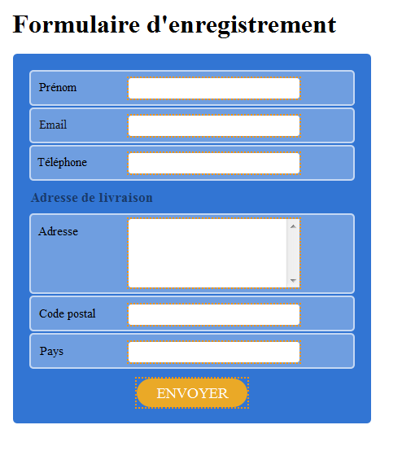

### Association des champs du formulaire {#linking-form-fields}

Nous allons associer les champs proposés dans la page à des champs de la base de données, afin de stocker les informations renseignées.

1. Sélectionnez un champ du formulaire.
1. Editez la section **[!UICONTROL Champ]** dans la zone droite de l&#39;éditeur.
1. Sélectionnez le champ de la base de données que vous souhaitez associer au champ sélectionné.

   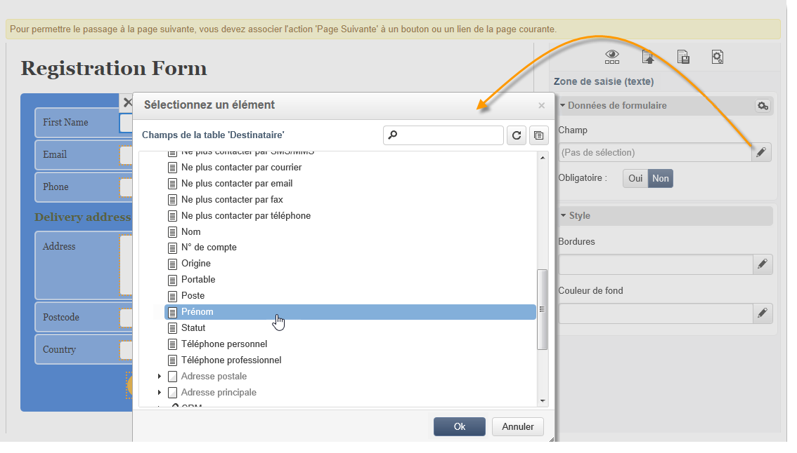

1. Reproduisez cette association pour chaque champ de la page.

Il est possible de rendre un champ obligatoire : par exemple, cliquez sur le champ **[!UICONTROL Email]** puis activez l&#39;option **Obligatoire**.

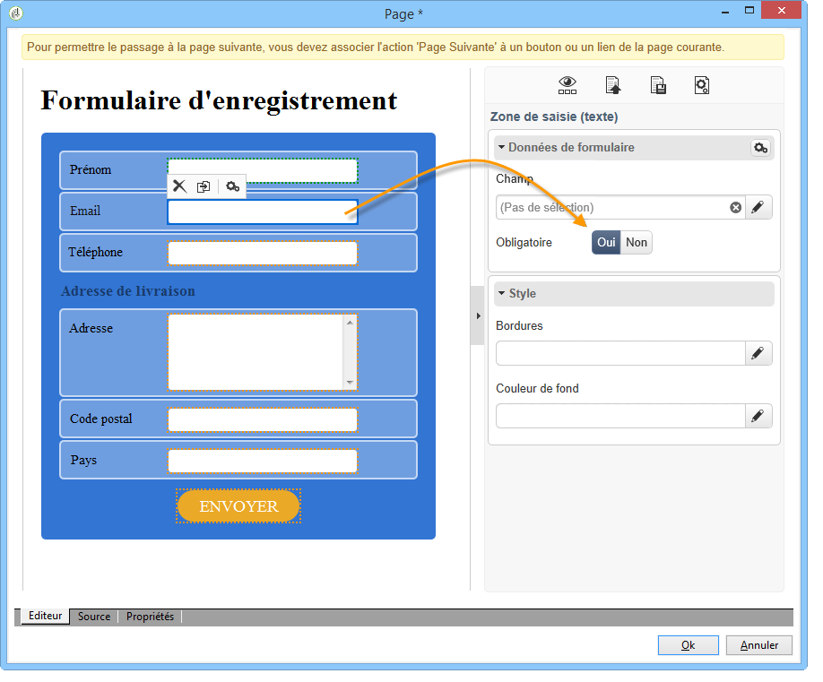

### Création d&#39;un lien vers la page suivante {#creating-a-link-to-the-next-page}

Cette étape est obligatoire car elle va permettre à l’application Web de déterminer le déroulement des étapes : enregistrer les données collectées dans la base puis afficher la page suivante (page **Remerciements**).

1. Sélectionnez le bouton **[!UICONTROL Send It!]** de la page **[!UICONTROL Collecte]**.
1. Cliquez dans le menu déroulant **[!UICONTROL Action]**.
1. Sélectionnez l&#39;action **[!UICONTROL Page Suivante]**.

   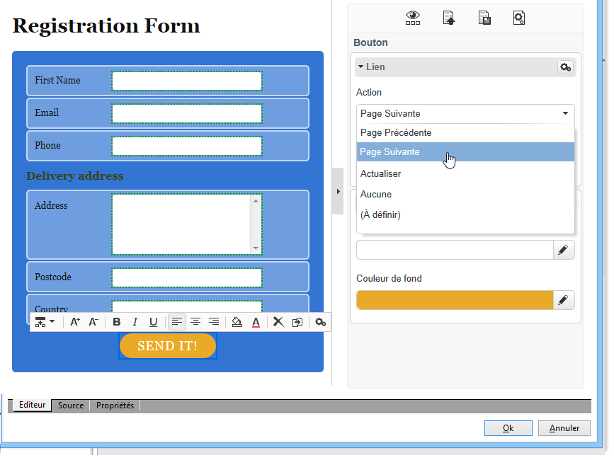

### Insertion d&#39;un champ de personnalisation {#inserting-a-personalization-field}

Cette étape permet de personnaliser le contenu de la page de remerciements. Pour cela :

1. Ouvrez la page **[!UICONTROL Remerciements]**.
1. Positionnez le curseur dans une zone de texte, là où vous souhaitez insérer le prénom du destinataire.
1. Sélectionnez **[!UICONTROL Champ de personnalisation]** dans le menu **[!UICONTROL Insérer]** de la barre d&#39;outils.
1. Sélectionnez le prénom.

   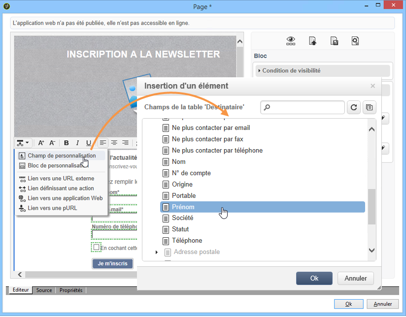

Le champ de personnalisation s&#39;affiche sur fond jaune dans l&#39;éditeur.

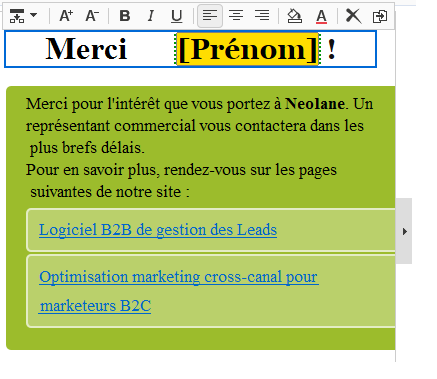

## Etape 3 - Publication du contenu {#step-3---publishing-content}

Le contenu est publié à partir du tableau de bord de l’application web. Cliquez sur le bouton **[!UICONTROL Publier]** pour effectuer la publication.

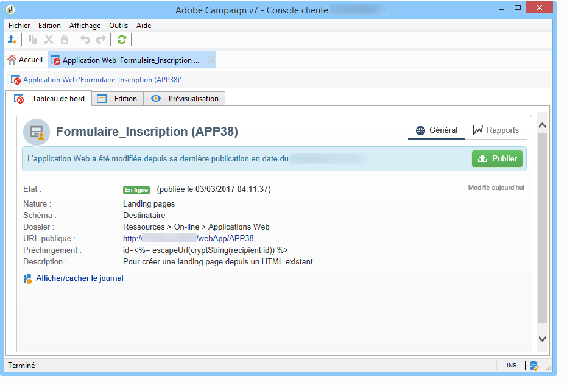

Lors de la publication, un journal est affiché. Le système de mise en ligne analyse l&#39;intégralité des contenus présents dans l&#39;application Web.

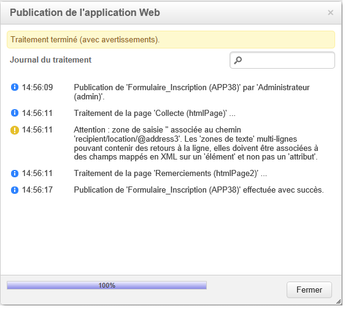

>[!NOTE]
>
>Dans le journal de publication, les avertissements ou erreurs potentiels sont triés par activité.

Le formulaire est maintenant disponible : son URL est accessible dans le tableau de bord de l&#39;application et peut être proposée aux destinataires.
