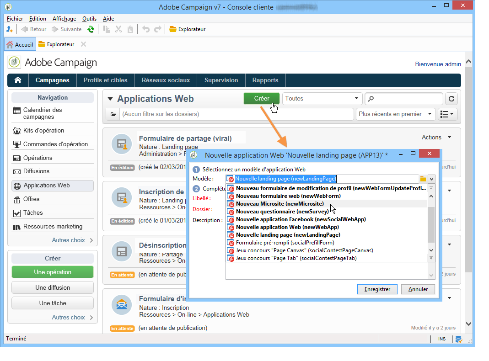

# Création d’une application web{#creating-a-new-web-application}

Le type d&#39;une application web est sélectionné au moment de sa création.

Accédez à l&#39;onglet **Campagnes** et sélectionnez le menu **[!UICONTROL Applications Web]**. Cliquez sur le bouton **[!UICONTROL Créer.]** Sélectionnez le modèle d&#39;application Web à utiliser :

>[!NOTE]
>
>Protégez toujours les pages pouvant contenir des informations personnelles. Consultez la [Liste de contrôle relative à la sécurité et à la confidentialité](https://helpx.adobe.com/fr/campaign/kb/acc-security.html#privacy).

Ce modèle détermine le type d&#39;application web. Vous pouvez ainsi créer :

1. Des formulaires web (+ modification de profil)

   Les formulaires Web permettent de proposer des pages Web avec des champs de saisie ou de sélection : les informations saisies par les utilisateurs peuvent être stockées dans la base de données Adobe Campaign. Voir à ce sujet la section [Formulaires web](about-web-forms.md).

1. Des applications web

   Adobe Campaign permet de créer des applications web destinées à être exposées sur une plateforme web ou par exemple sur un extranet. Vous pouvez ainsi modifier des données et enregistrer des informations dans Adobe Campaign. Dans ce cas, vous pouvez restreindre leur accès aux utilisateurs authentifiés (via un contrôle d’accès) et configurer le préchargement des données selon différents critères. Pour plus d’informations, consultez [cette section](about-web-applications.md).

1. Pages de destination

   Une landing page est une page de HTML dont le contenu est disponible sur un site web et qui permet aux utilisateurs de saisir des informations à stocker dans le profil de base de données Adobe Campaign. Le contenu de ce type de page est généralement créé par une agence web spécialisée avant d&#39;être importé dans Adobe Campaign pour publication, gestion et suivi. Pour plus d’informations, consultez [cette page](creating-a-landing-page.md).

1. Questionnaires

   Adobe Campaign vous permet d’effectuer les opérations suivantes : **Survey Manager** pour concevoir et gérer des questionnaires en ligne et en exploiter les résultats : création dynamique de champs, gestion des scores, export des réponses et rapports dédiés. Pour plus d’informations, consultez [cette section](../../surveys/using/about-surveys.md).

   >[!CAUTION]
   >
   >**Survey Manager** est un module optionnel d&#39;Adobe Campaign. Vérifiez votre contrat de licence.

1. Des applications Facebook

   Grâce à **Social Marketing** , Adobe Campaign vous permet de publier du contenu personnalisé dans une application Facebook. Pour plus d’informations, consultez [cette section](../../social/using/about-social-marketing.md).

   >[!CAUTION]
   >
   >**Social Marketing** est un module optionnel d&#39;Adobe Campaign. Vérifiez votre contrat de licence.

Le mode de paramétrage des pages ainsi que les paramétrages disponibles peuvent être identiques pour plusieurs types d&#39;applications Web. Pour plus d’informations, consultez [cette section](about-web-forms.md).
