# Définir la disposition des formulaires web{#defining-web-forms-layout}

## Créer des conteneurs {#creating-containers}

Les conteneurs permettent de regrouper les champs d&#39;une page et d&#39;en paramétrer la mise en page. Ils permettent d&#39;organiser les éléments dans la page.

Pour chaque page du formulaire, les conteneurs sont créés à partir du bouton **[!UICONTROL Conteneurs]** de la barre d&#39;outils.

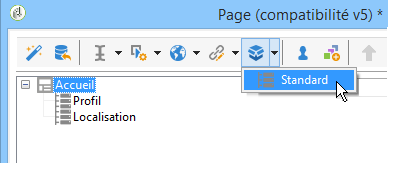

Utilisez un conteneur pour regrouper les éléments de la page sans ajouter de libellé au rendu final. Les éléments sont regroupés dans la sous-arborescence du conteneur. Les conteneurs standard permettent de gérer la mise en page.

Par exemple :

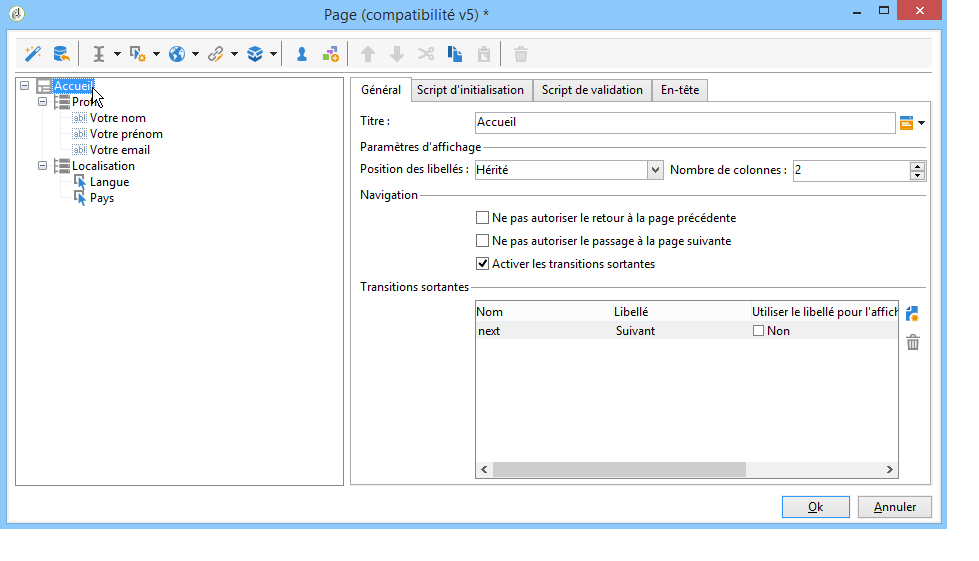

La position des libellés est appliquée aux éléments placés sous le conteneur dans la hiérarchie. Il peut être surchargé pour chaque élément si nécessaire. Ajoutez ou supprimez des colonnes pour modifier la disposition. Voir [Placer les champs de la page](#positioning-the-fields-on-the-page).

Dans l&#39;exemple ci-dessus, le rendu sera le suivant :

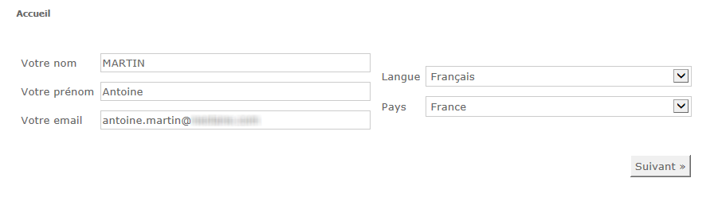

## Placer les champs de la page {#positioning-the-fields-on-the-page}

La mise en page du formulaire web est définie page par page, pour chaque conteneur et peut être surchargée si nécessaire.

Les pages sont organisées en colonnes : chaque page contient un certain nombre de colonnes. Chaque champ de la page occupe **n** cellules. Les conteneurs s’étendent eux aussi sur un certain nombre de colonnes et les champs qu’ils contiennent s’étendent sur un certain nombre de cellules.

Par défaut, les pages sont construites sur une seule colonne et chaque élément occupe une cellule. Ainsi, les champs sont affichés les uns en dessous des autres, chacun occupant toute la ligne, comme dans l&#39;exemple ci-dessous :

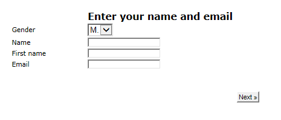

Dans l’exemple suivant, la configuration par défaut a été conservée. La page occupe une seule colonne qui comprend quatre conteneurs.

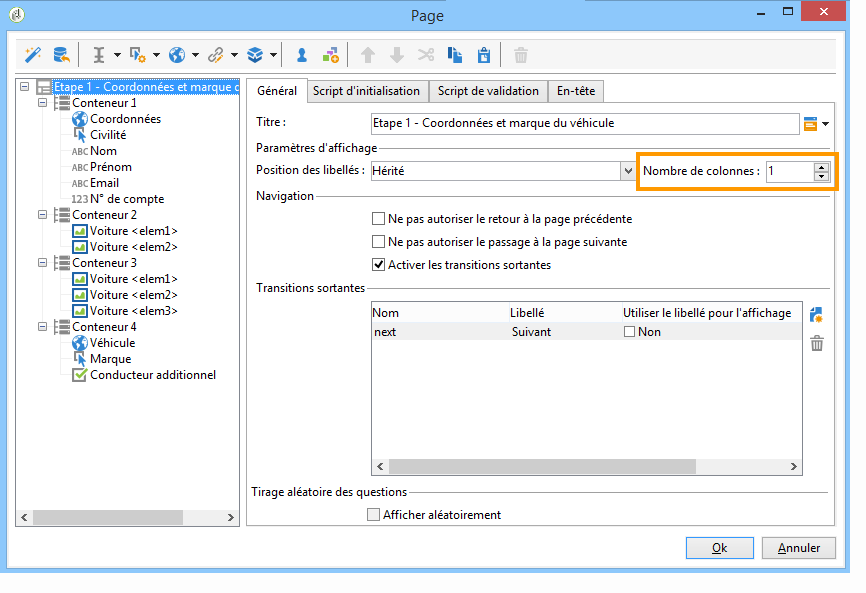

Chaque conteneur s&#39;étend sur une colonne et chaque élément occupe une cellule :

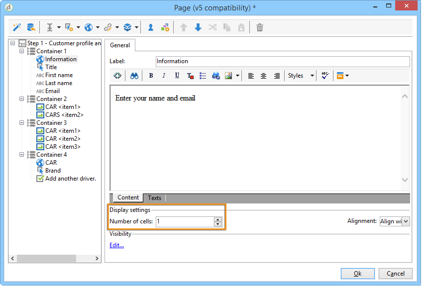

Le rendu est le suivant :

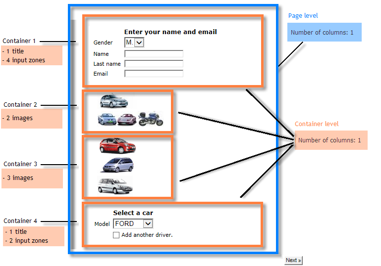

Vous pouvez adapter les paramètres d&#39;affichage pour obtenir le rendu suivant :

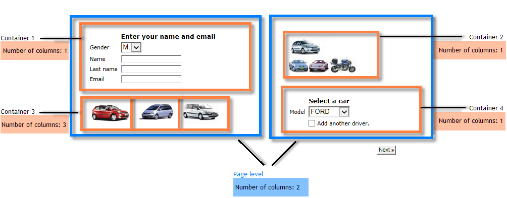

Dans l&#39;exemple de rendu ci-dessus, chaque zone de saisie, chaque titre et chaque image occupent une seule cellule dans les colonnes des conteneurs.

Vous pouvez modifier la mise en forme dans chaque conteneur. Dans notre exemple, vous pouvez répartir le contenu du conteneur 4 sur deux colonnes et répartir les éléments.

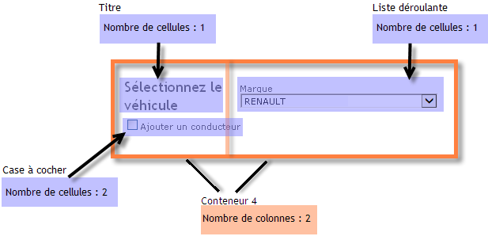

Le titre et la liste occupent une cellule chacun (et donc une ligne entière du conteneur) et la case à cocher s’étend sur deux cellules. Le nombre de cellules attribuées au champ de saisie est défini dans l’onglet **[!UICONTROL Général]** ou l’onglet **[!UICONTROL Avancé]** , en fonction du type de champ :

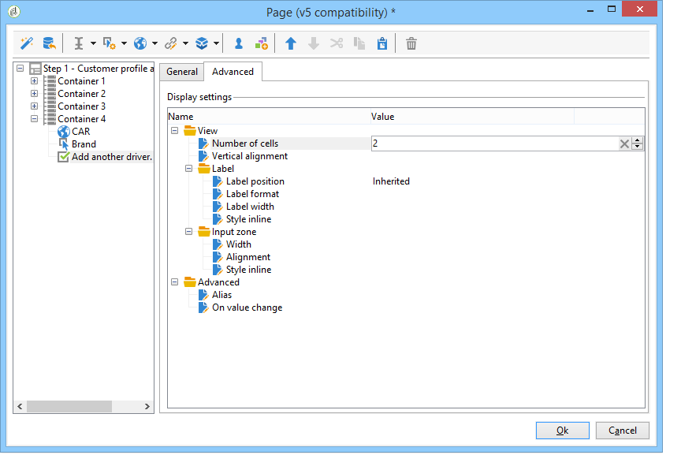

## Définir la position des libellés {#defining-the-position-of-labels}

Vous pouvez définir l&#39;alignement des champs et des libellés du formulaire.

Par défaut, les paramètres d&#39;affichage des champs et autres contenus de la page sont hérités du paramétrage général du formulaire, le paramétrage de la page ou celui du conteneur parent, s&#39;il existe.

Les paramètres d&#39;affichage globaux pour tout le formulaire sont indiqués dans la boîte de propriétés du formulaire. L&#39;onglet **[!UICONTROL Rendu]** permet de sélectionner la position des libellés.

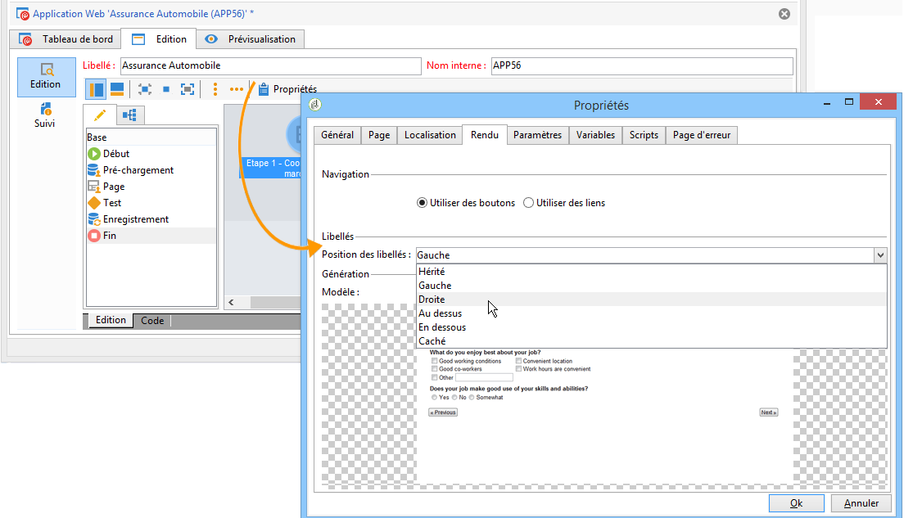

Cette position peut être surchargée au niveau de chaque page, puis de chaque conteneur et enfin au niveau de chaque champ, à partir de l&#39;onglet **[!UICONTROL Avancé]**.

Les alignements supportés sont les suivants :

* Hérité : l&#39;alignement est hérité de l&#39;élément parent (valeur par défaut), c&#39;est-à-dire le conteneur parent, ou, à défaut, la page.
* Gauche/Droite : le libellé est positionné à droite ou à gauche du champ,
* Au-dessus/En-dessous : le libellé est positionné au-dessus ou en-dessous du champ,
* Caché : le libellé n&#39;est pas affiché.
