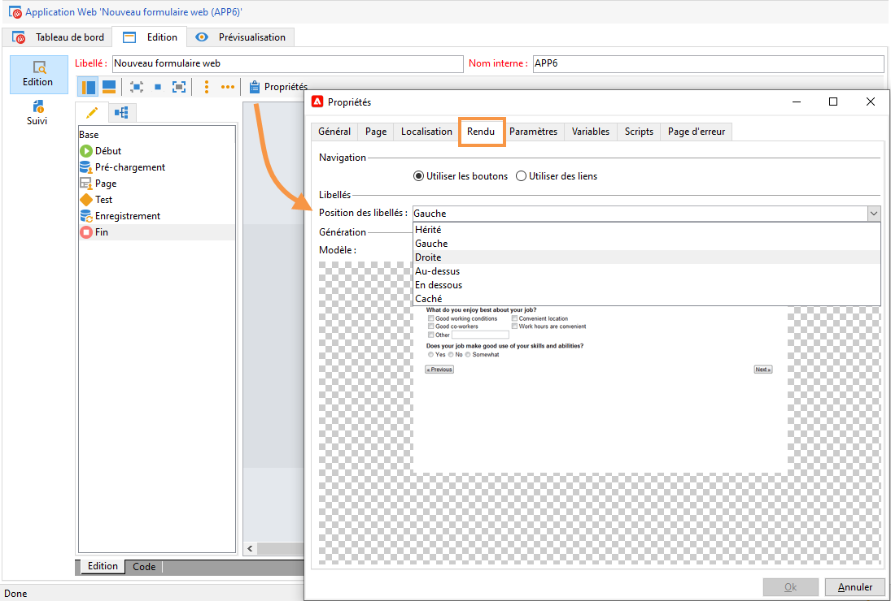

# Définir la disposition des formulaires web{#defining-web-forms-layout}

## Créer des conteneurs {#creating-containers}

Les conteneurs permettent de regrouper les champs d&#39;une page et d&#39;en paramétrer la mise en page. Ils permettent d&#39;organiser les éléments dans la page.

Pour chaque page du formulaire, les conteneurs sont créés à partir du bouton **[!UICONTROL Conteneurs]** de la barre d&#39;outils.

Utilisez un conteneur pour grouper des éléments de la page sans ajouter de libellé dans le rendu final. Les éléments sont regroupés en sous-arborescence du conteneur. Les conteneurs standards permettent de gérer la mise en page.

Par exemple :

La position des libellés est appliquée aux éléments placés en sous-arborescence du conteneur. Elle peut éventuellement être surchargée au niveau de chaque élément si nécessaire. Le nombre de colonnes permet de modifier la mise en page. Voir [Placer les champs de la page](#positioning-the-fields-on-the-page).

Dans l&#39;exemple ci-dessus, le rendu sera le suivant :

## Placer les champs de la page {#positioning-the-fields-on-the-page}

La mise en page du formulaire web est définie page par page, pour chaque conteneur et peut être surchargée si nécessaire.

Les pages sont organisées en colonnes : chaque page contient un certain nombre de colonnes. Chaque champ de la page occupe **n** cellules. Les conteneurs s&#39;étendent eux aussi sur un certain nombre de colonnes et les champs qu&#39;ils contiennent s&#39;étendent sur un certain nombre de cellules.

Par défaut, les pages sont construites sur une seule colonne et chaque élément occupe une cellule. Ainsi, les zones sont affichées les unes en dessous des autres, chacune occupant toute la ligne, comme ci-dessous :

Dans l&#39;exemple suivant, le paramétrage par défaut a été conservé. La page est construite sur une seule colonne et contient quatre conteneurs.

Chaque conteneur s&#39;étend sur une colonne et chaque élément occupe une cellule :

Le rendu est le suivant :

Vous pouvez adapter les paramètres d&#39;affichage pour obtenir le rendu suivant :

Dans l&#39;exemple de rendu ci-dessus, chaque zone de saisie, chaque titre et chaque image occupent une seule cellule dans les colonnes des conteneurs.

Vous pouvez modifier la mise en page au niveau de chaque conteneur. Dans notre exemple, vous pouvez passer le contenu du conteneur 4 sur deux colonnes et répartir les éléments.

Le titre et la liste occupent une cellule chacun (et donc une ligne entière du conteneur) et la case à cocher s’étend sur deux cellules. Le nombre de cellules attribuées au champ de saisie est défini dans la variable **[!UICONTROL Général]** ou le **[!UICONTROL Avancé]** , en fonction du type de champ :

## Définir la position des libellés {#defining-the-position-of-labels}

Vous pouvez définir l&#39;alignement des champs et des libellés du formulaire.

Par défaut, les paramètres d&#39;affichage des champs et autres contenus de la page sont hérités du paramétrage général du formulaire, le paramétrage de la page ou celui du conteneur parent, s&#39;il existe.

Les paramètres d’affichage globaux pour l’ensemble du formulaire sont indiqués dans la zone des propriétés du formulaire. La variable **[!UICONTROL Rendu]** vous permet de sélectionner la position des libellés.

Cette position peut être surchargée au niveau de chaque page, puis de chaque conteneur et enfin au niveau de chaque champ, à partir de l&#39;onglet **[!UICONTROL Avancé]**.

Les alignements supportés sont les suivants :

* Hérité : l&#39;alignement est hérité de l&#39;élément parent (valeur par défaut), c&#39;est-à-dire le conteneur parent, ou, à défaut, la page.
* Gauche/Droite : le libellé est positionné à droite ou à gauche du champ,
* Au-dessus/En-dessous : le libellé est positionné au-dessus ou en-dessous du champ,
* Caché : le libellé n&#39;est pas affiché.
